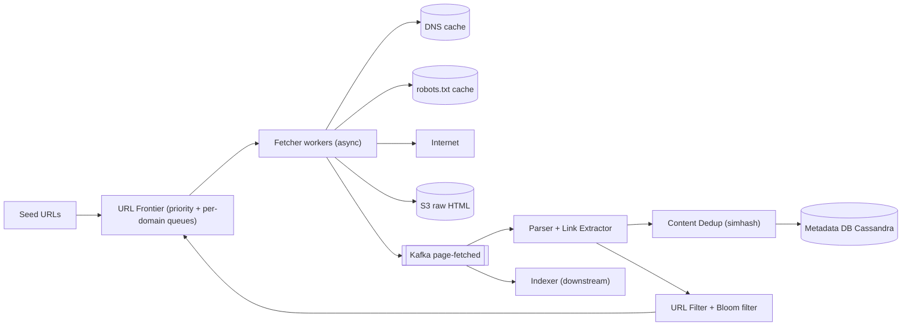
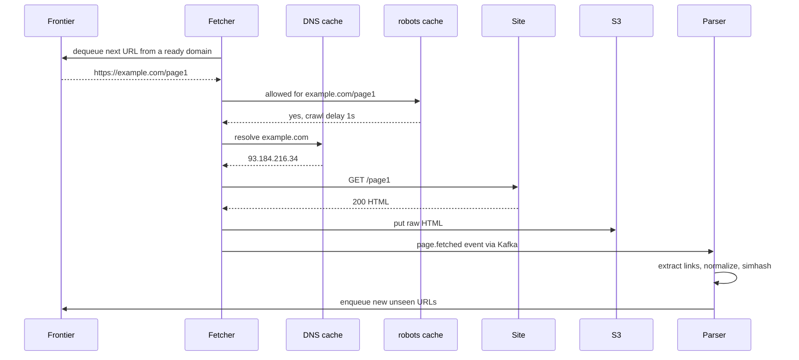
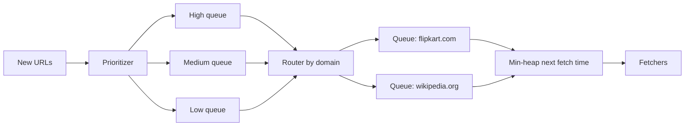

# Design a Web Crawler

**In one line:** seed URLs → download pages → extract links → keep crawling; **1B pages** for a search engine (Google). Challenge: **fast, polite, no duplicates**.

**What the interviewer checks in this question:** frontier (priority + politeness), dedup, estimation, traps / failures.

---

## Step 1: Clarify with the interviewer (3–5 min)

| You ask | Typical answer | Effect on design |
|---|---|---|
| "Purpose? Search indexing or specific data?" | Search engine indexing | HTML only, store the full page |
| "How many pages, in how long?" | 1B pages, ~1 month | ≈ 400 pages/sec, distributed fetchers |
| "Only HTML, or images/PDF too?" | Only HTML | Content-type filter |
| "robots.txt, politeness?" | Yes, required | Per-domain queue + delay |
| "Recrawl / freshness?" | Yes, popular pages sooner | Priority + recrawl scheduler |
| "JS-rendered pages?" | Out of scope / brief | Mention headless browser |
| "Duplicate content?" | Yes | Hash/simhash dedup |

> **Say:** "A pipeline: frontier → fetch → parse → dedup → store, links back to the frontier. The keys are politeness and dedup."

## Step 2: Requirements

**Functional** (user = search/indexing team)
1. Seed URLs → fetch, extract links, keep crawling
2. The indexer can read raw HTML + metadata
3. robots.txt and crawl-delay are always followed
4. Pages are recrawled based on their change rate

**Out of scope:** JS rendering, images/PDF, login pages, indexing/ranking.

**Non-functional (in priority order)**
1. **Politeness (hard rule):** max ~1 req/sec per domain, or the robots crawl-delay
2. **Throughput:** 1B / 30 days ≈ 400 pages/sec avg, ~1K peak, horizontally scalable
3. **Efficiency:** duplicate URL fetches < ~1%, duplicate content not stored/indexed
4. **Robustness:** bad HTML/traps/crashes don't stop the crawl, no URL lost (lease)
5. **Freshness:** news ~15 min, the rest ~1 month

**CAP choice:** AP. A duplicate/late crawl is fine, stopping is not. Politeness is strong, but node-local via domain sharding.

## Step 3: Estimation (only what changes the design)

- 1B / 30 days ≈ 33M/day ≈ **~400 pages/sec**, peak ~1,000/sec.
- 100 KB page → **100 TB** raw HTML (~25 TB compressed) → S3.
- Fetch ~500ms–2s (network bound). ~500 async connections/machine → ~300 pages/sec → **~5–10 fetcher machines**, 20 for safety.
- URL dedup: ~10B seen links × 50 bytes = 500 GB exact. **Bloom filter** (1% FP, ~10 bits/URL) ≈ ~12 GB → fits in RAM.
- Bandwidth: 400 × 100 KB = **40 MB/s ≈ 320 Mbps**.
- Metadata: ~10B URLs × ~100 bytes ≈ **1 TB**, ~2–5K writes/sec, key lookups only.

> **Say:** "The bottleneck is network + politeness, not CPU → async fetchers; the exact set is too big → Bloom."

## Step 4: Core entities

- **URL record**: url, url_hash, domain, priority, last_crawled_at, next_crawl_at, status, depth
- **Page**: url_hash, s3_path, content_hash, simhash, http_status, fetched_at
- **Domain**: domain, robots_rules, crawl_delay, last_fetch_at, ip
- **Frontier item**: url, priority, domain (in the queue)

## Step 5: APIs

Internal system, no public API:

```http
POST /seeds            {urls: [...]}                  → 202 (add to frontier)
GET  /crawl/status     ?url=https://example.com/a      → {lastCrawled, status, s3Path}
POST /crawl/priority   {domain, boost}                 → 200 (news sites boost)

Event: page.fetched  {urlHash, s3Path, contentHash}    → Kafka topic for indexer
```

> **Say:** "Focus on the contracts: frontier enqueue/dequeue and the page.fetched event."

## Step 6: High-level design

**Simple v1:** one machine, in-memory queue, `seen` set, fetch → parse loop, files on disk; fine up to 1M pages. Then: 400–1K pages/sec → async fetchers. Multi-machine politeness → domain-sharded frontier. 10B seen URLs → Bloom. 100 TB → S3, 1 TB metadata → KV. Parser + indexer + re-parse → Kafka.



**Why each component:**
- **URL Frontier (FR1, FR3, FR4):** what + when to crawl. Priority + politeness, domain-sharded, disk-backed (RocksDB).
- **Fetchers:** async HTTP, ~500 conns/machine, timeout, max 5 MB, redirect limit.
- **DNS + robots.txt cache:** DNS takes 10–200ms, robots cached ~24 hr. Otherwise fetchers sit idle.
- **Kafka `page-fetched` (FR2):** not for throughput (~1K/sec); two consumer groups + 7-day replay (re-parse after a parser bug without re-fetching). SNS → SQS has no replay.
- **Parser:** links → absolute + normalized.
- **URL Filter + Bloom:** drops seen/blocked/trap URLs. Bloom is domain-sharded with the frontier nodes (~12 GB / N nodes), no separate Redis.
- **Content Dedup:** near-same content not stored again (9.3).

**Mapping:** FR1 → Frontier, Fetchers, Parser, URL Filter. FR2 → S3, Kafka, Metadata DB. FR3 → robots cache + per-domain queues. FR4 → `next_crawl_at` + Frontier priority.

## Step 7: Main flow: crawling one URL



## Step 8: Data model & DB choice

```text
url_records (Cassandra, partition key = url_hash):
  url_hash, url, domain, priority, depth, status, last_crawled_at, next_crawl_at, content_hash

domains (Cassandra, next_allowed_fetch_at in the frontier node's memory):
  domain, robots_txt, crawl_delay_ms, next_allowed_fetch_at

S3 layout:
  s3://crawl/2026/10/03/<url_hash>.html.gz
```

- **Cassandra:** billions of rows, write-heavy, key lookups.
- **S3:** batch into big WARC files (small files are costly on S3).
- **Bloom filter:** in memory on each frontier node (its own domains), hourly S3 snapshot.

## Step 9: Deep dives (the interviewer will push here)

### 9.1 URL Frontier: priority + politeness
**NFR:** politeness (hard rule) + throughput.
Two levels of queues (Mercator design):
1. **Front queues (priority):** score (PageRank, domain importance, freshness need) → high/medium/low. The selector picks from high more often.
2. **Back queues (politeness):** per-domain FIFO + a **min-heap** `(next_allowed_time, domain)`. A fetcher takes a ready domain, fetches one URL, sets `next_allowed_time = now + crawl_delay`.



- **Shard by domain hash:** a domain always lives on one node → politeness is local, no distributed lock.
- Billions of URLs → disk-backed queues (RocksDB), only heads in memory. Kafka doesn't fit: we need hundreds of thousands of per-domain queues.

### 9.2 URL dedup: Bloom filter
**NFR:** duplicate fetches < ~1%.
- **Normalize:** lowercase host, drop default port, drop fragment (`#...`), sort query params, drop `utm_*`.
- `bloom.mightContain(url)`: no → definitely new, enqueue. Yes → maybe seen, skip.
- False positive → ~1% of new URLs missed (acceptable). Never a false negative.
- Need an exact check → on a Bloom positive, look up Cassandra.

### 9.3 Content dedup: hash and simhash
**NFR:** duplicate content not stored/indexed.
- **Exact:** SHA-256 / MD5. Hash exists → don't store, link to canonical. ~30% of web pages are duplicates/mirrors.
- **Near-dup** (different ads/timestamp): **SimHash** 64-bit, Hamming distance ≤ 3 → duplicate.
- Respect `<link rel="canonical">`.

### 9.4 Crawler traps and bad sites
**NFR:** robustness.
- **Infinite URLs** (calendar `/2026/10/04`..., session IDs, `?page=1..∞`): **max depth**, **max URL length** (~2,000 chars), **max pages per domain** per cycle, detect repeating segments (`/a/b/a/b/a/b`).
- **Slow servers:** 10s timeout, max response size, high error rate → back off the domain.
- Spam/malicious domains → blocklist.

**Trade-off:** some genuine deep pages are missed.

### 9.5 Recrawl and freshness
**NFR:** news ~15 min, the rest ~1 month.
- Each URL has `next_crawl_at` (news homepage 15 min, blog post monthly).
- **Adaptive:** same content_hash → double the interval, changed → halve it.
- **Conditional GET** (`If-Modified-Since`, `ETag`) → 304, saves bandwidth.
- Due URLs go back to the frontier with priority; `sitemap.xml` `lastmod` is a signal too.

**Trade-off:** bandwidth budget split between recrawl and new pages.

## Step 10: Decision table (what we chose, why, and what we did not)

| Decision | Why we chose it | What we did not choose, and why |
|---|---|---|
| **Two-level frontier** | Important first, politeness guaranteed | **Single FIFO:** thousands of one domain's URLs, hammering. Sacrifice: complex logic |
| **Frontier shard by domain hash** | Politeness on one node, no lock | **URL hash:** distributed lock/rate limit. Sacrifice: uneven load |
| **Bloom filter for URL seen** | 10B URLs in ~12 GB, O(1) | **Exact set:** ~500 GB. **DB lookup per link:** billions of reads. Sacrifice: ~1% missed |
| **SimHash for near-dup** | Catches dups despite ads/timestamps | **Exact hash only:** near-dups missed. Sacrifice: false duplicates |
| **S3 for raw HTML** | 100 TB cheap, durable, batch reads | **DB blob:** costly, bloat. Sacrifice: needs WARC batching |
| **Cassandra for URL metadata** | ~1 TB, 2–5K writes/sec, built-in sharding | **Sharded Postgres:** manual sharding of 10B rows, transactions not needed. Sacrifice: no joins |
| **Kafka between fetch and parse** | Two consumer groups, 7-day replay | **Parse in fetcher:** parser crash = fetching stops. **SQS:** no replay. Sacrifice: a cluster for ~1K/sec |

## Step 11: Failures & bottlenecks

| What failed | What happens | How to handle it |
|---|---|---|
| Fetcher crash | In-flight URLs lost | Frontier lease/visibility timeout, no ack → back to queue |
| DNS slow / down | Fetches stall | Local cache, multiple resolvers, DNS prefetch on enqueue |
| Site 5xx / timeout | Retries pile on the site | Per-domain backoff, max 3 retries, then low priority |
| Frontier node down | Its domains not crawled | Disk-backed queues + replica, reassign via consistent hashing |
| Bloom filter lost | Duplicate crawls | Reload from S3 snapshot |
| Hot domain (wikipedia) | Queue very long | Multiple IPs/connections if allowed |

## Step 12: How to make it better (say this yourself at the end)

- **JS rendering:** headless Chrome pool, only where HTML comes back empty (costly).
- **Geo-distributed fetchers:** near the site's region → less latency + bandwidth.
- **Smarter priority:** PageRank + click data + change rate → ML crawl scheduling.
- **WARC + compaction:** pack small pages into big files → lower S3 cost.

## Step 13: Likely follow-up questions

- "Duplicate content from mirror sites?" → SHA for exact, SimHash for near-dup
- "Infinite calendar pages?" → Max depth, max pages/domain, URL length limit
- "A page was updated?" → Adaptive recrawl + conditional GET
- **Senior signal:** raise on your own: the bottleneck is politeness + DNS, not CPU; a big domain makes its frontier node hot, and a node crash stalls its domains. Fix: leased dequeue (no ack → URL returns), disk-backed queues + consistent-hashing reassignment, auto back-off on per-domain error rate.

## 2-minute recap

> Seeds → frontier → fetchers → S3 → Kafka → parser → dedup → frontier. ~400 pages/sec, 100 TB, bottleneck network + politeness. Two-level frontier (priority + per-domain min-heap), domain-sharded. URL dedup = normalize + Bloom; content = SHA + SimHash. Traps → limits. Cassandra metadata. Adaptive recrawl + conditional GET.

## Checklist

- [ ] I can estimate throughput, storage and machines for 1B pages without looking
- [ ] I can draw the two-level URL frontier (priority + politeness) diagram
- [ ] I can tell the reason for sharding the frontier by domain
- [ ] I can explain URL normalization and Bloom filter dedup
- [ ] I can tell the difference between exact hash and SimHash content dedup
- [ ] I can say 3 defenses against crawler traps
- [ ] I can explain recrawl freshness (adaptive interval, conditional GET)
- [ ] I can say 3 trade-offs from the decision table without looking
