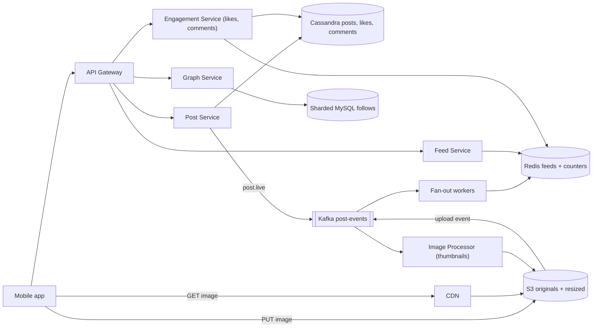
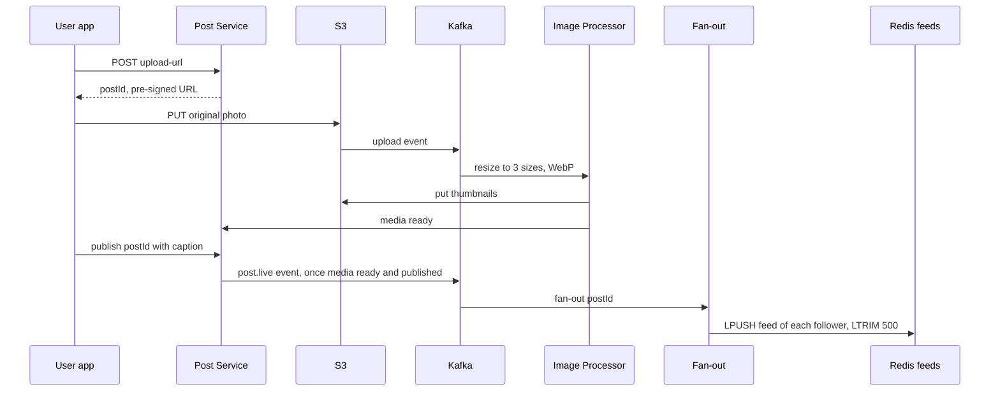

# Design Instagram

**In one line:** users upload photos, follow other users, and see posts from people they follow in their feed, along with likes, comments and stories that last 24 hours. The core challenge is to **upload and serve heavy media fast** and to **build the feed quickly**, even when a celebrity has 500 million followers.

**What the interviewer checks in this question:** correct use of blob storage + CDN, keeping the upload path off the app servers, async image processing, the feed fan-out trade-off, and hot counters (likes).

---

## Step 1: Clarify with the interviewer (3–5 min)

| You ask | Typical answer | Impact on design |
|---|---|---|
| "Core features: upload, follow, feed, like/comment? Stories too?" | Yes, stories too | TTL storage for stories |
| "Only photos, or videos/reels too?" | Focus on photos, video briefly | Video transcoding out of scope (like [YouTube](../02-questions/t1-07-youtube.md)) |
| "Chronological or ranked feed?" | Simple ranking, mostly recent | Precomputed feed + light rerank |
| "Scale?" | 500M DAU, 100M uploads/day | Very large storage and CDN |
| "Must a post show in the feed right after upload?" | A few seconds of delay is fine | Async fan-out |
| "Does the like count need to be exact?" | Approximate is fine, exact eventually | Counter sharding / batched updates |
| "Search, DMs, explore?" | Out of scope | Mention them and move on |

> **Say:** "I will split this system into three parts: the media pipeline (upload, process, CDN), the social graph + feed, and engagement (likes, comments, stories). It is read-heavy, so both the feed and media will be cached aggressively."

## Step 2: Requirements

**Functional**
1. Users should be able to post a photo + caption, and a story that disappears on its own after 24 hours
2. Users should be able to follow/unfollow other users
3. Users should be able to see a home feed of recent posts from people they follow
4. Users should be able to like and comment, and see the counts

**Out of scope:** video/reels, DMs, search, explore, ads.

**Non-functional (in priority order)**
1. **Latency:** feed p99 < 300ms (metadata), images < 100ms first byte from the CDN
2. **Availability:** 99.99% for feed and image reads
3. **Durability:** an uploaded photo is never lost
4. **Consistency:** eventual. A new post reaches followers' feeds in ~5–10 sec, your own post shows at once (read-your-own-writes)
5. **Scale:** 500M DAU, 100M uploads/day, ~100:1 read vs write, celebrities have hundreds of millions of followers

**CAP choice:** AP for feed, likes and counts: a slightly stale feed or "1.2M likes" is fine, a down feed is not. Media writes are durability-first (S3).

## Step 3: Estimation (only what changes the design)

- 100M uploads/day ≈ **1,200 uploads/sec**. Photo ~2 MB original + 3 resized versions ~500 KB → **~250 TB/day**. So S3 + lifecycle tiers, not the DB.
- Feed reads: 500M DAU × 10 opens ≈ 5B/day ≈ **60K QPS**, peak ~150K. We need a precomputed feed + cache.
- Image reads: ~20 images per feed open → **~1M+ image req/sec**. Only a CDN can handle this.
- Fan-out: avg 200 followers × 1,200 posts/sec ≈ **240K feed writes/sec**. But one post from a celebrity (250–500M followers) = hundreds of millions of writes. So hybrid fan-out.
- Likes: 500M DAU × ~10 likes ≈ 5B/day ≈ **~60K writes/sec**. Post metadata ~1 KB × 100M/day ≈ 100 GB/day (~36 TB/yr). So Cassandra.

> **Say:** "Media bytes will never pass through my app servers. The client uploads straight to S3 and reads from the CDN. App servers only handle metadata."

## Step 4: Core entities

- **User**: id, username, profile_pic_url, follower_count, is_celebrity
- **Post**: id, user_id, caption, media_keys, status (`UPLOADING`, `PROCESSING`, `LIVE`), created_at
- **Follow**: follower_id, followee_id, created_at
- **Like**: post_id, user_id, created_at
- **Comment**: id, post_id, user_id, text, created_at
- **Story**: id, user_id, media_key, created_at, expires_at
- **FeedItem**: user_id → list of post_ids (precomputed)

## Step 5: APIs

```http
POST /posts/upload-url  {contentType, size}          → {postId, uploadUrl (pre-signed S3, 15 min)}
PUT  <uploadUrl>        (client → S3 direct, bytes)  → 200
POST /posts/{postId}/publish  {caption}              → {status: PROCESSING}
GET  /feed?cursor=abc&limit=20                       → {posts: [...], nextCursor}
POST /users/{id}/follow                              → 200
POST /posts/{postId}/like                            → 200 (idempotent)
POST /posts/{postId}/comments  {text}                → {commentId}
POST /stories/upload-url, GET /stories/feed          → stories tray
```

> **Say:** "Upload has two steps: first get a pre-signed URL, then the client PUTs straight to S3. The feed uses cursor-based pagination, not offset, because new posts keep coming in."

## Step 6: High-level design

**Start with a simple v1:** one app service + Postgres (users, posts, follows, likes) + S3 + CDN. Feed = a query over followees' posts with `ORDER BY created_at LIMIT 20`. At small scale this covers FR1–FR4. The numbers break it: 150K peak feed QPS + celebrities → precomputed Redis feeds + hybrid fan-out. Resizing 1,200 uploads/sec → async workers. ~60K likes/sec + 36 TB/yr of metadata → Cassandra. ~1M image req/sec → CDN. Services are split because their load differs (feed 150K, likes 60K, uploads 1.2K per sec).



**Why each component:**
- **Pre-signed URL + S3 (250 TB/day, durability):** bytes bypass the app servers. Proxying would push 250 TB/day through their bandwidth.
- **CDN (~1M+ image req/sec):** an image is written once and read millions of times. Serving straight from S3 = higher latency and egress cost.
- **Image Processor (1,200 uploads/sec):** 3 sizes, WebP/AVIF, EXIF strip, async, never blocks the upload.
- **Kafka post-events:** ~1.2K events/sec, so throughput is not the reason. The reason: 2+ independent consumers (image processor, fan-out, later notifications), replay (if Redis feeds are lost, rerun fan-out), and ordering on the author_id key (`post.live` then `post.deleted`). Simpler option: SNS → one SQS per consumer, but no replay.
- **Post/Engagement + Cassandra (~60K like writes/sec, 36 TB/yr):** simple access patterns (a user's posts, a post's likes), linear scale. Sharded Postgres would work for posts alone, the like volume decides it.
- **Graph Service + sharded MySQL:** few follow writes, only two-direction lookups. No multi-hop queries, so no graph DB needed.
- **Fan-out workers + Redis feeds (150K peak reads, p99 300ms):** a precomputed post_id list per active user (~500M × 500 × 8 B ≈ 2 TB). Pull on read (merging 200 followees on every open) is too slow at this QPS.
- **Feed Service:** merges the precomputed feed with celebrity posts, hydrates, ranks.

**Mapping:** FR1 → Post Service, S3, Kafka, Image Processor (stories: TTL). FR2 → Graph Service + MySQL. FR3 → Fan-out, Redis, Feed Service, CDN. FR4 → Engagement Service, Cassandra, Redis counters.

## Step 7: Main flow: from photo upload to feed



**Feed read:** the Feed Service takes 20 post_ids from Redis `feed:{userId}`, fetches recent posts of followed celebrities separately, merges + ranks them, and returns them with post metadata (from cache) + CDN image URLs.

## Step 8: Data model & DB choice

```text
posts (Cassandra, partition = user_id, clustering = post_id DESC):
  user_id, post_id (Snowflake, time-sortable), caption, media_keys, status, created_at

follows (sharded MySQL, shard key = user_id):
  followers_by_user(user_id, follower_id)   -- for fan-out
  following_by_user(user_id, followee_id)   -- for celebrities on feed read

likes (Cassandra, partition = post_id):  post_id, user_id        -- "did I like it?" check
post_counters (Redis + Cassandra counter): post_id, like_count, comment_count
comments (Cassandra, partition = post_id, clustering = created_at)
stories (Cassandra with TTL 86400 / Redis sorted set by time)
feed cache (Redis list): feed:{userId} → [post_id, ...] max 500
```

- **Cassandra** for posts/likes/comments: huge write volume, simple access patterns (a user's posts, a post's likes), linear scale.
- **Post IDs from Snowflake:** time-sortable, so sorting during the feed merge is easy.
- **Graph:** tables for both directions, because fan-out needs followers and feed reads need following.

## Step 9: Deep dives (where the interviewer will push)

### 9.1 Upload path and image processing
**NFR:** durability + a fast upload response.
1. The client asks for `upload-url`. The server checks it (size < 20 MB, type image), creates the post row in `UPLOADING`, and returns a **pre-signed PUT URL** valid for 15 min.
2. The client uploads straight to S3 (multipart and resumable for large files).
3. S3 event → Kafka → **Image Processor** (autoscaling workers): 3 sizes, WebP, EXIF/GPS strip (privacy), content moderation (nudity/violence ML).
4. Once media is ready and the post is published → post `LIVE`, a `post.live` event, then fan-out. If processing fails → retry, after 3 tries DLQ + error to the user.

> **Say:** "This saves app server bandwidth and the upload runs at S3's scale. Processing is async, so the user sees 'posted' right after the upload."

**Trade-off:** followers see the post a few seconds later, after processing.

### 9.2 Feed generation: hybrid fan-out
**NFR:** feed p99 < 300ms at 150K peak QPS.
See [News Feed](../02-questions/t1-03-news-feed.md) for details. In short:
- **Normal users (< ~10K followers): fan-out on write.** As soon as a post arrives, push the post_id into every follower's Redis feed list. Reads are super fast.
- **Celebrities (Virat Kohli, 250M followers): fan-out on read.** Their posts are not pushed into anyone's feed. On feed read, fetch the latest posts of the celebrities the user follows (usually few) and merge.
- **Inactive users** (not seen for 30 days) are skipped in fan-out. If they come back, build the feed on the fly.
- The feed list stores only post_ids (8 bytes), not the full post. Hydration comes from a separate cache.

**Trade-off:** ~2 TB of Redis and two code paths, and the celebrity merge adds a bit of read latency.

### 9.3 Like and comment counters
**NFR:** availability on hot posts + ~60K like writes/sec.
- Virat's post gets 100K likes/min. A single-row `UPDATE count = count + 1` becomes a hot row.
- **Like record:** insert into `likes(post_id, user_id)`, idempotent (same user liking again = no-op).
- **Count:** Redis `INCR post:123:likes` (fast), and a background job flushes from Redis to Cassandra every few seconds. For very hot posts, use a **sharded counter** (split across 10 keys, sum on read).
- The UI shows "1.2M likes", so an exact real-time count is not needed.
- Comments: partitioned by post_id, time-ordered, cursor pagination.

**Trade-off:** counts are a few seconds stale, and after a Redis crash the increments since the last flush depend on AOF.

### 9.4 Stories with TTL
**NFR:** FR1's 24 hr expiry without cleanup jobs.
- Story upload uses the same pre-signed path. Metadata goes in Cassandra with **TTL 24 hr** (the row deletes itself), or a Redis sorted set `stories:{userId}` with score = timestamp, and old ones removed with `ZREMRANGEBYSCORE`.
- **Stories tray:** which of the people the user follows have an active story. Fan-out on write pushes the user_id into `tray:{userId}` with a TTL. For celebrities, check at read time.
- Media is deleted/archived after 24 hr by an S3 lifecycle rule (keep the user's "highlights" separately for the archive feature).

**Trade-off:** the S3 lifecycle runs once a day, so media can live a bit longer. The read path filters by `expires_at`.

## Step 10: Decision table (what we chose, why, and what we did not)

| Decision | Why we chose it | What we did not choose, and why |
|---|---|---|
| **Pre-signed URL, client → S3 direct** | Zero bandwidth on app servers, S3's scale | **Upload proxied through the app server:** 250 TB/day through app servers. Sacrifice: validation happens later (size/type check in the processor) |
| **Async image processing via Kafka** | Fast upload, workers scale separately. Kafka: 2+ consumers + replay + per-author order | **Resize inside the upload request:** servers go down on spikes. **SQS:** no replay. Sacrifice: operating Kafka for ~1.2K events/sec |
| **CDN for images** | 1M+ req/sec from the edge, low latency | **Serve straight from S3:** higher latency and egress cost. Sacrifice: CDN purge on delete/privacy change |
| **Hybrid fan-out + Redis feed lists** | Fast reads for normal users, no write storm for celebrities | **Pure push:** one celebrity post = 250M writes. **Pure pull:** merge 200+ users on every open. Sacrifice: ~2 TB RAM, two code paths |
| **Cassandra for posts/likes/comments** | ~60K like writes/sec, 36 TB/yr, partition by user/post | **Sharded Postgres:** fine for posts, but manual sharding at the like volume. Sacrifice: no joins/transactions |
| **Sharded MySQL for follows** | Two-direction key lookups, low write rate | **Graph DB (Neo4j):** we don't need multi-hop queries. Sacrifice: queries like "mutual friends" are costly |
| **Redis counters + periodic flush** | Fast even on a hot post, less load on the DB | **DB row `count+1` on every like:** hot row contention. Sacrifice: counts a few seconds stale |
| **TTL for stories** | Auto expiry, no cleanup job | **Delete with a cron:** if late, stories show after 24 hr. Sacrifice: TTL deletes are lazy, filter on read |

## Step 11: Failures & bottlenecks

| What failed | What happens | How to handle |
|---|---|---|
| Upload broke midway | Partial file | Multipart resumable upload. A cleanup job removes `UPLOADING` posts not published within 1 hr |
| Image Processor backlog | Posts stuck in `PROCESSING` | Autoscale workers on Kafka lag. Until then, show a low-res preview of the original |
| Redis feed cache lost | Empty feeds | Fall back to the pull model to rebuild the feed (fetch from following + merge), then warm the cache |
| CDN miss storm (viral post) | Load on S3 | CDN origin shield, pre-warm popular images |
| Counter flush fails | Old count in the DB | Redis AOF + replica, idempotent flush (set the absolute value, not a delta) |
| Follows shard is hot | Celebrity's follower list is slow | Paginate the follower list, and celebrities do not get fan-out anyway |

## Step 12: How to make it better (say this yourself at the end)

> "If I had more time, I would improve these:"
- **ML-ranked feed:** rerank candidates with an engagement prediction model (likes, dwell time). Precomputed candidates + online ranking.
- **Adaptive image delivery:** size/format based on device/network, with a blur placeholder.
- **Storage tiering:** photos older than 1 year go to S3 Infrequent Access / Glacier, cost drops by 50%+.
- **Multi-region:** media and feed caches in every region, writes in the home region, async replication.

## Step 13: Likely follow-up questions

- "How does a celebrity's post reach everyone's feed?" → Fan-out on read for celebrities, merge at read time (Step 9.2)
- "After unfollow, do the posts leave the feed?" → Filter at read time (check the following set), clean up in the background
- "How does feed pagination work?" → Cursor = last post_id (Snowflake, time-sortable)
- **Senior signal:** raise on your own that a viral celebrity post gets hot in three places: one Cassandra partition (`post_id` likes/comments), one Redis counter key, and a CDN miss storm. So sharded counters, comments partitioned by `(post_id, bucket)`, and an origin shield. Also rate-limit the rebuild storm if the Redis feed cluster is lost.

## 2-minute recap (read this before the interview)

> Instagram is read-heavy and media-heavy. Upload: the client gets a pre-signed URL and PUTs straight to S3, so app servers never touch the bytes. The S3 event goes to Kafka, the Image Processor builds thumbnails/WebP async, then the post goes LIVE and `post.live` triggers fan-out. Kafka's reason is not ~1.2K events/sec but 2+ consumers + replay. Images are served from the CDN. Posts, likes and comments live in Cassandra (partitioned by user/post), with IDs from Snowflake. The follow graph is stored in both directions in sharded MySQL. The feed uses hybrid fan-out: normal users' posts go into Redis feed lists with fan-out on write, celebrity posts are merged at read time. Like counts use Redis INCR + periodic flush, with a sharded counter for hot posts. Stories live in Cassandra/Redis with a 24 hr TTL, and media is deleted by an S3 lifecycle rule.

## Checklist

- [ ] I can explain the pre-signed URL upload flow step by step
- [ ] I can explain the async image processing pipeline (S3 event → Kafka → workers)
- [ ] I can estimate the storage and CDN numbers
- [ ] I can explain hybrid fan-out and the celebrity problem
- [ ] I can tell the solution for a hot like counter (Redis + flush + sharded counter)
- [ ] I can explain the TTL design for stories
- [ ] I can draw the HLD diagram in 5 min
- [ ] I can tell 3 trade-offs from the decision table without looking
