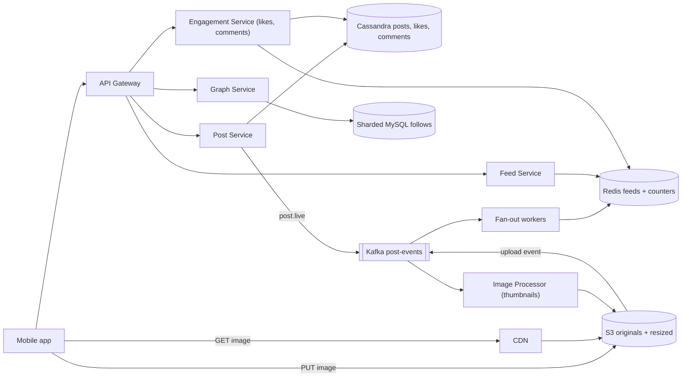
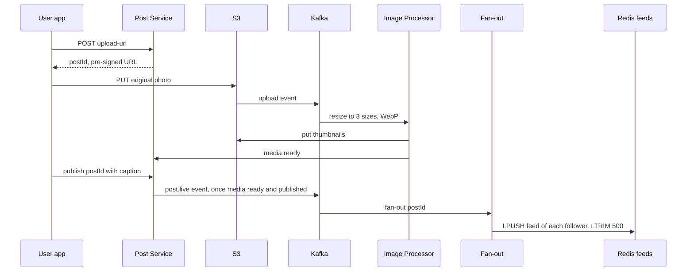

# Design Instagram

**In one line:** photo upload, follow, feed, likes, comments, 24 hr stories. Challenge: **heavy media uploaded + served fast**, **feed built fast**, even when a celebrity has 500M followers.

**What the interviewer checks in this question:** blob + CDN, upload off app servers, async processing, fan-out, hot counters.

---

## Step 1: Clarify with the interviewer (3–5 min)

| You ask | Typical answer | Effect on design |
|---|---|---|
| "Upload, follow, feed, likes? Stories?" | Yes, stories too | TTL storage |
| "Videos/reels too?" | Photo focus, video brief | Transcoding out of scope ([YouTube](../02-questions/t1-07-youtube.md)) |
| "Feed chronological or ranked?" | Simple ranking, mostly recent | Precomputed feed + light rerank |
| "Scale?" | 500M DAU, 100M uploads/day | Huge storage + CDN |
| "Post in feed instantly?" | A few seconds delay is fine | Async fan-out |
| "Exact like count?" | Approx, eventually exact | Counter sharding / batched updates |
| "Search, DMs, explore?" | Out of scope | Mention and move on |

> **Say:** "Three parts: media pipeline, social graph + feed, engagement. Read heavy → feed + media cached aggressively."

## Step 2: Requirements

**Functional**
1. Post photo + caption, and a story that disappears after 24 hours
2. Follow/unfollow
3. Home feed of recent posts from followed users
4. Like, comment, see counts

**Out of scope:** video/reels, DMs, search, explore, ads.

**Non-functional (in priority order)**
1. **Latency:** feed p99 < 300ms (metadata), images from CDN < 100ms first byte
2. **Availability:** 99.99% for feed + image reads
3. **Durability:** an uploaded photo is never lost
4. **Consistency:** eventual: followers in ~5–10 sec, own post instantly (read-your-own-writes)
5. **Scale:** 500M DAU, 100M uploads/day, ~100:1 read:write, celebrities with tens of crores of followers

**CAP choice:** feed/likes/counts AP (stale OK, down not). Media is durability-first (S3).

## Step 3: Estimation (only what changes the design)

- 100M uploads/day ≈ **1,200 uploads/sec**. ~2 MB original + 3 sizes ~500 KB → **~250 TB/day** → S3 + lifecycle tiers.
- Feed: 500M DAU × 10 opens ≈ 5B/day ≈ **60K QPS**, peak ~150K → precomputed feed + cache.
- Images: ~20 per feed open → **~1M+ req/sec** → only a CDN.
- Fan-out: 200 followers × 1,200 posts/sec ≈ **240K feed writes/sec**; one celebrity (25–50 crore followers) post = crores of writes → hybrid fan-out.
- Likes: 500M × ~10 ≈ 5B/day ≈ **~60K writes/sec**. Post metadata ~1 KB × 100M/day ≈ 100 GB/day (~36 TB/yr) → Cassandra.

> **Say:** "Media bytes never touch app servers: direct S3 upload, CDN reads. App servers handle only metadata."

## Step 4: Core entities

- **User**: id, username, profile_pic_url, follower_count, is_celebrity
- **Post**: id, user_id, caption, media_keys, status (`UPLOADING`, `PROCESSING`, `LIVE`), created_at
- **Follow**: follower_id, followee_id, created_at
- **Like**: post_id, user_id, created_at
- **Comment**: id, post_id, user_id, text, created_at
- **Story**: id, user_id, media_key, created_at, expires_at
- **FeedItem**: user_id → list of post_ids (precomputed)

## Step 5: APIs

```http
POST /posts/upload-url  {contentType, size}          → {postId, uploadUrl (pre-signed S3, 15 min)}
PUT  <uploadUrl>        (client → S3 direct, bytes)  → 200
POST /posts/{postId}/publish  {caption}              → {status: PROCESSING}
GET  /feed?cursor=abc&limit=20                       → {posts: [...], nextCursor}
POST /users/{id}/follow                              → 200
POST /posts/{postId}/like                            → 200 (idempotent)
POST /posts/{postId}/comments  {text}                → {commentId}
POST /stories/upload-url, GET /stories/feed          → stories tray
```

> **Say:** "Upload: pre-signed URL → client PUTs to S3. Feed is cursor-based (new posts keep arriving)."

## Step 6: High-level design

**Simple v1:** app service + Postgres + S3 + CDN; feed = `ORDER BY created_at LIMIT 20` on followees. Then: 150K feed QPS + celebrities → Redis + hybrid fan-out. 1,200 uploads/sec → async resize. 60K likes/sec + 36 TB/yr → Cassandra. 1M image req/sec → CDN. Separate services: different loads (feed 150K, likes 60K, uploads 1.2K /sec).



**Why each component:**
- **Pre-signed URL + S3 + CDN:** bytes bypass app servers; an image is written once, read crores of times.
- **Image Processor:** 3 sizes, WebP/AVIF, EXIF strip; async, never blocks the upload.
- **Kafka post-events:** not for throughput (~1.2K/sec); 2+ consumers (processor, fan-out, notifications), replay (Redis lost → redo fan-out), author_id ordering (`post.live` then `post.deleted`).
- **Cassandra / sharded MySQL:** like volume decides Cassandra; follows need only two-direction lookups.
- **Fan-out + Redis feeds:** a post_id list per active user (~500M × 500 × 8 B ≈ 2 TB). Pull is too slow at this QPS.
- **Feed Service:** merges precomputed feed + celebrity posts, hydrates, ranks.

**Mapping:** FR1 → Post Service, S3, Kafka, Image Processor (stories: TTL). FR2 → Graph + MySQL. FR3 → Fan-out, Redis, Feed Service, CDN. FR4 → Engagement, Cassandra, Redis counters.

## Step 7: Main flow: from photo upload to feed



**Feed read:** 20 post_ids from `feed:{userId}` + celebrity posts → merge + rank → metadata + CDN URLs.

## Step 8: Data model & DB choice

```text
posts (Cassandra, partition = user_id, clustering = post_id DESC):
  user_id, post_id (Snowflake, time-sortable), caption, media_keys, status, created_at

follows (sharded MySQL, shard key = user_id):
  followers_by_user(user_id, follower_id)   -- for fan-out
  following_by_user(user_id, followee_id)   -- for celebrities on feed read

likes (Cassandra, partition = post_id):  post_id, user_id        -- "did I like it?" check
post_counters (Redis + Cassandra counter): post_id, like_count, comment_count
comments (Cassandra, partition = post_id, clustering = created_at)
stories (Cassandra with TTL 86400 / Redis sorted set by time)
feed cache (Redis list): feed:{userId} → [post_id, ...] max 500
```

- **Snowflake post IDs:** time-sortable → easy feed merge sort.
- **Graph:** tables in both directions: fan-out needs followers, feed read needs following.

## Step 9: Deep dives (where the interviewer will push)

### 9.1 Upload path and image processing
**NFR:** durability + fast upload response.
1. `upload-url`: check (size < 20 MB, image), post `UPLOADING`, 15 min **pre-signed PUT URL**.
2. Client uploads straight to S3 (multipart, resumable).
3. S3 event → Kafka → **Image Processor** (autoscaling): 3 sizes, WebP, EXIF/GPS strip (privacy), moderation (nudity/violence ML).
4. Media ready + published → `LIVE` → `post.live` → fan-out. Failure → 3 retries → DLQ + error to user.

> **Say:** "Upload runs at S3's scale and saves app bandwidth. Processing is async → the user sees 'posted' at once."

**Trade-off:** followers see the post a few seconds after processing.

### 9.2 Feed generation: hybrid fan-out
**NFR:** feed p99 < 300ms at 150K peak QPS.
Details: [News Feed](../02-questions/t1-03-news-feed.md).
- **Normal (< ~10K followers): fan-out on write** → post_id into every follower's Redis list.
- **Celebrities (Virat Kohli, 25 crore followers): fan-out on read** → on read, merge latest posts of followed celebrities (usually few).
- **Inactive** (30 days) → skip, build the feed on the fly when they return.
- Lists hold only post_ids (8 bytes), hydration from cache.

**Trade-off:** celebrity merge adds a little read latency.

### 9.3 Like and comment counters
**NFR:** availability on hot posts + ~60K like writes/sec.
- Virat's post: 1 lakh likes/min → `count + 1` = hot row.
- **Like record:** insert into `likes(post_id, user_id)`, idempotent (liking again = no-op).
- **Count:** Redis `INCR post:123:likes`, a background job flushes to Cassandra every few sec. Very hot → **sharded counter** (10 keys, sum on read).
- UI shows "1.2M likes" → exact real time not needed.
- Comments: post_id partition, time-ordered, cursor pagination.

**Trade-off:** count a few sec stale; after a Redis crash, increments since the last flush depend on AOF.

### 9.4 Stories with TTL
**NFR:** 24 hr expiry without cleanup jobs.
- Same pre-signed upload. Metadata in Cassandra with **TTL 24 hr**, or Redis sorted set `stories:{userId}` (score = timestamp) + `ZREMRANGEBYSCORE`.
- **Tray:** fan-out on write → `tray:{userId}` (TTL); celebrities checked at read time.
- Media: S3 lifecycle deletes/archives after 24 hr ("highlights" kept separately).

**Trade-off:** S3 lifecycle runs daily → media may linger; read path filters by `expires_at`.

## Step 10: Decision table (what we chose, why, and what we did not)

| Decision | Why we chose it | What we did not choose, and why |
|---|---|---|
| **Pre-signed URL, client → S3** | Zero app bandwidth, S3 scale | **Upload proxy:** 250 TB/day through app servers. Sacrifice: validation in processor |
| **Async processing via Kafka** | Fast upload; 2+ consumers, replay, per-author order | **Resize in request:** down on spikes. **SQS:** no replay. Sacrifice: Kafka ops |
| **CDN for images** | 1M+ req/sec from the edge | **S3 direct:** latency + egress. Sacrifice: CDN purge on delete/privacy |
| **Hybrid fan-out + Redis lists** | Fast reads, no celebrity write storm | **Pure push:** 25 crore writes/post. **Pure pull:** 200+ merge per open. Sacrifice: ~2 TB RAM, two paths |
| **Cassandra for posts/likes/comments** | ~60K writes/sec, 36 TB/yr | **Sharded Postgres:** manual sharding at like volume. Sacrifice: no joins/transactions |
| **Sharded MySQL for follows** | Two-direction lookups, low writes | **Neo4j:** no multi-hop needed. Sacrifice: "mutual friends" is costly |
| **Redis counters + flush** | Fast on hot posts, less DB load | **`count+1` per like:** hot row contention. Sacrifice: seconds stale |
| **TTL for stories** | Auto expiry, no cleanup job | **Cron delete:** if late, stories show past 24 hr. Sacrifice: lazy delete, read filter |

## Step 11: Failures & bottlenecks

| What failed | What happens | How to handle it |
|---|---|---|
| Upload broke | Partial file | Multipart resumable; clean up `UPLOADING` posts older than 1 hr |
| Processor backlog | Posts stuck in `PROCESSING` | Autoscale on Kafka lag, low-res preview |
| Redis feed cache lost | Empty feeds | Rebuild via pull model, warm cache |
| CDN miss storm (viral) | Load on S3 | Origin shield, pre-warm popular images |
| Counter flush fails | DB count stale | Redis AOF + replica, idempotent flush (absolute value, not delta) |
| Follows shard hot | Celebrity follower list slow | Paginate; celebrities get no fan-out anyway |

## Step 12: How to make it better (say this yourself at the end)

- **ML-ranked feed:** engagement model (likes, dwell time), candidates + online ranking.
- **Adaptive images:** size/format by device/network + blur placeholder.
- **Storage tiering:** photos older than 1 year to S3 IA / Glacier, 50%+ cheaper.
- **Multi-region:** caches per region, writes to home region, async replication.

## Step 13: Likely follow-up questions

- "Celebrity post in everyone's feed?" → Fan-out on read, merge at read time (9.2)
- "Posts leave the feed after unfollow?" → Filter at read time (following set), background cleanup
- "Feed pagination?" → Cursor = last post_id (Snowflake, time-sortable)
- **Senior signal:** raise on your own: a viral celebrity post gets hot in three places: a Cassandra partition (`post_id` likes/comments), a Redis counter key, a CDN miss storm. Fix: sharded counters, comments partitioned by `(post_id, bucket)`, origin shield; rate-limit the rebuild storm if the Redis feed cluster is lost.

## 2-minute recap (read this before the interview)

> Pre-signed URL → S3 → Kafka → Image Processor → LIVE → fan-out. Images via CDN. Cassandra for posts/likes/comments, Snowflake IDs; follows in sharded MySQL. Hybrid fan-out (celebrities merged on read). Likes: Redis INCR + flush, sharded counter. Stories: TTL + S3 lifecycle.

## Checklist

- [ ] I can explain the pre-signed URL upload flow step by step
- [ ] I can explain the async image processing pipeline (S3 event → Kafka → workers)
- [ ] I can estimate the storage and CDN numbers
- [ ] I can explain hybrid fan-out and the celebrity problem
- [ ] I can tell the solution for a hot like counter (Redis + flush + sharded counter)
- [ ] I can explain the TTL design for stories
- [ ] I can draw the HLD diagram in 5 min
- [ ] I can tell 3 trade-offs from the decision table without looking
