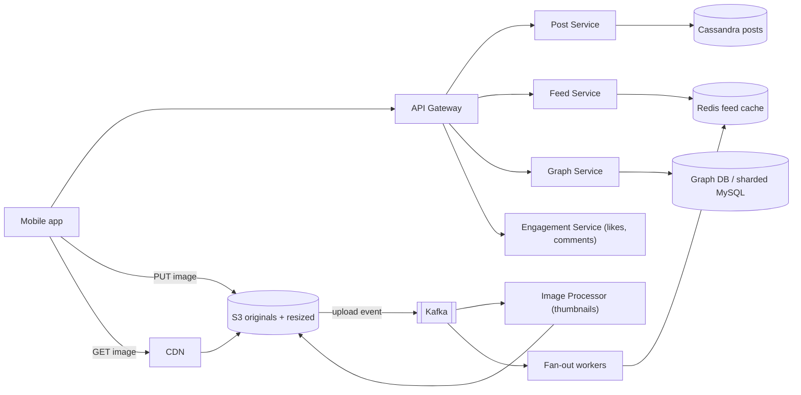
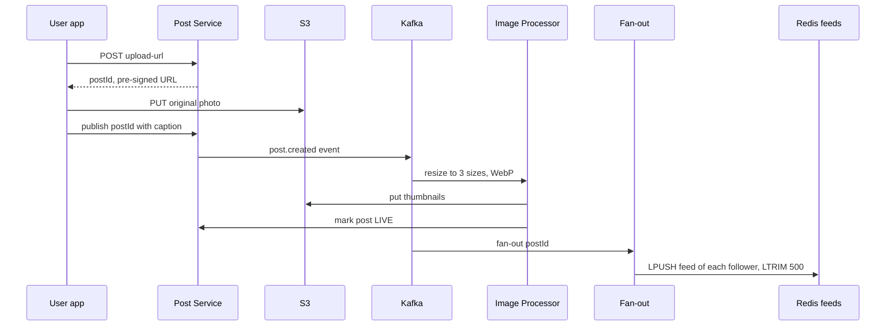

# Design Instagram

**In one line:** users upload photos, follow other users, and see posts from people they follow in their feed, along with likes, comments and stories that last 24 hours. The core challenge is to **upload and serve heavy media fast** and to **build the feed quickly**, even when a celebrity has 500 million followers.

**What the interviewer checks in this question:** correct use of blob storage + CDN, keeping the upload path off the app servers, async image processing, the feed fan-out trade-off, and hot counters (likes).

---

## Step 1: Clarify with the interviewer (3–5 min)

| You ask | Typical answer | Impact on design |
|---|---|---|
| "Core features: upload, follow, feed, like/comment? Stories too?" | Yes, stories too | TTL storage for stories |
| "Only photos, or videos/reels too?" | Focus on photos, video briefly | Video transcoding out of scope (like [YouTube](../02-questions/t1-07-youtube.md)) |
| "Chronological or ranked feed?" | Simple ranking, mostly recent | Precomputed feed + light rerank |
| "Scale?" | 500M DAU, 100M uploads/day | Very large storage and CDN |
| "Must a post show in the feed right after upload?" | A few seconds of delay is fine | Async fan-out |
| "Does the like count need to be exact?" | Approximate is fine, exact eventually | Counter sharding / batched updates |
| "Search, DMs, explore?" | Out of scope | Mention them and move on |

> **Say:** "I will split this system into three parts: the media pipeline (upload, process, CDN), the social graph + feed, and engagement (likes, comments, stories). It is read-heavy, so both the feed and media will be cached aggressively."

## Step 2: Requirements

**Functional**
1. User uploads a photo + caption
2. User follows/unfollows other users
3. Home feed: recent posts from followed users
4. Like and comment, with counts shown
5. Stories: disappear on their own after 24 hours

**Non-functional**
- **Low latency:** feed load < 300ms, images fast from the CDN
- **High availability:** feed always works (eventual consistency is OK)
- **Durability:** an uploaded photo is never lost
- **Scale:** read-heavy (~100:1 read vs write), celebrities have hundreds of millions of followers

## Step 3: Estimation (only what changes the design)

- 100M uploads/day ≈ **1,200 uploads/sec**. Photo ~2 MB original + 3 resized versions ~500 KB → **~250 TB/day**. So S3 + lifecycle tiers, not the DB.
- Feed reads: 500M DAU × 10 opens ≈ 5B/day ≈ **60K QPS**, peak ~150K. We need a precomputed feed + cache.
- Image reads: ~20 images per feed open → **~1M+ image req/sec**. Only a CDN can handle this.
- Fan-out: avg 200 followers × 1,200 posts/sec ≈ **240K feed writes/sec**. But one post from a celebrity (500M followers) = 500M writes. So hybrid fan-out.

> **Say:** "Media bytes will never pass through my app servers. The client uploads straight to S3 and reads from the CDN. App servers only handle metadata."

## Step 4: Core entities

- **User**: id, username, profile_pic_url, follower_count, is_celebrity
- **Post**: id, user_id, caption, media_keys, status (`UPLOADING`, `PROCESSING`, `LIVE`), created_at
- **Follow**: follower_id, followee_id, created_at
- **Like**: post_id, user_id, created_at
- **Comment**: id, post_id, user_id, text, created_at
- **Story**: id, user_id, media_key, created_at, expires_at
- **FeedItem**: user_id → list of post_ids (precomputed)

## Step 5: APIs

```http
POST /posts/upload-url  {contentType, size}          → {postId, uploadUrl (pre-signed S3, 15 min)}
PUT  <uploadUrl>        (client → S3 direct, bytes)  → 200
POST /posts/{postId}/publish  {caption}              → {status: PROCESSING}
GET  /feed?cursor=abc&limit=20                       → {posts: [...], nextCursor}
POST /users/{id}/follow                              → 200
POST /posts/{postId}/like                            → 200 (idempotent)
POST /posts/{postId}/comments  {text}                → {commentId}
POST /stories/upload-url, GET /stories/feed          → stories tray
```

> **Say:** "Upload has two steps: first get a pre-signed URL, then the client PUTs straight to S3. The feed uses cursor-based pagination, not offset, because new posts keep coming in."

## Step 6: High-level design



**Why each component:**
- **Pre-signed URL + S3:** heavy bytes bypass the app servers. S3 is durable (11 nines) and scales without limit.
- **CDN:** an image is written once and read millions of times. Edge caching cuts both latency and S3 cost.
- **Image Processor (async):** thumbnails (150px, 640px, 1080px), WebP/AVIF conversion, EXIF strip. It does not block the upload response.
- **Post Service + Cassandra:** post metadata, write-heavy, partitioned by user_id, sorted by time.
- **Graph Service:** follow/unfollow, follower list. Fan-out reads followers from here.
- **Fan-out workers + Redis feed cache:** a precomputed feed (list of post_ids) for every user.
- **Feed Service:** merges the precomputed feed with celebrity posts, hydrates, ranks.
- **Engagement Service:** likes/comments + counters.

## Step 7: Main flow: from photo upload to feed



**Feed read:** the Feed Service takes 20 post_ids from Redis `feed:{userId}`, fetches recent posts of followed celebrities separately, merges + ranks them, and returns them with post metadata (from cache) + CDN image URLs.

## Step 8: Data model & DB choice

```text
posts (Cassandra, partition = user_id, clustering = post_id DESC):
  user_id, post_id (Snowflake, time-sortable), caption, media_keys, status, created_at

follows (sharded MySQL / Cassandra):
  followers_by_user(user_id, follower_id)   -- for fan-out
  following_by_user(user_id, followee_id)   -- for celebrities on feed read

likes (Cassandra, partition = post_id):  post_id, user_id        -- "did I like it?" check
post_counters (Redis + Cassandra counter): post_id, like_count, comment_count
comments (Cassandra, partition = post_id, clustering = created_at)
stories (Cassandra with TTL 86400 / Redis sorted set by time)
feed cache (Redis list): feed:{userId} → [post_id, ...] max 500
```

- **Cassandra** for posts/likes/comments: huge write volume, simple access patterns (a user's posts, a post's likes), linear scale.
- **Post IDs from Snowflake:** time-sortable, so sorting during the feed merge is easy.
- **Graph:** tables for both directions, because fan-out needs followers and feed reads need following.

## Step 9: Deep dives (where the interviewer will push)

### 9.1 Upload path and image processing
1. The client asks for `upload-url`. The server checks it (size < 20 MB, type image), creates the post row in `UPLOADING`, and returns a **pre-signed PUT URL** valid for 15 min.
2. The client uploads straight to S3 (multipart and resumable for large files).
3. S3 event → Kafka → **Image Processor** (autoscaling workers): 3 sizes, WebP, EXIF/GPS strip (privacy), content moderation (nudity/violence ML).
4. When all is done, the post becomes `LIVE`, then fan-out. If processing fails → retry, after 3 tries DLQ + error to the user.

> **Say:** "This saves app server bandwidth and the upload runs at S3's scale. Processing is async, so the user sees 'posted' right after the upload."

### 9.2 Feed generation: hybrid fan-out
See [News Feed](../02-questions/t1-03-news-feed.md) for details. In short:
- **Normal users (< ~10K followers): fan-out on write.** As soon as a post arrives, push the post_id into every follower's Redis feed list. Reads are super fast.
- **Celebrities (Virat Kohli, 250M followers): fan-out on read.** Their posts are not pushed into anyone's feed. On feed read, fetch the latest posts of the celebrities the user follows (usually few) and merge.
- **Inactive users** (not seen for 30 days) are skipped in fan-out. If they come back, build the feed on the fly.
- The feed list stores only post_ids (8 bytes), not the full post. Hydration comes from a separate cache.

### 9.3 Like and comment counters
- Virat's post gets 100K likes/min. A single-row `UPDATE count = count + 1` becomes a hot row.
- **Like record:** insert into `likes(post_id, user_id)`, idempotent (same user liking again = no-op).
- **Count:** Redis `INCR post:123:likes` (fast), and a background job flushes from Redis to Cassandra every few seconds. For very hot posts, use a **sharded counter** (split across 10 keys, sum on read).
- The UI shows "1.2M likes", so an exact real-time count is not needed.
- Comments: partitioned by post_id, time-ordered, cursor pagination. Top comments are a separate ranked list.

### 9.4 Stories with TTL
- Story upload uses the same pre-signed path. Metadata goes in Cassandra with **TTL 24 hr** (the row deletes itself), or a Redis sorted set `stories:{userId}` with score = timestamp, and old ones removed with `ZREMRANGEBYSCORE`.
- **Stories tray:** which of the people the user follows have an active story. Fan-out on write pushes the user_id into `tray:{userId}` with a TTL. For celebrities, check at read time.
- Media is deleted/archived after 24 hr by an S3 lifecycle rule (keep the user's "highlights" separately for the archive feature).
- Seen/unseen state per viewer is a small Redis set.

## Step 10: Decision table (what we chose, why, and what we did not)

| Decision | Why we chose it | What we did not choose, and why |
|---|---|---|
| **Pre-signed URL, client → S3 direct** | Zero bandwidth on app servers, S3's scale | **Upload proxied through the app server:** 250 TB/day through app servers, costly and slow |
| **Async image processing via Kafka** | Fast upload response, workers scale separately | **Resize inside the upload request:** higher latency, servers go down on spikes |
| **CDN for images** | 1M+ req/sec from the edge, low latency | **Serve straight from S3:** higher latency, very high egress cost |
| **Hybrid fan-out** | Fast reads for normal users, no write storm for celebrities | **Pure push:** one celebrity post = 250M writes. **Pure pull:** merge posts of 500 users on every feed open, slow |
| **Cassandra for posts/likes/comments** | Write-heavy, partition by user/post, linear scale | **Single Postgres:** manual sharding at this write volume, and we do not need joins anyway |
| **Redis counters + periodic flush** | Fast even on a hot post, less load on the DB | **DB row `count+1` on every like:** hot row contention, lock waits |
| **TTL for stories** | Auto expiry, no cleanup job | **Delete with a cron:** if it runs late, stories show after 24 hr, extra DB load |

## Step 11: Failures & bottlenecks

| What failed | What happens | How to handle |
|---|---|---|
| Upload broke midway | Partial file | Multipart resumable upload. A cleanup job removes `UPLOADING` posts not published within 1 hr |
| Image Processor backlog | Posts stuck in `PROCESSING` | Autoscale workers on Kafka lag. Until then, show a low-res preview of the original |
| Redis feed cache lost | Empty feeds | Fall back to the pull model to rebuild the feed (fetch from following + merge), then warm the cache |
| Celebrity post | Fan-out storm | Hybrid: fan-out on read for celebrities |
| CDN miss storm (viral post) | Load on S3 | CDN origin shield, pre-warm popular images |
| Counter flush fails | Old count in the DB | Redis AOF + replica, idempotent flush (set the absolute value, not a delta) |
| Graph DB shard is hot | Celebrity's follower list is slow | Paginate the follower list, and celebrities do not get fan-out anyway |

## Step 12: How to make it better (say this yourself at the end)

> "If I had more time, I would improve these:"
- **ML-ranked feed:** rerank candidates with an engagement prediction model (likes, dwell time). Precomputed candidates + online ranking.
- **Adaptive image delivery:** size/format based on device and network (AVIF on fast networks, low-res on 2G). Progressive loading with a blur placeholder.
- **Storage tiering:** photos older than 1 year go to S3 Infrequent Access / Glacier, cost drops by 50%+.
- **Multi-region:** media and feed caches in every region, writes in the home region, async replication.
- **Explore page:** top-K popular posts per interest, a separate pipeline.
- **Abuse:** rate limits + bot detection for spam likes/follows.

## Step 13: Likely follow-up questions

- "Why not upload through the app server?" → Bandwidth and scale. Pre-signed URL, straight to S3 (Step 9.1)
- "How does a celebrity's post reach everyone's feed?" → Fan-out on read for celebrities, merge at read time (Step 9.2)
- "After unfollow, do the posts leave the feed?" → Filter at read time (check the following set), clean up in the background
- "Why is the like count not consistent?" → Approximate is acceptable, Redis INCR + periodic flush
- "How do stories disappear after 24 hr?" → Cassandra TTL / Redis sorted set + S3 lifecycle
- "A user liked the same photo twice?" → `likes(post_id, user_id)` is unique, idempotent
- "How does feed pagination work?" → Cursor = last post_id (Snowflake, time-sortable)

## 2-minute recap (read this before the interview)

> Instagram is read-heavy and media-heavy. Upload: the client gets a pre-signed URL and PUTs straight to S3, so app servers never touch the bytes. The S3 event goes to Kafka, the Image Processor builds thumbnails/WebP async, then the post goes LIVE. Images are served from the CDN. Posts, likes and comments live in Cassandra (partitioned by user/post), with IDs from Snowflake. The follow graph is stored in both directions. The feed uses hybrid fan-out: normal users' posts go into Redis feed lists with fan-out on write, celebrity posts are merged at read time. Like counts use Redis INCR + periodic flush, with a sharded counter for hot posts. Stories live in Cassandra/Redis with a 24 hr TTL, and media is deleted by an S3 lifecycle rule.

## Checklist

- [ ] I can explain the pre-signed URL upload flow step by step
- [ ] I can explain the async image processing pipeline (S3 event → Kafka → workers)
- [ ] I can estimate the storage and CDN numbers
- [ ] I can explain hybrid fan-out and the celebrity problem
- [ ] I can tell the solution for a hot like counter (Redis + flush + sharded counter)
- [ ] I can explain the TTL design for stories
- [ ] I can draw the HLD diagram in 5 min
- [ ] I can tell 3 trade-offs from the decision table without looking
