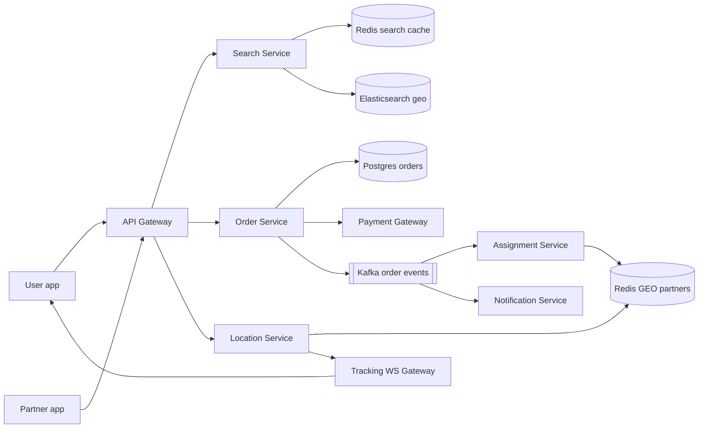
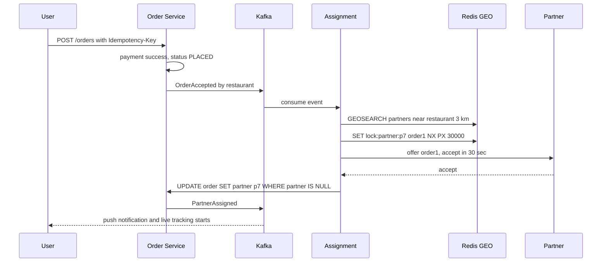
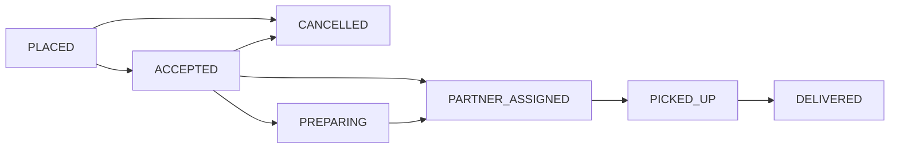

# Design Swiggy / Zomato (Food Delivery)

**In one line:** a user finds nearby restaurants, builds a cart from the menu, pays, and a delivery partner picks up the food and delivers it with live tracking.

**What the interviewer checks in this question:** geo search (nearby restaurants), a clean order state machine, making sure **the same order is never assigned twice** to delivery partners (lock), the scale of live location tracking, and async events between services.

---

## Step 1: Clarify with the interviewer (3–5 min)

| You ask | Typical answer | Impact on design |
|---|---|---|
| "Scope: search, menu, cart, order, partner assignment, tracking? Payment via a third-party gateway?" | Yes | Payment gateway is a black box, result comes via webhook |
| "What is the delivery radius? 5–7 km?" | Yes, ~7 km | Geohash precision 5–6 cells, query nearby cells |
| "How often does partner location come in?" | Every 5 sec | Very high location writes, so Redis geo, not the DB |
| "One order per partner at a time? Or batching?" | One first, batching is a bonus | Lock on the partner during assignment |
| "Scale?" | ~20M orders/day, peaks city-wise at lunch/dinner, 500K active partners | Search is read-heavy, location is write-heavy |
| "Ratings, offers engine, grocery in scope?" | No | Out of scope |

> **Say:** "I will design 4 core flows: nearby restaurant search, placing an order, assigning a partner, and live tracking. I will keep consistency on orders and assignment, and low latency and availability on search and tracking."

## Step 2: Requirements

**Functional**
1. Users should be able to search nearby open restaurants (cuisine, dish name, rating filters)
2. Users should be able to view the menu, build a cart, place an order and pay
3. Users should be able to get a nearby free partner assigned as soon as the restaurant accepts
4. Users should be able to see the partner on a live map with ETA, and get a push on every status change

**Out of scope:** ratings/reviews, offers engine, grocery, partner payouts, order batching.

**Non-functional (in priority order)**
1. **Correctness:** one order to one partner, one order per partner at a time, no double charge
2. **Latency:** search p99 < 300 ms, partner location reaches the user in < 2 sec
3. **Availability:** search and menu at 99.99%, even at lunch/dinner peak
4. **Scale:** 20M orders/day, 500K active partners, search read-heavy (~10 searches per order), location write-heavy

**CAP choice:** consistency for orders, payment and assignment (a wrong assignment costs money and trust). Availability for search, menu and tracking: a 1–2 min old list or a 5 sec old location is fine.

## Step 3: Estimation (only what changes the design)

- 20M orders/day, peak 3x → ~**700 orders/sec** at peak. SQL sharded by city can handle it.
- Order events: ~6 status changes per order → peak ~**4K events/sec**, 3 separate consumers (assignment, notification, analytics).
- Search: ~10 searches per order → 200M/day ≈ 2.3K/sec avg, peak 3x ≈ **7K QPS**. The geohash cache absorbs most of it.
- Location: 500K partners / 5 sec → **100K writes/sec**. This will not go to Postgres, it stays in-memory in Redis GEO.

> **Say:** "Order write load is manageable. The real load is partner location updates, 100K/sec, so location stays in Redis and only sampled history goes to S3."

## Step 4: Core entities

- **Restaurant**: id, name, lat, lng, geohash, cuisines, is_open, rating
- **MenuItem**: id, restaurant_id, name, price, in_stock
- **Cart**: user_id, restaurant_id, items (in Redis, temporary)
- **Order**: id, user_id, restaurant_id, partner_id, items, amount, status, idempotency_key
- **DeliveryPartner**: id, status (`OFFLINE`, `AVAILABLE`, `BUSY`), current_lat, current_lng

## Step 5: APIs

```http
GET  /restaurants?lat=18.52&lng=73.85&cuisine=biryani   → nearby list
GET  /restaurants/{id}/menu                             → menu items
PUT  /cart  {restaurantId, items}                       → cart
POST /orders {cartId, addressId, paymentToken}          → {orderId, status}
     Header: Idempotency-Key: <uuid>
POST /partners/location {lat, lng}                      → 204 (every 5 sec)
WS   /orders/{orderId}/track                            → live location + ETA push
```

## Step 6: High-level design

**Start with a simple v1:** apps → one backend service → one Postgres + PostGIS (restaurants, orders, partner location), the user polls for tracking. All FRs are met. Then the numbers break it: 100K location writes/sec (→ Redis GEO + Location Service), dish text search at 7K QPS (→ Elasticsearch), 3 consumers per order event (→ Kafka), hundreds of thousands of users polling every 5 sec (→ WebSocket gateway).



**Why each component:** (FR1 → Search + ES, FR2 → Order Service + Postgres + Payment, FR3 → Assignment + Redis GEO, FR4 → Location + Tracking WS + Notification)
- **Elasticsearch:** typo-tolerant text on dish names ("paneer tikka") + geo + filters, 7K QPS. For a geo-only filter **PostGIS + read replicas** would be enough. Synced via CDC.
- **Redis search cache:** key `geohash6 + filters`, 1–2 min TTL. All users in an area get the same list, less ES load.
- **Order Service + Postgres:** the state machine and payment need ACID. City-sharded Postgres handles 700 orders/sec.
- **Kafka:** ~4K events/sec, but **3 independent consumers** + analytics replay. With one consumer, outbox + an SQS worker would be enough.
- **Assignment Service:** a separate worker, so 30 sec offer windows and retries do not block the order request path.
- **Location Service + Redis GEO:** 100K writes/sec, 100x different scale from the order flow, hence a separate service.
- **Tracking WS Gateway:** push, because hundreds of thousands of users polling every 5 sec is wasted load.

## Step 7: Main flow: from order to delivery



## Step 8: Data model & DB choice

```sql
orders(id PK, user_id, restaurant_id, partner_id NULL, status, amount,
       idempotency_key UNIQUE, created_at, updated_at)   -- shard by city_id
order_events(order_id, from_status, to_status, at)       -- audit trail
restaurants(id PK, name, lat, lng, geohash, is_open, cuisines)
```

- **Postgres** for orders (transactions, conditional update). Shard by city, because an order never crosses a city.
- **Redis GEO** for partner live location. **Location history:** a point every 30 sec in a Redis list, on `DELIVERED` the route goes to S3 (key `order_id`). It is only read per order, so no Cassandra.
- **Elasticsearch** for restaurant + dish search (Postgres is the source of truth, ES is only a read copy).

## Step 9: Deep dives (where the interviewer will push)

### 9.1 How do you find nearby restaurants?
**NFR:** search p99 < 300 ms, 7K QPS peak, 99.99% available.
- Store the restaurant's **geohash** (precision 6 ≈ 1.2 km cell). Query the user's cell + 8 neighbours, then filter by exact distance.
- In practice: Elasticsearch `geo_point` + `geo_distance` filter + `is_open` + cuisine. All in one query.
- Cache the result in Redis for 1–2 min with the key `geohash6 + filters`. All users in an area get the same list.
- Delivery radius can differ per restaurant, so also add a "serviceable polygon" check.
- **Trade-off:** cache + CDC can make `is_open`/menu 1–2 min stale; a final check against Postgres happens at order time.

### 9.2 Order state machine
**NFR:** correctness, no invalid or duplicate transitions.

- Transitions happen only through a conditional update: `UPDATE orders SET status='PICKED_UP' WHERE id=? AND status='PARTNER_ASSIGNED'`. 0 rows updated means an invalid or duplicate transition.
- Write every transition to `order_events` and publish it to Kafka (outbox pattern, so the DB and Kafka do not go out of sync).
- **Trade-off:** outbox events are a bit late and at-least-once; consumers dedup on `order_id + status`.

### 9.3 Partner assignment: one partner must not get two orders
**NFR:** one order to one partner, one order per partner (no double assignment).
- `GEOSEARCH` finds `AVAILABLE` partners within 3 km, score them by distance + rating + current load.
- Put a **Redis lock** on the top partner: `SET lock:partner:p7 order1 NX PX 30000`. Send the offer only if you got the lock. If they do not accept in 30 sec, the lock expires and we try the next partner.
- The DB is the final truth: `UPDATE orders SET partner_id=p7 WHERE id=order1 AND partner_id IS NULL`. Even if two assigners race, only one wins.
- Mark the partner `BUSY` so they do not show up in the next search.
- **Trade-off:** offering one partner at a time = a 30 sec wait per decline. Offering the top 2 in parallel is faster but more complex.

### 9.4 Live tracking and ETA
**NFR:** location reaches the user in < 2 sec, 100K writes/sec.
- Partner app sends `lat,lng` every 5 sec → Location Service → Redis `GEOADD` + Redis pub/sub channel `order:{id}`.
- The Tracking WS Gateway where the user is connected subscribes to that channel and pushes updates. The user has a WebSocket, not polling.
- **ETA** = restaurant prep time (from history) + partner → restaurant + restaurant → user travel time (maps API / road graph, with traffic). Recalculate on every location update and show it to the user smoothed.
- **Trade-off:** pub/sub can miss an update; the next one comes in 5 sec.

## Step 10: Decision table (what we chose, why, and what we did not)

| Decision | Why we chose it | What we did not choose, and why |
|---|---|---|
| **Elasticsearch geo** for restaurant search | Dish text + typos + geo + filters, 7K QPS | **PostGIS:** enough for geo-only, weak at text search. Sacrifice: another cluster, 1–2 min CDC lag |
| **Redis GEO** for partner location | 100K writes/sec in-memory, fast `GEOSEARCH` | **Postgres:** index thrash. **Custom quadtree:** costly to build. Sacrifice: a crash loses the last 5 sec of locations |
| **Redis lock + DB conditional update** for assignment | Lock = offer control, DB = final guarantee | **Only `SELECT FOR UPDATE`:** cannot hold a row lock for 30 sec. Sacrifice: logic in two places |
| **Kafka** for order events | 3 independent consumers + replay | **Outbox + SQS:** simpler for one consumer, 3 need fan-out. **Sync REST chain:** one slow, all slow. Sacrifice: Kafka ops cost at 4K/sec |
| **WebSocket** for tracking | Push, < 2 sec | **Polling:** wasted load. **SSE:** would work. Sacrifice: stateful connections, reconnect handling |
| **Postgres sharded by city** | ACID, an order stays within a city | **Single DB:** limits at peak. **Cassandra:** weak conditional updates. Sacrifice: cross-city reports need a separate store |
| **Outbox pattern** | DB write + event are atomic | **Dual write:** a failed publish loses the event. Sacrifice: a relay + a little lag |

## Step 11: Failures & bottlenecks

| What failed | What happens | How to handle |
|---|---|---|
| No partner is accepting | Order is stuck | Increase radius, increase incentive, after 10 min notify the user / auto cancel + refund |
| Redis GEO node down | Partner locations are gone | Replica failover. The partner app sends again within 5 sec, so the data recovers by itself |
| Payment webhook missed | Money deducted, order PENDING | A reconciliation job asks the gateway for the status |
| Partner app offline | Tracking stopped | Show last known location + "updating", give an option to call the partner |
| Lunch peak in one city | Load on search and order service | City-wise autoscale, search cache, throttle by marking the restaurant "busy" |

## Step 12: How to make it better (say this yourself at the end)

> "If I had more time, I would improve these:"
- **Order batching:** give one partner 2 orders in the same direction, lower cost
- **Pre-assignment:** send the partner before the restaurant's prep time ends, so the partner does not wait
- **ML model** for ETA (historical prep time, weather, traffic)
- A demand-supply heatmap on an **H3 hexagon** grid near restaurants, to reposition partners there

## Step 13: Likely follow-up questions

- "What if two assignment workers grab the same partner?" → Redis `NX` lock + DB `WHERE partner_id IS NULL` (Step 9.3)
- "The restaurant marked an item out of stock after the order?" → the restaurant rejects, order `CANCELLED`, auto refund
- "The user cancelled after pickup?" → the state machine will not allow it, or a cancellation fee policy applies
- "Why location history, and where?" → disputes, ETA training. route sampled every 30 sec, in S3 per order, 90-day TTL
- "Geohash edge problem?" → if the user is on a cell boundary, also query the neighbour cells
- **Senior signal:** raise it yourself: at lunch peak a city runs short of partners, the assignment backlog grows and sequential 30 sec offers multiply the delay. Make assignment lag a metric, auto-adjust radius/incentive, shard Redis GEO by city.

## 2-minute recap (read this before the interview)

> Swiggy has 4 flows: search, order, assignment, tracking. Start from a simple v1 (one service + PostGIS) and evolve on numbers. Search uses Elasticsearch (dish text + geo_distance + filters), with results cached in Redis on a geohash key. Orders live in Postgres, sharded by city, with a strict state machine driven by a conditional `UPDATE ... WHERE status=?`. Every transition goes to Kafka through the outbox (3 consumers: assignment, notification, analytics). The assignment service gets nearby free partners from Redis GEO, puts a `SET NX PX 30s` lock on the top partner, and guarantees it with a final `UPDATE WHERE partner_id IS NULL`. Partner location is 100K writes/sec, kept in Redis, and reaches the user live via Redis pub/sub + a WebSocket gateway. ETA = prep time + travel time, recalculated on every update. Payment uses an idempotency key + reconciliation, notifications go async through Kafka.

## Checklist

- [ ] I can tell the clarifying questions and scale numbers without looking
- [ ] I can explain nearby restaurant search with geohash / ES geo
- [ ] I can draw the order state machine and explain the conditional update
- [ ] I can tell how we prevent double assignment of partners
- [ ] I can explain the live tracking flow (Redis GEO, pub/sub, WebSocket)
- [ ] I can tell the components of ETA
- [ ] I can tell 3 trade-offs from the decision table without looking
