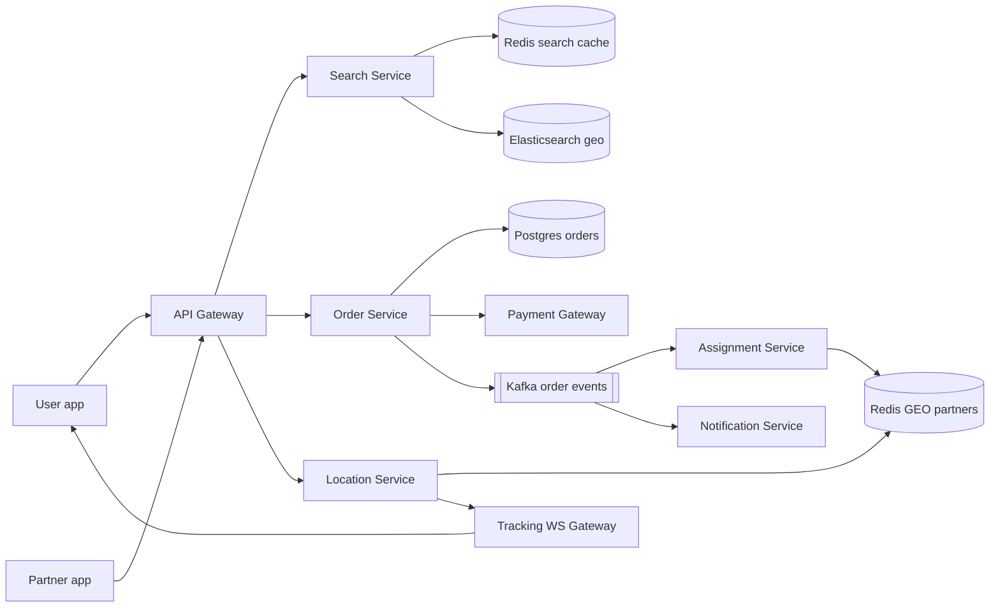
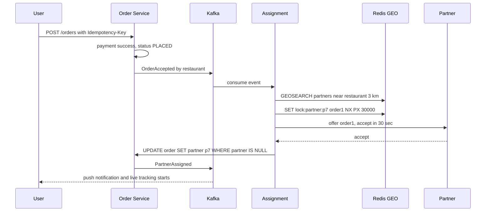
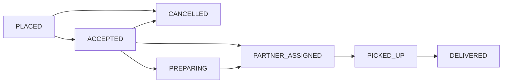

# Design Swiggy / Zomato (Food Delivery)

**In one line:** nearby restaurant → cart → pay → a partner picks up and delivers with live tracking.

**What the interviewer checks:** geo search, order state machine, **no double assignment** (lock), live location scale, async events.

---

## Step 1: Clarify with the interviewer (3–5 min)

| You ask | Typical answer | Impact on design |
|---|---|---|
| "Search, cart, order, assignment, tracking? Third-party payment?" | Yes | Gateway is a black box, result via webhook |
| "Delivery radius? 5–7 km?" | ~7 km | Geohash precision 5–6, query neighbour cells |
| "How often does partner location come?" | Every 5 sec | Heavy writes → Redis geo, not the DB |
| "One order per partner? Batching?" | One first, batching is a bonus | Lock on the partner during assignment |
| "Scale?" | 20M orders/day, 500K partners | Search read-heavy, location write-heavy |

> **Say:** "4 flows: search, order, assignment, tracking. Consistency on orders/assignment, latency + availability on search/tracking."

## Step 2: Requirements

**Functional**
1. Users should be able to search nearby open restaurants (cuisine, dish, rating)
2. Users should be able to build a cart from the menu, order and pay
3. Users should be able to get a nearby free partner when the restaurant accepts
4. Users should be able to see the partner on a live map with ETA + status pushes

**Out of scope:** ratings/reviews, offers engine, grocery, partner payouts, order batching.

**Non-functional (in priority order)**
1. **Correctness:** one order to one partner, one order per partner, no double charge
2. **Latency:** search p99 < 300 ms, location reaches the user in < 2 sec
3. **Availability:** search and menu 99.99%, even at peak
4. **Scale:** 20M orders/day, 500K partners, ~10 searches/order

**CAP choice:** order, payment, assignment → consistency (a wrong assignment costs money + trust). Search, menu, tracking → availability (a 1–2 min old list or 5 sec old location is fine).

## Step 3: Estimation (only what changes the design)

- 20M orders/day, peak 3x → ~**700 orders/sec**. City-sharded SQL is enough.
- ~6 status changes/order → peak ~**4K events/sec**, 3 consumers (assignment, notification, analytics).
- Search: 200M/day ≈ 2.3K/sec avg, peak ≈ **7K QPS**, mostly geohash cache hits.
- Location: 500K / 5 sec → **100K writes/sec** → Redis GEO, not Postgres.

> **Say:** "The real load is location, 100K/sec: keep it in Redis, sampled history in S3."

## Step 4: Core entities

- **Restaurant**: id, name, lat, lng, geohash, cuisines, is_open, rating
- **MenuItem**: id, restaurant_id, name, price, in_stock
- **Cart**: user_id, restaurant_id, items (in Redis, temporary)
- **Order**: id, user_id, restaurant_id, partner_id, items, amount, status, idempotency_key
- **DeliveryPartner**: id, status (`OFFLINE`, `AVAILABLE`, `BUSY`), current_lat, current_lng

## Step 5: APIs

```http
GET  /restaurants?lat=18.52&lng=73.85&cuisine=biryani   → nearby list
GET  /restaurants/{id}/menu                             → menu items
PUT  /cart  {restaurantId, items}                       → cart
POST /orders {cartId, addressId, paymentToken}          → {orderId, status}
     Header: Idempotency-Key: <uuid>
POST /partners/location {lat, lng}                      → 204 (every 5 sec)
WS   /orders/{orderId}/track                            → live location + ETA push
```

## Step 6: High-level design

**Simple v1:** apps → one service → Postgres + PostGIS, tracking by polling. The numbers break it → the components below.



**Why each component:** (FR1 → Search + ES, FR2 → Order + Postgres + Payment, FR3 → Assignment + Redis GEO, FR4 → Location + Tracking WS + Notification)
- **Elasticsearch:** 7K QPS of dish text (typos) + geo + filters. Geo only → PostGIS + replicas is enough. CDC sync.
- **Redis search cache:** key `geohash6 + filters`, 1–2 min TTL → less ES load.
- **Postgres:** state machine + payment need ACID.
- **Kafka:** 3 consumers + replay. One consumer → outbox + SQS is enough.
- **Assignment Service:** so 30 sec offers/retries do not block the order path.
- **Location Service + WS Gateway:** 100K writes/sec (100x the order flow); polling every 5 sec by lakhs of users → push.

## Step 7: Main flow: from order to delivery



## Step 8: Data model & DB choice

```sql
orders(id PK, user_id, restaurant_id, partner_id NULL, status, amount,
       idempotency_key UNIQUE, created_at, updated_at)   -- shard by city_id
order_events(order_id, from_status, to_status, at)       -- audit trail
restaurants(id PK, name, lat, lng, geohash, is_open, cuisines)
```

- **Postgres** for orders, sharded by city (an order never crosses a city).
- **Location history:** a point every 30 sec in a Redis list, on `DELIVERED` the route goes to S3 (key `order_id`). Read only per order → no Cassandra.
- **ES** is only a read copy; Postgres is the source of truth.

## Step 9: Deep dives (where the interviewer will push)

### 9.1 How do you find nearby restaurants?
**NFR:** search p99 < 300 ms, 7K QPS peak, 99.99% available.
- **Geohash** precision 6 ≈ 1.2 km. Query the user's cell + 8 neighbours, then filter by exact distance.
- In practice: ES `geo_point` + `geo_distance` + `is_open` + cuisine in one query; cache in Redis for 1–2 min.
- Radius differs per restaurant → "serviceable polygon" check.
- **Trade-off:** `is_open`/menu can be 1–2 min stale; final Postgres check at order time.

### 9.2 Order state machine
**NFR:** no invalid or duplicate transitions.

- Conditional update only: `UPDATE orders SET status='PICKED_UP' WHERE id=? AND status='PARTNER_ASSIGNED'`. 0 rows → invalid/duplicate.
- Every transition → `order_events` + Kafka, via outbox.
- **Trade-off:** events are a bit late and at-least-once → consumers dedup on `order_id + status`.

### 9.3 Partner assignment: one partner must not get two orders
**NFR:** no double assignment.
- `GEOSEARCH` `AVAILABLE` partners within 3 km → score (distance, rating, load).
- On the top one `SET lock:partner:p7 order1 NX PX 30000` → offer only if locked. No accept in 30 sec → expires, next one.
- DB is the final truth: `UPDATE orders SET partner_id=p7 WHERE id=order1 AND partner_id IS NULL`. In a race only one wins.
- Partner `BUSY` → out of the next search.
- **Trade-off:** one offer at a time = 30 sec per decline. Top-2 in parallel is faster but complex.

### 9.4 Live tracking and ETA
**NFR:** location reaches the user in < 2 sec, 100K writes/sec.
- Partner app every 5 sec → Location Service → Redis `GEOADD` + pub/sub channel `order:{id}`.
- The user's WS Gateway subscribes to the channel and pushes.
- **ETA** = prep time (history) + partner → restaurant + restaurant → user (maps API, traffic). Recalculate on every update, show it smoothed.
- **Trade-off:** pub/sub can miss an update; the next one comes in 5 sec.

## Step 10: Decision table (what we chose, why, and what we did not)

| Decision | Why we chose it | What we did not choose, and why |
|---|---|---|
| **Elasticsearch geo** for search | Text + geo + filters, 7K QPS | **PostGIS:** fine for geo, weak at text. Sacrifice: extra cluster, 1–2 min CDC lag |
| **Redis GEO** for location | 100K writes/sec, fast `GEOSEARCH` | **Postgres:** index thrash. **Quadtree:** costly. Sacrifice: crash → last 5 sec lost |
| **Redis lock + DB conditional update** | Lock = offer, DB = guarantee | **`SELECT FOR UPDATE`:** cannot hold a row lock 30 sec. Sacrifice: logic in two places |
| **Kafka** for order events | 3 consumers + replay | **Outbox + SQS:** for one consumer. **Sync REST:** one slow, all slow. Sacrifice: Kafka ops cost |
| **WebSocket** for tracking | Push, < 2 sec | **Polling:** wasted load. **SSE:** would work. Sacrifice: stateful, reconnects |
| **Postgres by city** | ACID, an order stays in a city | **Single DB:** peak limit. **Cassandra:** weak conditional updates. Sacrifice: cross-city reports elsewhere |
| **Outbox pattern** | DB write + event atomic | **Dual write:** failed publish → lost event. Sacrifice: relay + a little lag |

## Step 11: Failures & bottlenecks

| What failed | What happens | How to handle |
|---|---|---|
| No partner accepts | Order stuck | Raise radius/incentive; after 10 min auto cancel + refund |
| Redis GEO node down | Locations lost | Replica failover; apps resend within 5 sec |
| Payment webhook missed | Money deducted, order PENDING | Reconciliation job asks the gateway |
| Partner app offline | Tracking stops | Last location + "updating", call option |
| Lunch peak in one city | Load on search/order | City-wise autoscale, cache, throttle via restaurant "busy" |

## Step 12: How to make it better (say this yourself at the end)

- **Order batching:** 2 same-direction orders to one partner
- **Pre-assignment:** send the partner before prep ends, so they do not wait
- **ML ETA:** prep history, weather, traffic
- **H3 heatmap:** reposition partners by demand-supply

## Step 13: Likely follow-up questions

- "Two workers grab the same partner?" → 9.3: `NX` lock + `WHERE partner_id IS NULL`
- "Item out of stock after the order?" → restaurant rejects, `CANCELLED`, auto refund
- "Cancel after pickup?" → state machine disallows, or cancellation fee
- "Location history?" → disputes, ETA training; sampled every 30 sec, S3 per order, 90-day TTL
- "Geohash edge problem?" → on a boundary, also query neighbour cells
- **Senior signal:** few partners at peak → backlog, sequential 30 sec offers multiply delay. Make assignment lag a metric, auto-adjust radius/incentive, shard Redis GEO by city.

## 2-minute recap (read this before the interview)

> 4 flows, evolved from a v1 (PostGIS) on numbers. Search = ES + geohash Redis cache. Orders: city-sharded Postgres, conditional `UPDATE ... WHERE status=?`, outbox → Kafka. Assignment: Redis GEO, `SET NX PX 30s`, final `UPDATE WHERE partner_id IS NULL`. Location 100K/sec in Redis → pub/sub → WebSocket. ETA = prep + travel. Payment: idempotency key + reconciliation.

## Checklist

- [ ] I can tell the clarifying questions and scale numbers without looking
- [ ] I can explain nearby restaurant search with geohash / ES geo
- [ ] I can draw the order state machine and explain the conditional update
- [ ] I can tell how we prevent double assignment of partners
- [ ] I can explain the live tracking flow (Redis GEO, pub/sub, WebSocket)
- [ ] I can tell the components of ETA
- [ ] I can tell 3 trade-offs from the decision table without looking
