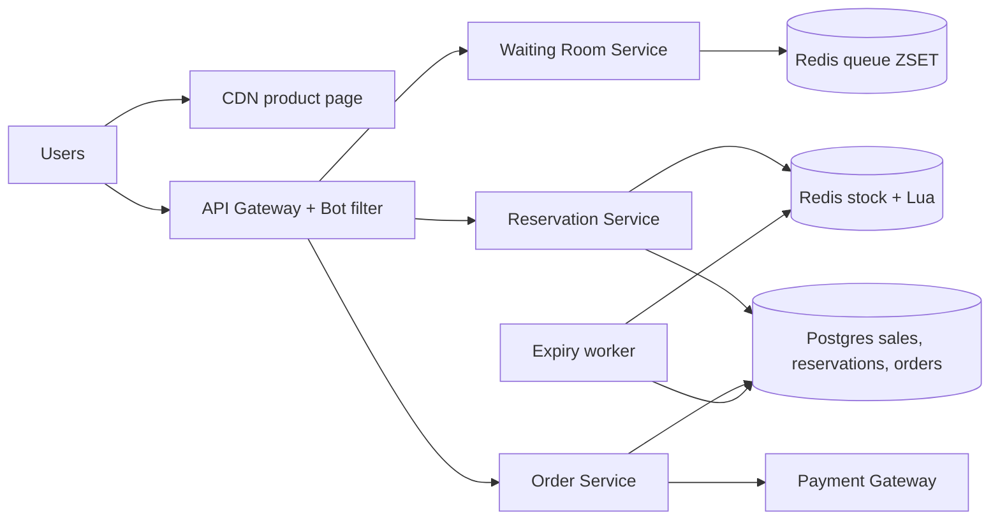
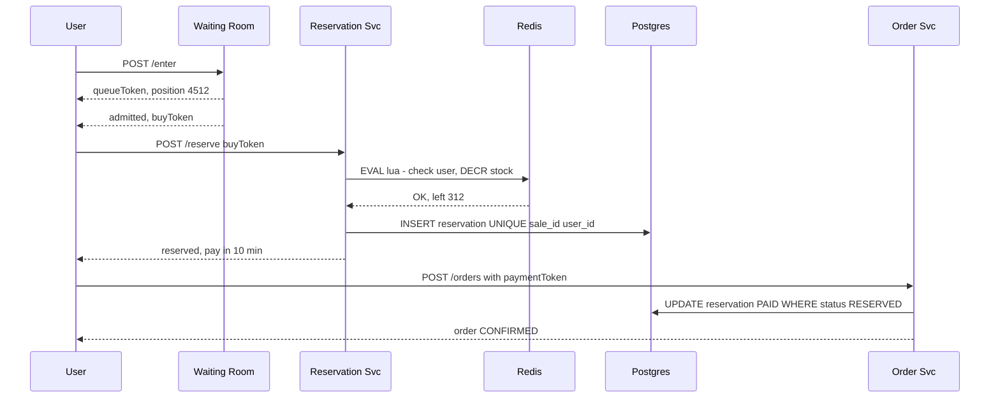

# Design Flash Sale (Big Billion Day / Lightning Deal)

**In one line:** at 12 o'clock, 1,000 iPhones at ₹49,999, 1 million people press "Buy" together. **Zero oversell**, no crash, bots out.

**What the interviewer checks:** hot-key contention, atomic decrement, load shaping (waiting room), stock back on timeout, bots.

---

## Step 1: Clarify with the interviewer (3–5 min)

| You ask | Typical answer | Impact on design |
|---|---|---|
| "Stock and users?" | 1,000 units, 1M users in 1 min | 1000x demand → reject most requests early |
| "Is oversell allowed?" | Zero | Atomic decrement + DB constraint |
| "Per user limit?" | 1 unit | User-level dedup key |
| "Payment window?" | 10 min | Reservation TTL, release on timeout |
| "Is a little undersell OK?" | Yes, released later | Fairness can be a bit loose |

> **Say:** "The problem is contention, not throughput. 99.9% of requests never reach the DB; only the 1,000 winners enter the order path."

## Step 2: Requirements

**Functional**
1. Users should be able to see the product page with a countdown before the sale
2. Users should be able to press "Buy" at sale start and reserve a unit (max 1)
3. Users should be able to pay within 10 min to confirm, otherwise the unit returns to the pool
4. Users should be able to see "Sold out" once stock is gone

**Out of scope:** catalog, search, recommendations, multi-item cart, returns.

**Non-functional (in priority order)**
1. **Correctness:** zero oversell, 1 unit per user
2. **Availability:** 99.99%; the sale path may throttle, never crash
3. **Latency:** p99 < 2 sec (got it / waiting / sold out)
4. **Fairness:** roughly FIFO, no advantage for bots
5. **Scale:** the funnel in Step 3

**CAP choice:** inventory → consistency (stock Redis primary down = pause the sale, no oversell risk). Page and queue position → availability (stale is fine).

## Step 3: Estimation (only what changes the design)

- Refreshes → **~500K QPS** on the page → only a CDN can take it.
- Buy: ~200K QPS in the first 10 sec; one Redis key does ~100K ops/sec → waiting room / rate limit first.
- Only **1,000** reservations → winners get a **sync insert**, no queue needed.

> **Say:** "Funnel: 500K QPS at the CDN, 200K at the gateway, a few thousand at Redis, 1,000 at the DB. Each layer cuts 10–100x."

## Step 4: Core entities

- **Sale**: id, product_id, start_at, end_at, total_stock, per_user_limit
- **Inventory** (Redis): `stock:{saleId}` counter
- **Reservation**: id, sale_id, user_id, status (`RESERVED`, `PAID`, `EXPIRED`), expires_at
- **Order**: id, user_id, sale_id, reservation_id, payment_id, status

## Step 5: APIs

```http
GET  /sales/{saleId}                     → product + countdown (CDN cached)
POST /sales/{saleId}/enter               → {queueToken, position}
GET  /sales/{saleId}/queue/{token}       → {position} or {admitted, buyToken}
POST /sales/{saleId}/reserve {buyToken}  → {reservationId, expiresAt} or SOLD_OUT
POST /orders {reservationId, paymentToken}
     Header: Idempotency-Key: <uuid>     → {orderId, status}
```

## Step 6: High-level design

**Simple v1:** Postgres `UPDATE sales SET sold = sold + 1 WHERE id=? AND sold < total_stock` + reservation insert. Fine for a normal sale; the winners' DB write stays exactly this.



**Why each component:** (FR1 → CDN, FR2 → Waiting Room + Reservation + Redis Lua, FR3 → Order + Payment + Expiry worker, FR4 → sold-out flag at gateway/CDN)
- **CDN:** 500K QPS must not reach the origin; app servers cannot scale 100x in 30 sec.
- **Waiting Room (ZSET):** 200K QPS > one key's ~100K, plus FIFO. A plain rate limit is random, not fair.
- **Redis Lua:** atomic stock check + decrement + user dedup; a DB row would hit lock contention.
- **Postgres sync insert:** ~1,000 rows → **no Kafka**, the spike never reaches the DB.
- **Expiry worker (every 30 sec):** expire unpaid, return stock; a DB scan of 1,000 rows is enough.

## Step 7: Main flow: from buy click to order



## Step 8: Data model & DB choice

```sql
sales(id PK, product_id, start_at, end_at, total_stock, sold INT,
      CHECK (sold <= total_stock))
reservations(id PK, sale_id, user_id, status, expires_at,
             UNIQUE(sale_id, user_id))
orders(id PK, reservation_id UNIQUE, payment_id UNIQUE, status)
```

- **Redis** = fast gatekeeper, **Postgres** = final truth. Reservation insert + `sold = sold + 1` in one transaction; on failure Redis `INCR` returns the unit.
- `CHECK` + `UNIQUE` → no oversell / double purchase even if Redis misbehaves.

## Step 9: Deep dives (where the interviewer will push)

### 9.1 How do you decrement inventory atomically?
**NFR:** zero oversell, even at 200K buy QPS.
A DB row update at 200K QPS = lock contention. So a Redis **Lua script** (single-threaded, atomic):
```lua
if redis.call('SISMEMBER', KEYS[2], ARGV[1]) == 1 then return -2 end  -- already bought
local s = tonumber(redis.call('GET', KEYS[1]))
if s <= 0 then return -1 end                                           -- sold out
redis.call('DECR', KEYS[1]); redis.call('SADD', KEYS[2], ARGV[1])
return s - 1
```
- Plain `DECR` also works (negative → `INCR` back), but Lua adds dedup in the same step.
- Stock 0 → `soldout:{saleId}` flag; gateway/CDN shows "Sold out" at once, no Redis hit.
- Hot key → **split stock**: 10 keys × 100, pick by user hash; if one runs out, try another.
- **Trade-off:** failover can lose the last writes → DB constraint is the safety net, accept a little undersell.

### 9.2 Virtual waiting room and queue admission
**NFR:** fairness + fixed load, no crash.
- `/enter` → token, `ZADD queue:{saleId} <timestamp> <userId>`.
- An admission worker gives N users (~2,000) per second a signed `buyToken` (valid 2 min).
- Client polls/SSE; stock 0 → everyone gets "Sold out".
- **Trade-off:** a short wait + extra service vs predictable load + fairness.

### 9.3 Payment timeout and stock release
**NFR:** a paid unit is never sold twice + less undersell.
- 10 min TTL. Worker every 30 sec: `status=RESERVED AND expires_at < now()` → `EXPIRED`, Redis `INCR stock`, remove user from the set. Units go to queued users.
- Race: `UPDATE reservations SET status='PAID' WHERE id=? AND status='RESERVED'`; first one wins. If expiry won → late payment gets an **auto refund**.
- **Trade-off:** shorter TTL = less undersell, but slow payers fail.

### 9.4 Bot protection
**NFR:** real users get the product.
- Login + verified phone; block new accounts or give them low priority.
- Per-user/IP/device rate limits at the gateway, device fingerprint, CAPTCHA on `/enter`.
- `buyToken` signed + user-bound → no sharing/replay.
- Many accounts on one address/card → post-sale fraud check, cancel.
- **Trade-off:** every check adds friction and stops some genuine users.

## Step 10: Decision table (what we chose, why, and what we did not)

| Decision | Why we chose it | What we did not choose, and why |
|---|---|---|
| **Redis Lua** decrement | Atomic, ~100K ops/sec, dedup included | **DB row update:** lakhs of lock waits. **Optimistic locking:** retry storm. Sacrifice: writes lost on failover |
| **DB CHECK + UNIQUE** | No oversell even if Redis fails | **Only Redis:** oversell on failover. Sacrifice: Redis "yes", DB "no" = user error |
| **Virtual waiting room** | Fixed-rate load, FIFO | **Rate limit + autoscale:** unfair, hot key. Sacrifice: extra service, wait |
| **Sync DB insert** | ~1,000 inserts, truth right away | **Kafka/SQS:** spike never reaches the DB, useless lag. Sacrifice: DB down = sale paused |
| **CDN** product page | 500K QPS at the edge | **App servers:** origin goes down. Sacrifice: countdown slightly stale |
| **TTL + cron expiry** | Unpaid units come back | **Decrement after pay:** 1,000+ pay, refunds. **Delay queue:** overkill. Sacrifice: ~30 sec delay |

## Step 11: Failures & bottlenecks

| What failed | What happens | How to handle |
|---|---|---|
| Redis primary crash | Decrements lost | DB constraint; AOF `everysec` + replica; dedicated Redis |
| Postgres slow/down | Lua won, insert failed | `INCR` back, user gets "retry"; DB down → pause sale |
| Payment gateway slow | Reservations expire | Raise TTL, dedicated gateway capacity |
| Hot key | One shard at 100% CPU | Split stock, sold-out flag at the edge |
| Bots | Real users get nothing | CAPTCHA, signed tokens, rate limit, fraud check |

## Step 12: How to make it better (say this yourself at the end)

- **Pre-registration lottery:** random winners → no contention
- **Game day:** rehearse at 2x traffic
- **Graceful degradation:** turn off recos, reviews during the sale
- **Multi-region:** page via CDN in every region, inventory in one primary Redis cluster

## Step 13: Likely follow-up questions

- "Redis and DB counts differ?" → DB is truth; reconciliation after the sale
- "Buy from two tabs?" → Lua `SISMEMBER` + DB `UNIQUE(sale_id, user_id)`
- "Payment succeeded, reservation expired?" → conditional update fails, auto refund
- "10 million users?" → shard the waiting room ZSET, or a lottery
- "Prove fairness?" → timestamp FIFO + admission logs
- "Why no Kafka?" → only ~1,000 writes reach the DB
- **Senior signal:** the real single point is the stock Redis key. Plan failover (last-writes loss) and hot-shard CPU up front: dedicated Redis, stock split, edge flag, DB constraint backstop.

## 2-minute recap (read this before the interview)

> Contention, not throughput. Funnel: CDN page → gateway (bots, rate limit) → waiting room ZSET (fixed rate) → Redis Lua (dedup + decrement). Sold out → edge flag. ~1,000 winners go sync to Postgres with `CHECK(sold <= total)` + `UNIQUE(sale_id, user_id)` as backstop. 10 min TTL, expiry worker returns stock, late payment auto refund. Bots: CAPTCHA, signed tokens, per-device limits.

## Checklist

- [ ] I can tell the numbers for the funnel (CDN → gateway → waiting room → Redis → DB)
- [ ] I can write the Redis Lua script for atomic stock decrement
- [ ] I can explain how a DB constraint stops oversell
- [ ] I can explain the waiting room and the admission rate
- [ ] I can handle the race between payment timeout and stock release
- [ ] I can tell 3 ways to protect against bots
- [ ] I can tell 3 trade-offs from the decision table without looking
