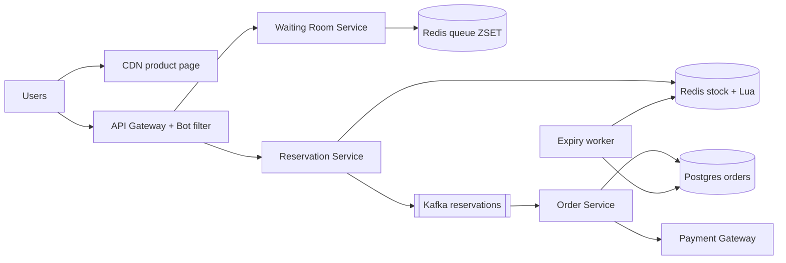
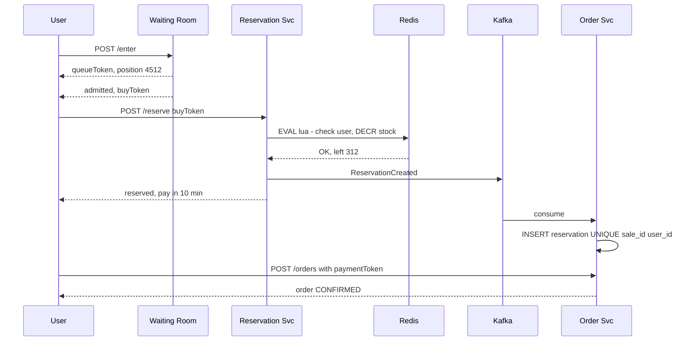

# Design Flash Sale (Big Billion Day / Lightning Deal)

**In one line:** at 12 o'clock, 1,000 iPhones go on sale at ₹49,999, and 1 million people press "Buy" at the same time. The system must **not sell even one extra unit (no oversell)**, must not crash, and must stop bots.

**What the interviewer checks in this question:** extreme contention on a single row/key, atomic inventory decrement, shaping the load (waiting room, queue), returning stock on payment timeout, and bot protection.

---

## Step 1: Clarify with the interviewer (3–5 min)

| You ask | Typical answer | Impact on design |
|---|---|---|
| "How much stock and how many people?" | 1,000 units, 1 million users in one minute | 1000x more demand than supply. We must reject most requests early |
| "Is oversell not allowed at all?" | Yes, zero oversell | Atomic decrement + DB constraint |
| "Per user limit?" | 1 unit per user | User-level dedup key |
| "How long does the user have to pay?" | 10 min | Reservation TTL, release stock on timeout |
| "Is undersell OK? Can a few units be left at the end?" | A little is OK, they will be released later | We can keep fairness a bit loose |
| "Normal catalog, search, recommendations?" | Out of scope | We only design the sale path |

> **Say:** "The problem here is not throughput, it is contention. 1 million people for 1,000 units. I will design it so that 99.9% of requests never reach the DB, and only the 1,000 winners go into the order path."

## Step 2: Requirements

**Functional**
1. Before the sale starts, the product page shows with a countdown
2. When the sale starts, the user presses "Buy", and if stock is left, a unit is reserved
3. The reserved user pays within 10 min, otherwise the unit goes back to the pool
4. 1 unit per user, and "Sold out" shows right away once sold out

**Non-functional**
- **Correctness:** zero oversell (most important)
- **Availability:** the site must not go down, even if the sale path is throttled
- **Fairness:** roughly first-come-first-served, no advantage for bots
- **Latency:** the user gets an answer in 1–2 sec (got it / waiting / sold out)

## Step 3: Estimation (only what changes the design)

- 1 million users × many refreshes → **~500K QPS** on the page at sale start. Only a CDN can handle this.
- "Buy" clicks: ~200K QPS in the first 10 sec. One Redis key does ~100K ops/sec. So filter first with a waiting room / rate limit.
- Actual orders: only **1,000**. That is nothing for the DB.

> **Say:** "The funnel will look like this: 500K QPS at the CDN, 200K buy clicks at the gateway, a few thousand reach Redis through the waiting room, and only 1,000 reach the DB. Each layer cuts load by 10–100x."

## Step 4: Core entities

- **Sale**: id, product_id, start_at, end_at, total_stock, per_user_limit
- **Inventory** (Redis): `stock:{saleId}` counter
- **Reservation**: id, sale_id, user_id, status (`RESERVED`, `PAID`, `EXPIRED`), expires_at
- **Order**: id, user_id, sale_id, reservation_id, payment_id, status

## Step 5: APIs

```http
GET  /sales/{saleId}                     → product + countdown (CDN cached)
POST /sales/{saleId}/enter               → {queueToken, position}
GET  /sales/{saleId}/queue/{token}       → {position} or {admitted, buyToken}
POST /sales/{saleId}/reserve {buyToken}  → {reservationId, expiresAt} or SOLD_OUT
POST /orders {reservationId, paymentToken}
     Header: Idempotency-Key: <uuid>     → {orderId, status}
```

## Step 6: High-level design



**Why each component:**
- **CDN:** product page, images, countdown are static. The 500K QPS at sale start must not reach the origin.
- **API Gateway + Bot filter:** per-user / per-IP rate limit, CAPTCHA, device fingerprint.
- **Waiting Room:** gives everyone a token, keeps a line in a Redis sorted set, admits at a fixed rate.
- **Reservation Service + Redis Lua:** atomic "stock check + decrement + user dedup".
- **Kafka → Order Service:** writes the winners to the DB async, protecting the DB from the spike.
- **Expiry worker:** if payment does not happen in 10 min, the reservation expires and stock goes back.

## Step 7: Main flow: from buy click to order



## Step 8: Data model & DB choice

```sql
sales(id PK, product_id, start_at, end_at, total_stock, sold INT,
      CHECK (sold <= total_stock))
reservations(id PK, sale_id, user_id, status, expires_at,
             UNIQUE(sale_id, user_id))
orders(id PK, reservation_id UNIQUE, payment_id UNIQUE, status)
```

- **Redis** = fast gatekeeper. **Postgres** = final truth.
- `CHECK (sold <= total_stock)` and `UNIQUE(sale_id, user_id)` stop oversell and double purchase at the DB level, even if something goes wrong in Redis.

## Step 9: Deep dives (where the interviewer will push)

### 9.1 How do you decrement inventory atomically?
A DB row `UPDATE ... SET stock = stock - 1` at 200K QPS = row lock contention, and the DB dies. So use a **Lua script** in Redis (single-threaded, atomic):
```lua
if redis.call('SISMEMBER', KEYS[2], ARGV[1]) == 1 then return -2 end  -- already bought
local s = tonumber(redis.call('GET', KEYS[1]))
if s <= 0 then return -1 end                                           -- sold out
redis.call('DECR', KEYS[1]); redis.call('SADD', KEYS[2], ARGV[1])
return s - 1
```
- Plain `DECR` also works (if it goes negative, `INCR` it back), but Lua also does the user dedup in the same step.
- As soon as stock hits 0, set a flag `soldout:{saleId}`. The gateway/CDN reads that flag and shows "Sold out" right away, without even reaching Redis.
- If one key is very hot, **split the stock**: divide 1,000 units into 10 keys of 100 each, pick a key by user hash. If one key runs out, try another.

### 9.2 Virtual waiting room and queue admission
- On `/enter`, give the user a token, `ZADD queue:{saleId} <timestamp> <userId>`.
- An admission worker gives a `buyToken` (signed, valid for 2 min) to N users (say 2,000) every second.
- The client polls its position (or uses SSE). Once stock hits 0, everyone in the queue gets "Sold out" right away.
- Benefit: load on the Reservation service comes at a fixed rate, not as a spike.

### 9.3 Payment timeout and stock release
- Reservation TTL is 10 min. The expiry worker runs every 30 sec: `status=RESERVED AND expires_at < now()` → `EXPIRED`, then `INCR stock` in Redis and remove the user from the set.
- Released units go to users waiting in the queue.
- Race: payment and expiry at the same time? `UPDATE reservations SET status='PAID' WHERE id=? AND status='RESERVED'`. Whoever wins first wins. If expiry won and the payment came late, **auto refund**.

### 9.4 Bot protection
- Login + verified phone required before the sale. Block new accounts or give them low priority.
- Per-user, per-IP, per-device rate limits at the gateway. CAPTCHA on `/enter`.
- `buyToken` is signed and bound to the user, so it cannot be shared or replayed.
- Multiple accounts on the same address / payment card → post-sale fraud check, cancel the order.

## Step 10: Decision table (what we chose, why, and what we did not)

| Decision | Why we chose it | What we did not choose, and why |
|---|---|---|
| **Redis Lua** for stock decrement | Atomic, ~100K ops/sec, user dedup in the same step | **DB row update:** hundreds of thousands of lock waits on one row, DB crash. **Optimistic locking:** almost every request will conflict, retry storm |
| **DB CHECK + UNIQUE constraint** | Final safety net, no oversell even if Redis fails | **Trusting only Redis:** last writes can be lost on failover, and we oversell |
| **Virtual waiting room** | Fixed-rate load, fair FIFO, UX shows the position | **Only autoscaling:** you cannot scale 100x in 30 sec, and the bottleneck is a single key |
| **Kafka** between reserve and order | Keeps the spike away from the DB, safe retries | **Sync DB insert:** the spike hits the DB directly |
| **CDN** for product page | 500K QPS at the edge, origin is safe | **Serve from app servers:** wasted compute, origin goes down |
| **TTL reservation + expiry worker** | Unpaid units come back, less undersell | **Decrement only after payment:** more than 1,000 people will pay, and we get a pile of refunds |

## Step 11: Failures & bottlenecks

| What failed | What happens | How to handle |
|---|---|---|
| Redis primary crash | Some decrements may be lost | The DB constraint stops oversell. AOF `everysec` + replica. Dedicated Redis for the sale |
| Kafka consumer lag | Reservation reaches the DB late | The user already got a response from the Redis result. Scale the consumer |
| Payment gateway slow | Reservations are expiring | Increase the TTL a bit for the sale, get dedicated capacity from the gateway |
| Hot key | One Redis shard at 100% CPU | Split stock across keys, sold-out flag at the edge |
| Bots | Real users get nothing | CAPTCHA, signed tokens, rate limit, fraud check |

## Step 12: How to make it better (say this yourself at the end)

> "If I had more time, I would improve these:"
- **Pre-registration / lottery:** register before the sale, pick random winners. Contention disappears
- **Load test + game day:** rehearse with 2x the expected traffic before the sale
- **Graceful degradation:** turn off non-critical features like recommendations and reviews during the sale
- **Multi-region:** product page from the CDN in every region, but inventory in one primary Redis cluster
- Post-sale **analytics stream**: how many bots were blocked, how much undersell, conversion

## Step 13: Likely follow-up questions

- "What if Redis and the DB have different counts?" → The DB is the truth. After the sale, a reconciliation job syncs Redis from the DB
- "The user pressed buy from two tabs?" → `SISMEMBER` in Lua + DB `UNIQUE(sale_id, user_id)`
- "Payment succeeded but the reservation had already expired?" → the conditional update fails, auto refund
- "What if 10 million users show up?" → shard the waiting room's Redis ZSET, or use a pre-registration lottery
- "How will you prove fairness?" → FIFO by queue timestamp, and admission logs for audit

## 2-minute recap (read this before the interview)

> In a flash sale the problem is contention, not throughput. Build a funnel: the CDN serves the product page, the gateway filters bots and applies rate limits, the waiting room (Redis ZSET) admits users at a fixed rate, and the Reservation service does user dedup + stock decrement atomically with a Redis Lua script. As soon as it is sold out, a flag is set and the rest of the requests are rejected at the edge. Winners go through Kafka to the Order service, which writes to Postgres with `CHECK(sold <= total)` and `UNIQUE(sale_id, user_id)`, so there is no oversell even if Redis fails. Reservations have a 10 min TTL, an expiry worker returns the stock, and late payments get an auto refund. For bots: CAPTCHA, signed buy tokens, per-device limits.

## Checklist

- [ ] I can tell the numbers for the funnel (CDN → gateway → waiting room → Redis → DB)
- [ ] I can write the Redis Lua script for atomic stock decrement
- [ ] I can explain how a DB constraint stops oversell
- [ ] I can explain the waiting room and the admission rate
- [ ] I can handle the race between payment timeout and stock release
- [ ] I can tell 3 ways to protect against bots
- [ ] I can tell 3 trade-offs from the decision table without looking
