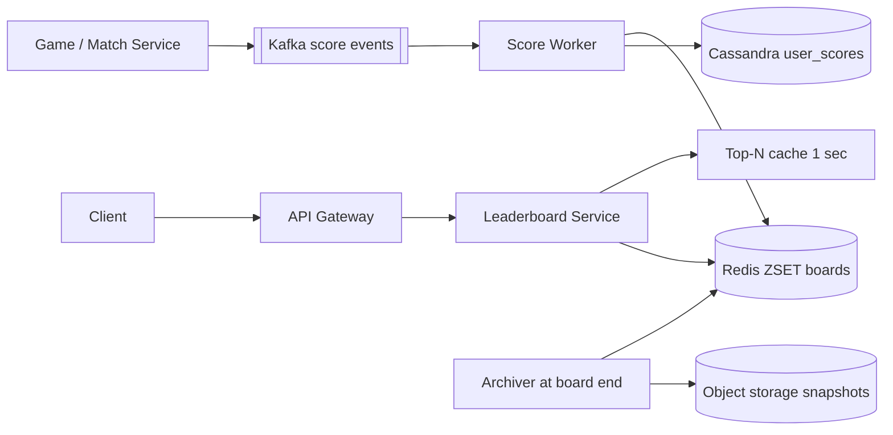

# Design Real-time Leaderboard (Gaming / Dream11)

**In one line:** scores of lakhs of players update in real time; every player instantly sees the **top 100** and **their own rank**, daily/weekly/per contest.

**What the interviewer checks:** sorted set vs SQL `ORDER BY`, sharding, ties, score pipeline (Kafka, idempotency).

---

## Step 1: Clarify with the interviewer (3–5 min)

| You ask | Typical answer | Impact on design |
|---|---|---|
| "Global board or per contest?" | Per contest + global daily/weekly | Each board is its own ZSET key |
| "Users per board?" | Big contest ~20M | ~2 GB, fits one node but hot; discuss sharding |
| "Increment or overwrite score?" | Points added per event (a run scored) | `ZINCRBY`, events from Kafka |
| "Ties?" | First to arrive is higher, or same rank | Composite score |
| "Besides rank?" | Top 100 + my rank + 10 around me | `ZREVRANK`, `ZREVRANGE` |

> **Say:** "Each board is a Redis sorted set, updates come via Kafka, the DB is only for durability and history. The whole read path is Redis."

## Step 2: Requirements

**Functional**
1. Users should be able to see their score rise on a game event (the system increments it)
2. Users should be able to see a board's top N (say 100)
3. Users should be able to see their rank and the users around them
4. Users should be able to see daily, weekly, per-contest boards (old ones archived)

**Out of scope:** scoring rules, friends leaderboard, prize payout, anti-cheat ML.

**Non-functional (in priority order)**
1. **Correctness:** every event exactly once (prizes depend on it)
2. **Latency:** top N and my rank p99 < 50 ms
3. **Freshness:** update on the board in 1–5 sec (async pipeline OK)
4. **Scale:** 20M users/contest, 500K updates/sec, 200K reads/sec (Step 3)
5. **Durability:** rebuild on Redis crash

**CAP choice:** live board → availability + eventual (a 1–5 sec old rank is fine). At contest end a strongly consistent **final freeze** snapshot, prizes come from it.

## Step 3: Estimation (only what changes the design)

- ~100 bytes/entry × 20M ≈ **2 GB** → fits in memory.
- A wicket updates lakhs of teams across all of a match's contests → **500K updates/sec** burst; one Redis node does ~100K ops/sec → batching/sharding.
- ~200K QPS of "my rank" reads; top 100 is the same for all → cache.

> **Say:** "Memory is not the problem, 2 GB. The problem is the write burst on one key and read QPS: cache top N, batch/shard writes."

## Step 4: Core entities

- **Board**: id (`contest:123`, `global:daily:2026-10-03`), type, start_at, end_at
- **ScoreEvent**: event_id, user_id, board_id, delta, ts
- **UserScore**: board_id, user_id, score, updated_at (durable copy in the DB)

## Step 5: APIs

```http
POST /boards/{boardId}/scores {userId, delta, eventId}   → 202 (internal, from game service)
GET  /boards/{boardId}/top?n=100                         → [{rank, userId, score}]
GET  /boards/{boardId}/rank/{userId}                     → {rank, score}
GET  /boards/{boardId}/around/{userId}?k=5               → 5 above + 5 below
```

## Step 6: High-level design

**Simple v1:** sync `ZINCRBY` per board + Postgres `user_scores`; enough up to thousands of updates/sec. A 500K/sec burst → Kafka + batching worker + Cassandra.



**Why each component:** (FR1 → Kafka + Score Worker + Redis, FR2/FR3 → Leaderboard Service + Redis + Top-N cache, FR4 → per-period keys + Archiver)
- **Kafka:** absorbs the burst, `user_id` partitions = per-user order, **replay** to rebuild.
- **Score Worker:** `eventId` dedup, sums deltas in 200 ms batches, pipelines `ZINCRBY` (5–10x fewer ops).
- **Top-N cache:** 1 sec in-process → 100x fewer Redis reads.
- **Cassandra:** still lakhs of writes/sec after batching, key access only.
- **Archiver:** cron, snapshot to S3 at board end (history, prizes).

## Step 7: Main flow: score update and rank read


## Step 8: Data model & DB choice

```text
Redis:  board:{boardId}         ZSET  member=userId  score=composite
        seen:{eventId}          STRING (dedup, TTL 1 day)
Cassandra: user_scores(board_id, user_id, score, updated_at, PK((board_id), user_id))
S3:        final board snapshots + archived score events (audit)
```

- **Redis** = serving, **Cassandra** = durable copy. The worker writes the `ZINCRBY` return (new total) → idempotent (no counter). Below 10K writes/sec Postgres alone is fine.
- `ZREVRANK` is 0-based → +1 in the API.

## Step 9: Deep dives (where the interviewer will push)

### 9.1 Why not SQL, why a sorted set?
**NFR:** my rank p99 < 50 ms at ~200K QPS.
- `SELECT COUNT(*) FROM scores WHERE score > my_score` → scans tens of millions of rows per request; at 200K QPS the DB dies.
- ZSET = skip list + hash: `ZINCRBY`, `ZREVRANK` O(log N), `ZREVRANGE 0 99` O(log N + 100).
- Top 100: `ZREVRANGE board:c123 0 99 WITHSCORES`. Neighbours: rank r, then `ZREVRANGE board r-5 r+5`.
- **Trade-off:** board lives in RAM (2 GB/contest); SQL's flexible queries are gone.

### 9.2 How will you handle ties?
**NFR:** deterministic rank for prizes.
- **Same score = same rank:** `ZCOUNT board (score +inf` + 1.
- **First to arrive is higher:** composite = `score * 10^10 + (MAX_TS - ts)`. Doubles are exact to 2^53 → watch score/ts ranges (or use seconds).
- Ask the business which one they want.
- **Trade-off:** composite has a precision limit; `ZCOUNT` costs an extra call.

### 9.3 Tens of millions of users: sharding
**NFR:** scale write burst + memory without breaking rank latency.
- **Hash by user_id:** writes spread, but global rank = a count from every shard (scatter-gather); top N = merge each shard's top N.
- **Score buckets (range):** shard 1 = 0–100, shard 2 = 100–500… Rank = local rank + cached counts of shards above. Top N from the top shard only.
- Drawback: rising score → shard change (remove + add); skew → set buckets from the distribution.
- **Approximate rank** for users far down ("top 35%"); exact only for the top 10K.
- **Trade-off:** shard only when one node is not enough (not at 2 GB); every scheme makes rank queries complex.

### 9.4 Update pipeline, durability and boards
**NFR:** exactly-once + rebuild on Redis crash.
- `SET seen:{eventId} NX` dedup → no double score on Kafka redelivery.
- In a burst, batch 200ms, sum a user's deltas into one `ZINCRBY` (pipeline).
- Redis crash: scan `user_scores` + batch `ZADD`, or replay from a Kafka offset.
- **Daily/weekly:** `global:daily:2026-10-03`, `global:weekly:2026-W40`; one event does `ZINCRBY` on both. `EXPIRE` 7 days after the board ends, snapshot to S3.
- **Trade-off:** 200 ms of freshness lost, 5–10x fewer Redis ops.

## Step 10: Decision table (what we chose, why, and what we did not)

| Decision | Why we chose it | What we did not choose, and why |
|---|---|---|
| **Redis sorted set** | O(log N) update/rank, top N built in | **SQL ORDER BY / COUNT:** scans tens of millions of rows. **Elasticsearch:** rank not natural. Sacrifice: RAM, separate durability |
| **Kafka** for events | 500K/sec burst, replay, per-user order | **Direct Redis:** burst overload. **SQS:** no replay/order. Sacrifice: Kafka ops, 1–5 sec lag |
| **Cassandra durable copy** | Lakhs of writes/sec, key access, prize audit | **Postgres:** heavy sharding. **Only Redis + AOF:** risky for prizes. Sacrifice: one more DB |
| **eventId dedup** | Exactly-once score on at-least-once Kafka | **No dedup:** double points. Sacrifice: extra Redis write/event |
| **Score-bucket sharding** (huge scale) | Top N from one shard, rank = local + counts above | **Hash sharding:** scatter-gather. Sacrifice: shard changes, skew |
| **Top N cache 1 sec** | Same for all, 100x fewer reads | **Every request to Redis:** wasted load. Sacrifice: 1 sec old |

## Step 11: Failures & bottlenecks

| What failed | What happens | How to handle |
|---|---|---|
| Redis node crash | Board gone | Replica failover; worst case Cassandra rebuild / Kafka replay |
| Worker crash | Event half done | Commit offset after, dedup makes retry safe |
| Hot board (IPL final) | Burst on one key | Worker batching, read replicas, top N cache |
| Kafka lag | Board 30 sec old | More consumers/partitions, lag alert |
| Fake scores | Wrong winner | Scores only from the server-side Match Service |

## Step 12: How to make it better (say this yourself at the end)

- **WebSocket push** of top 10 changes instead of polling
- **Friends leaderboard:** fetch with `ZMSCORE` and sort, or a small ZSET per user
- **Percentile rank** for users lower down, exact only for the top 10K
- **Final freeze:** board read-only, prizes from the snapshot

## Step 13: Likely follow-up questions

- "Redis bigger than memory?" → score-bucket sharding, or spread boards across Redis Cluster
- "Penalty?" → negative `ZINCRBY`, same pipeline
- "Exactly-once?" → eventId dedup + idempotent upsert
- "Dense or competition rank?" → competition via `ZCOUNT`; ask the business
- "Rank 1 last week?" → S3 snapshot, not Redis
- **Senior signal:** the real bottleneck is one hot board key (IPL final). A Redis shard is single-threaded → worker aggregation, read replicas, top-N cache, freshness-SLO alert on Kafka lag.

## 2-minute recap (read this before the interview)

> One Redis ZSET per board. Events via Kafka (500K/sec burst + replay). Worker: `eventId` dedup, 200 ms batch, `ZINCRBY`, new total to Cassandra (for rebuild). Top N `ZREVRANGE 0 99` (1 sec cache), my rank `ZREVRANK`, neighbours a range. Ties: composite score or `ZCOUNT`. 20M ≈ 2 GB fits; at very large scale score-bucket sharding. Daily/weekly as separate keys + TTL, snapshot at end.

## Checklist

- [ ] I can tell why SQL `COUNT/ORDER BY` fails
- [ ] I can explain top N and my rank with ZINCRBY, ZREVRANK, ZREVRANGE
- [ ] I can explain both approaches for ties
- [ ] I can tell the trade-off between score-bucket and hash sharding
- [ ] I can explain exactly-once scoring with Kafka + dedup
- [ ] I can explain the rebuild on Redis crash and the design of daily/weekly boards
- [ ] I can tell 3 trade-offs from the decision table without looking
