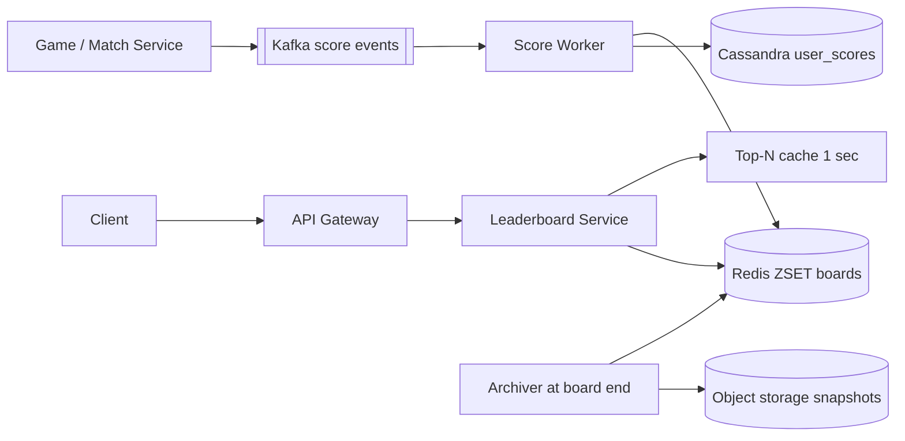

# Design Real-time Leaderboard (Gaming / Dream11)

**In one line:** scores of hundreds of thousands of players update in real time, and every player must instantly see the **top 100** and **their own rank**, daily/weekly/per contest.

**What the interviewer checks in this question:** correct use of Redis sorted sets, why SQL `ORDER BY` does not scale, sharding for tens of millions of users, ties, and the score update pipeline (Kafka, idempotency).

---

## Step 1: Clarify with the interviewer (3–5 min)

| You ask | Typical answer | Impact on design |
|---|---|---|
| "One global board, or per contest / per game?" | Per contest + global daily/weekly | Each board is a separate sorted set key |
| "How many users on one board?" | A big contest has ~20M users | One ZSET ~2 GB, fits on one node, but hot. We will need to discuss sharding |
| "How does the score change? Increment or overwrite?" | Points are added on every event (Dream11: a player scored a run) | `ZINCRBY`, events from Kafka |
| "How real-time?" | 1–5 sec delay is fine | Async pipeline OK |
| "How do we break ties?" | Whoever got there first is higher, or same rank | Composite score |
| "What to show besides rank?" | Top 100 + my rank + 10 users around me | `ZREVRANK`, `ZREVRANGE` |

> **Say:** "I will treat each board as a Redis sorted set, score updates will come through Kafka, and the DB will only be for durability and history. The whole read path is from Redis."

## Step 2: Requirements

**Functional**
1. Users should be able to see their score go up when a game/match event arrives (the system increments it)
2. Users should be able to see the top N (say top 100) of a board
3. Users should be able to see their own rank and the users around them
4. Users should be able to see daily, weekly and per-contest boards (old boards archived)

**Out of scope:** the scoring rules themselves, friends leaderboard, the prize payout payment flow, anti-cheat ML.

**Non-functional (in priority order)**
1. **Correctness:** every event counted exactly once (prizes depend on it)
2. **Latency:** top N and my rank p99 < 50 ms
3. **Freshness:** a score update shows on the board within 1–5 sec
4. **Scale:** ~20M users in one contest, peak 500K score updates/sec (on a wicket), ~200K rank reads/sec
5. **Durability:** the board can be rebuilt if Redis crashes

**CAP choice:** availability + eventual consistency for the live board (a 1–5 sec old rank is fine). When the contest ends, a strongly consistent **final freeze** snapshot, because prizes are paid from it.

## Step 3: Estimation (only what changes the design)

- ZSET entry ~100 bytes → 20M users ≈ **2 GB**. Fits in memory.
- In Dream11, one real-world event (a wicket) changes the score of hundreds of thousands of teams across all contests of a match → a burst of **500K updates/sec**. One Redis node does ~100K ops/sec. So batching/sharding.
- Reads: tens of millions of users refresh "my rank" every few sec → ~200K QPS. Cache the top 100 (same for everyone).

> **Say:** "Memory is not the problem, it is 2 GB. The problem is the write burst on one key and the read QPS. The top N is the same for everyone, so I will cache it, and I will batch or shard the writes."

## Step 4: Core entities

- **Board**: id (`contest:123`, `global:daily:2026-10-03`), type, start_at, end_at
- **ScoreEvent**: event_id, user_id, board_id, delta, ts
- **UserScore**: board_id, user_id, score, updated_at (durable copy in the DB)

## Step 5: APIs

```http
POST /boards/{boardId}/scores {userId, delta, eventId}   → 202 (internal, from game service)
GET  /boards/{boardId}/top?n=100                         → [{rank, userId, score}]
GET  /boards/{boardId}/rank/{userId}                     → {rank, score}
GET  /boards/{boardId}/around/{userId}?k=5               → 5 above + 5 below
```

## Step 6: High-level design

**Start with a simple v1:** game service → Leaderboard Service → one Redis ZSET per board (sync `ZINCRBY`), reads from the same place, and `user_scores` in Postgres. Enough for a small game (thousands of updates/sec). The numbers break it: a **500K updates/sec burst** on a wicket (one Redis node does ~100K ops/sec, and one Postgres cannot take it either) → Kafka buffer + batching worker, and a write-heavy durable copy → Cassandra.



**Why each component:** (FR1 → Kafka + Score Worker + Redis, FR2/FR3 → Leaderboard Service + Redis + Top-N cache, FR4 → per-period keys + Archiver)
- **Kafka:** absorbs a 500K events/sec burst, per-user order via `user_id` partitions, and **replay** from retention (Redis rebuild). A simpler SQS has no replay or per-key ordering; sync writes would knock Redis over in a burst.
- **Score Worker:** `eventId` dedup, adds up per-user deltas in 200 ms batches and pipelines `ZINCRBY` (burst 5–10x smaller).
- **Redis ZSET:** `O(log N)` update/rank, top N range query. 20M users ≈ 2 GB, fits on one node.
- **Leaderboard Service + Top-N cache:** the top 100 is the same for everyone; a 1 sec in-process cache cuts Redis read load 100x.
- **Cassandra:** durable copy, still hundreds of thousands of writes/sec after batching, only `(board_id, user_id)` key access, no joins/transactions. Postgres would need many shards for this write rate.
- **Archiver:** when a board ends, snapshots the ZSET to S3 (history, prizes). A simple cron job.

## Step 7: Main flow: score update and rank read


## Step 8: Data model & DB choice

```text
Redis:  board:{boardId}         ZSET  member=userId  score=composite
        seen:{eventId}          STRING (dedup, TTL 1 day)
Cassandra: user_scores(board_id, user_id, score, updated_at, PK((board_id), user_id))
S3:        final board snapshots + archived score events (audit)
```

- **Redis** = serving layer. **Cassandra** = durable copy. The worker writes the `ZINCRBY` return value (the new total) to Cassandra, so the write is idempotent (no `score = score + delta` counter). At small scale (< 10K writes/sec) Postgres alone would be fine.
- `ZREVRANK` rank is 0-based, so add +1 in the API.

## Step 9: Deep dives (where the interviewer will push)

### 9.1 Why not SQL, why a sorted set?
**NFR:** my rank p99 < 50 ms at ~200K QPS.
- `SELECT COUNT(*) FROM scores WHERE score > my_score` → a full index range scan over tens of millions of rows on every request. At 200K QPS the DB is dead.
- Redis ZSET = skip list + hash. `ZINCRBY` O(log N), `ZREVRANK` O(log N), `ZREVRANGE 0 99` O(log N + 100).
- Top 100: `ZREVRANGE board:c123 0 99 WITHSCORES`. My neighbours: get the rank, then `ZREVRANGE board r-5 r+5`.
- **Trade-off:** the whole board lives in RAM (2 GB per big contest); we give up SQL's flexible queries.

### 9.2 How will you handle ties?
**NFR:** correctness (rank must be deterministic for prizes).
- If **same score = same rank** is needed: `ZCOUNT board (score +inf` + 1 = rank (number of users strictly above + 1).
- If **whoever got there first is higher:** composite score = `score * 10^10 + (MAX_TS - ts)`. Double precision is exact up to 2^53, so watch the score and ts ranges (or use seconds).
- Tell the interviewer you would need to ask the business which one they want.
- **Trade-off:** the composite score has a precision limit; the `ZCOUNT` way costs one extra call.

### 9.3 Tens of millions of users: sharding
**NFR:** scale (write burst + memory) without breaking rank latency.
- **Hash by user_id** across N shards: writes spread out, but a global rank needs a count from every shard (scatter-gather). Top N: take the top N of each shard and merge.
- **Score buckets (range sharding):** shard 1 = score 0–100, shard 2 = 100–500, ... A user's rank = their rank in their shard + total counts of the shards above (these counts are cached). Top N comes only from the top shard.
- Drawback: when the score grows, the user changes shard (remove + add), and buckets can get skewed. Set buckets by looking at the distribution.
- **Approximate rank** is also fine for users far down: "you are in the top 35%". Exact rank only for the top 10K.
- **Trade-off:** shard only when one node is not enough (not needed at 2 GB); every sharding scheme makes rank queries more complex.

### 9.4 Update pipeline, durability and boards
**NFR:** exactly-once scoring + rebuild on Redis crash.
- Every event has an `eventId`. The worker dedups with `SET seen:{eventId} NX`, so a Kafka redelivery does not double the score.
- During a burst, the worker batches events for 200ms, adds up each user's deltas, and sends one `ZINCRBY` (Redis pipeline).
- Redis crash: rebuild from the DB (scan `user_scores` and batch `ZADD`) or replay from a Kafka offset.
- **Daily/weekly:** separate keys `global:daily:2026-10-03`, `global:weekly:2026-W40`. One event does `ZINCRBY` on both. Set `EXPIRE` on the key 7 days after the board ends. Snapshot the finished board to S3.
- **Trade-off:** 200 ms batching costs a little freshness, but Redis sees 5–10x fewer ops.

## Step 10: Decision table (what we chose, why, and what we did not)

| Decision | Why we chose it | What we did not choose, and why |
|---|---|---|
| **Redis sorted set** for ranking | O(log N) update and rank, top N built in | **SQL ORDER BY / COUNT:** every rank query scans tens of millions of rows. **Elasticsearch:** rank queries are not natural. Sacrifice: RAM cost, durability handled separately |
| **Kafka** for score events | 500K/sec burst, rebuild via replay, per-user order | **Direct Redis write:** overload on bursts. **SQS:** no replay or per-key order. Sacrifice: Kafka cluster ops, 1–5 sec lag |
| **Cassandra as durable copy** | Hundreds of thousands of writes/sec, simple key access, prize audit | **Postgres:** heavy sharding at this write rate. **Only Redis + AOF:** one in-memory store is risky for prizes. Sacrifice: one more DB to run |
| **Event dedup with eventId** | Exactly-once scoring even on at-least-once Kafka | **No dedup:** double points on redelivery. Sacrifice: one extra Redis write per event |
| **Score-bucket sharding** at huge scale | Top N from one shard, rank = local rank + counts above | **Hash sharding:** every rank query is scatter-gather. Sacrifice: users change shards, skew |
| **Top N cache 1 sec** | Same data for all, Redis read load 100x lower | **Every request to Redis:** wasted load. Sacrifice: top N is 1 sec old |

## Step 11: Failures & bottlenecks

| What failed | What happens | How to handle |
|---|---|---|
| Redis node crash | Board is gone | Replica failover. Worst case, rebuild from Cassandra or replay Kafka |
| Worker crash midway | Event half processed | Commit the offset after, retry is safe with the dedup key |
| Hot board (IPL final) | Write burst on one key | Worker-side batching, read replicas, top N cache |
| Kafka lag | Board is 30 sec old | Scale consumers, add partitions, lag alert |
| Cheating / fake scores | Wrong winner | Scores only from the server-side Match Service, never from the client |

## Step 12: How to make it better (say this yourself at the end)

> "If I had more time, I would improve these:"
- **WebSocket push** of top 10 changes, instead of polling
- **Friends leaderboard:** fetch friends' scores with `ZMSCORE` and sort, or a small ZSET per user
- **Percentile rank** (approximate) for users lower down, exact only for the top 10K
- **Final freeze** when a contest ends: board becomes read-only, prizes distributed from the snapshot

## Step 13: Likely follow-up questions

- "What if Redis grows bigger than memory?" → score-bucket sharding, or spread boards across Redis Cluster
- "What if a user's score must go down (penalty)?" → `ZINCRBY` with a negative delta, same pipeline
- "Exactly-once scoring?" → eventId dedup + idempotent DB upsert
- "Rank: 1-based dense or competition ranking?" → competition rank via `ZCOUNT`, ask the business
- "Historical: who was rank 1 last week?" → S3 snapshot, not Redis
- **Senior signal:** raise it yourself: the real bottleneck is one hot board key (in the IPL final everyone hits one ZSET). A Redis shard is single-threaded, so plan worker aggregation, read replicas, the top-N cache, and a freshness-SLO alert on Kafka lag.

## 2-minute recap (read this before the interview)

> Leaderboard = one Redis sorted set per board. Score events go from the game service into Kafka (500K/sec burst + replay). The Score Worker dedups by `eventId`, batches for 200 ms, does `ZINCRBY` and writes the new total to Cassandra, so the board can be rebuilt if Redis crashes. Top N is `ZREVRANGE 0 99`, my rank is `ZREVRANK`, neighbours are a range around the rank. Cache the top N for 1 sec. For ties, use a composite score (score + reverse timestamp) or the same rank via `ZCOUNT`. 20M users ≈ 2 GB, which fits in memory, but use batching for write bursts, and at very large scale use score-bucket sharding: rank = local rank in the shard + count of the shards above. Daily/weekly boards are separate keys with a TTL, and a finished board gets a snapshot.

## Checklist

- [ ] I can tell why SQL `COUNT/ORDER BY` fails
- [ ] I can explain top N and my rank with ZINCRBY, ZREVRANK, ZREVRANGE
- [ ] I can explain both approaches for ties
- [ ] I can tell the trade-off between score-bucket and hash sharding
- [ ] I can explain exactly-once scoring with Kafka + dedup
- [ ] I can explain the rebuild on Redis crash and the design of daily/weekly boards
- [ ] I can tell 3 trade-offs from the decision table without looking
