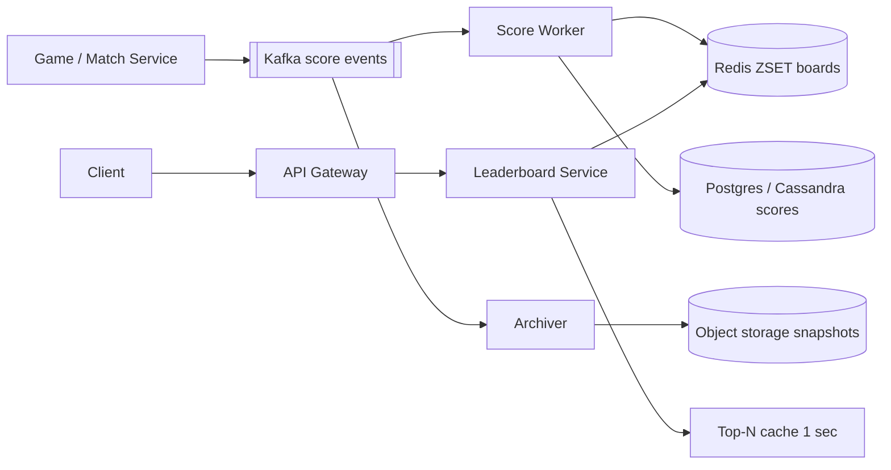
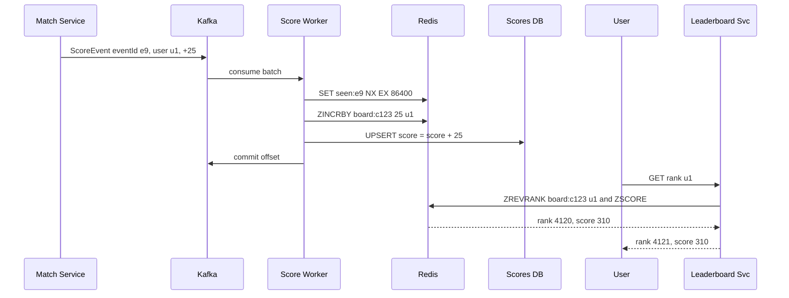

# Design Real-time Leaderboard (Gaming / Dream11)

**In one line:** scores of hundreds of thousands of players update in real time, and every player must instantly see the **top 100** and **their own rank**, daily/weekly/per contest.

**What the interviewer checks in this question:** correct use of Redis sorted sets, why SQL `ORDER BY` does not scale, sharding for tens of millions of users, ties, and the score update pipeline (Kafka, idempotency).

---

## Step 1: Clarify with the interviewer (3–5 min)

| You ask | Typical answer | Impact on design |
|---|---|---|
| "One global board, or per contest / per game?" | Per contest + global daily/weekly | Each board is a separate sorted set key |
| "How many users on one board?" | A big contest has ~20M users | One ZSET ~2 GB, fits on one node, but hot. We will need to discuss sharding |
| "How does the score change? Increment or overwrite?" | Points are added on every event (Dream11: a player scored a run) | `ZINCRBY`, events from Kafka |
| "How real-time?" | 1–5 sec delay is fine | Async pipeline OK |
| "How do we break ties?" | Whoever got there first is higher, or same rank | Composite score |
| "What to show besides rank?" | Top 100 + my rank + 10 users around me | `ZREVRANK`, `ZREVRANGE` |

> **Say:** "I will treat each board as a Redis sorted set, score updates will come through Kafka, and the DB will only be for durability and history. The whole read path is from Redis."

## Step 2: Requirements

**Functional**
1. Update (increment) a user's score on a board
2. Show the top N (say top 100)
3. "My rank" and the users around me
4. Daily, weekly, per-contest boards. Archive old boards

**Non-functional**
- **Low latency:** top N and my rank < 50ms
- **Freshness:** a score update shows on the board within 1–5 sec
- **Scale:** ~20M users in one contest, peak 500K score updates/sec (on a wicket in a match)
- **Durability:** the board can be rebuilt if Redis crashes

## Step 3: Estimation (only what changes the design)

- ZSET entry ~100 bytes → 20M users ≈ **2 GB**. Fits in memory.
- In Dream11, one real-world event (a wicket) changes the score of hundreds of thousands of teams across all contests of a match → a burst of **500K updates/sec**. One Redis node does ~100K ops/sec. So batching/sharding.
- Reads: tens of millions of users refresh "my rank" every few sec → ~200K QPS. Cache the top 100 (same for everyone).

> **Say:** "Memory is not the problem, it is 2 GB. The problem is the write burst on one key and the read QPS. The top N is the same for everyone, so I will cache it, and I will batch or shard the writes."

## Step 4: Core entities

- **Board**: id (`contest:123`, `global:daily:2026-10-03`), type, start_at, end_at
- **ScoreEvent**: event_id, user_id, board_id, delta, ts
- **UserScore**: board_id, user_id, score, updated_at (durable copy in the DB)

## Step 5: APIs

```http
POST /boards/{boardId}/scores {userId, delta, eventId}   → 202 (internal, from game service)
GET  /boards/{boardId}/top?n=100                         → [{rank, userId, score}]
GET  /boards/{boardId}/rank/{userId}                     → {rank, score}
GET  /boards/{boardId}/around/{userId}?k=5               → 5 above + 5 below
```

## Step 6: High-level design



**Why each component:**
- **Kafka:** score events are durable, bursts are absorbed, partitioned by `user_id` so one user's updates stay in order.
- **Score Worker:** event dedup, `ZINCRBY`, upsert into the DB. Pipelines in batches.
- **Redis ZSET:** `O(log N)` insert/rank, top N range query.
- **Leaderboard Service:** read API, caches the top N locally for 1 sec.
- **DB:** durable truth, used to rebuild Redis. **Archiver:** snapshot when a board ends.

## Step 7: Main flow: score update and rank read



## Step 8: Data model & DB choice

```text
Redis:  board:{boardId}         ZSET  member=userId  score=composite
        seen:{eventId}          STRING (dedup, TTL 1 day)
DB:     user_scores(board_id, user_id, score, updated_at, PK(board_id, user_id))
        score_events(event_id PK, board_id, user_id, delta, ts)   -- audit, replay
```

- **Redis** = serving layer. **Cassandra/Postgres** = durable. It is write-heavy with simple key access, so Cassandra is natural, and Postgres is fine at small scale.
- `ZREVRANK` rank is 0-based, so add +1 in the API.

## Step 9: Deep dives (where the interviewer will push)

### 9.1 Why not SQL, why a sorted set?
- `SELECT COUNT(*) FROM scores WHERE score > my_score` → a full index range scan over tens of millions of rows on every request. At 200K QPS the DB is dead.
- Redis ZSET = skip list + hash. `ZINCRBY` O(log N), `ZREVRANK` O(log N), `ZREVRANGE 0 99` O(log N + 100).
- Top 100: `ZREVRANGE board:c123 0 99 WITHSCORES`. My neighbours: get the rank, then `ZREVRANGE board r-5 r+5`.

### 9.2 How will you handle ties?
- If **same score = same rank** is needed: `ZCOUNT board (score +inf` + 1 = rank (number of users strictly above + 1).
- If **whoever got there first is higher:** composite score = `score * 10^10 + (MAX_TS - ts)`. Double precision is exact up to 2^53, so watch the score and ts ranges (or use seconds).
- Tell the interviewer you would need to ask the business which one they want.

### 9.3 Tens of millions of users: sharding
- **Hash by user_id** across N shards: writes spread out, but a global rank needs a count from every shard (scatter-gather). Top N: take the top N of each shard and merge.
- **Score buckets (range sharding):** shard 1 = score 0–100, shard 2 = 100–500, ... A user's rank = their rank in their shard + total counts of the shards above (these counts are cached). Top N comes only from the top shard.
- Drawback: when the score grows, the user changes shard (remove + add), and buckets can get skewed. Set buckets by looking at the distribution.
- **Approximate rank** is also fine for users far down: "you are in the top 35%". Exact rank only for the top 10K.

### 9.4 Update pipeline, durability and boards
- Every event has an `eventId`. The worker dedups with `SET seen:{eventId} NX`, so a Kafka redelivery does not double the score.
- During a burst, the worker batches events for 200ms, adds up each user's deltas, and sends one `ZINCRBY` (Redis pipeline).
- Redis crash: rebuild from the DB (scan `user_scores` and batch `ZADD`) or replay from a Kafka offset.
- **Daily/weekly:** separate keys `global:daily:2026-10-03`, `global:weekly:2026-W40`. One event does `ZINCRBY` on both. Set `EXPIRE` on the key 7 days after the board ends. Snapshot the finished board to S3/DB.

## Step 10: Decision table (what we chose, why, and what we did not)

| Decision | Why we chose it | What we did not choose, and why |
|---|---|---|
| **Redis sorted set** for ranking | O(log N) update and rank, top N range query built in | **SQL ORDER BY / COUNT:** every rank query scans tens of millions of rows. **Elasticsearch:** near-real-time refresh, rank queries are not natural |
| **Kafka** for score events | Absorbs bursts, rebuild via replay, ordering per user | **Direct Redis write from the game service:** Redis overloads on bursts, no durability |
| **DB as durable copy** | Rebuild on Redis crash, audit, truth for prizes | **Only Redis + AOF:** trusting a single in-memory store for prize payouts is risky |
| **Event dedup with eventId** | Exactly-once scoring even on at-least-once Kafka | **No dedup:** double points on redelivery, wrong prizes |
| **Score-bucket sharding** at huge scale | Top N from one shard, rank = local rank + counts above | **Hash sharding:** every rank query is scatter-gather, latency goes up |
| **Top N cache 1 sec** | Same data for all users, Redis read load 100x lower | **Every request to Redis:** wasted load, no freshness benefit |

## Step 11: Failures & bottlenecks

| What failed | What happens | How to handle |
|---|---|---|
| Redis node crash | Board is gone | Replica failover. Worst case, rebuild from the DB or replay Kafka |
| Worker crash midway | Event half processed | Commit the offset after, retry is safe with the dedup key |
| Hot board (IPL final) | Write burst on one key | Worker-side batching, read replicas, top N cache |
| Kafka lag | Board is 30 sec old | Scale consumers, add partitions, lag alert |
| Cheating / fake scores | Wrong winner | Scores only from the server-side Match Service, never from the client |

## Step 12: How to make it better (say this yourself at the end)

> "If I had more time, I would improve these:"
- **WebSocket push** of top 10 changes, instead of polling
- **Friends leaderboard:** fetch friends' scores with `ZMSCORE` and sort, or a small ZSET per user
- **Percentile rank** (approximate) for users lower down, exact only for the top 10K
- **Final freeze** when a contest ends: board becomes read-only, prizes distributed from the snapshot
- Region-wise boards (India, city) as separate keys, same pipeline

## Step 13: Likely follow-up questions

- "What if Redis grows bigger than memory?" → score-bucket sharding, or spread boards across Redis Cluster
- "What if a user's score must go down (penalty)?" → `ZINCRBY` with a negative delta, same pipeline
- "Exactly-once scoring?" → eventId dedup + idempotent DB upsert
- "Rank: 1-based dense or competition ranking?" → competition rank via `ZCOUNT`, ask the business
- "Historical: who was rank 1 last week?" → snapshot table / S3, not Redis

## 2-minute recap (read this before the interview)

> Leaderboard = one Redis sorted set per board. Score events go from the game service into Kafka, the Score Worker dedups by `eventId`, does `ZINCRBY` and upserts into the DB, so the board can be rebuilt if Redis crashes. Top N is `ZREVRANGE 0 99`, my rank is `ZREVRANK`, neighbours are a range around the rank. Cache the top N for 1 sec. For ties, use a composite score (score + reverse timestamp) or the same rank via `ZCOUNT`. 20M users ≈ 2 GB, which fits in memory, but use batching for write bursts, and at very large scale use score-bucket sharding: rank = local rank in the shard + count of the shards above. Daily/weekly boards are separate keys with a TTL, and a finished board gets a snapshot.

## Checklist

- [ ] I can tell why SQL `COUNT/ORDER BY` fails
- [ ] I can explain top N and my rank with ZINCRBY, ZREVRANK, ZREVRANGE
- [ ] I can explain both approaches for ties
- [ ] I can tell the trade-off between score-bucket and hash sharding
- [ ] I can explain exactly-once scoring with Kafka + dedup
- [ ] I can explain the rebuild on Redis crash and the design of daily/weekly boards
- [ ] I can tell 3 trade-offs from the decision table without looking
