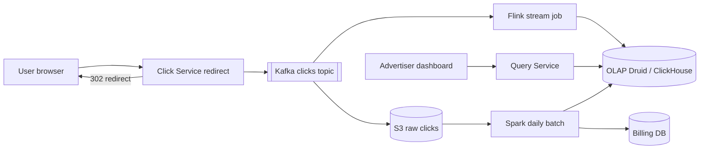
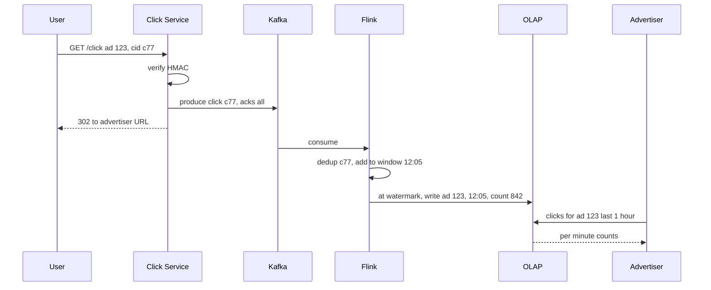

# Design Ad Click Aggregator

**In one line:** capture every ad click, redirect the user to the advertiser's site, and show advertisers click counts per ad, per minute. These counts go into **billing**, so a wrong count = wrong money.

**What the interviewer checks in this question:** high QPS ingestion, stream processing (windows, watermarks), exactly-once counting, choice of OLAP store, and an accuracy guarantee through batch reconciliation.

---

## Step 1: Clarify with the interviewer (3–5 min)

| You ask | Typical answer | Impact on design |
|---|---|---|
| "How many clicks per second?" | ~10K avg, peak 50K QPS | Kafka + stream processor, not the DB directly |
| "Query granularity? Per minute?" | Per ad per minute, plus hour/day rollups | 1 min tumbling window |
| "How fresh must the dashboard be?" | ~1 min delay is fine | Streaming, not batch |
| "Accuracy for billing?" | Must be exact, 100% | Dedup + daily batch reconciliation |
| "Do we do the redirect too?" | Yes, the click goes through our server | The click server must be fast, < 50ms |
| "Fraud detection, impressions?" | Basic dedup yes, ML fraud out of scope | Click dedup by click_id |

> **Say:** "I will build two paths: a fast streaming path that updates the dashboard within 1 minute, and a batch path that computes the exact count from raw data at night and reconciles the streaming numbers. Billing will use the batch numbers."

## Step 2: Requirements

**Functional**
1. User clicks an ad → click is recorded → redirect to the advertiser URL
2. Advertiser queries: clicks for ad X, last 1 hour, per minute
3. Filters: campaign, country, device
4. Top N ads per campaign in the last 1 hour

**Non-functional**
- **Low latency redirect:** < 50ms, a click is never lost
- **Accuracy:** every click is counted exactly once (no double, no miss)
- **Freshness:** ~1 min
- **Scale:** 50K QPS peak, ~1B clicks/day, data retained for 1 year

## Step 3: Estimation (only what changes the design)

- 1B clicks/day ≈ **12K QPS avg, 50K peak**. An `UPDATE count+1` per click in any OLTP DB = hot rows, not possible. So pre-aggregation.
- Raw event ~200 bytes → **200 GB/day** raw. Raw in S3, aggregated in OLAP.
- Aggregated: 10M ads × 1440 min = max 14B rows/day, but only rows for active ads → realistically ~100M rows/day. We need an OLAP store.

> **Say:** "We cannot count every raw click in a DB. The stream processor will aggregate in 1 minute windows, so OLAP gets one row per ad per minute, which brings 50K writes/sec down to a few thousand rows/min."

## Step 4: Core entities

- **ClickEvent**: click_id (unique, generated at impression time), ad_id, campaign_id, user_id, ip, country, device, ts
- **AdAggregate**: ad_id, minute_bucket, country, device, click_count
- **Ad**: ad_id, campaign_id, advertiser_id, target_url

## Step 5: APIs

```http
GET /click?ad=123&cid=<click_id>&sig=<hmac>   → 302 Location: advertiser URL
GET /ads/{adId}/clicks?from=..&to=..&granularity=minute&country=IN
                                              → [{minute, count}]
GET /campaigns/{id}/top-ads?window=1h&n=10    → [{adId, count}]
```

> **Say:** "The click URL has a `click_id` and an HMAC signature, created when the ad is served. This gives us dedup, and nobody can build a fake URL to inflate clicks."

## Step 6: High-level design



**Why each component:**
- **Click Service:** stateless, writes the event to Kafka (acks=all), then returns 302. This is the entry point.
- **Kafka:** durable buffer, partitioned by `ad_id`, replay possible.
- **Flink:** 1 min tumbling windows, event time, watermarks, exactly-once checkpoints.
- **OLAP (Druid/ClickHouse/Pinot):** fast slice-and-dice queries on time-series aggregations.
- **S3 + Spark:** permanent copy of raw data, exact recount at night, corrects OLAP.
- **Query Service:** dashboard APIs, picks the right rollup (hour/day).

## Step 7: Main flow: from click to dashboard



## Step 8: Data model & DB choice

```sql
-- OLAP (ClickHouse / Druid)
ad_clicks_1m(ad_id, campaign_id, minute_ts, country, device, clicks)
  PARTITION BY day, ORDER BY (ad_id, minute_ts)
-- rollups
ad_clicks_1h, ad_clicks_1d   -- materialized views
```

- **OLAP column store:** sorted by time + ad_id, columnar compression, aggregates in ms.
- **S3 (Parquet):** raw clicks, 1 year, for batch.
- **Billing DB (Postgres):** final daily numbers per advertiser, invoices.

## Step 9: Deep dives (where the interviewer will push)

### 9.1 Exactly-once counting
Duplicates can come from three places:
1. **User double click / bot refresh:** dedup by `click_id`. Keyed state `seen(click_id)` in Flink with a 10 min TTL.
2. **Click Service retry:** Kafka idempotent producer (`enable.idempotence=true`).
3. **Flink restart:** checkpoints (Kafka offset + window state together) and an idempotent or transactional OLAP sink. Upsert on row key `(ad_id, minute)`, so a replay overwrites instead of adding twice.
> We also have batch reconciliation, so if anything slips in streaming, it gets fixed at night.

### 9.2 Windows, late events and watermarks
- **Tumbling window of 1 min**, using **event time** (the click's ts), not processing time. Otherwise, during Kafka lag, counts land in the wrong minute.
- **Watermark** = "events up to this time have arrived". For example `max_event_ts - 30 sec`. When the watermark crosses 12:06, the 12:05 window closes and is emitted.
- **Late events** (the phone was offline): update the window (upsert) up to `allowedLateness 5 min`. Anything later → side output → S3, and the batch job will count them.

### 9.3 Hot ad partitioning
- A viral ad (an IPL ad) gets 20K QPS → the single Kafka partition and single Flink task for that `ad_id` get overloaded.
- Fix: key = `ad_id + random(0..N-1)` salt. Flink first does a partial count on the salted key, then sums by `ad_id` in a second stage.
- Salt only known hot ads (config list or dynamic detection), use the normal key for the rest.

### 9.4 Batch reconciliation (Lambda style)
- Kafka → S3 raw (Kafka Connect, hourly Parquet files).
- At night a **Spark job**: raw clicks, distinct on `click_id`, group by `ad_id, minute`. This is the exact truth.
- Compare with the streaming result. If the difference > threshold, alert, and overwrite OLAP rows with the batch value. Billing always uses batch numbers.
- If the interviewer asks about Kappa: "It can also work with Flink alone if replay and exactly-once are strong, but in billing a double check is cheap insurance."

## Step 10: Decision table (what we chose, why, and what we did not)

| Decision | Why we chose it | What we did not choose, and why |
|---|---|---|
| **Kafka** for ingestion | Durable buffer for 50K QPS, replay, multiple consumers (Flink, S3) | **Direct DB write:** hot row update on every click, DB goes down. **SQS:** weak replay and ordering |
| **Flink** for aggregation | Event-time windows, watermarks, exactly-once checkpoints | **Spark Streaming micro-batch:** higher latency, weaker event-time support. **Custom consumer + Redis INCR:** you have to build late events and exactly-once yourself |
| **Tumbling 1 min window** | Simple, non-overlapping, matches dashboard granularity | **Sliding window:** each event in many windows, more compute, not needed |
| **OLAP (ClickHouse/Druid/Pinot)** | Columnar, time-series group by in ms, rollups | **Postgres:** aggregates over billions of rows are slow. **Cassandra:** no support for ad-hoc filters/group by |
| **Spark batch reconciliation** | Exact truth from raw data, billing is safe | **Only streaming:** if there is a bug/slip, the money is wrong and nobody notices |
| **click_id + HMAC** | Dedup and protection from fake click URLs | **IP + ad_id dedup:** different users behind NAT share one IP, real clicks get dropped |
| **Salted keys for hot ads** | No load concentrated on one partition | **Salting every ad:** two-stage aggregation everywhere, wasted overhead |

## Step 11: Failures & bottlenecks

| What failed | What happens | How to handle |
|---|---|---|
| Kafka slow / down | Click not recorded | Click Service buffers to local disk and still redirects. Kafka replication factor 3 |
| Flink job crash | Dashboard stopped | Restart from the last checkpoint, replay from Kafka offsets, idempotent sink |
| OLAP down | Dashboard down | Flink sink backpressure, data is safe in Kafka. Query Service shows a stale cache |
| Hot ad | One task is lagging | Salting + two-stage aggregation |
| Bot click flood | Advertiser gets a fake bill | Rate limit per IP/user, click_id dedup, fraud filter in batch before billing |

## Step 12: How to make it better (say this yourself at the end)

> "If I had more time, I would improve these:"
- **Fraud detection stage** in Flink: same user with 20 clicks in 1 min → flag
- **Top-K ads** in real time in Flink with Count-Min Sketch + heap
- Impressions in the same pipeline too, so the dashboard shows **CTR**
- Data retention tiers: 1-min data for 30 days, then only hourly rollups (lower cost)
- **Data quality alerts:** if stream vs batch difference > 0.1%, page on-call

## Step 13: Likely follow-up questions

- "Why wait for the Kafka ack before redirecting so no click is lost?" → it is billing data. The Kafka ack is ~5–10ms, within the latency budget
- "A late event came 1 day later?" → dropped in streaming, the batch job will count it
- "How do you get exactly-once end to end?" → idempotent producer + Flink checkpoint + upsert sink + click_id dedup
- "The advertiser queries 1 year of data?" → from the day rollup table, not the minute table
- "Kappa vs Lambda?" → Step 9.4

## 2-minute recap (read this before the interview)

> The Click Service verifies the signed `click_id`, writes the event to Kafka (acks=all) and returns a 302 redirect. Kafka is partitioned by `ad_id`. Flink aggregates in event-time 1 min tumbling windows, closes windows by watermark, allows 5 min lateness, and sends later events to a side output. Exactly-once: click_id dedup state + idempotent producer + checkpoints + an `(ad_id, minute)` upsert sink. Results go to ClickHouse/Druid with hourly/daily rollups, and the dashboard reads from there. Raw clicks go to S3, and at night Spark does an exact recount and reconciles OLAP and billing. Hot ads use salted keys and two-stage aggregation.

## Checklist

- [ ] I can explain the click → redirect → Kafka flow and why we redirect after the ack
- [ ] I can explain tumbling windows, event time and watermarks
- [ ] I can tell the 3 layers of exactly-once (dedup, checkpoint, idempotent sink)
- [ ] I can tell why an OLAP store, and why not Postgres
- [ ] I can explain the role of batch reconciliation (Lambda)
- [ ] I can explain salting and two-stage aggregation for hot ads
- [ ] I can tell 3 trade-offs from the decision table without looking
