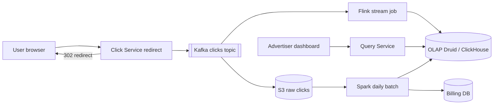
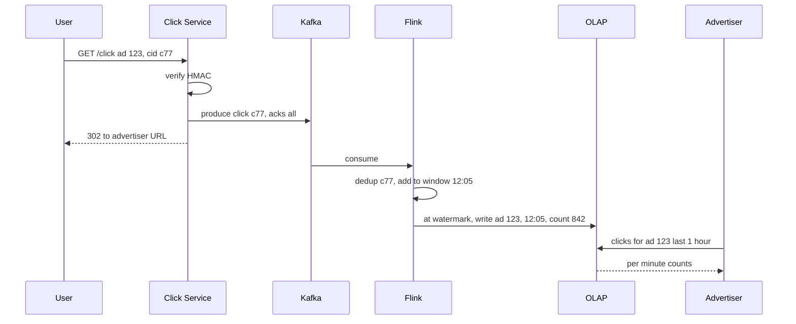

# Design Ad Click Aggregator

**In one line:** capture every ad click, redirect to the advertiser's site, show advertisers per-ad per-minute counts. Counts go into **billing**: wrong count = wrong money.

**What the interviewer checks:** ingestion, windows/watermarks, exactly-once, OLAP, batch reconciliation.

---

## Step 1: Clarify with the interviewer (3–5 min)

| You ask | Typical answer | Impact on design |
|---|---|---|
| "Clicks per second?" | ~10K avg, peak 50K | Kafka + stream processor, not the DB directly |
| "Granularity?" | Per ad per minute + hour/day rollups | 1 min tumbling window |
| "Billing accuracy?" | Exact, 100% | Dedup + daily batch reconciliation |
| "Do we redirect too?" | Yes, via our server | Click server < 50ms |

> **Say:** "Two paths: streaming that updates the dashboard within 1 min, and a nightly batch that counts exactly from raw data and reconciles. Billing uses batch numbers."

## Step 2: Requirements

**Functional**
1. Users should be able to click an ad and be redirected to the advertiser URL (click recorded)
2. Advertisers should be able to query an ad's clicks per minute (last 1 hour, or hour/day rollups)
3. Advertisers should be able to filter by campaign, country, device
4. Advertisers should be able to see a campaign's top N ads (last 1 hour)

**Out of scope:** impressions/CTR, ML fraud (basic `click_id` dedup is in scope), ad serving/auction, invoice UI.

**Non-functional (in priority order)**
1. **Accuracy:** exactly-once count (billing), a click is never lost
2. **Latency:** redirect p99 < 50 ms; dashboard query p99 < 1 sec
3. **Freshness:** dashboard at most ~1 min old → streaming
4. **Scale:** 50K QPS peak, ~1B clicks/day, 1 year retention

**CAP choice:** ingestion → availability (redirect even if Kafka is down, local buffer); dashboard eventual (~1 min). Billing → strong, final only after the batch recount.

## Step 3: Estimation (only what changes the design)

- 1B/day ≈ **12K QPS avg, 50K peak**. `UPDATE count+1` per click = hot rows → pre-aggregation. Kafka is justified by **replay + 2 consumers**, not 50K/sec (Step 6).
- ~200 bytes/event → **200 GB/day** raw → S3; aggregates in OLAP.
- 10M ads × 1440 min = max 14B rows/day; active ads only → ~100M rows/day → OLAP store.

> **Say:** "Aggregate in 1 min windows: one row per ad per minute (country, device), 50K writes/sec → ~1K rows/sec."

## Step 4: Core entities

- **ClickEvent**: click_id (unique, generated at impression time), ad_id, campaign_id, user_id, ip, country, device, ts
- **AdAggregate**: ad_id, minute_bucket, country, device, click_count
- **Ad**: ad_id, campaign_id, advertiser_id, target_url

## Step 5: APIs

```http
GET /click?ad=123&cid=<click_id>&sig=<hmac>   → 302 Location: advertiser URL
GET /ads/{adId}/clicks?from=..&to=..&granularity=minute&country=IN
                                              → [{minute, count}]
GET /campaigns/{id}/top-ads?window=1h&n=10    → [{adId, count}]
```

> **Say:** "`click_id` + HMAC are created at ad serving: they give dedup, and nobody can inflate clicks with a fake URL."

## Step 6: High-level design

**Simple v1:** insert every click into Postgres, dashboard runs `GROUP BY ad_id, minute`; fine up to ~1K/sec. At 50K/sec + 1B rows/day the `GROUP BY` takes seconds → the components below.



**Why each component:** (FR1 → Click Service + Kafka, FR2/FR3/FR4 → Flink + OLAP + Query Service; accuracy NFR → S3 + Spark)
- **Click Service:** stateless; writes to Kafka (acks=all), then 302.
- **Kafka:** **2 consumers** (Flink, S3 sink) + **7-day replay** (recount after a Flink crash/bug fix). SQS: one consumer, no replay.
- **Flink:** event-time windows, watermarks, exactly-once checkpoints.
- **OLAP:** slice-and-dice in < 1 sec over ~100M rows/day.
- **S3 + Spark:** cheap raw copy, exact nightly recount = billing truth.
- **Query Service:** thin; picks the rollup (minute/hour/day).

## Step 7: Main flow: from click to dashboard



## Step 8: Data model & DB choice

```sql
-- OLAP (ClickHouse / Druid)
ad_clicks_1m(ad_id, campaign_id, minute_ts, country, device, clicks)
  PARTITION BY day, ORDER BY (ad_id, minute_ts)
-- rollups
ad_clicks_1h, ad_clicks_1d   -- materialized views
```

- **OLAP:** sorted by time + ad_id, columnar, aggregates in ms.
- **S3 (Parquet):** raw clicks, 1 year, for batch.
- **Billing DB (Postgres):** final daily numbers per advertiser, invoices.

## Step 9: Deep dives (where the interviewer will push)

### 9.1 Exactly-once counting
**NFR:** every click counted once.
1. **Double click / bot refresh:** Flink keyed state `seen(click_id)`, 10 min TTL.
2. **Click Service retry:** idempotent producer (`enable.idempotence=true`).
3. **Flink restart:** checkpoints (offset + window state together) + `(ad_id, minute)` upsert sink → replay overwrites, no double add.
- Anything that slips in streaming gets fixed by the nightly batch.
- **Trade-off:** dedup state + checkpoints = heavy job, slow restarts; in return billing is safe.

### 9.2 Windows, late events and watermarks
**NFR:** ~1 min freshness, counts in the right minute.
- **Tumbling 1 min**, **event time** (not processing time, or Kafka lag puts counts in the wrong minute).
- **Watermark** = `max_event_ts - 30 sec`; crossing 12:06 → emit the 12:05 window.
- **Late events:** upsert up to `allowedLateness 5 min`; later → side output → S3 → counted by batch.
- **Trade-off:** big watermark = accurate but late dashboard; small = fresh but more late events.

### 9.3 Hot ad partitioning
**NFR:** one viral ad must not lag the whole pipeline.
- Viral ad (IPL) at 20K QPS → one partition + one Flink task overloaded.
- Key = `ad_id + random(0..N-1)` salt → partial counts, then stage 2 sums by `ad_id`.
- Salt only known hot ads (config or dynamic detection).
- **Trade-off:** two stages = a bit more latency + code.

### 9.4 Batch reconciliation (Lambda style)
**NFR:** 100% billing accuracy.
- Kafka → S3 (Kafka Connect, hourly Parquet).
- Nightly **Spark:** distinct `click_id`, group by `ad_id, minute` = exact truth.
- Compare with streaming; diff > threshold → alert + overwrite OLAP. Billing always from batch.
- Kappa? "Flink alone works if replay + exactly-once are strong, but in billing a double check is cheap insurance."
- **Trade-off:** two pipelines, final billing next day.

## Step 10: Decision table (what we chose, why, and what we did not)

| Decision | Why we chose it | What we did not choose, and why |
|---|---|---|
| **Kafka** ingestion | 50K QPS, 2 consumers, 7-day replay | **Direct DB:** hot rows. **SQS:** one consumer, no replay. Sacrifice: Kafka ops |
| **Flink** aggregation | Event-time windows, watermarks, exactly-once | **ClickHouse MVs:** weak dedup/late events. **Spark micro-batch:** latency. Sacrifice: stateful job is hard |
| **Tumbling 1 min** | Simple, matches dashboard | **Sliding:** event in many windows. Sacrifice: nothing below 1 min |
| **OLAP (ClickHouse/Druid/Pinot)** | Group by < 1 sec on ~100M rows/day | **Postgres:** slow. **Cassandra:** no ad-hoc group by. Sacrifice: costly updates, extra store |
| **Spark reconciliation** | Exact truth from raw | **Kappa only:** a bug = wrong money, unnoticed. Sacrifice: two pipelines, next-day billing |
| **click_id + HMAC** | Dedup + no fake URLs | **IP + ad_id dedup:** drops real clicks behind NAT. Sacrifice: signing at ad serving |
| **Salted keys** (hot ads) | No single hot partition | **Salt every ad:** pointless overhead. Sacrifice: maintain a hot list |

## Step 11: Failures & bottlenecks

| What failed | What happens | How to handle |
|---|---|---|
| Kafka slow / down | Click not recorded | Local disk buffer, still redirect; RF 3 |
| Flink crash | Dashboard stops | Restart from checkpoint, offset replay, idempotent sink |
| OLAP down | Dashboard down | Sink backpressure, data safe in Kafka; show stale cache |
| Hot ad | One task lags | Salting + two stages |
| Bot click flood | Fake bill | Per IP/user rate limit, dedup, batch fraud filter before billing |

## Step 12: How to make it better (say this yourself at the end)

- **Fraud stage** in Flink: 20 clicks in 1 min → flag
- **Real-time top-K:** Count-Min Sketch + heap
- **Retention tiers:** 1-min data for 30 days, then hourly only
- **Drift alert:** stream vs batch > 0.1% → page on-call

## Step 13: Likely follow-up questions

- "Why wait for the Kafka ack before redirecting?" → billing data; ack ~5–10ms fits the budget
- "Event 1 day late?" → dropped by streaming, counted by batch
- "End-to-end exactly-once?" → idempotent producer + checkpoint + upsert sink + click_id dedup
- "Query 1 year?" → from the day rollup table
- "Kappa vs Lambda?" → 9.4
- **Senior signal:** the Kafka ack is on the redirect's critical path → slow Kafka = every redirect slow. Local disk buffer + redirect on timeout; make stream-vs-batch drift an alerting metric, or billing errors pile up silently.

## 2-minute recap (read this before the interview)

> Click Service verifies the signed `click_id` → Kafka (acks=all) → 302. Kafka partitioned by `ad_id` (for 2 consumers + 7-day replay). Flink: event-time 1 min tumbling, watermark close, 5 min lateness, the rest to a side output. Exactly-once = dedup state + idempotent producer + checkpoints + `(ad_id, minute)` upsert. OLAP (ClickHouse/Druid) + hourly/daily rollups. Raw in S3, nightly Spark recount reconciles OLAP + billing. Hot ads: salting + two stages.

## Checklist

- [ ] I can explain the click → redirect → Kafka flow and why we redirect after the ack
- [ ] I can explain tumbling windows, event time and watermarks
- [ ] I can tell the 3 layers of exactly-once (dedup, checkpoint, idempotent sink)
- [ ] I can tell why an OLAP store, and why not Postgres
- [ ] I can explain the role of batch reconciliation (Lambda)
- [ ] I can explain salting and two-stage aggregation for hot ads
- [ ] I can tell 3 trade-offs from the decision table without looking
