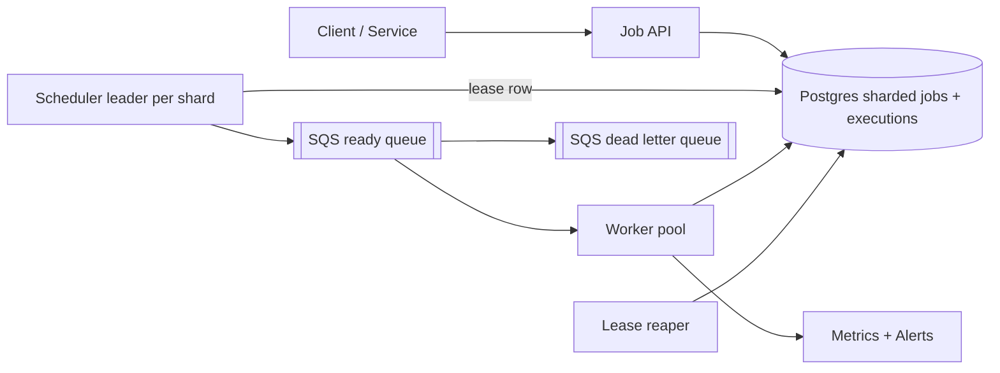
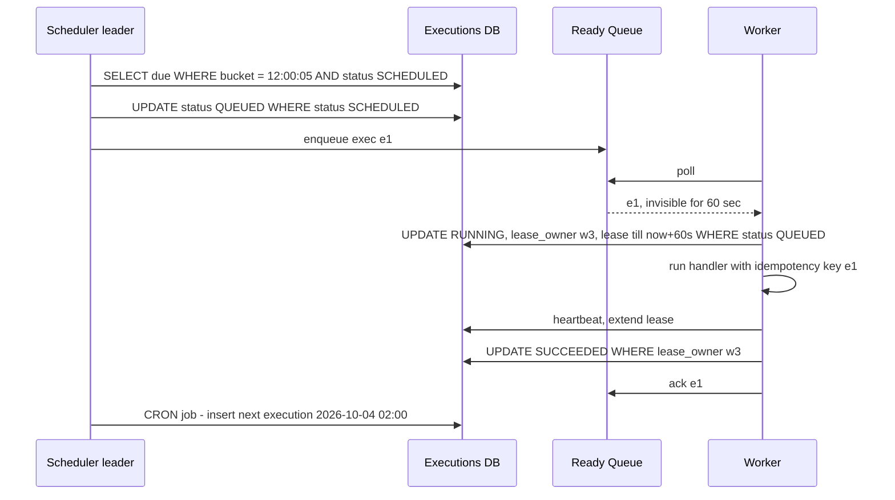

# Design Distributed Job Scheduler (Cron at Scale)

**In one line:** run jobs (one-time, delayed, cron "every day at 2 AM") on workers at the right time, with retries, never missed and (as far as possible) never run twice.

**What the interviewer checks:** finding due jobs, crash recovery (leases), at-least-once + idempotency, retries/DLQ, no scheduler SPOF.

---

## Step 1: Clarify with the interviewer (3–5 min)

| You ask | Typical answer | Impact on design |
|---|---|---|
| "One-time, delayed, cron?" | All three | Cron: compute next_run → new execution |
| "What is a job?" | Container image / handler + payload | Generic executor |
| "Time precision?" | ~1 sec is fine | Second-level buckets, not ms |
| "Exactly-once?" | At-least-once + idempotent is OK | Leases + retries, idempotency key |
| "Scale?" | 10M jobs/day, peak 10K/sec (midnight) | Time-bucketed partitioned table, scheduler sharding |
| "Job duration?" | Seconds to 1 hour | Lease heartbeat |

> **Say:** "Job definition and execution are separate. The scheduler only queues due executions; workers pull and run them under a lease. At-least-once, so jobs are idempotent."

## Step 2: Requirements

**Functional**
1. Users should be able to create/update/delete jobs: one-time, delayed (`run_at`), cron (`0 2 * * *`)
2. Users should be able to have the job run at its due time with its payload
3. Users should be able to get retries (backoff) on failure, DLQ after max retries
4. Users should be able to see status and execution history

**Out of scope:** job DAGs/dependencies, building/deploying job code, multi-region active-active.

**Non-functional (in priority order)**
1. **Reliability:** no due job missed (durable), at-least-once, duplicates rare
2. **Timeliness:** starts within p99 < 2 sec of the due time
3. **HA:** 99.99%, keeps running through scheduler/worker crashes
4. **Scale:** 10M executions/day, 10K/sec burst at midnight

**CAP choice:** scheduling → consistency: a scheduler may pause during a partition (job late), but two schedulers never take one bucket → leader lease in a strongly consistent store.

## Step 3: Estimation (only what changes the design)

- 10M/day ≈ **120/sec avg**, but cron fires at round times (00:00, every hour) → **10K/sec peak**. Design for the burst.
- ~1 KB/record → 10 GB/day of history; 30 days → 300 GB, partition by day.
- `WHERE run_at <= now()` every second on the full table is slow → time-bucket index.

> **Say:** "The average is nothing; the problem is the midnight burst and no miss, no double run on a crash."

## Step 4: Core entities

- **Job** (definition): job_id, owner, type (`ONCE`, `CRON`), cron_expr, handler, payload, max_retries, timeout
- **Execution** (each run): exec_id, job_id, scheduled_at, status (`SCHEDULED`, `QUEUED`, `RUNNING`, `SUCCEEDED`, `FAILED`, `DEAD`), attempt, lease_owner, lease_expires_at
- **Worker**: worker_id, capacity, last_heartbeat

## Step 5: APIs

```http
POST   /jobs {handler, payload, schedule: {cron | runAt | delaySec}, maxRetries, timeoutSec}
       Header: Idempotency-Key: <uuid>                 → {jobId}
GET    /jobs/{jobId}                                   → definition + next_run
DELETE /jobs/{jobId}                                   → 204
GET    /jobs/{jobId}/executions?limit=20               → history + status
POST   /executions/{execId}/heartbeat   (worker)       → extend lease
POST   /executions/{execId}/complete {status, output}  (worker)
```

## Step 6: High-level design

**Simple v1:** Postgres + workers polling directly with `SELECT ... WHERE scheduled_at <= now() FOR UPDATE SKIP LOCKED LIMIT 10`; enough up to thousands of jobs/min. 10K/sec burst + ~1000 workers polling → scheduler + SQS; 40K writes/sec → shards.



**Why each component:** (FR1/FR4 → Job API + Postgres, FR2 → Scheduler + SQS + Workers, FR3 → backoff rows + DLQ)
- **Postgres, sharded by `hash(job_id)`:** conditional updates (status, fencing) + `UNIQUE`. ~4 writes/execution × 10K/sec = 40K/sec → a few shards.
- **Scheduler leader per shard:** every second marks the current bucket's due rows `QUEUED` → SQS. Leader via a **DB lease row** (`UPDATE shard_leases SET owner=me, expires=now()+10s WHERE expires < now()`); Postgres is already strongly consistent, so no separate etcd/ZK.
- **SQS (not Kafka):** task distribution → per-message visibility timeout (= lease), retries, DLQ built in.
- **Lease reaper:** `RUNNING` rows with expired leases → `SCHEDULED`.
- **DLQ:** SQS redrive, manual inspection.

## Step 7: Main flow: from due job to completion



## Step 8: Data model & DB choice

```sql
jobs(job_id PK, owner, type, cron_expr, handler, payload, max_retries, timeout_sec, enabled)
executions(exec_id PK, job_id, time_bucket, scheduled_at, status, attempt,
           lease_owner, lease_expires_at, last_error,
           UNIQUE(job_id, scheduled_at))
INDEX (shard_id, time_bucket, status)
```

- `time_bucket` = `scheduled_at` rounded to the minute/second; the scheduler reads only the current bucket.
- `UNIQUE(job_id, scheduled_at)`: the same cron run is never created twice, even if two schedulers run by mistake.
- Cassandra `(shard_id, time_bucket)` only at hundreds of thousands of writes/sec (Airbnb/Uber scale), not at 40K/sec.

## Step 9: Deep dives (where the interviewer will push)

### 9.1 How do you find due jobs?
**NFR:** < 2 sec from the due time.
- **Time-bucketed:** partition key `(shard, minute_bucket)`, a small index scan every second.
- **Alt: Redis ZSET** `ZADD due <run_at_epoch> exec_id` + `ZRANGEBYSCORE due 0 now LIMIT 1000`: fast, weak durability → only an index for the next 1 hour, DB is truth.
- **Delayed:** `scheduled_at = now + delay`, same path.
- **Cron:** on complete/queue, insert a new row for the next run; watch timezone + DST.
- **Trade-off:** second-level polling = constant DB load, small buckets, no ms precision.

### 9.2 Workers: pull, lease, visibility timeout
**NFR:** no job missed on a worker crash.
- **Pull** (by capacity) + SQS visibility timeout = lease. Crash → message visible again → another worker.
- Long jobs: **heartbeat** every 20 sec; stops → expires → reaper re-queues.
- **Zombie worker:** on complete check `WHERE lease_owner = me AND attempt = n`; fencing token = attempt → old result rejected.
- **Trade-off:** short lease = fast detection, more heartbeats; long = less traffic, slow recovery.

### 9.3 At-least-once, idempotency, retries, DLQ
**NFR:** duplicates rare and harmless.
- Crash/timeout → re-run, so **at-least-once**. `exec_id` = idempotency key, the handler ("send invoice") dedups on it.
- Failure → `attempt++`, `scheduled_at = now + backoff` (10s, 30s, 2m, 10m + jitter), `SCHEDULED`.
- `attempt > max_retries` → `DEAD`, DLQ, alert the owner, manual replay API.
- Past `timeout_sec` → kill, retry.
- **Trade-off:** the job author carries idempotency; the system stays simple (no 2PC).

### 9.4 Scheduler HA and scale
**NFR:** no SPOF, handle the midnight burst.
- Per-shard **leader election** (else duplicate enqueues): Postgres lease row, 10 sec lease, renewed every 3 sec. Leader dies → new one in ~10 sec, catches up `bucket <= now AND status SCHEDULED`. Many shards / slow DB failover → etcd/ZooKeeper.
- Duplicates anyway: `UPDATE ... SET status='QUEUED' WHERE status='SCHEDULED'` lets one win; the worker claims with `WHERE status='QUEUED'`.
- **Scale:** N shards, leaders assigned to schedulers by consistent hashing → the burst splits across N.
- Thundering herd: 0–30 sec **jitter** on non-critical jobs.
- **Trade-off:** that shard's jobs run late during the ~10 sec failover (consistency > availability).

## Step 10: Decision table (what we chose, why, and what we did not)

| Decision | Why we chose it | What we did not choose, and why |
|---|---|---|
| **Time-bucketed sharded Postgres** | Small scan, durable, conditional updates | **Full scan:** slow. **In-memory PQ:** crash = loss. **Cassandra:** slow LWTs. Sacrifice: sharding ops, cross-shard queries |
| **Workers pull + lease** | Natural backpressure, auto recovery | **Push to worker:** capacity unknown, hard crash detection |
| **At-least-once + idempotent** | Practical, achievable | **Exactly-once:** no guarantee across crashes, 2PC is costly |
| **Postgres lease row leader** | One scheduler per shard, no new cluster | **etcd/ZK:** robust but one more cluster. **No coordination:** duplicates. Sacrifice: ~10 sec failover, leader stalls on DB failover |
| **SQS ready queue** | Bursts, visibility timeout, retries, DLQ | **Kafka:** no per-message ack, replay unneeded. **DB polling:** 1000 workers = lock contention. Sacrifice: no ordering, extra hop |
| **Exponential backoff + DLQ** | Downstream gets breathing room, poison jobs apart | **Immediate retry:** load on a failing downstream, poison job blocks the queue |
| **Fencing token (attempt)** | Rejects a zombie's old result | **Lease TTL only:** wrong status after a GC pause |

## Step 11: Failures & bottlenecks

| What failed | What happens | How to handle |
|---|---|---|
| Scheduler leader crash | Due jobs not queued | New leader in 10 sec, catch-up scan |
| Worker crash mid-job | Job incomplete | Lease expires, reaper re-queues, idempotent retry |
| Midnight burst | Queue lag, jobs late | Shards, schedulers, queue-depth autoscale, jitter |
| DB slow | Scheduling stops | History read replicas, day partitions, archive |
| Poison job | Crashes every time | max_retries → DLQ, owner alert |
| Clock skew | Early/late runs | NTP; decisions only from the leader / DB time |

## Step 12: How to make it better (say this yourself at the end)

- **DAG dependencies** (like Airflow): B runs only when A succeeds
- **Priority queues:** payments vs reports separate
- **Per-tenant rate limits:** one customer's 100K jobs must not starve others
- **Schedule lag** (start - scheduled_at) p99 dashboard + alert

## Step 13: Likely follow-up questions

- "Job ran twice?" → accept at-least-once, handler idempotent on `exec_id` (9.3)
- "1 hour job, worker died?" → heartbeat stops, lease expires, re-run; long jobs should checkpoint
- "Previous cron run still running, next one due?" → skip / queue / parallel, set in job config
- "Leader election?" → Postgres lease row (etcd lease / ZK ephemeral node in bigger setups) + fencing
- "Delayed job 30 days out?" → same table, future bucket; in the DB, not Redis
- **Senior signal:** the real risk is **schedule lag** at midnight. Make it a p99 metric, autoscale on queue depth, jitter non-critical jobs, align Postgres primary failover with leader lease timing.

## 2-minute recap (read this before the interview)

> Definition vs execution are separate; execution row = `scheduled_at`, `time_bucket`, status, lease; `UNIQUE(job_id, scheduled_at)`. Sharded Postgres. Per-shard leader (Postgres lease row) every second marks due rows `QUEUED` via conditional update → SQS (task distribution, not Kafka). Workers pull, lease (visibility timeout), heartbeat, fencing check on complete; crash → reaper re-queues. At-least-once → `exec_id` idempotency key. Backoff + jitter, then DLQ. Cron: new row for the next run. Burst: sharding, autoscale, jitter.

## Checklist

- [ ] I can explain the job definition vs execution model
- [ ] I can tell how due jobs are found with a time-bucketed table
- [ ] I can explain crash recovery with lease, heartbeat and visibility timeout
- [ ] I can tell why at-least-once, and how idempotency works
- [ ] I can tell the flow of retries, backoff and DLQ
- [ ] I can explain scheduler leader election and the fencing token
- [ ] I can tell 3 trade-offs from the decision table without looking
