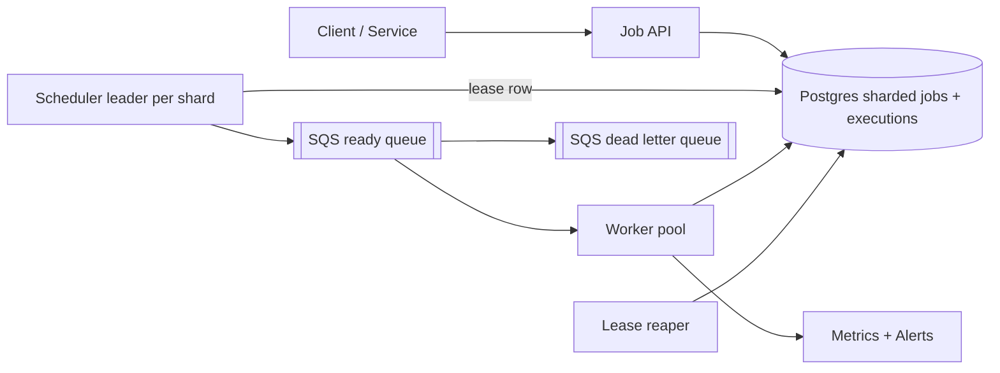
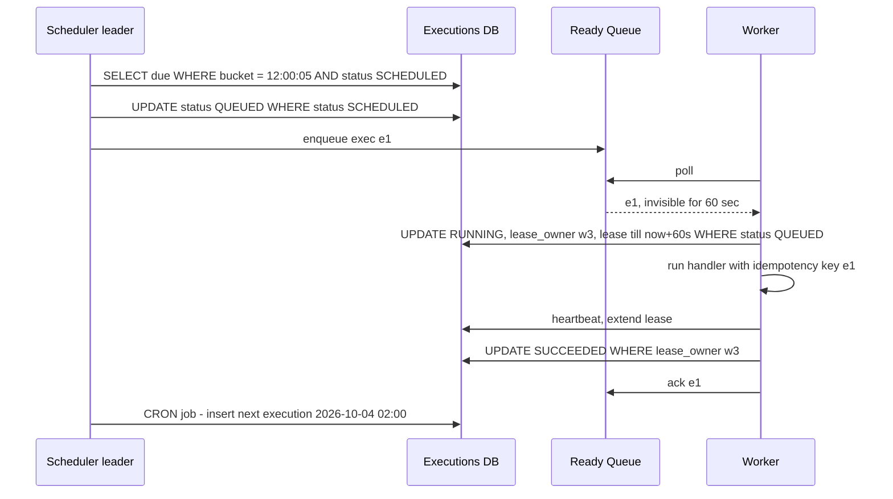

# Design Distributed Job Scheduler (Cron at Scale)

**In one line:** users register jobs (one-time, delayed, or cron like "every day at 2 AM"), and the system runs them on workers at the right time, with retries, without missing any and without running them twice (as far as possible).

**What the interviewer checks in this question:** how you find due jobs efficiently, how a job recovers when a worker crashes (leases), at-least-once + idempotency, retries/DLQ, and making sure the scheduler itself is not a single point of failure.

---

## Step 1: Clarify with the interviewer (3–5 min)

| You ask | Typical answer | Impact on design |
|---|---|---|
| "Job types: one-time, delayed, recurring cron?" | All three | For recurring, compute next_run and create a new execution |
| "What is the job itself? Code or an HTTP call?" | Container image / handler name + payload | The worker is a generic executor |
| "Time precision?" | ~1 sec delay is fine | Second-level buckets, not ms |
| "Do we need exactly-once?" | At-least-once + idempotent jobs is OK | Leases + retries, job idempotency key |
| "Scale?" | 10M jobs/day, peak 10K jobs/sec (midnight cron) | Time-bucketed partitioned table, scheduler sharding |
| "How long does a job run?" | From seconds up to 1 hour | We need a lease heartbeat |

> **Say:** "I will keep the job definition and the job execution separate. The scheduler only puts due executions into a queue, and workers pull them and run them with a lease. The guarantee will be at-least-once, so jobs must be idempotent."

## Step 2: Requirements

**Functional**
1. Users should be able to create/update/delete jobs: one-time, delayed (`run_at`), cron (`0 2 * * *`)
2. Users should be able to rely on the job running at its due time with its payload
3. Users should be able to get automatic retries (backoff) on failure, and a DLQ after max retries
4. Users should be able to see job status and execution history

**Out of scope:** job DAGs/dependencies, building/deploying job code, multi-region active-active.

**Non-functional (in priority order)**
1. **Reliability:** no due job is missed (durable), at-least-once, duplicates rare
2. **Timeliness:** starts within p99 < 2 sec of the due time
3. **HA:** 99.99%, keeps running if a scheduler or worker crashes
4. **Scale:** 10M executions/day, 10K/sec burst at midnight

**CAP choice:** consistency for scheduling state: during a partition it is fine if a scheduler pauses (a job runs a bit late), but two schedulers must never take the same bucket. So the leader lease lives in a strongly consistent store.

## Step 3: Estimation (only what changes the design)

- 10M/day ≈ **120/sec avg**, but cron jobs run at round times (00:00, every hour) → **10K/sec peak**. Design for the burst, not the average.
- Job record ~1 KB → 10M executions/day ≈ 10 GB/day of history. Keep 30 days → 300 GB, partition by day.
- Querying due jobs every second: `WHERE run_at <= now()` on the full table is slow, so use a time-bucket index.

> **Say:** "The average load is nothing. The problem is the midnight burst and the guarantee that a job is not missed on a crash and does not run twice."

## Step 4: Core entities

- **Job** (definition): job_id, owner, type (`ONCE`, `CRON`), cron_expr, handler, payload, max_retries, timeout
- **Execution** (each run): exec_id, job_id, scheduled_at, status (`SCHEDULED`, `QUEUED`, `RUNNING`, `SUCCEEDED`, `FAILED`, `DEAD`), attempt, lease_owner, lease_expires_at
- **Worker**: worker_id, capacity, last_heartbeat

## Step 5: APIs

```http
POST   /jobs {handler, payload, schedule: {cron | runAt | delaySec}, maxRetries, timeoutSec}
       Header: Idempotency-Key: <uuid>                 → {jobId}
GET    /jobs/{jobId}                                   → definition + next_run
DELETE /jobs/{jobId}                                   → 204
GET    /jobs/{jobId}/executions?limit=20               → history + status
POST   /executions/{execId}/heartbeat   (worker)       → extend lease
POST   /executions/{execId}/complete {status, output}  (worker)
```

## Step 6: High-level design

**Start with a simple v1:** Job API + one Postgres + workers that poll directly with `SELECT ... WHERE scheduled_at <= now() FOR UPDATE SKIP LOCKED LIMIT 10`. This fully works up to thousands of jobs/min. The numbers break it: a 10K/sec burst at midnight and ~1000 workers polling the DB (→ scheduler + SQS ready queue), and 40K status writes/sec at peak (→ Postgres shards, one scheduler leader per shard).



**Why each component:** (FR1/FR4 → Job API + Postgres, FR2 → Scheduler + SQS + Workers, FR3 → backoff rows + DLQ)
- **Postgres sharded by `hash(job_id)`:** we need conditional updates (status, fencing) and `UNIQUE`. ~4 writes per execution × 10K/sec = 40K writes/sec at peak, a few shards are enough. In Cassandra this would be slow LWTs.
- **Scheduler leader per shard:** every second, marks the current bucket's due rows `QUEUED` and sends them to SQS. The leader is chosen via a **DB lease row** (`UPDATE shard_leases SET owner=me, expires=now()+10s WHERE expires < now()`); no separate etcd/ZooKeeper cluster, because we already have a strongly consistent Postgres.
- **SQS ready queue (not Kafka):** this is task distribution: per-message visibility timeout (= lease), retries, DLQ built in. Kafka has no per-message ack, and we need no replay/multiple consumers.
- **Workers:** pull, take a lease, run, heartbeat, complete. Pull = natural backpressure.
- **Lease reaper:** moves `RUNNING` rows with expired leases back to `SCHEDULED` in the DB.
- **DLQ:** SQS redrive policy, manual inspection after max retries.

## Step 7: Main flow: from due job to completion



## Step 8: Data model & DB choice

```sql
jobs(job_id PK, owner, type, cron_expr, handler, payload, max_retries, timeout_sec, enabled)
executions(exec_id PK, job_id, time_bucket, scheduled_at, status, attempt,
           lease_owner, lease_expires_at, last_error,
           UNIQUE(job_id, scheduled_at))
INDEX (shard_id, time_bucket, status)
```

- `time_bucket` = `scheduled_at` rounded to the minute/second. The scheduler reads only the current bucket, not the whole table.
- `UNIQUE(job_id, scheduled_at)`: the same cron run cannot be created twice, even if two schedulers run by mistake.
- **Postgres, sharded by `hash(job_id) % N`:** conditional updates and `UNIQUE` are natural here. Consider Cassandra `(shard_id, time_bucket)` only when writes reach hundreds of thousands/sec (Airbnb/Uber scale); not needed at 40K/sec.

## Step 9: Deep dives (where the interviewer will push)

### 9.1 How do you find due jobs?
**NFR:** timeliness, < 2 sec from the due time.
- **Time-bucketed table:** partition key `(shard, minute_bucket)`. The scheduler queries the current bucket every second. The index scan is small, never the whole table.
- **Alternative: Redis ZSET** `ZADD due <run_at_epoch> exec_id`, then `ZRANGEBYSCORE due 0 now LIMIT 1000`. It is fast, but Redis durability is weak, so keep the DB as the truth and use Redis only as an index for the next 1 hour.
- **Delayed jobs** (like "reminder after 30 min") work the same way: `scheduled_at = now + delay`.
- **Cron:** when an execution completes (or is queued), compute the next run from the cron expression and insert a new execution row. Watch out for timezones and DST.
- **Trade-off:** second-level polling puts constant load on the DB; buckets must stay small, and we get no ms precision.

### 9.2 Workers: pull, lease, visibility timeout
**NFR:** reliability, no job missed on a worker crash.
- Workers **pull** (not push), so they take work based on their own capacity.
- Queue (SQS) visibility timeout = lease. Worker crash → message becomes visible again → another worker picks it up.
- Long jobs: the worker sends a **heartbeat** every 20 sec to extend the lease. Heartbeat stops → lease expires → reaper re-queues.
- **Zombie worker** (network partition, an old worker is still running): on complete, check `WHERE lease_owner = me AND attempt = n`. Fencing token = attempt number. The old worker's result is rejected.
- In a Postgres-only design (v1), `SELECT ... FOR UPDATE SKIP LOCKED LIMIT 10` also works instead of a queue.
- **Trade-off:** a short lease = faster crash detection but more heartbeat traffic; a long one = less traffic but slower recovery.

### 9.3 At-least-once, idempotency, retries, DLQ
**NFR:** at-least-once, duplicates rare and harmless.
- On a crash/timeout a job can run again, so it is **at-least-once, not exactly-once**. Give every run its `exec_id` as an idempotency key. The job handler (like "send invoice") dedups with this key.
- On failure → `attempt++`, `scheduled_at = now + backoff` (exponential: 10s, 30s, 2m, 10m + jitter), status `SCHEDULED`.
- `attempt > max_retries` → `DEAD`, into the DLQ, alert the owner. A manual replay API from the DLQ.
- If the job crosses its `timeout_sec` → the worker kills it, treats it as failed and retries.
- **Trade-off:** the job author carries the idempotency burden; in return the system stays simple (no 2PC).

### 9.4 Scheduler HA and scale
**NFR:** HA, the scheduler must not be a SPOF, and it must handle the midnight burst.
- If two schedulers pick up the same bucket, we get duplicate enqueues. So use **leader election** per shard via a Postgres lease row (10 sec lease, renewed by the leader every 3 sec). Leader dies → new leader in ~10 sec, which catches up on missed buckets (`bucket <= now AND status SCHEDULED`). If shards grow very many or DB failover is slow, move to an etcd/ZooKeeper lease.
- If a duplicate enqueue still happens: `UPDATE ... SET status='QUEUED' WHERE status='SCHEDULED'` lets only one win, and the worker claims it with `WHERE status='QUEUED'`.
- **Scale:** split executions into N shards (`hash(job_id) % N`). Each shard has its own leader (assigned to schedulers with consistent hashing). The midnight burst is spread across N schedulers.
- Midnight thundering herd: add a small random **jitter** (0–30 sec) to jobs that are not sensitive to the exact time.
- **Trade-off:** jobs of that shard run late during the ~10 sec leader failover; we gave up a little availability for consistency.

## Step 10: Decision table (what we chose, why, and what we did not)

| Decision | Why we chose it | What we did not choose, and why |
|---|---|---|
| **Time-bucketed executions table (sharded Postgres)** | Scans only a small bucket every second, durable, conditional updates | **Full table scan:** slow. **In-memory priority queue:** everything lost on a crash. **Cassandra:** slow LWTs. Sacrifice: sharding ops, cross-shard queries are hard |
| **Workers pull + lease** | Natural backpressure, auto recovery on crash | **Scheduler pushes to worker:** worker capacity is unknown, crash detection is hard |
| **At-least-once + idempotent jobs** | Practical and achievable | **Exactly-once:** cannot be guaranteed across crashes in a distributed system, 2PC is costly and slow |
| **Leader election via Postgres lease row** | One active scheduler per shard, no new cluster | **etcd/ZooKeeper:** more robust, but one more cluster to run. **No coordination:** duplicate enqueues. Sacrifice: ~10 sec failover, the leader also stalls during DB failover |
| **SQS between scheduler and workers** | Absorbs bursts, visibility timeout, retries, DLQ built in | **Kafka:** no per-message ack/visibility, replay not needed. **Workers poll the DB directly:** 1000 workers = DB load, lock contention. Sacrifice: no ordering in SQS, one extra hop |
| **Exponential backoff + DLQ** | Gives the downstream time to recover, poison jobs kept apart | **Immediate retry loop:** more load on a failing downstream, a poison job blocks the queue |
| **Fencing token (attempt) on complete** | Rejects a zombie worker's old result | **Only lease TTL:** after a GC pause, the old worker writes the wrong status |

## Step 11: Failures & bottlenecks

| What failed | What happens | How to handle |
|---|---|---|
| Scheduler leader crash | Due jobs are not going to the queue | New leader in 10 sec, catch-up scan of missed buckets |
| Worker crash mid-job | Job is incomplete | Lease expires, reaper re-queues, safe retry thanks to idempotency |
| Midnight burst | Queue lag, jobs late | Shards + more schedulers, worker autoscale on queue depth, jitter |
| DB slow | Scheduling stopped | Read replicas for history, partition by day, archive old data |
| Poison job | Crashes every time | max_retries → DLQ, owner alert |
| Clock skew | Job runs early/late | NTP, scheduling decisions only from the leader's clock / DB time |

## Step 12: How to make it better (say this yourself at the end)

> "If I had more time, I would improve these:"
- **Job dependencies (DAG)** like Airflow: job B runs only when A succeeds
- **Priority queues**: separate queues for critical jobs (payments) and batch jobs (reports)
- **Per-tenant rate limits** so one customer's 100K jobs do not starve everyone else
- **Observability:** p99 dashboard and alert for schedule lag (actual start - scheduled_at)

## Step 13: Likely follow-up questions

- "What if a job runs twice?" → accept at-least-once, the handler is idempotent on `exec_id` (Step 9.3)
- "A 1 hour job, and the worker died midway?" → heartbeat stopped, lease expired, re-run. Long jobs should checkpoint
- "The previous run of a cron job is still running and the next time has come?" → policy: skip, queue, or allow parallel. Keep it in the job config
- "How does leader election work?" → a Postgres lease row (or an etcd lease / ZK ephemeral node in a bigger setup), with fencing
- "A delayed job 30 days later?" → same table, a bucket 30 days ahead. In the DB, not Redis
- **Senior signal:** raise it yourself: the real risk is **schedule lag** during the midnight burst. Make it a p99 metric, autoscale workers on queue depth, add jitter to non-critical jobs, and align Postgres primary failover with the leader lease timing.

## 2-minute recap (read this before the interview)

> Job definition and execution are separate. Each execution is a row: `scheduled_at`, `time_bucket`, status, lease. `UNIQUE(job_id, scheduled_at)` prevents duplicate runs. Data lives in sharded Postgres (conditional updates). The scheduler leader (elected via a Postgres lease row, one per shard) takes the due executions of the current bucket every second, marks them `QUEUED` with a conditional update and puts them into the SQS ready queue (this is task distribution, so not Kafka). Workers pull, take a lease (visibility timeout), extend it with heartbeats, and the fencing token is checked on complete. On a crash the lease expires → the reaper re-queues. The guarantee is at-least-once, so handlers get `exec_id` as an idempotency key. On failure, exponential backoff + jitter, and DLQ after max retries. For cron, compute the next run and insert a new row. For the midnight burst: sharding, worker autoscaling and jitter.

## Checklist

- [ ] I can explain the job definition vs execution model
- [ ] I can tell how due jobs are found with a time-bucketed table
- [ ] I can explain crash recovery with lease, heartbeat and visibility timeout
- [ ] I can tell why at-least-once, and how idempotency works
- [ ] I can tell the flow of retries, backoff and DLQ
- [ ] I can explain scheduler leader election and the fencing token
- [ ] I can tell 3 trade-offs from the decision table without looking
