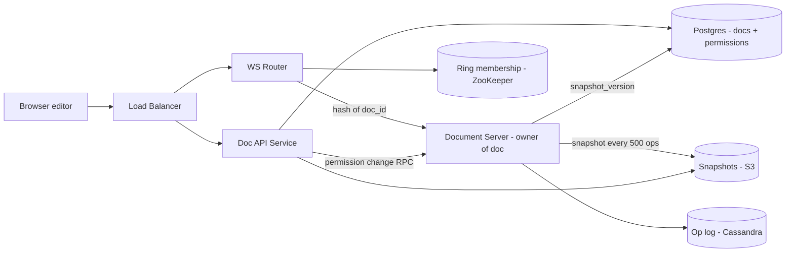
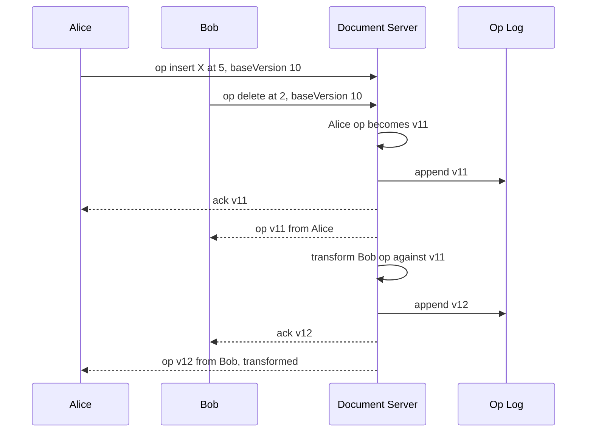

# Design Google Docs (Collaborative Editing)

**In one line:** many people edit the same document at the same time, everyone sees each other's changes in ~100ms, and in the end **everyone has exactly the same document**.

**What the interviewer checks in this question:** how you resolve conflicts between concurrent edits (OT vs CRDT), how you route WebSocket connections, and how you keep document history/storage.

---

## Step 1: Clarify with the interviewer (3–5 min)

| You ask | Typical answer | Impact on design |
|---|---|---|
| "Only text documents? Sheets/Slides out of scope?" | Only rich text | One data model: characters + formatting |
| "How many people edit one document at the same time, at most?" | ~100 editors, up to 1000 viewers | One doc will fit on one server |
| "How fast must edits show for others?" | < 200ms | We need WebSocket, not polling |
| "Do we need offline editing?" | Yes, basic | Pending ops queue on the client + rebase on reconnect |
| "Do we need version history and cursors/presence?" | Yes | Op log + snapshots, presence on a separate ephemeral channel |
| "Comments, suggestions mode, export to PDF?" | Out of scope | Mention them and move on |

> **Say:** "I will focus on real-time concurrent editing: every editor's change reaches everyone quickly, and everyone converges to the same final state. Along with that, presence, version history and permissions."

## Step 2: Requirements

**Functional**
1. Users should be able to create, open, edit and share a document (owner / editor / viewer)
2. Users should be able to edit the same doc at the same time and see each other's changes live
3. Users should be able to see others' cursors and "who is online"
4. Users should be able to see version history and restore an old version

**Out of scope:** comments, suggestions mode, PDF export, Sheets/Slides.

**Non-functional (in priority order)**
1. **Convergence:** all clients end up with exactly the same document
2. **Durability:** an acknowledged edit is never lost (0 acked-op loss)
3. **Latency:** p99 edit propagation < 200ms (same region), doc open p99 < 1s
4. **Availability:** 99.9% doc open. If the owner server goes down, failover < 5s
5. **Scale:** 100M DAU, ~10M concurrent WebSockets, ≤ 100 editors + 1000 viewers per doc

**CAP choice:** **consistency** for a doc's edits (only one owner orders them). During a partition, the old owner's writes are rejected, so edits pause for a few seconds but the doc never diverges. Presence and offline local edits sit on the **availability** side (eventual).

## Step 3: Estimation (only what changes the design)

- 100M DAU, ~10M documents open at peak → **~10M concurrent WebSockets**. One server ~50K connections → **~200+ WebSocket servers**.
- Typing: one active editor ~2–5 ops/sec. 10M active editors → **~20–50M ops/sec** in total, but only a few hundred ops/sec per doc. So the **per-doc** load is small, the total is big.
- One op ~100 bytes. A busy doc's op log grows to MBs in a month, so we need **snapshots** so that we do not replay the whole log on load.

> **Say:** "Total ops are very high, but the load on one document is small. So I will make the document the unit of sharding: all traffic for one doc goes to one server."

## Step 4: Core entities

- **Document**: doc_id, title, owner_id, latest_snapshot_version, created_at
- **Operation**: doc_id, version (monotonic), user_id, op (insert/delete/format at position), timestamp
- **Snapshot**: doc_id, version, full content (blob)
- **Permission**: doc_id, user_id, role (`OWNER`, `EDITOR`, `VIEWER`)
- **Presence** (ephemeral): doc_id, user_id, cursor position, color

## Step 5: APIs

```http
POST /docs                               → {docId}
GET  /docs/{docId}                        → {snapshot, version}
GET  /docs/{docId}/history?before=v500    → list of versions
POST /docs/{docId}/restore {version}      → new version
POST /docs/{docId}/share {userId, role}

WS   /docs/{docId}/live
  client → server: {type: "op", baseVersion: 120, op: {insert "a" at 15}}
  server → client: {type: "ack", version: 121}
  server → client: {type: "op", version: 122, op: {...}, userId}
  client ↔ server: {type: "cursor", pos: 40}
```

> **Say:** "With every op, the client sends its `baseVersion`, meaning the version it was looking at when it made the edit. From this the server knows which ops it missed in between and what to transform."

## Step 6: High-level design

**Start with a simple v1:** client → one Doc Service (WebSocket) → one Postgres. The service orders each doc's ops, writes them to an `operations` table and broadcasts to that doc's clients. This meets every FR. But **10M WebSockets** do not fit on one server (→ ~200 servers + doc_id routing), one Postgres cannot take **20–50M ops/sec** (→ Cassandra op log), and replaying a long log is slow (→ S3 snapshots).



**Why each component:**
- **WS Router:** maps `doc_id` to one Document Server with consistent hashing, so all editors of the same doc land on the **same server**. With a plain round-robin LB, editors would scatter across servers and we would need cross-server pub/sub + distributed ordering.
- **Document Server:** the single owner of that doc. It orders ops, runs the OT transform, assigns versions and broadcasts. **Presence also lives here in memory** (all editors are on this server), so no Redis is needed.
- **ZooKeeper/etcd:** ring membership + owner lease/epoch. It backs the "one doc = one owner" guarantee (the convergence NFR). Static config cannot fail over.
- **Op log (Cassandra):** **20–50M appends/sec** in total, `doc_id` partition, `version` clustering key. On Postgres this load means a lot of manual sharding.
- **Snapshots (S3):** the Document Server already holds the doc in memory, so it writes an async snapshot to S3 every 500 ops itself and updates `snapshot_version` in Postgres. **No Kafka + Snapshot Worker**: one producer, one consumer, no replay needed, so a queue would only be an extra hop.
- **Postgres:** doc metadata and permissions. Small data, relational, needs strong consistency.

**FR → component:** FR1 → Doc API + Postgres, FR2 → WS Router + Document Server + Cassandra, FR3 → Document Server memory, FR4 → S3 snapshots + Cassandra op log.

## Step 7: Main flow: two people typing at the same time



Bob's op was on `baseVersion 10`, but the server is now at v11. The server **transforms** Bob's op against Alice's op, then applies it. The client side runs the same transform for incoming ops too.

## Step 8: Data model & DB choice

```sql
-- Cassandra
operations(doc_id, version, user_id, op_blob, ts, PRIMARY KEY (doc_id, version))

-- Postgres
documents(doc_id PK, title, owner_id, snapshot_version, snapshot_url, updated_at)
permissions(doc_id, user_id, role, PRIMARY KEY (doc_id, user_id))
```

Doc load: get the latest snapshot from S3 + the ops after it from Cassandra with `WHERE doc_id = ? AND version > snapshot_version`. Only a few hundred ops need to be replayed.

## Step 9: Deep dives (where the interviewer will push)

### 9.1 OT vs CRDT: how will you resolve conflicts?
**NFR: convergence.**

Problem: the doc is "CAT". Alice inserts "S" at position 0 ("SCAT"). At the same time, Bob deletes position 2 ("T"). If Bob's op is applied as-is, we get "SCT", which is wrong. The correct result is "SCA".
- **OT (Operational Transformation):** the server applies ops in one order. It shifts a late op against the ops that came before it. Bob's "delete at 2" → Alice added 1 char before it, so it becomes "delete at 3". Simple idea: **adjust the position**.
- **CRDT:** every character gets a unique ID (like `userId + counter`) and position is decided by ID, not by index. Merge in any order and the result is the same. No central server needed.

**We choose OT** because we have a central owner server for each doc that gives us ordering. OT data stays small (plain text + ops). With CRDT, every character carries metadata and tombstones, so memory is 2–10x. Choose CRDT when peer-to-peer or offline-first is very heavy (some cases like Figma, Notion).

> **Say:** "Google Docs itself uses OT with a central server. Having a central server makes the hard part of OT (keeping transforms correct for all orderings) simple, because we only need client-server transforms."

**Trade-off:** OT is simple and light but depends on a central server. If you need true peer-to-peer/offline-first, pick CRDT.

### 9.2 Document server ownership and failover
**NFR: durability (no acked op lost) + failover < 5s.**

- Consistent hashing ring (membership in ZooKeeper/etcd). `hash(doc_id)` → owner server. All editors connect there.
- The owner server keeps the doc's current state + version in memory.
- Server dies → the ring updates, and the doc moves to a new server. The new server rebuilds the state from the snapshot + op log (a few hundred ms). Clients reconnect and resend their un-acked ops with `baseVersion`.
- The op log write happens **before the ack**. So an acked op is never lost.
- Op log writes check the owner's **epoch** (Cassandra LWT / conditional write). Even if the old owner is still alive, its writes are rejected.

**Trade-off:** edits on that doc pause for a few seconds during failover (consistency > availability), but the doc never diverges.

### 9.3 Offline edits
**NFR: availability (edit while offline) + convergence.**

- The client keeps a local queue of pending ops (IndexedDB). While offline, ops keep applying locally.
- On reconnect: fetch all ops after `baseVersion` from the server, transform your pending ops against them, then send. If the offline edits are very old (like 1 week), there are more conflicts, so show the user "conflicting changes".

**Trade-off:** the longer the user is offline, the costlier the rebase and the more surprising the result.

### 9.4 Cursors, presence and version history
**NFR: p99 < 200ms without filling the op log.**

- **Cursors:** `cursor` messages on the same WebSocket, but they **do not go into the op log**. Throttle them (~50ms). "Online users" = the open connections for that doc on the Document Server, in memory. On a server crash, clients reconnect and resend their presence.
- **Version history:** any version can be rebuilt from snapshots + ops. In the UI, do not show every op, show "groups of 5 min of edits" instead. Restore = apply the old content as new ops (history is not deleted).
- **Permissions:** check at WebSocket connect time and cache on the server. The server rejects ops from viewers. On a permission change, the Doc API finds the owner from the ring and sends it an RPC → the connection is downgraded. If the RPC is missed, the server's permission cache still refreshes on a 60s TTL.

**Trade-off:** presence disappears for a few seconds on a crash, but we skip Redis's extra hop and ops cost.

## Step 10: Decision table (what we chose, why, and what we did not)

| Decision | Why we chose it | What we did not choose, and why |
|---|---|---|
| **OT + central server** | The server gives ordering, small data, proven (Google Docs) | **CRDT:** an ID + tombstones per char, 2–10x memory. Sacrifice: we depend on the owner server, no true P2P |
| **WebSocket** | Bi-directional, low latency, both ops + cursors | **Polling:** too many requests for 200ms. **SSE:** server → client only. Sacrifice: sticky stateful connections, reconnect storm on deploy |
| **One doc = one owner (consistent hashing + ZooKeeper lease)** | Simple ordering, in-memory state, no distributed lock | **Any server for any doc:** distributed lock or DB ordering on every op. Sacrifice: a doc is edit-unavailable for a few seconds on failover, we run ZooKeeper |
| **Cassandra** for op log | 20–50M appends/sec, partition by doc_id, linear scale | **Postgres:** a lot of manual sharding. **Kafka as store:** per-doc range reads are awkward. Sacrifice: no joins, LWT for the epoch check (slower write) |
| **Snapshots in S3, written by the Document Server itself** | The state is already in memory, one hop less | **Kafka + Snapshot Worker:** one producer, one consumer, no replay needed, so just extra infra. Sacrifice: a bit of snapshot CPU on the owner server |
| **Presence in Document Server memory** | All editors are on the same server, cursors are temporary | **Redis:** extra hop + cost. **Cursor in the op log:** pollutes the log and history. Sacrifice: presence is gone until clients reconnect after a crash |
| **Postgres** for metadata + permissions | Small, relational, permission checks are strongly consistent | **Cassandra/DynamoDB:** sharing queries and transactions are hard. Sacrifice: single primary, scale with read replicas |

## Step 11: Failures & bottlenecks

| What failed | What happens | How to handle |
|---|---|---|
| Document server crash | Editors of that doc disconnect | New owner from the ring, rebuild from snapshot + log, clients reconnect and resend un-acked ops |
| Network partition, two servers think they are the owner | Two different orderings, split brain | Lease/fencing token: check the owner epoch on op log writes, reject writes from the old owner |
| Viral doc (10K viewers) | Broadcast load on one server | Send viewers to a read-only fan-out tier, editors stay on the owner |
| Op log is very long | Doc load is slow | Snapshot every 500 ops, old ops to cold storage |
| Snapshot write to S3 fails | Load is a bit slower, data is safe | The op log is the source of truth. Retry at the next 500 ops, replay the older snapshot + more ops |
| Client bug, wrong transform | The client's doc diverges | Periodic checksum compare. On mismatch, the client reloads a fresh snapshot |

## Step 12: How to make it better (say this yourself at the end)

> "If I had more time, I would improve these:"
- **Read-only fan-out tier:** separate broadcast servers for viewers of big docs, less load on the owner
- **Multi-region:** the doc's owner sits in the region with the most editors. Move the owner region (migration) when editors shift
- **Op compaction:** merge continuous inserts like "a", "b", "c" into one op to keep the log small
- **Suggestions mode and comments:** anchor comments to a text range, which keeps shifting with OT
- **End-to-end checksum** every N ops, so silent divergence is caught right away

## Step 13: Likely follow-up questions

- "The difference between OT and CRDT in simple words?" → OT adjusts positions and needs a central order. CRDT gives every char a unique ID, and merging in any order gives the same result
- "What if two people type at the same spot at the same time?" → the op the server receives first goes first. On a tie, a deterministic order by userId
- "Will edits be lost if the server crashes?" → acked ops are in the log, not lost. The client resends un-acked ones
- "What if 1 million people view one doc?" → read-only fan-out + CDN snapshot for viewers, editors are limited
- "How does undo work?" → build the inverse of the user's own last op and send it as a new op (with transform)
- "Why no Kafka?" → snapshots have a single consumer and need no replay. The owner server writes to S3 itself. We would consider Kafka once several consumers appear, like analytics or search indexing
- **Senior signal:** raise it yourself that the single owner is both the bottleneck and the risk: split brain during failover (epoch fencing on Cassandra writes) and a reconnect storm of millions of WebSockets on deploy/ring rebalance (graceful drain + jittered reconnect)

## 2-minute recap (read this before the interview)

> In Google Docs every document has one owner Document Server, chosen with consistent hashing (`hash(doc_id)`). All editors connect to that server over WebSocket. The client sends every op with a `baseVersion`. The server orders ops, transforms late ops with OT, appends to the Cassandra op log (Cassandra because of 20–50M ops/sec), then acks and broadcasts to everyone. We use OT because the central server gives ordering and we do not want CRDT's memory overhead. To load fast, the owner server itself writes a snapshot to S3 every 500 ops (no Kafka needed). Version history comes from snapshots + ops. Cursors/presence live in the owner server's memory, not in the op log (no Redis needed). Offline edits sit in a client queue and are rebased on reconnect. On a server crash, the new owner rebuilds from the log, and a fencing token prevents split brain.

## Checklist

- [ ] I can explain the OT "CAT" example by adjusting the position
- [ ] I can tell the difference between OT and CRDT and why we chose OT
- [ ] I can explain routing from doc_id to the owner server (consistent hashing)
- [ ] I can draw the HLD diagram in 5 min
- [ ] I can explain doc load and version history using op log + snapshots
- [ ] I can tell the recovery flow for a server crash and for offline edits
- [ ] I can tell 3 trade-offs from the decision table without looking
