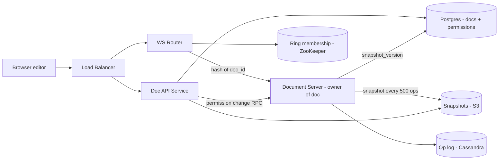
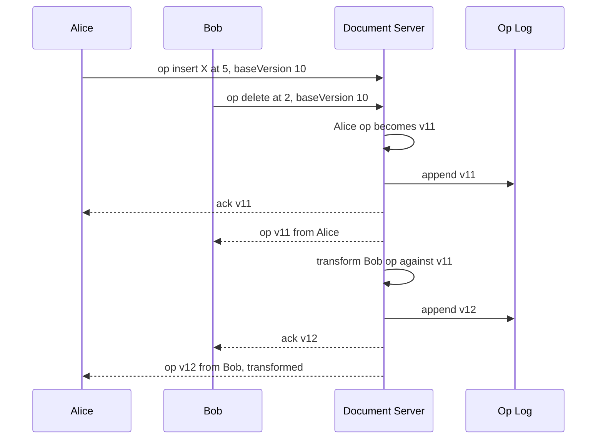

# Design Google Docs (Collaborative Editing)

**In one line:** many people edit one doc at once, changes reach everyone in ~100ms, and in the end **everyone has exactly the same document**.

**What the interviewer checks in this question:** concurrent edit conflicts (OT vs CRDT), WebSocket routing, document history/storage.

---

## Step 1: Clarify with the interviewer (3–5 min)

| You ask | Typical answer | Impact on design |
|---|---|---|
| "Only text docs? Sheets/Slides?" | Only rich text | One data model: characters + formatting |
| "Max editors on one doc?" | ~100 editors, 1000 viewers | One doc fits on one server |
| "How fast must edits show?" | < 200ms | WebSocket, not polling |
| "Offline editing?" | Yes, basic | Client pending ops queue + rebase on reconnect |
| "Version history, cursors/presence?" | Yes | Op log + snapshots, presence on a separate ephemeral channel |

> **Say:** "Focus on real-time concurrent editing: changes show fast, all converge to one state. Plus presence, history, permissions."

## Step 2: Requirements

**Functional**
1. Create, open, edit, share a doc (owner / editor / viewer)
2. Edit the same doc at once and see changes live
3. See others' cursors and "who is online"
4. View version history and restore an old version

**Out of scope:** comments, suggestions mode, PDF export, Sheets/Slides.

**Non-functional (in priority order)**
1. **Convergence:** all clients end up with exactly the same doc
2. **Durability:** an acknowledged edit is never lost (0 acked-op loss)
3. **Latency:** p99 edit propagation < 200ms (same region), doc open p99 < 1s
4. **Availability:** 99.9% doc open. Owner server down → failover < 5s
5. **Scale:** 100M DAU, ~10M concurrent WebSockets, ≤ 100 editors + 1000 viewers per doc

**CAP choice:** doc edits → **consistency** (one owner orders; in a partition the old owner's writes are rejected, edits pause but never diverge). Presence + offline local edits → **availability** (eventual).

## Step 3: Estimation (only what changes the design)

- 100M DAU, ~10M docs open at peak → **~10M concurrent WebSockets**. ~50K connections/server → **~200+ WebSocket servers**.
- Active editor ~2–5 ops/sec. 10M editors → **~20–50M ops/sec** total, but only a few hundred ops/sec per doc.
- Op ~100 bytes. A busy doc's log reaches MBs in a month → need **snapshots**, no full-log replay on load.

> **Say:** "Total ops are huge, per-doc load is small. So document = unit of sharding: one doc's traffic on one server."

## Step 4: Core entities

- **Document**: doc_id, title, owner_id, latest_snapshot_version, created_at
- **Operation**: doc_id, version (monotonic), user_id, op (insert/delete/format at position), timestamp
- **Snapshot**: doc_id, version, full content (blob)
- **Permission**: doc_id, user_id, role (`OWNER`, `EDITOR`, `VIEWER`)
- **Presence** (ephemeral): doc_id, user_id, cursor position, color

## Step 5: APIs

```http
POST /docs                               → {docId}
GET  /docs/{docId}                        → {snapshot, version}
GET  /docs/{docId}/history?before=v500    → list of versions
POST /docs/{docId}/restore {version}      → new version
POST /docs/{docId}/share {userId, role}

WS   /docs/{docId}/live
  client → server: {type: "op", baseVersion: 120, op: {insert "a" at 15}}
  server → client: {type: "ack", version: 121}
  server → client: {type: "op", version: 122, op: {...}, userId}
  client ↔ server: {type: "cursor", pos: 40}
```

> **Say:** "Each op carries the client's `baseVersion`. From it the server knows which ops were missed in between and what to transform against."

## Step 6: High-level design

**Simple v1:** client → one Doc Service (WebSocket) → one Postgres `operations` table + broadcast. Meets FRs. Where it breaks:
- **10M WebSockets** do not fit on one server → ~200 servers + doc_id routing
- **20–50M ops/sec** is too much for one Postgres → Cassandra op log
- Long log replay is slow → S3 snapshots



**Why each component:**
- **WS Router:** consistent hashing maps `doc_id` → one Document Server; all editors on the **same server**. Round-robin → cross-server pub/sub + distributed ordering.
- **Document Server:** single owner of the doc. Orders, OT-transforms, versions, broadcasts. **Presence lives here in memory too** (all editors are here), so no Redis.
- **ZooKeeper/etcd:** ring membership + owner lease/epoch → "one doc = one owner". Static config cannot fail over.
- **Op log (Cassandra):** **20–50M appends/sec**, `doc_id` partition, `version` clustering key. Postgres → lots of manual sharding.
- **Snapshots (S3):** doc already in memory → owner writes an async S3 snapshot every 500 ops + updates `snapshot_version`. **No Kafka**: one producer/consumer, no replay.
- **Postgres:** doc metadata + permissions. Small, relational, strongly consistent.

**FR → component:** FR1 → Doc API + Postgres, FR2 → WS Router + Document Server + Cassandra, FR3 → Document Server memory, FR4 → S3 snapshots + Cassandra op log.

## Step 7: Main flow: two people typing at the same time



Clients run the same transform on incoming ops.

## Step 8: Data model & DB choice

```sql
-- Cassandra
operations(doc_id, version, user_id, op_blob, ts, PRIMARY KEY (doc_id, version))

-- Postgres
documents(doc_id PK, title, owner_id, snapshot_version, snapshot_url, updated_at)
permissions(doc_id, user_id, role, PRIMARY KEY (doc_id, user_id))
```

Doc load: latest snapshot from S3 + `WHERE doc_id = ? AND version > snapshot_version` from Cassandra → only a few hundred ops replayed.

## Step 9: Deep dives (where the interviewer will push)

### 9.1 OT vs CRDT: how will you resolve conflicts?
**NFR: convergence.**

Problem: doc is "CAT". Alice inserts "S" at 0 ("SCAT"); Bob concurrently deletes position 2 ("T"). Applied as-is → "SCT" (wrong). Correct: "SCA".
- **OT (Operational Transformation):** server orders ops, shifts a late op against earlier ones: "delete at 2" → "delete at 3". Idea: **adjust the position**.
- **CRDT:** unique ID per char (`userId + counter`), position from ID, not index. Any merge order → same result, no central server.

**We choose OT:** the central owner gives ordering, data is small (text + ops). CRDT → per-char metadata + tombstones, 2–10x memory.

> **Say:** "Google Docs uses OT with a central server. The central server makes OT's hard part simple: only client-server transforms are needed."

**Trade-off:** OT is light but depends on a central server. Heavy P2P/offline-first (some cases like Figma, Notion) → CRDT.

### 9.2 Document server ownership and failover
**NFR: durability (no acked op lost) + failover < 5s.**

- Owner (`hash(doc_id)`, ring in ZooKeeper/etcd) keeps doc state + version in memory.
- Server dies → new owner rebuilds from snapshot + op log (a few hundred ms); clients resend un-acked ops with `baseVersion`.
- Op log write happens **before the ack** → an acked op is never lost.
- Op log writes check the owner **epoch** (Cassandra LWT / conditional write) → a still-alive old owner's writes are rejected.

**Trade-off:** edits pause a few seconds during failover (consistency > availability); the doc never diverges.

### 9.3 Offline edits
**NFR: availability (edit while offline) + convergence.**

- Client keeps a local queue of pending ops (IndexedDB); applies locally while offline.
- Reconnect: fetch ops after `baseVersion` → transform pending ops → send. Very old edits (1 week) → show "conflicting changes".

**Trade-off:** the longer offline, the costlier the rebase and the more surprising the result.

### 9.4 Cursors, presence and version history
**NFR: p99 < 200ms without filling the op log.**

- **Cursors:** same WebSocket, **not in the op log**, throttle ~50ms. "Online users" = open connections on the owner. Crash → presence resent on reconnect.
- **Version history:** any version from snapshots + ops. UI shows 5-min edit groups, not every op. Restore = old content applied as new ops (history kept).
- **Permissions:** checked on connect + server cache; viewer ops rejected. Change → Doc API RPCs the owner → connection downgraded. RPC missed → cache refreshes on a 60s TTL.

## Step 10: Decision table (what we chose, why, and what we did not)

| Decision | Why we chose it | What we did not choose, and why |
|---|---|---|
| **OT + central server** | Server ordering, small data, proven | **CRDT:** 2–10x memory. Sacrifice: owner dependency, no true P2P |
| **WebSocket** | Bi-directional, low latency | **Polling:** too many requests. **SSE:** server → client only. Sacrifice: sticky connections, reconnect storm on deploy |
| **One doc = one owner (hashing + ZooKeeper lease)** | Simple ordering, in-memory state, no lock | **Any server:** lock/DB ordering per op. Sacrifice: few seconds edit-unavailable on failover, run ZooKeeper |
| **Cassandra** for op log | 20–50M appends/sec, doc_id partition, linear scale | **Postgres:** manual sharding. **Kafka as store:** per-doc range reads awkward. Sacrifice: no joins, LWT epoch check (slower write) |
| **Snapshots in S3, written by the owner** | State in memory, one hop less | **Kafka + Snapshot Worker:** extra infra. Sacrifice: some CPU on the owner |
| **Presence in owner memory** | Editors on one server, cursors temporary | **Redis:** hop + cost. **In op log:** pollutes history. Sacrifice: gone until reconnect after crash |
| **Postgres** for metadata + permissions | Small, relational, strongly consistent | **Cassandra/DynamoDB:** sharing queries, transactions hard. Sacrifice: single primary, read replicas |

## Step 11: Failures & bottlenecks

| What failed | What happens | How to handle |
|---|---|---|
| Crash / split brain | Editors disconnect, two owners | See 9.2: rebuild + resend, epoch fencing |
| Viral doc (10K viewers) | Broadcast load on one server | Viewers on read-only fan-out tier, editors on owner |
| Op log long | Load slow | 500-op snapshots, old ops to cold storage |
| S3 snapshot write fails | Load a bit slower, data safe | Op log is source of truth; retry at next 500 ops, meanwhile replay older snapshot + more ops |
| Client bug, wrong transform | Client doc diverges | Periodic checksum; on mismatch reload fresh snapshot |

## Step 12: How to make it better (say this yourself at the end)

> "If I had more time, I would improve these:"
- **Multi-region:** owner in the region with most editors; migrate when editors shift
- **Op compaction:** merge "a", "b", "c" inserts into one op, smaller log
- **Comments/suggestions:** text-range anchor, shifts with OT
- **End-to-end checksum** every N ops, catch silent divergence fast

## Step 13: Likely follow-up questions

- "Two people type at the same spot at once?" → op received first goes first; ties broken deterministically by userId
- "Edits lost on a crash?" → acked ones are in the log; client resends un-acked
- "1 million viewers on one doc?" → read-only fan-out + CDN snapshot for viewers, editors limited
- "Undo?" → send the inverse of your last op as a new op (with transform)
- "Why no Kafka?" → one consumer, no replay. Kafka once several consumers appear (analytics, search)
- **Senior signal:** raise it yourself that the single owner is both the bottleneck and the risk: split brain during failover (epoch fencing on Cassandra writes) and a reconnect storm of millions of WebSockets on deploy/ring rebalance (graceful drain + jittered reconnect)

## 2-minute recap (read this before the interview)

> `hash(doc_id)` picks one owner Document Server per doc; editors connect there over WebSocket. Ops carry `baseVersion`; server orders + OT-transforms, appends to Cassandra (20–50M ops/sec), acks, broadcasts. OT since ordering is central, no CRDT memory overhead. Owner writes an S3 snapshot every 500 ops (no Kafka). History = snapshot + ops. Presence in owner memory (no Redis). Offline → client queue, rebased on reconnect. Crash → new owner rebuilds from the log; a fencing token stops split brain.

## Checklist

- [ ] I can explain the OT "CAT" example by adjusting the position
- [ ] I can tell the difference between OT and CRDT and why we chose OT
- [ ] I can explain routing from doc_id to the owner server (consistent hashing)
- [ ] I can draw the HLD diagram in 5 min
- [ ] I can explain doc load and version history using op log + snapshots
- [ ] I can tell the recovery flow for a server crash and for offline edits
- [ ] I can tell 3 trade-offs from the decision table without looking
