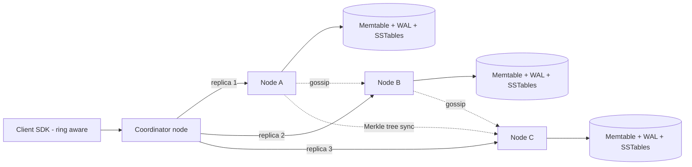
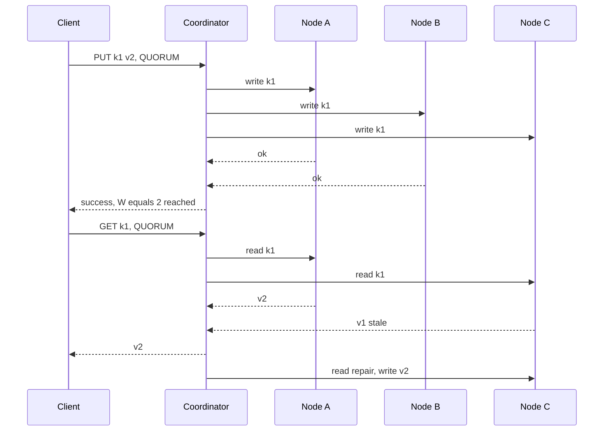

# Design a Distributed Key-Value Store / Distributed Cache

**In one line:** Run `put(key, value)` and `get(key)` across thousands of machines so that data is **never lost**, the system keeps working when a machine dies, and latency stays in single-digit ms (like DynamoDB / Cassandra / Redis Cluster).

**What the interviewer checks in this question:** how you split data across nodes (consistent hashing), the math of replication and quorum, the CAP trade-off, and how the system heals itself when nodes fail or join.

---

## Step 1: Clarify with the interviewer (3–5 min)

| You ask | Typical answer | Effect on design |
|---|---|---|
| "Persistent store (DynamoDB) or cache (Redis/Memcached)?" | Store first, also cover the cache variant | Store needs durability + replication. Cache needs eviction + TTL |
| "What consistency do we need: strong or eventual?" | Tunable, eventual by default | Quorum N/R/W is configurable |
| "Key and value size?" | Key < 256B, value < 1MB | Simple KV, no queries or indexes |
| "Scale?" | ~100TB data, 1M QPS, read:write 4:1 | Sharding + many nodes |
| "Do we need multi-datacenter?" | Yes, it must work even if one DC fails | Replicas in different racks/DCs |
| "Range scans, transactions?" | No | Hash partitioning is fine |

> **Say:** "I will build a Dynamo-style leaderless design: partitioning with consistent hashing, N replicas, and tunable R/W quorum. This keeps availability high and lets the client choose its consistency."

## Step 2: Requirements

**Functional**
1. Clients should be able to `put(key, value)`, `get(key)`, `delete(key)`
2. Clients should be able to set an optional TTL per key
3. Clients should be able to choose the consistency level per request (ONE, QUORUM, ALL)

**Out of scope:** range scans, transactions, secondary indexes, multi-key ops.

**Non-functional (in priority order)**
1. **Availability:** 99.99% for reads/writes, even with a node, rack or AZ down
2. **Durability:** an acked write is never lost (N=3, different AZs)
3. **Latency:** p99 < 10ms (same DC)
4. **Scale:** 100TB, 1M QPS, read:write 4:1. Add nodes and data rebalances by itself
5. **Self-healing:** failures happen daily, no manual fixes

**CAP choice:** **AP** by default (like Dynamo): accept writes on both sides of a partition and converge later. A request that needs consistency asks for QUORUM/ALL and pays in latency/availability.

## Step 3: Estimation (only what changes the design)

- 100TB data, replication factor 3 → **300TB raw**. One node has ~2TB SSD → **~150 nodes**.
- 1M QPS = 800K reads + 200K writes. At QUORUM a read goes to 2 replicas and a write to 3 → ~2.2M replica ops/sec / 150 ≈ **~15K ops/sec per node**. Easy with SSD + memory cache.
- With 150 nodes, some node will fail every day. So **failure is the normal case**, not an exception.

> **Say:** "With this many nodes, failures happen daily, so failure detection, hinted handoff and repair must be built into the design. No manual steps."

## Step 4: Core entities

- **Key / Value**: key, value bytes, version (vector clock or timestamp), TTL, tombstone flag
- **Node**: node_id, address, tokens (vnodes), status (UP, DOWN, JOINING)
- **Ring**: token → node mapping, every node has the same copy (via gossip)
- **Hint**: target_node, key, value, version (when a replica is down)

## Step 5: APIs

```http
PUT    /kv/{key}   {value, ttl?}   Header: Consistency: QUORUM   → {version}
GET    /kv/{key}                   Header: Consistency: ONE      → {value, version} or conflicting versions
DELETE /kv/{key}                                                 → tombstone written
```

> **Say:** "If we use vector clocks, `get` can return multiple conflicting versions, and the client merges them and writes the result back with the context in the next `put`."

## Step 6: High-level design

**Start with a simple v1:** one node, an in-memory hash map + a WAL on disk. It meets all three FRs. But **100TB** does not fit on one machine (→ partitioning with consistent hashing), a node dying loses data and availability (→ N=3 replicas in different AZs), membership of **150 nodes** through one master is a bottleneck (→ gossip), and replicas drift (→ hinted handoff + Merkle repair).



**Why each component:**
- **Client SDK / Coordinator:** hashes the key and finds the owner nodes on the ring. Any node can be the coordinator (leaderless), which serves the 99.99% availability NFR. No separate "router tier": that would be one more hop and one more fleet.
- **Consistent hashing ring with vnodes:** splits 100TB across 150 nodes. Each node takes ~256 tokens. With **hash mod N**, adding a node moves almost all data; here only ~1/N moves.
- **Storage engine (LSM tree):** WAL (durability) → memtable → SSTables. 200K writes/sec × 3 replicas become sequential appends. Bloom filters + a row cache keep reads fast.
- **Gossip:** membership and health for 150 nodes without a central master. ZooKeeper for every heartbeat would be a bottleneck/SPOF.
- **Merkle tree sync:** fixes replicas after daily failures without a full scan (the self-healing NFR).

**FR → component:** FR1 → coordinator + ring + LSM storage, FR2 → TTL stored with the value, checked on read, purged in compaction, FR3 → the coordinator's R/W quorum logic.

## Step 7: Main flow: quorum write and read



N=3, W=2, R=2. **R + W > N** (2+2 > 3), so the read set and the write set share at least one node, and that node has the latest value.

## Step 8: Data model & DB choice

LSM-tree storage on every node:
```
WAL (append-only log on disk)   → crash recovery
Memtable (sorted, in memory)    → recent writes
SSTables (immutable, on disk)   → after flush, with bloom filter + index
Compaction                      → merge old SSTables, remove tombstones
```

Read path: memtable → bloom filter check → SSTable. The bloom filter can say "this key is definitely not in this SSTable", which saves disk reads.

## Step 9: Deep dives (where the interviewer will push)

### 9.1 Consistent hashing + vnodes + replication
**NFR: scale (rebalances by itself) + availability (rack/AZ loss).**

- `hash(key)` is a point on the ring. The first node clockwise = owner. The next **N-1 distinct physical nodes** = replicas (preference list).
- **Why vnodes:** without vnodes, all of a node's load goes to just one neighbour. With vnodes, data and load spread across all nodes, and a bigger node can take more tokens.
- Put replicas in **different racks/AZs** (rack-aware placement), so one rack going down does not take out all replicas.

**Trade-off:** vnodes make rebalancing smooth, but ring metadata grows and repair has to compare more ranges.

### 9.2 Quorum and tunable consistency
**NFR: p99 < 10ms vs consistency, per request.**

| Setting | Meaning | Use case |
|---|---|---|
| W=1, R=1 | Fastest, stale reads possible | Cache, analytics counters |
| W=2, R=2 (N=3) | R+W>N, you get the latest read (in the normal case) | Default |
| W=3, R=1 | Fast reads, slow/fragile writes | Read-heavy config data |
| W=1, R=3 | Fast writes | Write-heavy logs |

> **Say:** "Quorum behaves like strong consistency, but with sloppy quorum and concurrent writes it is not linearizable. If we truly need linearizability, we need a Raft-based leader per shard, like etcd or Spanner."

**Trade-off:** at QUORUM every request waits for 2 replicas, so p99 depends on the slower of the two.

### 9.3 Conflicts: vector clocks vs last-write-wins
**NFR: durability (a valid write must not be silently lost under concurrent writes).**

- **LWW (timestamp):** simple. The bigger timestamp wins. Problem: clock skew can silently lose a valid write. Cassandra does this.
- **Vector clocks:** every write carries `{nodeA: 3, nodeB: 1}`. If one clock is bigger than the other, it is newer. If they cannot be compared, it is a **conflict**: give both versions to the client and let it merge (like a shopping cart union). This is the Dynamo paper approach.
- **Choice:** LWW by default (simple, fine for most use cases), and vector clocks or CRDT counters/sets where data must never be lost (cart).

**Trade-off:** with LWW we accept a rare silent loss on clock skew in exchange for simplicity.

### 9.4 Handling failures: hinted handoff, read repair, anti-entropy, gossip
**NFR: availability + self-healing (150 nodes, daily failures).**

- **Gossip + failure detection:** every node gossips heartbeat counters. If a node's counter does not increase for ~10s, mark it SUSPECT/DOWN. A phi-accrual detector reduces false alarms.
- **Hinted handoff (temporary failure):** if Node C is down, the write goes to Node D with a "hint" (sloppy quorum). When C comes back, D delivers the hint. Availability is kept.
- **Read repair:** if a stale replica is found during a read, the coordinator writes the latest value to it (Step 7).
- **Anti-entropy with Merkle trees (long failure):** each node builds a Merkle tree for its key range (leaf = hash of keys, parent = hash of children). Two replicas compare the root. Same means done. Different means go down only into the subtree that differs. Only the different ranges are synced, without comparing all the data.
- **Delete:** write a tombstone, do not delete right away. Otherwise, during repair the old value will "come back to life". Remove the tombstone in compaction after `gc_grace` (like 10 days).

**Trade-off:** sloppy quorum raises availability, but during that time the R+W>N overlap guarantee breaks (stale reads possible).

### 9.5 Cache variant (like Redis/Memcached) and hot keys
**NFR: sub-ms latency, and one hot key must not take down a node.**

- Data lives in memory, disk is optional. Replication is small (1 replica) or none.
- **Eviction:** when memory is full use **LRU** (or approximate LRU sampling, like Redis), TTL expiry is lazy (checked on access) + periodic sampling. Use LFU when some keys are always hot.
- **Hot key** (like the IPL final score key): all load lands on one node. Fix: client-side local cache (1–2 sec), replicate the key as `score#1..score#10` and read a random one, or add more read replicas for that key.

**Trade-off:** a cache gives up durability for speed. If a node is lost, cold misses fall on the DB.

## Step 10: Decision table (what we chose, why, what we did not)

| Decision | Why we chose it | What we did not choose, and why |
|---|---|---|
| **Consistent hashing + vnodes** | Only ~1/N data moves when a node is added/removed, even load | **hash mod N:** if node count changes, almost all data reshuffles. **Range partitioning:** hotspots, and we do not need range scans. Sacrifice: range scans are impossible |
| **Leaderless replication, N=3** | Any replica can take a write, 99.99% availability | **Single leader per shard (Raft):** if the leader is down, writes stop until failover. Sacrifice: no linearizability, conflicts must be resolved |
| **Tunable quorum R/W** | Each use case picks its own latency vs consistency | **Fixed ALL:** one slow node makes everything slow. **Fixed ONE:** stale reads always possible. Sacrifice: clients must understand the trade-off |
| **LWW default, vector clocks optional** | LWW is simple and cheap. Vector clocks for critical data | **Only vector clocks:** every client must write merge logic. Sacrifice: rare silent loss on clock skew |
| **Gossip membership** | Decentralized, scales to 150+ nodes | **ZooKeeper for every heartbeat:** bottleneck and SPOF. Sacrifice: membership changes reach everyone in seconds, not instantly |
| **Merkle tree anti-entropy** | Syncs only the different ranges, less network | **Full data compare:** transferring TBs. Sacrifice: CPU/IO to build trees, repair must run periodically |
| **LSM tree storage** | 600K replica writes/sec as sequential appends, bloom filters keep reads fine | **B-tree:** valid for read-heavy loads (reads are 4:1), but random writes and page splits. Sacrifice: compaction IO and read amplification |

## Step 11: Failures & bottlenecks

| What failed | What happens | How to handle it |
|---|---|---|
| One node down for a few minutes | It misses writes | Hinted handoff + sloppy quorum, replay hints when it comes back |
| Node gone forever | Replicas drop from 3 to 2 | New node joins, vnode ranges stream to it, verify with Merkle trees |
| Network partition | Writes on both sides, conflicts | In AP mode accept both, resolve later with LWW or vector clocks |
| Hot key | One node overloaded | Client cache, key splitting, extra read replicas |
| Compaction storm | Latency spike | Throttle compaction, schedule off-peak |
| Clock skew | Wrong write wins under LWW | NTP monitoring, vector clocks on critical keys |

## Step 12: How to make it better (say this yourself at the end)

> "If I had more time, I would improve these:"
- **Strong consistency mode:** a Raft group per shard, for keys that need linearizability (like locks, counters)
- **Multi-DC:** `LOCAL_QUORUM` so a write waits only for the local DC quorum, remote is async
- **Speculative reads:** for p99, if one replica is slow, send the request to another too and take whichever answers first
- **Tiered storage:** cold keys on S3, hot keys on SSD/memory, lower cost
- **Observability:** per-node p99, hinted handoff queue size, repair lag, hot key detection dashboard

## Step 13: Likely follow-up questions

- "Why R + W > N?" → the read and write sets overlap, so at least one node returns the latest value
- "Where is this in CAP?" → AP by default. Available during a partition, converges later. You can move towards CP with W=ALL/R=ALL
- "How does a new node join?" → announces itself via gossip, takes tokens, streams ranges from neighbour nodes, then starts serving reads
- "Why does data come back after a delete?" → no tombstone was kept, or it was removed before gc_grace, and repair copied the old value back
- "Difference between Redis Cluster and Dynamo?" → Redis Cluster has 16384 hash slots with one master per slot (leader-based), Dynamo uses a leaderless quorum
- **Senior signal:** say it yourself that QUORUM is not "strong": with sloppy quorum + LWW, stale or lost writes are possible. And repair debt: if anti-entropy does not run on every replica within `gc_grace`, deleted data comes back, so put repair lag on an alert

## 2-minute recap (read this before the interview)

> In a distributed KV store, data is split on a consistent hashing ring, and each node takes ~256 vnodes so load stays even and rebalancing is small. Each key lives on N=3 replicas, in different racks. Leaderless: any node can be the coordinator. Tunable quorum: R + W > N gives the latest read (not guaranteed under sloppy quorum), W=1/R=1 gives speed. AP by default. For conflicts, last-write-wins by default, and vector clocks for data like a cart. Failures are normal: gossip for detection, hinted handoff for temporary failures, read repair at read time, and Merkle tree anti-entropy in the background. Storage is an LSM tree: WAL, memtable, SSTables, bloom filter. Deletes use tombstones. The cache variant uses LRU eviction + TTL, and hot keys are handled with a client cache or key splitting.

## Checklist

- [ ] I can explain consistent hashing + vnodes and replica placement
- [ ] I can explain the R + W > N logic with an example
- [ ] I can tell the trade-off between LWW and vector clocks
- [ ] I can tell the difference between hinted handoff, read repair and Merkle tree anti-entropy
- [ ] I can explain failure detection with gossip
- [ ] I can draw the HLD diagram in 5 min
- [ ] I can explain eviction and hot key handling in the cache variant
- [ ] I can say 3 trade-offs from the decision table without looking
