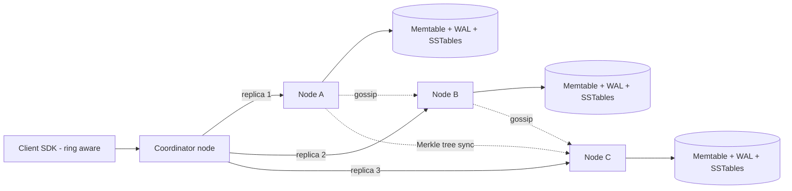
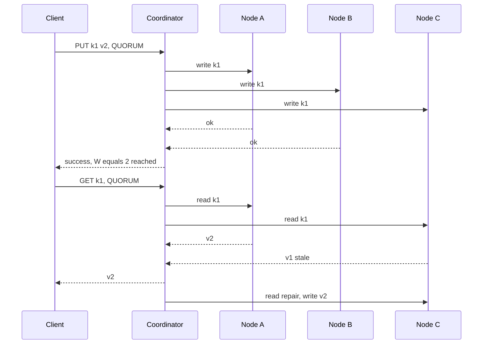

# Design a Distributed Key-Value Store / Distributed Cache

**In one line:** `put(key, value)` / `get(key)` across thousands of machines: data **never lost**, keeps working when a machine dies, single-digit ms latency (like DynamoDB / Cassandra / Redis Cluster).

**What the interviewer checks in this question:** partitioning (consistent hashing), replication + quorum math, the CAP trade-off, self-healing when nodes fail/join.

---

## Step 1: Clarify with the interviewer (3–5 min)

| You ask | Typical answer | Effect on design |
|---|---|---|
| "Store (DynamoDB) or cache (Redis)?" | Store first, cache variant too | Store: durability + replication. Cache: eviction + TTL |
| "Strong or eventual consistency?" | Tunable, eventual by default | Quorum N/R/W configurable |
| "Key/value size?" | Key < 256B, value < 1MB | Simple KV, no queries/indexes |
| "Scale?" | ~100TB, 1M QPS, read:write 4:1 | Sharding + many nodes |
| "Multi-datacenter?" | Yes, must survive one DC failing | Replicas in different racks/DCs |
| "Range scans, transactions?" | No | Hash partitioning is fine |

> **Say:** "Dynamo-style leaderless design: consistent hashing, N replicas, tunable R/W quorum. High availability, client picks consistency."

## Step 2: Requirements

**Functional**
1. `put(key, value)`, `get(key)`, `delete(key)`
2. Optional TTL per key
3. Consistency level per request (ONE, QUORUM, ALL)

**Out of scope:** range scans, transactions, secondary indexes, multi-key ops.

**Non-functional (in priority order)**
1. **Availability:** 99.99% reads/writes, even with a node/rack/AZ down
2. **Durability:** an acked write is never lost (N=3, different AZs)
3. **Latency:** p99 < 10ms (same DC)
4. **Scale:** 100TB, 1M QPS, read:write 4:1. New nodes → auto rebalance
5. **Self-healing:** failures happen daily, no manual fixes

**CAP choice:** **AP** by default (Dynamo): accept writes on both sides of a partition, converge later. Consistency → QUORUM/ALL (W=ALL/R=ALL → towards CP), paid in latency/availability.

## Step 3: Estimation (only what changes the design)

- 100TB × RF 3 → **300TB raw**. ~2TB SSD/node → **~150 nodes**.
- 1M QPS = 800K reads + 200K writes. QUORUM: read → 2 replicas, write → 3 → ~2.2M replica ops/sec / 150 ≈ **~15K ops/sec/node**. Easy with SSD + memory cache.
- 150 nodes → some node fails daily. **Failure is the normal case**, not an exception.

> **Say:** "Failures are daily, so detection, hinted handoff and repair are built in, no manual steps."

## Step 4: Core entities

- **Key / Value**: key, value bytes, version (vector clock or timestamp), TTL, tombstone flag
- **Node**: node_id, address, tokens (vnodes), status (UP, DOWN, JOINING)
- **Ring**: token → node mapping, every node has the same copy (via gossip)
- **Hint**: target_node, key, value, version (when a replica is down)

## Step 5: APIs

```http
PUT    /kv/{key}   {value, ttl?}   Header: Consistency: QUORUM   → {version}
GET    /kv/{key}                   Header: Consistency: ONE      → {value, version} or conflicting versions
DELETE /kv/{key}                                                 → tombstone written
```

> **Say:** "With vector clocks, `get` can return conflicting versions; the client merges them and writes back with the context in the next `put`."

## Step 6: High-level design

**Simple v1:** one node, in-memory hash map + WAL on disk. Meets the FRs. Where it breaks:
- **100TB** does not fit one machine → consistent hashing partitioning
- Node dies → data + availability lost → N=3 replicas in different AZs
- **150 nodes** of membership via one master is a bottleneck → gossip
- Replicas drift → hinted handoff + Merkle repair



**Why each component:**
- **Client SDK / Coordinator:** key hash → owner nodes. Any node can coordinate → 99.99%. No router tier: extra hop + fleet.
- **Consistent hashing ring + vnodes:** 100TB → 150 nodes, ~256 tokens/node. **hash mod N** → adding a node moves almost all data; here only ~1/N.
- **LSM tree:** 200K writes/sec × 3 → sequential appends. Reads: bloom filters + row cache.
- **Gossip:** membership/health for 150 nodes without a master (ZooKeeper → bottleneck/SPOF).
- **Merkle tree sync:** fixes replicas without a full scan (self-healing).

**FR → component:** FR1 → coordinator + ring + LSM, FR2 → TTL stored with the value (checked on read, purged in compaction), FR3 → coordinator quorum logic.

## Step 7: Main flow: quorum write and read



N=3, W=2, R=2 → **R + W > N** (2+2 > 3) → read and write sets share at least one node, which has the latest value.

## Step 8: Data model & DB choice

LSM-tree storage on every node:
```
WAL (append-only log on disk)   → crash recovery
Memtable (sorted, in memory)    → recent writes
SSTables (immutable, on disk)   → after flush, with bloom filter + index
Compaction                      → merge old SSTables, remove tombstones
```

Read path: memtable → bloom filter ("definitely not here" → skip disk read) → SSTable.

## Step 9: Deep dives (where the interviewer will push)

### 9.1 Consistent hashing + vnodes + replication
**NFR: scale (auto rebalance) + availability (rack/AZ loss).**

- `hash(key)` → first node clockwise = owner, next **N-1 distinct physical nodes** = replicas (preference list).
- **Vnodes:** without them, a dead node's load lands on one neighbour. With vnodes it spreads across all; bigger nodes take more tokens.
- **Rack-aware placement:** replicas in different racks/AZs, so one rack cannot take all of them.

**Trade-off:** smooth rebalancing, but bigger ring metadata and more ranges to compare during repair.

### 9.2 Quorum and tunable consistency
**NFR: p99 < 10ms vs consistency, per request.**

| Setting | Meaning | Use case |
|---|---|---|
| W=1, R=1 | Fastest, stale reads possible | Cache, analytics counters |
| W=2, R=2 (N=3) | R+W>N, latest read (normal case) | Default |
| W=3, R=1 | Fast reads, slow/fragile writes | Read-heavy config data |
| W=1, R=3 | Fast writes | Write-heavy logs |

> **Say:** "Quorum looks strong, but with sloppy quorum + concurrent writes it is not linearizable. For that we need a per-shard Raft leader (etcd, Spanner)."

**Trade-off:** at QUORUM, p99 = the slower of two replicas.

### 9.3 Conflicts: vector clocks vs last-write-wins
**NFR: durability (a valid write must not be silently lost under concurrent writes).**

- **LWW (timestamp, Cassandra):** bigger timestamp wins. Simple, but clock skew → a valid write silently lost.
- **Vector clocks (Dynamo paper):** each write carries `{nodeA: 3, nodeB: 1}`. One bigger → newer. Incomparable → **conflict**: client merges both versions (cart union).
- **Choice:** LWW by default; where loss is unacceptable (cart) → vector clocks or CRDT counters/sets.

### 9.4 Failures: hinted handoff, read repair, anti-entropy, gossip
**NFR: availability + self-healing (150 nodes, daily failures).**

- **Gossip detection:** nodes gossip heartbeat counters; no increase for ~10s → SUSPECT/DOWN. Phi-accrual → fewer false alarms.
- **Hinted handoff (temporary failure):** C down → write goes to D with a "hint" (sloppy quorum); C returns → D delivers the hint.
- **Read repair:** stale replica found on read → coordinator writes the latest value (Step 7).
- **Merkle anti-entropy (long failure):** leaf = hash of keys, parent = hash of children. Compare roots → descend only into differing subtrees → sync only diff ranges.
- **Delete:** write a tombstone, or repair brings the old value "back to life". Remove it in compaction after `gc_grace` (like 10 days).

**Trade-off:** sloppy quorum → higher availability, but the R+W>N overlap breaks (stale reads possible).

### 9.5 Cache variant (like Redis/Memcached) and hot keys
**NFR: sub-ms latency, one hot key must not take down a node.**

- In memory, disk optional, replication 1 or none.
- **Eviction:** **LRU** (Redis: approximate sampling); always-hot keys → LFU. TTL expiry lazy (on access) + periodic sampling.
- **Hot key** (IPL final score) → all load on one node. Fix: client cache (1–2 sec), replicate as `score#1..score#10` + random read, or more read replicas.

**Trade-off:** durability traded for speed. Node lost → cold misses hit the DB.

## Step 10: Decision table (what we chose, why, what we did not)

| Decision | Why we chose it | What we did not choose, and why |
|---|---|---|
| **Consistent hashing + vnodes** | ~1/N data moves, even load | **hash mod N:** full reshuffle. **Range partitioning:** hotspots. Sacrifice: no range scans |
| **Leaderless, N=3** | Any replica takes writes, 99.99% | **Raft leader per shard:** writes stop until failover. Sacrifice: no linearizability, resolve conflicts |
| **Tunable quorum R/W** | Each use case picks latency vs consistency | **ALL:** one slow → all slow. **ONE:** stale. Sacrifice: clients must understand trade-off |
| **LWW default, vector clocks optional** | Simple, cheap; vector clocks for critical data | **Only vector clocks:** every client writes merge logic. Sacrifice: rare silent loss on skew |
| **Gossip membership** | Decentralized, scales to 150+ nodes | **ZooKeeper per heartbeat:** bottleneck, SPOF. Sacrifice: changes take seconds to spread |
| **Merkle tree anti-entropy** | Syncs only differing ranges, less network | **Full compare:** TBs transferred. Sacrifice: tree CPU/IO, periodic repair |
| **LSM tree storage** | 600K replica writes/sec sequential, bloom filter reads | **B-tree:** valid for 4:1 reads, but random writes + page splits. Sacrifice: compaction IO, read amplification |

## Step 11: Failures & bottlenecks

| What failed | What happens | How to handle it |
|---|---|---|
| Node gone forever | Replicas 3 → 2 | New node joins, ranges stream, Merkle verify |
| Compaction storm | Latency spike | Throttle, schedule off-peak |
| Clock skew | Wrong write wins under LWW | NTP monitoring, vector clocks on critical keys |

## Step 12: How to make it better (say this yourself at the end)

> "If I had more time, I would improve these:"
- **Strong consistency mode:** per-shard Raft group for linearizable keys (locks, counters)
- **Multi-DC:** `LOCAL_QUORUM`: wait only for the local DC quorum, remote async
- **Speculative reads:** slow replica → also ask another (p99)
- **Tiered storage:** cold keys on S3, hot on SSD/memory, lower cost
- **Observability:** per-node p99, hint queue size, repair lag, hot key detection

## Step 13: Likely follow-up questions

- "How does a new node join?" → gossip announce → tokens → stream ranges from neighbours → serve reads
- "Why does data come back after a delete?" → no tombstone, or removed before gc_grace; repair copied the old value back
- "Redis Cluster vs Dynamo?" → Redis: 16384 hash slots, one master per slot (leader-based). Dynamo: leaderless quorum
- **Senior signal:** say it yourself that QUORUM is not "strong": with sloppy quorum + LWW, stale or lost writes are possible. And repair debt: if anti-entropy does not run on every replica within `gc_grace`, deleted data comes back, so put repair lag on an alert

## 2-minute recap (read this before the interview)

> Ring + ~256 vnodes/node, N=3 replicas in different racks, leaderless coordinator. R + W > N → latest read (not under sloppy quorum), W=1/R=1 → speed. AP by default. Conflicts: LWW, vector clocks for a cart. Failures: gossip, hinted handoff, read repair, Merkle anti-entropy. LSM: WAL, memtable, SSTables, bloom filter. Deletes = tombstones. Cache: LRU + TTL; hot keys → client cache / key splitting.

## Checklist

- [ ] I can explain consistent hashing + vnodes and replica placement
- [ ] I can explain the R + W > N logic with an example
- [ ] I can tell the trade-off between LWW and vector clocks
- [ ] I can tell the difference between hinted handoff, read repair and Merkle tree anti-entropy
- [ ] I can explain failure detection with gossip
- [ ] I can draw the HLD diagram in 5 min
- [ ] I can explain eviction and hot key handling in the cache variant
- [ ] I can say 3 trade-offs from the decision table without looking
