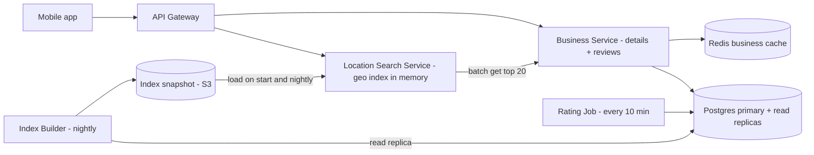
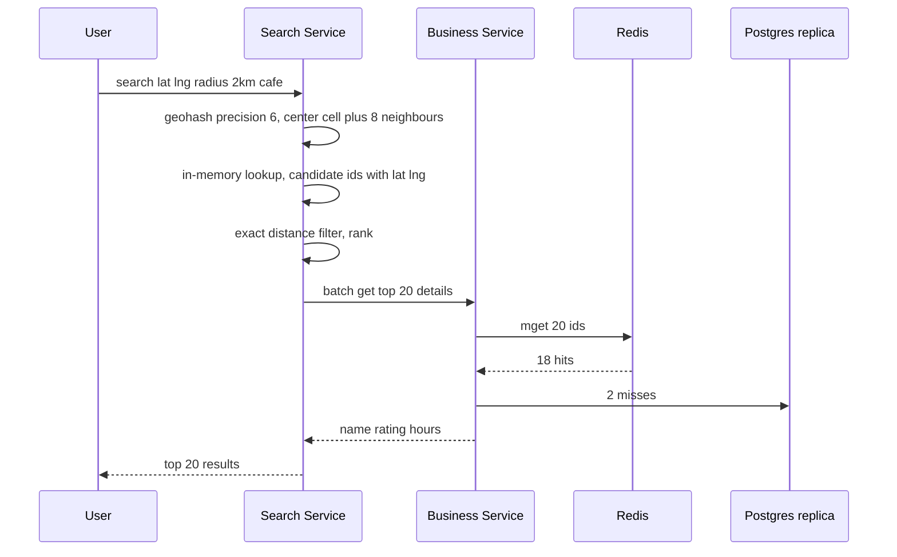

# Design Yelp / Nearby Places (Proximity Service)

**In one line:** Find restaurants/shops near the user's location ("coffee shops within 2km of me"), ranked by distance and rating. Business data **changes very rarely**, but searches happen **a lot**.

**What the interviewer checks in this question:** the geospatial index (geohash vs quadtree), caching in a read-heavy system, expanding the radius, and ranking.

---

## Step 1: Clarify with the interviewer (3–5 min)

| You ask | Typical answer | Effect on design |
|---|---|---|
| "Core feature: nearby search by location + radius, and a business detail page?" | Yes | Two main APIs: search and detail |
| "How often do business owners update info? Must it show instantly?" | Rarely, next day is fine | Geo index can be rebuilt in batch |
| "What radius? Filters?" | 0.5–20 km, category/open now/rating | Geo index + filter |
| "Scale?" | 200M businesses, 100M DAU | Read-heavy, cache + replicas |
| "Writing reviews and photos?" | Reviews yes, photos basic | Reviews in a separate Postgres table, photos on S3 |
| "Real-time moving objects (like Uber)?" | No, businesses are static | Static index is fine, no frequent updates |

> **Say:** "Businesses are static and reads are very high, so I will keep the geo index read-optimized, cache heavily, and apply updates async/in batch."

## Step 2: Requirements

**Functional**
1. Users should be able to search nearby businesses by lat/long + radius + filters
2. Users should be able to view a business detail page (info, rating, reviews)
3. Users should be able to post a review and rating
4. Business owners should be able to add/update a listing

**Out of scope:** moving objects (Uber), photo pipeline, personalization, booking/ordering.

**Non-functional (in priority order)**
1. **Availability:** search 99.99% (a stale result is fine, an error is not)
2. **Latency:** search p99 < 200ms (index lookup < 10ms)
3. **Scale:** 100M DAU, peak ~20K search QPS, search:write ~1000:1
4. **Freshness:** a new/updated business within 24 hours, rating within ~10 min
5. **Durability:** an acked review is never lost

**CAP choice:** search is **AP**: serve the old index, do not fail. Review writes go to the Postgres primary and are **consistent** (one review per user per business, unique constraint).

## Step 3: Estimation (only what changes the design)

- 100M DAU × 5 searches = 500M/day ≈ **~6K QPS avg, peak ~20K QPS**.
- 200M businesses × ~1KB = **200GB** of business data. The geo index is only `(id, lat, long, geohash)` ≈ 200M × ~30B = **~6GB**, which **fits in one machine's memory**.
- Writes: ~100K business updates/day, ~1 QPS. Reviews ~1M/day ≈ **~12 writes/sec**, ~1KB → ~0.4TB/year. One Postgres primary is enough, no Kafka or sharding needed.
- Details for each search's top 20: 20K × 20 = **~400K lookups/sec** at peak. We cannot put that on the DB → business cache.

> **Say:** "The geo index is only ~6GB, so we can keep the whole index in memory and scale with read replicas. We need to shard neither the index nor reviews. We only need a cache for detail lookups."

## Step 4: Core entities

- **Business**: id, name, category, lat, long, geohash, address, hours, avg_rating, review_count
- **Review**: id, business_id, user_id, rating, text, created_at
- **User**: id, name
- **GeoIndex entry**: geohash, business_id (derived data)

## Step 5: APIs

```http
GET  /search?lat=18.52&lng=73.85&radius=2000&category=cafe&openNow=true&cursor=...
     → [{businessId, name, distance, rating}], nextCursor
GET  /businesses/{id}                      → details
POST /businesses        {name, lat, lng, ...}   (owner)
PUT  /businesses/{id}   {...}
POST /businesses/{id}/reviews {rating, text}
GET  /businesses/{id}/reviews?cursor=...
```

## Step 6: High-level design

**Start with a simple v1:** app → one Business Service → Postgres (PostGIS / geohash index). Search, detail and reviews all from one DB. This meets every FR. But at **20K search QPS** a 2D geo query on the DB breaks p99 (→ an in-memory geo index in a separate Search Service), and **400K detail lookups/sec** (→ a Redis business cache). Reviews are only ~12 writes/sec, so they stay in Postgres.



**Why each component:**
- **Location Search Service:** stateless, every node holds the full ~6GB geohash index in memory. For the search p99 NFR and 20K QPS: a < 10ms in-memory lookup instead of a DB geo query, and it scales linearly by adding replicas. No separate Redis "cell cache": the index is already in memory, Redis would be one extra network hop.
- **Business Service + Postgres:** source of truth (businesses + reviews). 200GB + ~0.4TB/year of reviews fit on one primary + read replicas. A separate Review Service/sharded DB only when data reaches many TB or a separate team owns it.
- **Redis business cache:** `biz:{id}`, ~400K lookups/sec at peak. That load on read replicas is costly and slow.
- **Index Builder (nightly) + S3 snapshot:** the freshness NFR is 24 hours, so batch is enough. With a snapshot a new node starts in seconds without scanning the DB. **No CDC/Kafka:** a real-time pipeline is wasted on ~1 update/sec.
- **Rating Job (cron, 10 min):** recomputes `avg_rating`, `review_count` from new reviews. **No Kafka:** ~12 reviews/sec, a single consumer, no replay needed. Cron + a `created_at` index is enough.

**FR → component:** FR1 → Location Search Service + index snapshot, FR2 → Business Service + Redis + Postgres, FR3 → Business Service + Postgres + Rating Job, FR4 → Business Service + Postgres (reaches the index at the next nightly build).

## Step 7: Main flow: nearby search



## Step 8: Data model & DB choice

```sql
businesses(id PK, name, category, lat, lng, geohash, hours JSONB, avg_rating, review_count, updated_at)
INDEX (geohash)   -- prefix search: geohash LIKE 'tek5%'

reviews(id, business_id, user_id, rating, text, created_at)
UNIQUE(business_id, user_id)   -- one review per user per business
INDEX (business_id, created_at), INDEX (created_at)   -- detail page + Rating Job
```

Postgres for both businesses and reviews (200GB + ~0.4TB/year, easy read replicas, strong schema). We shard reviews by `business_id` only when one primary is too small. If the team already uses it, PostGIS is also an option, but an in-memory geohash index keeps the search path separate from the DB.

## Step 9: Deep dives (where the interviewer will push)

### 9.1 Geohash vs Quadtree
**NFR: search p99 < 200ms at 20K QPS.**

- **Geohash:** split the world into a grid and give each cell a string. Same prefix = close to each other. Precision 6 ≈ 1.2km × 0.6km, precision 5 ≈ 5km × 5km.
- **Quadtree:** split the map into 4 parts again and again until each node has ≤ 100 businesses. Small cells in dense Mumbai, big cells in empty Rajasthan.

| | Geohash | Quadtree (in-memory) |
|---|---|---|
| Implementation | Simple, just a string column + index | Must build a tree, custom code |
| Density handling | Fixed cell size, thousands in one cell in dense areas | Adaptive, ~100 per leaf |
| Updates | Easy, row update | Tree rebuild/rebalance, tricky |
| Storage | Directly in Redis/DB | In each server's memory, built at startup |
| Cache key | Cell string is a natural cache key | Node id, not as clean |

**Choice:** geohash, because it is simple, native to Redis/DB, and the cell string becomes the cache key directly. Use a quadtree when density is very uneven and you need "k nearest". Both are acceptable; explaining the trade-off is what matters.

**Trade-off:** geohash is simple, but dense cells give more candidates and ranking costs more.

### 9.2 Boundary problem and radius expansion
**NFR: correctness (do not miss a nearby business) + latency.**

- If the user is at the edge of a cell, a nearby business may be in the neighbour cell. So query the **center cell + 8 neighbours**.
- Choose precision from the radius: 500m → precision 7, 2km → 6, 20km → 5.
- If too few results come back (only 3 cafes within 2km in a village), **expand the radius**: lower the precision by one (bigger cell) and query again, until you get the min results (like 20) or hit the max radius.
- A geohash cell is a rectangle, so at the end filter by **exact haversine distance**.

**Trade-off:** 9 cells + expansion scan extra candidates, but nothing at the edge is missed.

### 9.3 Ranking: distance + rating
**NFR: latency (rank only ~500 candidates, in memory).**

- Score the candidates (like 500): `score = w1 × (1 - distance/radius) + w2 × (avg_rating/5) + w3 × log(review_count)`.
- Apply filters (category, open now) first, then rank. Return the top 20, paginate with a cursor.
- Personalization (the user's past likes) comes later with an ML ranker; just mention it in the interview.

**Trade-off:** a simple weighted score is explainable and fast, but not personalized.

### 9.4 Caching and sharding
**NFR: 400K detail lookups/sec + 99.99% availability.**

- **No separate cell cache:** the geo index itself is in the search node's memory. For popular cells (CP, Koramangala) you can precompute top-K per category in-process.
- **Business detail cache:** `biz:{id}` in Redis, TTL 1 hour + invalidate on owner update. Used by both the detail page and search enrichment.
- **Sharding:** the geo index is small, so replicate it, do not shard it. If you must shard, do it by **region/geohash prefix**, but hot cities will cause skew. Reviews stay on one primary for now; shard by `business_id` when they grow.

**Trade-off:** the cache makes rating/hours slightly stale (up to the TTL), but saves the DB from 400K/sec.

## Step 10: Decision table (what we chose, why, what we did not)

| Decision | Why we chose it | What we did not choose, and why |
|---|---|---|
| **Geohash index** | Simple, prefix query, cell = natural key | **Quadtree:** adaptive but complex to build/update. **Plain lat/lng index:** 2D range query is slow. Sacrifice: more candidates in dense cells |
| **Full geo index in memory + replicas** | Only ~6GB, lookup < 10ms, reads scale linearly | **PostGIS on every search:** DB p99 breaks at 20K QPS. **Sharding:** cross-shard queries for such small data. Sacrifice: 6GB RAM per node, nightly reload |
| **Redis business cache** | ~400K detail lookups/sec, almost 100% hit for popular businesses | **Serve from read replicas:** many replicas, higher latency. Sacrifice: rating/hours stale up to the TTL |
| **Nightly index build + S3 snapshot** | Freshness is 24 hours, ~1 update/sec | **CDC + Kafka:** a real-time pipeline nobody asked for. Sacrifice: a new business shows up the next day |
| **Rating Job (cron) for avg_rating** | ~12 reviews/sec, one consumer, idempotent recompute | **Kafka + aggregator:** no need for replay/multiple consumers. **Update in the same txn:** row contention on popular businesses. Sacrifice: rating is ~10 min late |
| **One Postgres (primary + replicas) for businesses + reviews** | 200GB + ~0.4TB/year fits, joins and a unique constraint | **Cassandra / sharded reviews DB:** only ops cost at this volume. Sacrifice: sharding must be planned in a few years |
| **No Elasticsearch (for now)** | In-memory geohash is cheaper and faster for core proximity | **ES:** add it when text + geo like "biryani near me" is needed. Sacrifice: no free-text search yet |

## Step 11: Failures & bottlenecks

| What failed | What happens | How to handle it |
|---|---|---|
| Redis down | Detail lookups hit the DB | Redis replica failover. Meanwhile read replicas + short timeouts, optionally enrich only the top 10 |
| Search node crash | Some requests fail | Stateless, LB sends to another replica. A new node loads from the S3 snapshot |
| Bad nightly index (empty/corrupt) | Wrong or empty results | Load on a canary node first, check counts, keep the old snapshot for rollback |
| Dense cell (Mumbai station) | Thousands of results in one cell | Higher precision or quadtree split, top-K pre-sorted per cell |
| Stale index | New business not showing | Acceptable. Show the owner a "live within 24 hours" message |
| Rating Job fails | Rating is old | Retry. The recompute is idempotent, the next run catches up |
| Fake review spike | Rating manipulation | Rate limit per user, spam ML, more weight to verified visits |

## Step 12: How to make it better (say this yourself at the end)

> "If I had more time, I would improve these:"
- **Pre-computed top-K per cell per category:** ranking ready in advance for popular cells, search becomes almost O(1)
- **Personalized ranking:** ML ranker using user history and time of day (breakfast in the morning)
- **Multi-region:** a geo index in each region, serve from the user's nearest region
- **Hybrid geohash + quadtree:** adaptive split in dense cities
- **Elasticsearch** for combined text + geo queries ("veg thali under 200 near me")

## Step 13: Likely follow-up questions

- "What if a business at a cell boundary is missed?" → also query the 8 neighbour cells, then filter by exact distance
- "Geohash or quadtree, which will you pick?" → geohash for simplicity and caching, quadtree for uneven density. See the Step 9.1 table
- "What if a new restaurant must show up instantly?" → then push incremental updates to search nodes via CDC (Debezium). The NFR is 24 hours today, so nightly is enough
- "Why no Kafka?" → ~12 reviews/sec and ~1 update/sec. A cron job and a nightly build are enough. Add it when many consumers or real-time freshness appear
- "What if very few results come back?" → expand the radius, lower the precision and query again
- "What if there are moving drivers like Uber?" → then update every 4 sec in Redis GEO; this static design will not work
- **Senior signal:** raise it yourself that the risks are density skew (thousands of candidates in one Mumbai cell → ranking p99 rises, use adaptive split or precomputed top-K) and the nightly index rollout (a bad snapshot loaded on every node at once = all search down, so canary + rollback)

## 2-minute recap (read this before the interview)

> Yelp is read-heavy (1000:1) and business data rarely changes. The geo index is only ~6GB, so we keep it fully in memory and replicate it. We use geohash: choose precision from the radius, query the center + 8 neighbour cells, then filter by exact haversine distance. If results are few, lower the precision to expand the radius. Ranking is a weighted score of distance + rating + review count. No separate cell cache, the index itself is in memory. The top 20 details need ~400K lookups/sec, so we add a Redis business cache. Businesses and reviews live in one Postgres (primary + replicas), because reviews are only ~12 writes/sec. The index is built nightly and loaded from an S3 snapshot (freshness is 24 hours, no CDC/Kafka needed). A cron job recomputes ratings every 10 min. A quadtree is the alternative; it is better for uneven density, but more complex.

## Checklist

- [ ] I can draw the geohash vs quadtree comparison table without looking
- [ ] I can explain the boundary problem and the 8 neighbour cells fix
- [ ] I can explain radius expansion and how to choose precision
- [ ] I can estimate that the geo index fits in memory
- [ ] I can tell the distance + rating ranking formula
- [ ] I can draw the HLD diagram in 5 min
- [ ] I can say 3 trade-offs from the decision table without looking
