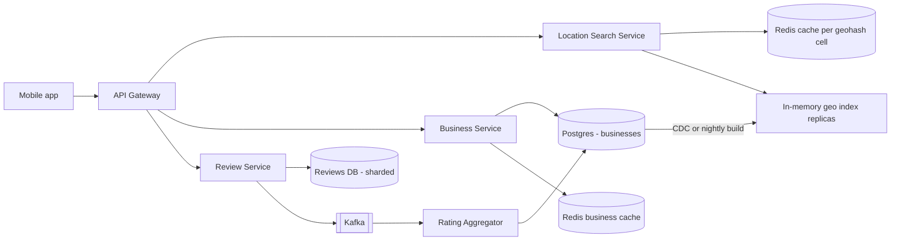
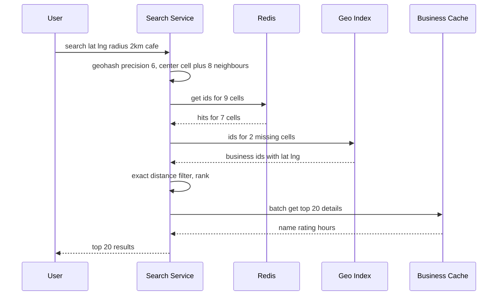

# Design Yelp / Nearby Places (Proximity Service)

**In one line:** Find restaurants/shops near the user's location ("coffee shops within 2km of me"), ranked by distance and rating. Business data **changes very rarely**, but searches happen **a lot**.

**What the interviewer checks in this question:** the geospatial index (geohash vs quadtree), caching in a read-heavy system, expanding the radius, and ranking.

---

## Step 1: Clarify with the interviewer (3–5 min)

| You ask | Typical answer | Effect on design |
|---|---|---|
| "Core feature: nearby search by location + radius, and a business detail page?" | Yes | Two main APIs: search and detail |
| "How often do business owners update info? Must it show instantly?" | Rarely, next day is fine | Geo index can be rebuilt in batch |
| "What radius? Filters?" | 0.5–20 km, category/open now/rating | Geo index + filter |
| "Scale?" | 200M businesses, 100M DAU | Read-heavy, cache + replicas |
| "Writing reviews and photos?" | Reviews yes, photos basic | Separate Review Service, photos on S3 |
| "Real-time moving objects (like Uber)?" | No, businesses are static | Static index is fine, no frequent updates |

> **Say:** "Businesses are static and reads are very high, so I will keep the geo index read-optimized, cache heavily, and apply updates async/in batch."

## Step 2: Requirements

**Functional**
1. Find nearby businesses by lat/long + radius + filters
2. Business detail page (info, rating, reviews)
3. Users can give a review and rating
4. Business owners can add/update a listing

**Non-functional**
- **Low latency:** search < 200ms
- **High availability:** search is never down
- **Read-heavy:** search:write ~1000:1
- **Eventual consistency:** fine if a new business shows up a few hours later

## Step 3: Estimation (only what changes the design)

- 100M DAU × 5 searches = 500M/day ≈ **~6K QPS avg, peak ~20K QPS**.
- 200M businesses × ~1KB = **200GB** of business data. The geo index is only `(id, lat, long, geohash)` ≈ 200M × ~30B = **~6GB**, which **fits in one machine's memory**.
- Writes: ~100K business updates/day, ~1 QPS. Negligible.

> **Say:** "The geo index is only ~6GB, so we can keep the whole index in memory and scale with read replicas. Sharding is not needed for the index, only for business data and reviews."

## Step 4: Core entities

- **Business**: id, name, category, lat, long, geohash, address, hours, avg_rating, review_count
- **Review**: id, business_id, user_id, rating, text, created_at
- **User**: id, name
- **GeoIndex entry**: geohash, business_id (derived data)

## Step 5: APIs

```http
GET  /search?lat=18.52&lng=73.85&radius=2000&category=cafe&openNow=true&cursor=...
     → [{businessId, name, distance, rating}], nextCursor
GET  /businesses/{id}                      → details
POST /businesses        {name, lat, lng, ...}   (owner)
PUT  /businesses/{id}   {...}
POST /businesses/{id}/reviews {rating, text}
GET  /businesses/{id}/reviews?cursor=...
```

## Step 6: High-level design



**Why each component:**
- **Location Search Service:** stateless. Computes geohash cells, gets candidate ids from the geo index, then filters + ranks.
- **In-memory geo index:** ~6GB, every search node has a full copy (or separate replicas). Horizontal read scaling.
- **Business Service + Postgres:** source of truth. Few writes, read replicas + Redis cache for the detail page.
- **Review Service:** more writes (reviews), DB sharded by `business_id`.
- **Rating Aggregator:** updates avg_rating async on each new review. No business row lock on every review.

## Step 7: Main flow: nearby search



## Step 8: Data model & DB choice

```sql
businesses(id PK, name, category, lat, lng, geohash, hours JSONB, avg_rating, review_count, updated_at)
INDEX (geohash)   -- prefix search: geohash LIKE 'tek5%'

reviews(id, business_id, user_id, rating, text, created_at)   -- shard by business_id
UNIQUE(business_id, user_id)   -- one review per user per business
```

Postgres for business data (200GB, easy read replicas, strong schema). If the team already uses it, PostGIS is also an option, but an in-memory geohash index keeps the search path separate from the DB.

## Step 9: Deep dives (where the interviewer will push)

### 9.1 Geohash vs Quadtree
- **Geohash:** split the world into a grid and give each cell a string. Same prefix = close to each other. Precision 6 ≈ 1.2km × 0.6km, precision 5 ≈ 5km × 5km.
- **Quadtree:** split the map into 4 parts again and again until each node has ≤ 100 businesses. Small cells in dense Mumbai, big cells in empty Rajasthan.

| | Geohash | Quadtree (in-memory) |
|---|---|---|
| Implementation | Simple, just a string column + index | Must build a tree, custom code |
| Density handling | Fixed cell size, thousands in one cell in dense areas | Adaptive, ~100 per leaf |
| Updates | Easy, row update | Tree rebuild/rebalance, tricky |
| Storage | Directly in Redis/DB | In each server's memory, built at startup |
| Cache key | Cell string is a natural cache key | Node id, not as clean |

**Choice:** geohash, because it is simple, native to Redis/DB, and the cell string becomes the cache key directly. Use a quadtree when density is very uneven and you need "k nearest". Both are acceptable; explaining the trade-off is what matters.

### 9.2 Boundary problem and radius expansion
- If the user is at the edge of a cell, a nearby business may be in the neighbour cell. So query the **center cell + 8 neighbours**.
- Choose precision from the radius: 500m → precision 7, 2km → 6, 20km → 5.
- If too few results come back (only 3 cafes within 2km in a village), **expand the radius**: lower the precision by one (bigger cell) and query again, until you get the min results (like 20) or hit the max radius.
- A geohash cell is a rectangle, so at the end filter by **exact haversine distance**.

### 9.3 Ranking: distance + rating
- Score the candidates (like 500): `score = w1 × (1 - distance/radius) + w2 × (avg_rating/5) + w3 × log(review_count)`.
- Apply filters (category, open now) first, then rank. Return the top 20, paginate with a cursor.
- Personalization (the user's past likes) comes later with an ML ranker; just mention it in the interview.

### 9.4 Caching and sharding
- **Cache per geohash cell:** key `geo:tek5x2:cafe` → list of business ids. TTL 1 hour or invalidate on business update. Popular cells (CP, Koramangala) are almost always a hit.
- **Business detail cache:** `biz:{id}` in Redis, used by both the detail page and search result enrichment.
- **Sharding:** the geo index is small, so replicate it, do not shard it. If you must shard, do it by **region/geohash prefix**, but hot cities will cause skew. Shard reviews by `business_id`.

## Step 10: Decision table (what we chose, why, what we did not)

| Decision | Why we chose it | What we did not choose, and why |
|---|---|---|
| **Geohash index** | Simple, prefix query, cell = cache key | **Quadtree:** adaptive but complex to build/update. **Plain lat/lng index:** 2D range query is slow, the index works on only one dimension |
| **Full geo index in memory + replicas** | Only ~6GB, latency < 10ms, reads scale linearly | **Sharding the geo index:** extra complexity for such small data, cross-shard queries |
| **Redis cache per cell** | Read:write is 1000:1, almost 100% hit for popular areas | **Every search on the DB:** 20K QPS on the DB, higher latency and cost |
| **Index update via batch/CDC** | Business data rarely changes, eventual is fine | **Sync update on every write:** useless complexity, no requirement for it |
| **Async rating aggregation** | Review writes are fast, no contention on the business row | **Update the avg in the same txn on every review:** row lock contention on popular businesses |
| **Elasticsearch only for text search (optional)** | Combined text + geo like "biryani near me" | **Everything on ES only:** would work, but in-memory geohash is cheaper and faster for core proximity |

## Step 11: Failures & bottlenecks

| What failed | What happens | How to handle it |
|---|---|---|
| Redis down | Cache miss, load goes to the index | Index is in memory, still fast. Redis replica |
| Geo index node crash | Some requests fail | Stateless, LB sends to another replica. Load index from a snapshot at startup |
| Dense cell (Mumbai station) | Thousands of results in one cell | Higher precision or quadtree split, top-K pre-sorted per cell |
| Stale index | New business not showing | Acceptable. Show the owner a "live within 24 hours" message |
| Fake review spike | Rating manipulation | Rate limit per user, spam ML, more weight to verified visits |

## Step 12: How to make it better (say this yourself at the end)

> "If I had more time, I would improve these:"
- **Pre-computed top-K per cell per category:** ranking ready in advance for popular cells, search becomes almost O(1)
- **Personalized ranking:** ML ranker using user history and time of day (breakfast in the morning)
- **Multi-region:** a geo index in each region, serve from the user's nearest region
- **Hybrid geohash + quadtree:** adaptive split in dense cities
- **Elasticsearch** for combined text + geo queries ("veg thali under 200 near me")

## Step 13: Likely follow-up questions

- "What if a business at a cell boundary is missed?" → also query the 8 neighbour cells, then filter by exact distance
- "Geohash or quadtree, which will you pick?" → geohash for simplicity and caching, quadtree for uneven density. See the Step 9.1 table
- "What if a new restaurant must show up instantly?" → incrementally update the geo index and cell cache via CDC
- "What if very few results come back?" → expand the radius, lower the precision and query again
- "What if there are moving drivers like Uber?" → then update every 4 sec in Redis GEO; this static design will not work

## 2-minute recap (read this before the interview)

> Yelp is read-heavy (1000:1) and business data rarely changes. The geo index is only ~6GB, so we keep it fully in memory and replicate it. We use geohash: choose precision from the radius, query the center + 8 neighbour cells, then filter by exact haversine distance. If results are few, lower the precision to expand the radius. Ranking is a weighted score of distance + rating + review count. Each geohash cell's result is cached in Redis, and popular cells are almost always a hit. Business data lives in Postgres, and the index is updated via CDC/batch. Reviews are a separate service, sharded by business_id, and ratings are aggregated async. A quadtree is the alternative; it is better for uneven density, but more complex.

## Checklist

- [ ] I can draw the geohash vs quadtree comparison table without looking
- [ ] I can explain the boundary problem and the 8 neighbour cells fix
- [ ] I can explain radius expansion and how to choose precision
- [ ] I can estimate that the geo index fits in memory
- [ ] I can tell the distance + rating ranking formula
- [ ] I can draw the HLD diagram in 5 min
- [ ] I can say 3 trade-offs from the decision table without looking
