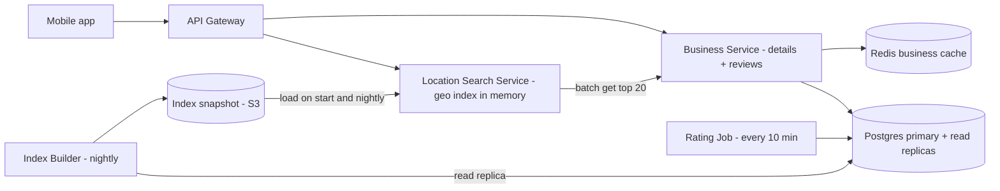
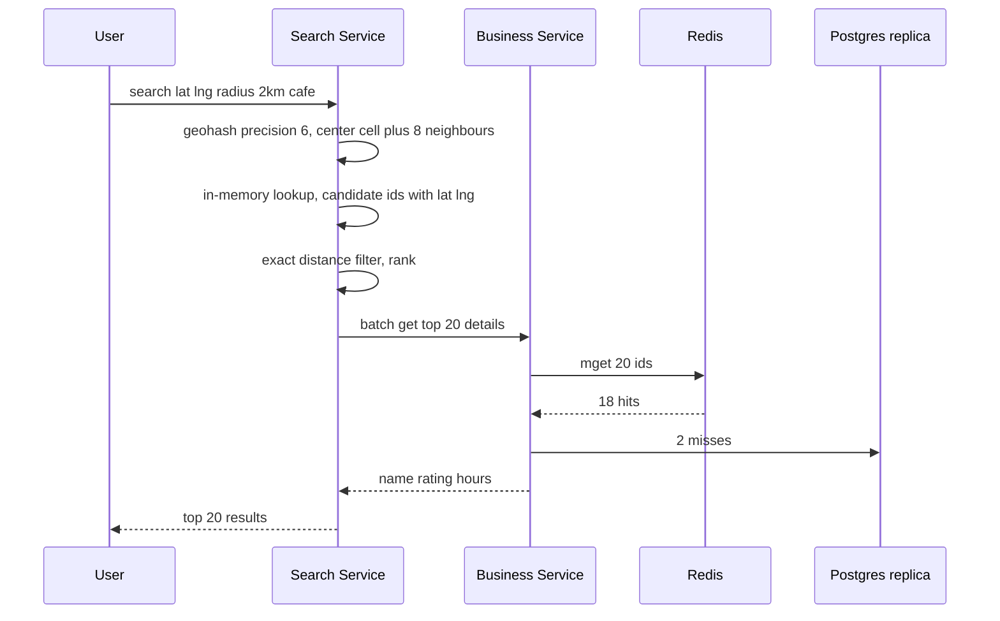

# Design Yelp / Nearby Places (Proximity Service)

**In one line:** find restaurants/shops near the user ("coffee shops within 2km"), ranked by distance + rating. Business data **rarely changes**, searches happen **a lot**.

**What the interviewer checks in this question:** geospatial index (geohash vs quadtree), read-heavy caching, radius expansion, ranking.

---

## Step 1: Clarify with the interviewer (3–5 min)

| You ask | Typical answer | Effect on design |
|---|---|---|
| "Core: location + radius search and a detail page?" | Yes | Two main APIs: search, detail |
| "How often do owners update? Must it show instantly?" | Rarely, next day is fine | Geo index rebuilt in batch |
| "Radius? Filters?" | 0.5–20 km, category/open now/rating | Geo index + filter |
| "Scale?" | 200M businesses, 100M DAU | Read-heavy, cache + replicas |
| "Reviews, photos?" | Reviews yes, photos basic | Reviews in a separate Postgres table, photos on S3 |
| "Moving objects (like Uber)?" | No, businesses are static | Static index, no frequent updates |

> **Say:** "Businesses are static and reads are huge: read-optimized geo index, heavy caching, async/batch updates."

## Step 2: Requirements

**Functional**
1. Nearby search by lat/long + radius + filters
2. Business detail page (info, rating, reviews)
3. Post a review and rating
4. Owners add/update a listing

**Out of scope:** moving objects (Uber), photo pipeline, personalization, booking/ordering.

**Non-functional (in priority order)**
1. **Availability:** search 99.99% (stale is fine, an error is not)
2. **Latency:** search p99 < 200ms (index lookup < 10ms)
3. **Scale:** 100M DAU, peak ~20K search QPS, search:write ~1000:1
4. **Freshness:** new/updated business within 24 hours, rating within ~10 min
5. **Durability:** an acked review is never lost

**CAP choice:** search is **AP** (serve the old index, do not fail). Review writes on the Postgres primary are **consistent** (one review per user per business, unique constraint).

## Step 3: Estimation (only what changes the design)

- 100M DAU × 5 searches = 500M/day ≈ **~6K QPS avg, peak ~20K QPS**.
- 200M × ~1KB = **200GB** business data. Geo index `(id, lat, long, geohash)` ≈ 200M × ~30B = **~6GB** → **fits in one machine's memory**.
- Writes: ~100K business updates/day (~1 QPS). Reviews ~1M/day ≈ **~12 writes/sec**, ~1KB → ~0.4TB/year. One Postgres primary is enough; no Kafka/sharding.
- Top 20 details per search: 20K × 20 = **~400K lookups/sec** at peak → not on the DB, business cache.

> **Say:** "Index ~6GB → in memory + replicas. Shard nothing; only a cache for detail lookups."

## Step 4: Core entities

- **Business**: id, name, category, lat, long, geohash, address, hours, avg_rating, review_count
- **Review**: id, business_id, user_id, rating, text, created_at
- **User**: id, name
- **GeoIndex entry**: geohash, business_id (derived data)

## Step 5: APIs

```http
GET  /search?lat=18.52&lng=73.85&radius=2000&category=cafe&openNow=true&cursor=...
     → [{businessId, name, distance, rating}], nextCursor
GET  /businesses/{id}                      → details
POST /businesses        {name, lat, lng, ...}   (owner)
PUT  /businesses/{id}   {...}
POST /businesses/{id}/reviews {rating, text}
GET  /businesses/{id}/reviews?cursor=...
```

## Step 6: High-level design

**Simple v1:** app → one Business Service → Postgres (PostGIS / geohash index); search, detail, reviews all from one DB. Meets the FRs. Where it breaks:
- **20K search QPS** of 2D geo queries breaks DB p99 → in-memory geo index in a separate Search Service
- **400K detail lookups/sec** → Redis business cache
- Reviews are only ~12 writes/sec → stay in Postgres



**Why each component:**
- **Location Search Service:** stateless, full ~6GB index in every node's memory → < 10ms, scales with replicas. No Redis "cell cache": extra hop.
- **Business Service + Postgres:** source of truth. Separate Review Service/sharded DB only at many TB or a separate team.
- **Redis business cache:** `biz:{id}`, ~400K lookups/sec.
- **Index Builder (nightly) + S3 snapshot:** 24h freshness → batch is enough; new nodes start in seconds without a DB scan.
- **Rating Job (cron, 10 min):** recomputes `avg_rating`, `review_count` from new reviews; cron + a `created_at` index is enough.

**FR → component:** FR1 → Search Service + snapshot, FR2 → Business Service + Redis + Postgres, FR3 → Business Service + Postgres + Rating Job, FR4 → Business Service + Postgres (reaches the index at the next nightly build).

## Step 7: Main flow: nearby search



## Step 8: Data model & DB choice

```sql
businesses(id PK, name, category, lat, lng, geohash, hours JSONB, avg_rating, review_count, updated_at)
INDEX (geohash)   -- prefix search: geohash LIKE 'tek5%'

reviews(id, business_id, user_id, rating, text, created_at)
UNIQUE(business_id, user_id)   -- one review per user per business
INDEX (business_id, created_at), INDEX (created_at)   -- detail page + Rating Job
```

Postgres for both: easy replicas, strong schema. PostGIS is an option, but the in-memory index keeps the search path off the DB.

## Step 9: Deep dives (where the interviewer will push)

### 9.1 Geohash vs Quadtree
**NFR: search p99 < 200ms at 20K QPS.**

- **Geohash:** world as a grid, each cell a string. Same prefix = close. Precision 6 ≈ 1.2km × 0.6km, 5 ≈ 5km × 5km.
- **Quadtree:** split the map into 4 until each node has ≤ 100 businesses. Dense Mumbai → small cells, empty Rajasthan → big.

| | Geohash | Quadtree (in-memory) |
|---|---|---|
| Implementation | Simple: string column + index | Build a tree, custom code |
| Density | Fixed cell, thousands in dense areas | Adaptive, ~100 per leaf |
| Updates | Easy, row update | Rebuild/rebalance, tricky |
| Storage | Directly in Redis/DB | Each server's memory, built at startup |
| Cache key | Cell string is a natural key | Node id, less clean |

**Choice:** geohash. Quadtree when density is very uneven + "k nearest" is needed. Both valid; stating the trade-off matters.

### 9.2 Boundary problem and radius expansion
**NFR: correctness (do not miss a nearby business) + latency.**

- User at a cell edge → business may be in the neighbour cell → query **center + 8 neighbours**.
- Radius → precision: 500m → 7, 2km → 6, 20km → 5.
- Too few results (3 cafes within 2km in a village) → **expand radius**: lower precision by one and re-query, until min results (like 20) or max radius.
- Cells are rectangles → finally filter by **exact haversine distance**.

**Trade-off:** 9 cells + expansion scan extra candidates, but nothing at the edge is missed.

### 9.3 Ranking: distance + rating
**NFR: latency (rank only ~500 candidates, in memory).**

- Score: `score = w1 × (1 - distance/radius) + w2 × (avg_rating/5) + w3 × log(review_count)`.
- Filters (category, open now) first, then rank. Top 20, cursor pagination.
- Personalization later via an ML ranker (just mention it).

**Trade-off:** a weighted score is explainable and fast, but not personalized.

### 9.4 Caching and sharding
**NFR: 400K detail lookups/sec + 99.99% availability.**

- Precompute top-K per category in-process for popular cells (CP, Koramangala).
- **Detail cache:** `biz:{id}` TTL 1 hour + invalidate on owner update; detail page + search enrichment.
- **Sharding:** small index → replicate, do not shard. If forced, shard by **region/geohash prefix**, but hot cities skew. Shard reviews by `business_id` when they grow.

## Step 10: Decision table (what we chose, why, what we did not)

| Decision | Why we chose it | What we did not choose, and why |
|---|---|---|
| **Geohash index** | Simple, prefix query, cell = key | **Quadtree:** complex build/update. **Plain lat/lng index:** slow 2D range. Sacrifice: more candidates in dense cells |
| **Full geo index in memory + replicas** | ~6GB, < 10ms, linear read scale | **PostGIS per search:** p99 breaks at 20K QPS. **Sharding:** cross-shard queries. Sacrifice: 6GB RAM/node, nightly reload |
| **Redis business cache** | ~400K lookups/sec, ~100% hit on popular | **Read replicas:** many replicas, higher latency. Sacrifice: stale up to TTL |
| **Nightly index build + S3 snapshot** | Freshness 24 hours, ~1 update/sec | **CDC + Kafka:** real-time nobody asked for. Sacrifice: new business shows next day |
| **Rating Job (cron) for avg_rating** | ~12 reviews/sec, idempotent recompute | **Kafka + aggregator:** no replay needed. **Same-txn update:** row contention. Sacrifice: rating ~10 min late |
| **One Postgres (primary + replicas)** | 200GB + ~0.4TB/year, joins, unique constraint | **Cassandra / sharded reviews:** only ops cost. Sacrifice: plan sharding in a few years |
| **No Elasticsearch (for now)** | In-memory geohash cheaper, faster | **ES:** when text + geo ("biryani near me") is needed. Sacrifice: no free-text search |

## Step 11: Failures & bottlenecks

| What failed | What happens | How to handle it |
|---|---|---|
| Redis down | Lookups hit the DB | Replica failover; meanwhile read replicas + short timeouts, or enrich only top 10 |
| Search node crash | Some requests fail | Stateless, LB uses another replica; new node loads S3 snapshot |
| Bad nightly index | Wrong/empty results | Canary node first, count check, keep old snapshot for rollback |
| Dense cell (Mumbai station) | Thousands of candidates | Higher precision / quadtree split, top-K pre-sorted per cell |
| Stale index | New business missing | Acceptable; owner told "live within 24 hours" |
| Rating Job fails | Old rating | Retry; idempotent, next run catches up |
| Fake review spike | Rating manipulation | Per-user rate limit, spam ML, more weight to verified visits |

## Step 12: How to make it better (say this yourself at the end)

> "If I had more time, I would improve these:"
- **Pre-computed top-K per cell per category:** near O(1) search for popular cells
- **Personalized ranking:** ML ranker on user history + time of day (breakfast in the morning)
- **Multi-region:** index per region, serve from the nearest
- **Hybrid geohash + quadtree:** adaptive split in dense cities
- **Elasticsearch:** text + geo ("veg thali under 200 near me")

## Step 13: Likely follow-up questions

- "New restaurant must show instantly?" → incremental updates to search nodes via CDC (Debezium). Today's NFR is 24 hours, so nightly is enough
- "Why no Kafka?" → ~12 reviews/sec, ~1 update/sec; cron + nightly build suffice. Add it for many consumers or real-time freshness
- "Moving drivers like Uber?" → Redis GEO updated every 4 sec; this static design will not work
- **Senior signal:** raise it yourself that the risks are density skew (thousands of candidates in one Mumbai cell → ranking p99 rises, use adaptive split or precomputed top-K) and the nightly index rollout (a bad snapshot loaded on every node at once = all search down, so canary + rollback)

## 2-minute recap (read this before the interview)

> Read-heavy (1000:1). ~6GB geo index in memory, replicated. Geohash: precision from radius, center + 8 neighbours, haversine filter; few results → expand. Rank = distance + rating + review count. ~400K detail lookups/sec → Redis. One Postgres (reviews ~12 writes/sec). Nightly index → S3 snapshot (no CDC/Kafka). Rating cron 10 min. Quadtree: better for uneven density, complex.

## Checklist

- [ ] I can draw the geohash vs quadtree comparison table without looking
- [ ] I can explain the boundary problem and the 8 neighbour cells fix
- [ ] I can explain radius expansion and how to choose precision
- [ ] I can estimate that the geo index fits in memory
- [ ] I can tell the distance + rating ranking formula
- [ ] I can draw the HLD diagram in 5 min
- [ ] I can say 3 trade-offs from the decision table without looking
