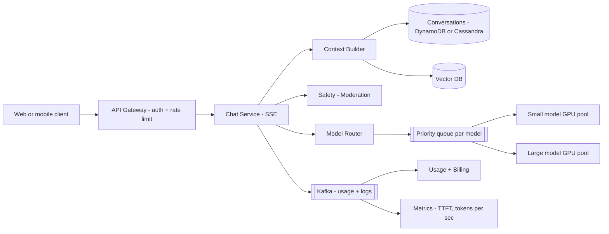
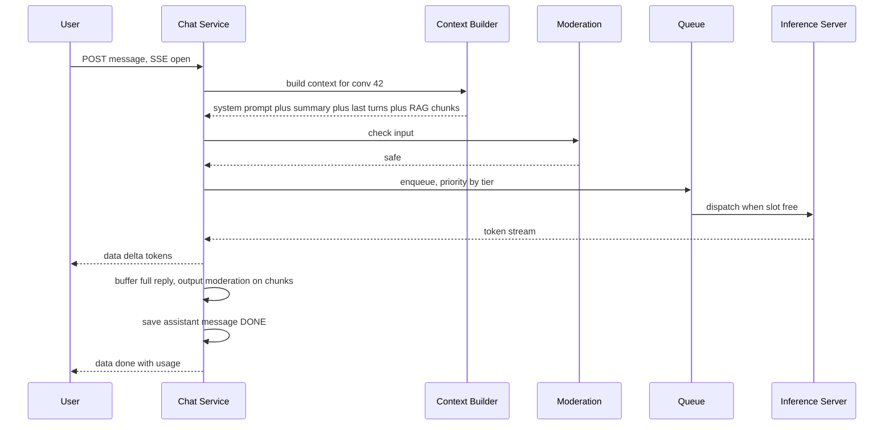

# Design a ChatGPT-style LLM Chat App

**In one line:** The user sends a message, the LLM **streams the answer token by token**, and the whole conversation is saved. The core challenge is that **GPUs are expensive and limited**, so you must use them well with queueing, rate limits, caching and routing.

**What the interviewer checks in this question:** streaming (SSE), context window management, scheduling and backpressure on the GPU fleet, per-tier rate limits, cost control, and the safety layer. This is a very common question in 2026.

---

## Step 1: Clarify with the interviewer (3–5 min)

| You ask | Typical answer | Effect on design |
|---|---|---|
| "Do we host the model ourselves or use a third-party API?" | Self-hosted, GPU fleet | We must design inference scheduling |
| "Should the response stream?" | Yes, token by token | SSE, long-lived connections |
| "Do we save conversation history? How long?" | Yes, unlimited threads | Need context window management |
| "Are there free and paid tiers?" | Yes, free/plus/enterprise | Per-tier rate limits and a priority queue |
| "Do we need file upload / knowledge base (RAG)?" | Basic RAG | Vector DB + retrieval step |
| "Images, voice, agents/tools?" | Out of scope | Mention them and move on |

> **Say:** "I will focus on 3 things: the chat streaming flow, using GPU capacity fairly and cheaply, and conversation + context management. I will also cover safety and observability."

## Step 2: Requirements

**Functional**
1. The user starts a new chat, sends a message, and the answer streams
2. The user can list old conversations and continue them
3. The user can stop a response midway, and regenerate it
4. The user can upload documents and ask questions about them (RAG)

**Non-functional**
- **Low TTFT (time to first token):** < 1 sec p50
- **Throughput:** smooth streaming, ~30+ tokens/sec per user
- **Availability:** 99.9%. Degrade gracefully under overload (queue/smaller model), do not crash
- **Cost efficiency:** high GPU utilization, low cost per query
- **Safety:** block harmful input/output

## Step 3: Estimation (only what changes the design)

- 50M DAU × 10 messages = 500M/day ≈ **~6K req/sec avg, peak ~20K**.
- Each response is ~500 output tokens, ~10 sec of streaming. At peak, **~200K concurrent streams** are open.
- One GPU (H100 class) with batching gives ~2–3K output tokens/sec, so one GPU handles ~50–100 streams. For peak we need **~3,000+ GPUs**. GPU cost is the real bill.
- Conversation storage: 500M messages × ~2KB = **~1TB/day**. Cheap, not a problem.

> **Say:** "Storage and API servers are the cheap part. The bottleneck and the cost is the GPU, so most of my design is about using the GPU less and more smartly: routing, caching, batching, and rate limits."

## Step 4: Core entities

- **User**: id, tier (`FREE`, `PLUS`, `ENTERPRISE`), token quota
- **Conversation**: id, user_id, title, model, summary, created_at, updated_at
- **Message**: conversation_id, message_id, role (`user`, `assistant`, `system`), content, token_count, status (`STREAMING`, `DONE`, `STOPPED`, `FAILED`)
- **Document chunk** (RAG): id, user_id, doc_id, text, embedding
- **Usage record**: user_id, model, input_tokens, output_tokens, cost, ts

## Step 5: APIs

```http
POST /conversations                                → {conversationId}
GET  /conversations?cursor=...                     → list
GET  /conversations/{id}/messages?cursor=...       → messages
POST /conversations/{id}/messages {content, model?}
     Accept: text/event-stream
     → SSE stream: data: {"delta":"Hello"} ... data: {"done":true,"usage":{...}}
POST /conversations/{id}/messages/{msgId}/stop
POST /files {file}                                  → {fileId} (async indexing)
```

> **Say:** "The response to the message POST is itself the SSE stream. We do not need WebSocket because the stream goes in only one direction: server to client. Stop is a separate small API."

## Step 6: High-level design



**Why each component:**
- **API Gateway:** auth, per-user/tier rate limits (requests/min and tokens/day), stopping abuse.
- **Chat Service:** holds the SSE connection, forwards tokens to the client, saves the message. Stateless (apart from the connection).
- **Context Builder:** fits history + system prompt + RAG chunks into the context window.
- **Safety / Moderation:** a small, fast classifier on input and output.
- **Model Router:** picks the small or large model based on the question, and routes based on capacity.
- **Priority queue + GPU pools:** admission control for the GPU. Paid tiers get higher priority. Inference servers (like vLLM) do continuous batching.
- **Kafka → Billing/Observability:** token usage and latency metrics go async, so the chat path does not slow down.

## Step 7: Main flow: sending a message and streaming



## Step 8: Data model & DB choice

```
conversations   PK: user_id, SK: updated_at#conv_id     -- list chats newest first
messages        PK: conversation_id, SK: message_id (time-sortable, ULID)
usage           Kafka → ClickHouse/warehouse (analytics + billing)
doc_chunks      Vector DB (pgvector / Pinecone / Milvus), filter by user_id
```

**DynamoDB/Cassandra** for messages: write-heavy, simple access pattern (messages of one conversation in order), easy horizontal scale. No transactions needed. User accounts and billing plans go in Postgres (small, relational).

## Step 9: Deep dives (where the interviewer will push)

### 9.1 Streaming: SSE and connection handling
- **SSE** (an HTTP response that stays open, `text/event-stream`). Friendly to proxies/CDNs, auto-reconnect built in, server → client only. WebSocket is overkill.
- A gRPC stream between the Chat Service and the inference server. The Chat Service forwards tokens and buffers them at the same time.
- Checkpoint the partial message to the DB every ~N tokens, so if the client disconnects, the partial answer shows on reload. Whether generation keeps running in the background or stops is a product decision.
- **Stop button:** stop API → Chat Service sends a cancel signal to inference → GPU slot is freed right away. This saves cost.

### 9.2 Context window management
The model's context is limited (like 128K tokens), and every input token costs money and latency.
- **Sliding window / truncation:** system prompt + the last K turns that fit in the token budget.
- **Summarization:** build a running summary of old turns (with a small model, async), and store it in `conversation.summary`. Context = system prompt + summary + recent turns.
- **RAG:** chunk the user's documents and store embeddings in a vector DB. When a query comes in, use the query embedding to fetch the top 5 chunks and put them in the context. Not the whole document.
- Token budget order: system prompt > current message > RAG chunks > recent turns > summary. On overflow, cut from the bottom.

### 9.3 GPU fleet, queueing and model routing
- **Continuous batching:** the inference server runs many requests together in a batch, and new requests join midway. GPU utilization goes up 2–5x.
- **Admission control:** each model pool has limited capacity (KV cache memory). Make requests wait in a queue; if the queue gets too long, give the free tier "high demand, try later" (429) or a smaller model. Backpressure, not a crash.
- **Priority:** enterprise > plus > free. The free tier has a max queue wait limit.
- **Model routing:** a small classifier or rules: "hi", simple factual questions, title generation → small model (10x cheaper). Coding/reasoning/long questions → large model. If the user picked a model explicitly, use that.
- **Autoscaling:** GPUs scale slowly (loading a model takes minutes), so scale on queue depth + pre-warm on the daily pattern. Reserved capacity for peak.

### 9.4 Caching, rate limits, cost and safety
- **Prompt caching (prefix/KV cache):** the system prompt and the start of the conversation are the same on every turn. If the inference server keeps the KV cache for that prefix, the next turn computes only the new tokens. Both TTFT and cost go down. That is why we **sticky-route the same conversation to the same GPU node**.
- **Response cache:** a semantic cache for exactly the same question (like "what is GST"), only for generic queries. Not for personal chats.
- **Rate limits:** token bucket per user per tier, in two dimensions: requests/min and tokens/day. Done at the gateway with Redis. Org-level quota for enterprise.
- **Cost control:** max output tokens per tier, routing to the small model, cancel on stop, prompt caching, usage dashboards and per-user cost alerts.
- **Safety:** a fast classifier on input (jailbreak, harmful). On output, check chunks while streaming; if something unsafe is found, stop the stream and send a safe message. Flag/ban abusive users. Mask PII in logs.

## Step 10: Decision table (what we chose, why, what we did not)

| Decision | Why we chose it | What we did not choose, and why |
|---|---|---|
| **SSE** for streaming | One-way stream, simple HTTP, works with proxies, auto-reconnect | **WebSocket:** we do not need bi-directional, more LB/infra complexity. **Polling:** will not feel token-by-token |
| **Priority queue + admission control** before GPU | GPUs are limited, graceful degrade on overload, priority for paid users | **Sending straight to the GPU:** OOM/timeouts on a spike, bad experience for all users |
| **Model routing small vs large** | Many questions are simple, 5–10x cost saving | **Everything on the large model:** very high bill, higher latency too. **Everything on small:** poor quality on hard questions |
| **Summary + recent turns** for context | Lower token cost, long chats still work | **Sending the full history:** context overflow, every turn is expensive. **Only the last turns:** forgets old context |
| **Prefix/KV cache + sticky routing** | Saves compute on the repeated prefix, lower TTFT | **Random load balancing:** the full prefix is recomputed on every turn |
| **DynamoDB/Cassandra** for messages | Write-heavy, simple key access, easy scale | **Postgres:** would work, but at this scale needs heavy sharding, and we do not need joins |
| **Async usage via Kafka** | Chat path stays fast, billing is reliable with replay | **Sync billing call:** slow billing makes chat slow |

## Step 11: Failures & bottlenecks

| What failed | What happens | How to handle it |
|---|---|---|
| GPU pool overload | Queue gets long, TTFT goes up | Small model or 429 for the free tier, autoscale, reserved capacity for enterprise |
| Inference node crash mid-stream | Answer stops midway | Chat Service retries on another node (continue after the partial or regenerate), mark message `FAILED` |
| Client disconnect | Stream breaks | Partial checkpoint in the DB, show it on reconnect. Configurable: cancel generation to free the GPU |
| Moderation service down | Safety risk | Fail closed for high-risk categories, or a simple rule-based fallback |
| Vector DB slow | RAG latency | Timeout, answer without RAG and tell the user |
| A user spams with a bot | GPU waste | Token bucket rate limit, CAPTCHA, abuse detection |

## Step 12: How to make it better (say this yourself at the end)

> "If I had more time, I would improve these:"
- **Speculative decoding:** a small model drafts tokens, the big one verifies them, tokens/sec goes up 2–3x
- **Multi-region GPU fleet** and region-aware routing; if one region runs out of GPU capacity, spill to another
- **Batch/offline tier:** non-urgent jobs (summaries, evals) on cheaper off-peak GPUs
- **Learned router:** a router trained on quality feedback (thumbs up/down) that decides small vs large better
- **Observability:** dashboards for TTFT p50/p99, tokens/sec, queue wait, GPU utilization, cost per 1K tokens per tier, cache hit rate, and quality evals
- **Memory feature:** store the user's long-term preferences separately, and put a small profile in the context

## Step 13: Likely follow-up questions

- "Why SSE vs WebSocket?" → the stream is one-way, SSE is simple and HTTP friendly. A separate POST is enough for stop
- "What if the conversation gets bigger than the context window?" → summary + recent turns + RAG, cut using the token budget order
- "What if traffic goes 5x and there are no GPUs?" → admission control, priority queue, small model for the free tier, tighter rate limits
- "How will you cut cost?" → model routing, prompt caching, max tokens, cancel on stop, batching
- "What is TTFT and how will you lower it?" → the time until the first token arrives. Less queue wait, prefix cache, shorter prompt, nearby region
- "What if harmful content appears in the response?" → output moderation on streaming chunks, stop the stream and send a safe message

## 2-minute recap (read this before the interview)

> In a ChatGPT-like app, the real cost and bottleneck is the GPU. The client POSTs a message and the response streams over SSE. The Chat Service uses the Context Builder to build the context from the system prompt + conversation summary + recent turns + RAG chunks, runs input moderation, and uses the Model Router to pick the small or large model. The request goes into a priority queue (based on tier), where admission control protects the GPU from overload. Inference servers use continuous batching and a prefix KV cache, so the same conversation is sticky-routed. Tokens stream out, output moderation runs on chunks, and the message is saved in DynamoDB/Cassandra. Usage goes via Kafka to billing and metrics (TTFT, tokens/sec, queue wait). Rate limits are per user per tier: requests/min and tokens/day. Under overload we degrade gracefully: small model, 429 for the free tier.

## Checklist

- [ ] I can explain the SSE streaming flow and how the stop button cancels the GPU work
- [ ] I can explain the GPU count estimate and why "the GPU is the bottleneck"
- [ ] I can explain truncation, summarization and RAG for the context window
- [ ] I can explain the priority queue, admission control and continuous batching
- [ ] I can explain cost control with model routing and prompt caching
- [ ] I can explain per-tier rate limits and the safety layer
- [ ] I can draw the HLD diagram in 5 min
- [ ] I can tell metrics like TTFT and tokens/sec
