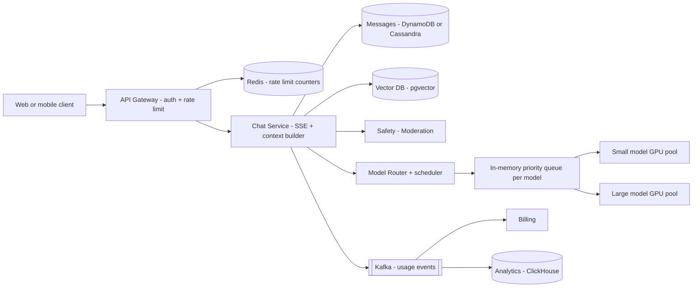
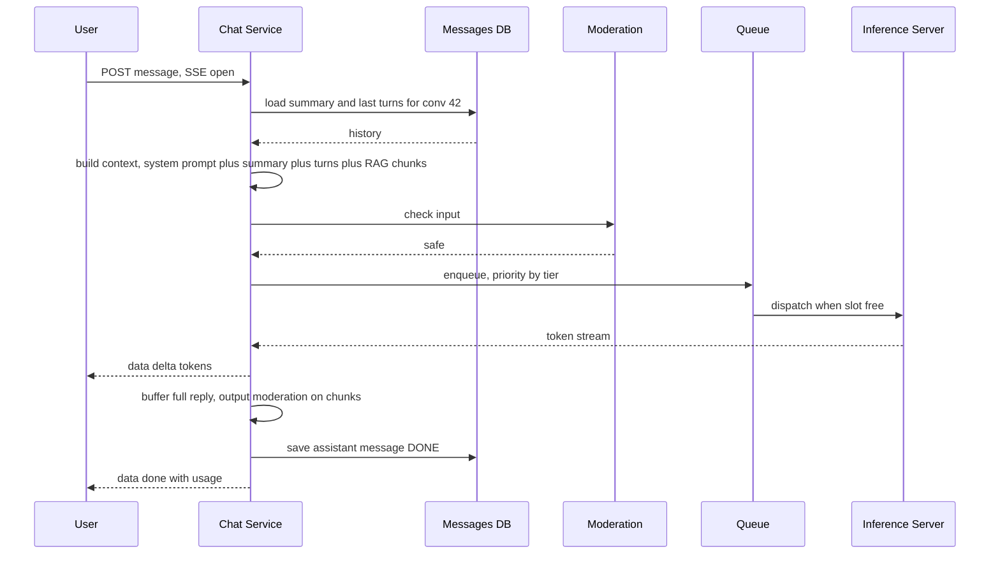

# Design a ChatGPT-style LLM Chat App

**In one line:** the LLM **streams the answer token by token**, the conversation is saved. Core challenge: **GPUs are expensive and limited** → queueing, rate limits, caching, routing.

**What the interviewer checks in this question:** streaming (SSE), context window, GPU scheduling + backpressure, per-tier rate limits, cost control, safety.

---

## Step 1: Clarify with the interviewer (3–5 min)

| You ask | Typical answer | Effect on design |
|---|---|---|
| "Self-host the model or third-party API?" | Self-hosted, GPU fleet | Design inference scheduling |
| "Should the response stream?" | Yes, token by token | SSE, long-lived connections |
| "Save history? How long?" | Yes, unlimited threads | Context window management |
| "Free/paid tiers?" | Yes, free/plus/enterprise | Per-tier rate limits + priority queue |
| "File upload / RAG?" | Basic RAG | Vector DB + retrieval step |

> **Say:** "Focus on 3 things: streaming flow, fair and cheap GPU use, conversation + context management. Plus safety and observability."

## Step 2: Requirements

**Functional**
1. Start a chat, send a message, answer streams
2. List old conversations + continue them
3. Stop a response midway + regenerate
4. Upload documents and ask about them (basic RAG)

**Out of scope:** images, voice, agents/tools, fine-tuning, chat sharing.

**Non-functional (in priority order)**
1. **TTFT (time to first token):** p50 < 1s, p99 < 3s (paid tiers)
2. **Streaming:** ~30+ tokens/sec per user, smooth
3. **Availability:** 99.9%. Overload → degrade gracefully (queue/smaller model/429), no crash
4. **Durability:** completed message history never lost
5. **Cost:** high GPU utilization, low cost per query (the GPU is the bill)
6. **Safety:** block harmful input/output
7. **Scale:** 50M DAU, peak ~20K messages/sec, ~200K concurrent streams

**CAP choice:** history → **availability** + read-your-writes within a conversation (same partition key). Usage/billing + rate-limit counters **eventual/approximate**: rate limiter down → fail open with local limits.

## Step 3: Estimation (only what changes the design)

- 50M DAU × 10 messages = 500M/day ≈ **~6K req/sec avg, peak ~20K**.
- Response ~500 output tokens, ~10 sec stream → peak **~200K concurrent streams**.
- H100-class GPU + batching ≈ 2–3K output tokens/sec ≈ 50–100 streams → peak **~3,000+ GPUs**. GPU is the real bill.
- Storage: 500M user + 500M assistant messages × ~1.5KB ≈ **~1.5TB/day** (~0.5PB/year), ~12K writes/sec avg + partial checkpoints. Too big for one Postgres → DynamoDB/Cassandra.
- Usage events: ~20K/sec peak, 3 consumers: billing, analytics, abuse detection.

> **Say:** "Storage and API servers are cheap. The GPU is bottleneck + cost, so focus on routing, caching, batching, rate limits."

## Step 4: Core entities

- **User**: id, tier (`FREE`, `PLUS`, `ENTERPRISE`), token quota
- **Conversation**: id, user_id, title, model, summary, created_at, updated_at
- **Message**: conversation_id, message_id, role (`user`, `assistant`, `system`), content, token_count, status (`STREAMING`, `DONE`, `STOPPED`, `FAILED`)
- **Document chunk** (RAG): id, user_id, doc_id, text, embedding
- **Usage record**: user_id, model, input_tokens, output_tokens, cost, ts

## Step 5: APIs

```http
POST /conversations                                → {conversationId}
GET  /conversations?cursor=...                     → list
GET  /conversations/{id}/messages?cursor=...       → messages
POST /conversations/{id}/messages {content, model?}
     Accept: text/event-stream
     → SSE stream: data: {"delta":"Hello"} ... data: {"done":true,"usage":{...}}
POST /conversations/{id}/messages/{msgId}/stop
POST /files {file}                                  → {fileId} (async indexing)
```

> **Say:** "The message POST's response is the SSE stream. The stream is one-way, so no WebSocket; stop is a separate small API."

## Step 6: High-level design

**Simple v1:** client → Chat Service (SSE) → one inference server; history + usage in one Postgres. Every FR works. Where it breaks:
- **~200K streams = ~3,000 GPUs** → Model Router + priority queue + admission control
- Every question on the large model costs 5–10x → small/large routing
- **~1.5TB/day of messages** → DynamoDB/Cassandra
- Tiers + abuse → gateway rate limits (Redis)
- Usage has 3 consumers → Kafka



**Why each component:**
- **API Gateway + Redis:** auth + per-user/tier limits (requests/min, tokens/day), shared counters across nodes.
- **Chat Service:** holds SSE, forwards tokens, saves the message. **Context builder is a module inside it**, not a service (no reason to scale separately, extra hop).
- **Safety / Moderation:** small classifier on input/output. Separate service: own GPU/CPU pool, scales separately.
- **Model Router + scheduler:** picks small vs large, admits by the pool's KV-cache capacity. Cost (5–10x) + overload NFR.
- **In-memory priority queue (per model):** tier priority, waits only seconds. **Not Kafka/SQS:** client waits on SSE and retries on a crash.
- **Vector DB (pgvector):** RAG, `user_id` filter → small set.
- **Kafka → Billing + ClickHouse:** 3 independent consumers + **replay** after a billing bug. TTFT metrics via Prometheus, not Kafka.

**FR → component:** FR1 → Gateway + Chat Service + Router + GPU pools, FR2 → DynamoDB/Cassandra, FR3 → Chat Service cancel → Router → GPU, FR4 → pgvector + context builder.

## Step 7: Main flow: sending a message and streaming



## Step 8: Data model & DB choice

```
conversations   PK: user_id, SK: updated_at#conv_id     -- list chats newest first
messages        PK: conversation_id, SK: message_id (time-sortable, ULID)
usage           Kafka → ClickHouse/warehouse (analytics + billing)
doc_chunks      Vector DB (pgvector / Pinecone / Milvus), filter by user_id
```

- **DynamoDB/Cassandra** for messages: only access is "one conversation's messages in order", easy horizontal scale, no transactions.
- Accounts, billing plans, pgvector chunks → Postgres (small, relational).
- `token_count` on each message → reconcile Kafka usage for billing.

## Step 9: Deep dives (where the interviewer will push)

### 9.1 Streaming: SSE and connection handling
**NFR: TTFT + smooth streaming, no lost partial answers.**

- **SSE** (`text/event-stream`, an open HTTP response): proxy/CDN friendly, auto-reconnect. Chat Service ↔ inference: gRPC stream, tokens forwarded + buffered.
- Checkpoint the partial every ~N tokens → shows on reload after a disconnect. Finish in background or stop: product decision.
- **Stop button:** stop API → cancel to inference → GPU slot freed at once (saves cost).

**Trade-off:** ~200K long-lived connections → connection limits + graceful drain on Chat Service nodes.

### 9.2 Context window management
**NFR: cost + TTFT (every input token costs money and latency).**

Context is limited (like 128K tokens):
- **Sliding window / truncation:** system prompt + last K turns that fit the budget.
- **Summarization:** running summary of old turns (small model, async) → `conversation.summary`. Context = system prompt + summary + recent turns.
- **RAG:** chunk docs → embeddings in a vector DB; query fetches top 5 chunks into context, never the whole doc.
- Budget order: system prompt > current message > RAG chunks > recent turns > summary. Overflow → cut from the bottom.
- File upload: S3 + SQS job → embedding worker (retry + DLQ). One consumer, task distribution → no Kafka.

**Trade-off:** summary is cheap but lossy; the model sometimes forgets old details.

### 9.3 GPU fleet, queueing and model routing
**NFR: 99.9% availability under overload + GPU cost.**

- **Continuous batching:** many requests in one batch, new ones join midway → GPU utilization 2–5x.
- **Admission control:** pool capacity (KV cache memory) is limited → wait in queue; too long → free tier gets 429 or a smaller model. Backpressure, not a crash.
- **Priority:** enterprise > plus > free; free tier has a max queue wait.
- **Model routing:** "hi", simple factual, title generation → small (10x cheaper). Coding/reasoning/long → large. User-picked model → use it.
- **Autoscaling:** model load takes minutes → scale on queue depth, pre-warm on the daily pattern, reserved capacity for peak + enterprise.

**Trade-off:** at peak the free tier gets a worse experience (429/small model) to protect paid TTFT.

### 9.4 Caching, rate limits, cost and safety
**NFR: cost, no GPU waste from abuse, safety.**

- **Prompt caching (prefix/KV cache):** system prompt + conversation start repeat every turn → prefix KV cache, compute only new tokens. Hence **sticky-route to the same GPU node**.
- **Response cache:** semantic, only generic queries ("what is GST"), never personal chats.
- **Rate limits:** token bucket per user per tier: requests/min + tokens/day, at the gateway with Redis. Enterprise → org-level quota.
- **Cost control:** max output tokens per tier, small model routing, cancel on stop, prompt caching, batching, per-user cost alerts.
- **Safety:** fast input classifier (jailbreak, harmful). Output chunks checked while streaming; unsafe → stop, send a safe message. Flag/ban abusers, mask PII in logs.

**Trade-off:** output moderation → a bit of latency + cost.

## Step 10: Decision table (what we chose, why, what we did not)

| Decision | Why we chose it | What we did not choose, and why |
|---|---|---|
| **SSE** for streaming | One-way, simple HTTP, auto-reconnect | **WebSocket:** more infra. **Polling:** no token feel. Sacrifice: separate POST for stop |
| **In-memory priority queue + admission control** | Graceful degrade, paid priority | **Straight to GPU:** OOM on spikes. **Kafka/SQS:** useless durability, latency. Sacrifice: client retries on router crash |
| **Model routing small vs large** | 5–10x saving | **All large:** bill + latency. **All small:** poor on hard questions. Sacrifice: wrong route → weak answer |
| **Summary + recent turns** for context | Lower token cost, long chats work | **Full history:** overflow, every turn costly. Sacrifice: summary is lossy |
| **Prefix/KV cache + sticky routing** | Saves prefix compute, lower TTFT | **Random LB:** prefix recomputed per turn. Sacrifice: hot nodes |
| **DynamoDB/Cassandra** for messages | ~1.5TB/day, ~12K writes/sec, simple key access | **Postgres:** heavy sharding, no joins needed. Sacrifice: no ad-hoc queries/joins |
| **Kafka** for usage events | ~20K events/sec, 3 consumers, replay | **SQS:** one consumer, no replay. **Sync billing:** slow billing → slow chat. Sacrifice: Kafka ops cost |
| **Redis** for rate limits | Shared counters across gateways, sub-ms | **Local limits:** bypassed by switching nodes. Sacrifice: fail open when down, approximate |
| **pgvector** for RAG | Small per-user set, Postgres already runs | **Pinecone/Milvus:** right at billions, extra system now. Sacrifice: migrate at large scale |

## Step 11: Failures & bottlenecks

| What failed | What happens | How to handle it |
|---|---|---|
| Inference node crash mid-stream | Answer stops midway | Retry on another node (continue or regenerate), mark `FAILED` |
| Client disconnect | Stream breaks | Partial checkpoint, show on reconnect; configurable cancel → GPU freed |
| Moderation down | Safety risk | Fail closed for high-risk categories, or rule-based fallback |
| Vector DB slow | RAG latency | Timeout, answer without RAG + tell the user |
| Bot spam | GPU waste | Token bucket, CAPTCHA, abuse detection |

## Step 12: How to make it better (say this yourself at the end)

> "If I had more time, I would improve these:"
- **Speculative decoding:** small model drafts, large verifies → tokens/sec 2–3x
- **Multi-region GPU fleet:** region-aware routing, spill to another region when capacity runs out
- **Batch/offline tier:** non-urgent jobs (summaries, evals) on cheaper off-peak GPUs
- **Learned router:** thumbs up/down feedback decides small vs large better
- **Observability:** TTFT p50/p99, tokens/sec, queue wait, GPU utilization, cost per 1K tokens per tier, cache hit rate, quality evals

## Step 13: Likely follow-up questions

- "Traffic 5x, no GPUs?" → admission control, priority queue, small model for free tier, tighter rate limits
- "How to lower TTFT?" → time to first token: less queue wait, prefix cache, shorter prompt, nearby region
- **Senior signal:** raise it yourself that GPU concurrency is limited by **KV-cache memory**, not FLOPs. Admission control should use KV-cache headroom, and hot nodes created by sticky routing need a fallback (send to another node and accept the prefix cache miss)

## 2-minute recap (read this before the interview)

> GPU = cost + bottleneck. POST → SSE stream. Chat Service builds context (system prompt + summary + recent turns + RAG chunks), input moderation, Router picks small/large. In-memory priority queue (by tier, no Kafka) + admission control. Continuous batching + prefix KV cache → sticky routing. Output moderation on chunks, message in DynamoDB/Cassandra. Usage via Kafka → billing + ClickHouse. Redis rate limits: requests/min + tokens/day. Overload → small model, 429 for free tier.

## Checklist

- [ ] I can explain the SSE streaming flow and how the stop button cancels the GPU work
- [ ] I can explain the GPU count estimate and why "the GPU is the bottleneck"
- [ ] I can explain truncation, summarization and RAG for the context window
- [ ] I can explain the priority queue, admission control and continuous batching
- [ ] I can explain cost control with model routing and prompt caching
- [ ] I can explain per-tier rate limits and the safety layer
- [ ] I can draw the HLD diagram in 5 min
- [ ] I can tell metrics like TTFT and tokens/sec
