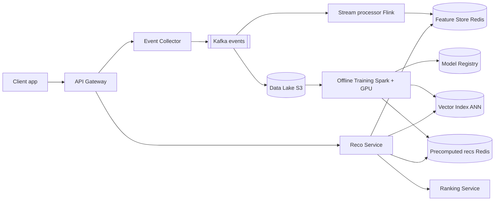
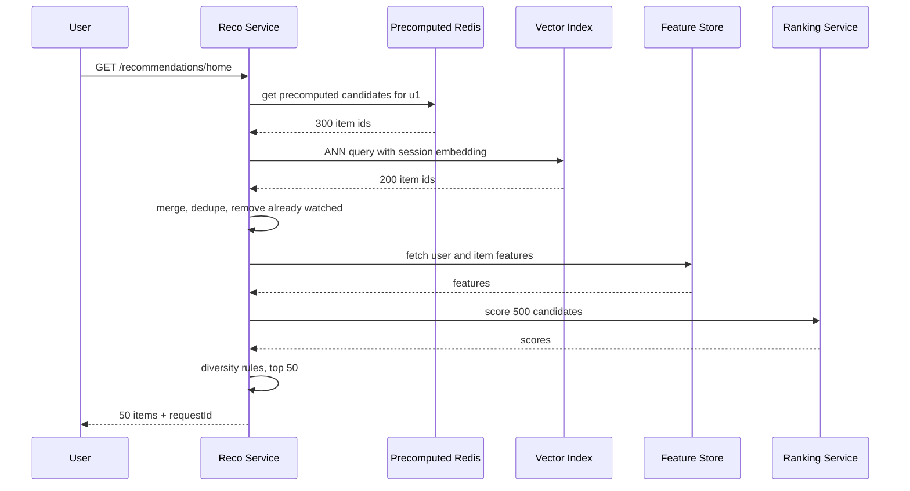
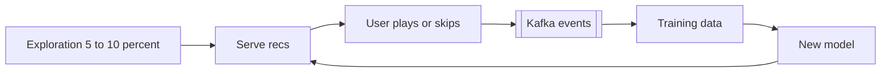

# Design a Recommendation System (YouTube / Spotify / Netflix)

**In one line:** a "for you" list from history (plays, skips, watch time): < 200ms, fresh, works for new users/content.

**What the interviewer checks in this question:** the system, not ML: event pipeline, offline training vs online serving, two-stage (candidate generation → ranking), precompute vs real-time, cold start, A/B testing, latency budget.

---

## Step 1: Clarify with the interviewer (3–5 min)

| You ask | Typical answer | Effect on design |
|---|---|---|
| "Which surface? Home feed, 'Up next', 'similar items'?" | Home feed + Up next | Per-user list and per-item similar list |
| "How big is the catalog?" | ~10M videos/songs | Cannot rank all → candidate generation |
| "How many users? Latency target?" | 200M DAU, < 200ms | Precompute + cache + ANN search |
| "How soon should a just-watched item matter?" | Within the session | Real-time features + online re-ranking |
| "Design the ML model or the system?" | System, model is a black box | Focus on training pipeline + serving |
| "Do we run experiments?" | Yes, A/B testing | Experiment service + metrics logging |

> **Say:** "Model is a black box. Focus: data pipeline, training, two-stage serving, caching, cold start; target 200ms."

## Step 2: Requirements

**Functional**
1. Personalized list (top 50 items) on the home page
2. "Up next" / similar items while watching an item
3. Actions (play, skip, like, watch time) recorded → recs change within the session
4. New users and new / trending items also get sensible recs (cold start)

**Out of scope:** ML model internals, search, ads ranking, content moderation, creator analytics.

**Non-functional (in priority order)**
1. **Latency:** home feed p99 < 200ms at ~40K peak QPS
2. **Availability:** 99.95%, page never empty (popular-items fallback)
3. **Freshness:** session actions < 1 min (features), model daily
4. **Scale:** 200M DAU, ~115K events/sec avg, ~300K peak
5. **Consistency:** eventual

**CAP choice:** **AP**: a stale list is fine, an empty page is not (no money/booking data).

## Step 3: Estimation (only what changes the design)

- 200M DAU × ~50 events/day = **10B events/day ≈ 115K/sec**, peak ~300K/sec → **Kafka**, not direct DB writes.
- Home feed: 200M × 5 opens/day = 1B/day ≈ **12K QPS**, peak ~40K → heavy model per request is expensive → **precompute + cache**.
- Catalog 10M items, scoring all per request is impossible → **~500 items via candidate generation**, then rank.
- Precomputed list: 200M × 100 item IDs × 8 bytes ≈ **160 GB** → fits a Redis cluster.

> **Say:** "Two-stage: cheap retrieval pulls 500 candidates, heavy ranking runs only on those 500."

## Step 4: Core entities

- **User**: id, country, language, signup_time
- **Item**: id (video/song), title, tags, genre, creator_id, duration, upload_time
- **Event**: user_id, item_id, type (`PLAY`, `SKIP`, `LIKE`, `WATCH_PROGRESS`), watch_ms, timestamp, context (device, surface)
- **Embedding**: entity_id, vector (128 floats), model_version
- **Recommendation list**: user_id, item_ids[], scores[], model_version, generated_at
- **Experiment**: id, variants, traffic_split

## Step 5: APIs

```http
GET  /recommendations/home?userId=u1&limit=50       → [{itemId, reason}], requestId
GET  /recommendations/similar?itemId=v9&limit=20    → [{itemId}]
POST /events  [{userId, itemId, type, watchMs, ts, requestId}]   → 202 Accepted
```

> **Say:** "The response carries a `requestId`; the client sends it back with events. That tells us which reco got the click, which is the training label."

## Step 6: High-level design

**Simple v1:** client → Reco Service → Postgres + nightly top-50 batch. FR1 works. Broken by: **~300K events/sec peak**, **freshness < 1 min**, **10M items** per request. Each add-on fixes one.



**Why each component:**
- **Event Collector + Kafka:** ~300K/sec peak (NFR4), **3 consumer groups** (Flink, S3 sink, analytics), **7-day replay** for backfill. SQS has neither. Collector = validate + batch.
- **Flink:** real-time features (last 10 items, skips today, trending), < 1 min (NFR3).
- **S3:** ~1TB/day (10B × ~100 bytes), cheap training history.
- **Offline Training:** daily batch → embeddings, ranking model, precomputed lists for active users.
- **Vector Index (FAISS/ScaNN/Milvus):** FR2, ANN ~5ms over 10M.
- **Precomputed recs (Redis):** 40K QPS, ~160GB, < 5ms; 30ms retrieval budget safe.
- **Feature Store (Redis):** training = serving features; 500 items batched, in-memory.
- **Reco Service:** candidates → filter → ranking, fallback.
- **Ranking Service (separate):** GBDT / neural net on 500; GPU/large-memory + own deploys. At small scale a library is enough.

**FR → component:** FR1 → Reco Service + Precomputed Redis + Ranking. FR2 → Vector Index. FR3 → Kafka + Flink + Feature Store. FR4 → trending (Flink) + content embeddings + exploration slot.

## Step 7: Main flow: serving the home feed



**Latency budget (200ms):**

| Step | Budget |
|---|---|
| Precomputed fetch + ANN (parallel) | 30ms |
| Filter + dedupe | 10ms |
| Feature fetch (batched) | 30ms |
| Ranking 500 items | 60ms |
| Re-rank + network | 40ms |
| Buffer | 30ms |

## Step 8: Data model & DB choice

```text
events (Kafka → S3 Parquet, partitioned by date/hour)
  user_id, item_id, type, watch_ms, ts, request_id

precomputed recs (Redis)
  key: rec:{user_id}  → list of (item_id, score), TTL 2 days

feature store online (Redis / Cassandra)
  key: uf:{user_id}  → {last_10_items, genre_affinity, skip_rate}
  key: if:{item_id}  → {ctr_24h, avg_watch_pct, age_hours}

item catalog (Postgres / Cassandra) → metadata
vector index (FAISS / Milvus)       → item_id → 128-dim embedding
```

- Embeddings live in an ANN index because SQL has no "nearest vector" query.

## Step 9: Deep dives (where the interviewer will push)

### 9.1 Two-stage: candidate generation → ranking
**NFR:** p99 < 200ms with 10M items.
- **Candidate generation (recall):** cheap, ~500 items from:
  - **Collaborative filtering:** "people like you also watched this" (from interactions)
  - **Content-based:** "you played Arijit → this is Arijit too" (tags/genre/audio)
  - **Trending** in region, **subscriptions / followed creators**
- **Ranking (precision):** P(user watches 70%+). Features: user history, item stats, context (time, device).
- **Re-ranking:** max 3 items per creator, diversity, remove already-watched, policy filters.

> **Say:** "Retrieval = recall, ranking = precision. Different cost profiles, so separate stages."

**Trade-off:** a retrieval miss is never ranked → multiple sources.

### 9.2 Embeddings + ANN search
**NFR:** retrieval < 30ms over 10M items (FR2 + FR1).
- Two-tower model: user/item → 128-dim vector; liked items sit close.
- User vector → **ANN** (HNSW / IVF): top 200 in ~5ms. Exact search over 10M is slow.
- Similar items = neighbours of the item vector (precompute + cache).
- Each training run: new index → **atomic swap** (blue-green).

**Trade-off:** ~5ms vs a little recall loss.

### 9.3 Offline vs online, precompute vs real-time
**NFR:** latency and session freshness together.
| Approach | How | Benefit | Drawback |
|---|---|---|---|
| **Full precompute** | Nightly batch, top 100 in Redis | Super fast, cheap | Stale, ignores today's session |
| **Full real-time** | Retrieval + ranking per request | Fresh | Expensive, latency risk |
| **Hybrid (chosen)** | Precomputed + session ANN + online ranking | Fast + fresh | A bit complex |

- Precompute **only for active users**; monthly users on-demand.
- **Feature store:** same feature logic, else training-serving skew (good offline, bad in prod).

**Trade-off:** two code paths (batch + online).

### 9.4 Cold start, freshness and feedback loop
**NFR:** freshness < 1 min, plus FR4.
- **New user:** genre/language at signup, regional trending, first 5–10 clicks → session embedding.
- **New item:** CF won't work → **content embedding** (title, tags, audio/video) + **exploration slot** (5–10% of feed, bandit style).
- **Trending:** Flink 1-hour sliding window, per-region counts, top-K in Redis → candidate source.
- **Feedback loop:** shown → clicked → training data → popular gets more popular. Fix: exploration + position-bias correction.



**Trade-off:** slightly lower short-term watch time, healthy catalog.

### 9.5 A/B testing
**NFR:** availability, a bad model must not drop watch time.
- Variant by hash: `hash(userId) % 100 < 5` → model B. Reco Service picks the model version accordingly; every event logs `requestId` + `variant`.
- Metrics: watch time per user, CTR, skip rate, 7-day retention. CTR alone → clickbait wins.
- New model first in **shadow mode** (score, don't show), then 1% → 5% → 50%.

**Trade-off:** good model arrives later, bad one has a small blast radius.

## Step 10: Decision table (what we chose, why, what we did not)

| Decision | Why we chose it | What we did not choose, and why |
|---|---|---|
| **Two-stage** (retrieval → ranking) | Heavy model on 500, not 10M | **Single model:** latency/cost. Sacrifice: retrieval misses |
| **Hybrid precompute + online** | Speed + session freshness | **Batch:** stale. **Real-time:** expensive at 40K QPS. Sacrifice: two code paths |
| **Kafka** for events | ~300K/sec, 3 consumers, 7-day replay | **Direct DB:** load. **SQS:** no replay. Sacrifice: Kafka ops |
| **Flink** real-time features | Session effect < 1 min | **15-min batch:** no in-session effect. Sacrifice: stateful job |
| **Redis** for precomputed recs + online features | 40K QPS, ~160GB, < 5ms | **Postgres:** p99 risky. **Cassandra:** slower tail. Sacrifice: RAM, rebuild after restart |
| **S3 data lake** | ~1TB/day, cheap, Spark-readable | **Warehouse/DB:** expensive. Sacrifice: batch query latency |
| **ANN vector index** | Neighbours in ms, 10M+ | **Exact / SQL:** slow. Sacrifice: a little recall |
| **Feature store** | Training = serving features | **Per-service code:** skew. Sacrifice: one more platform |
| **Popular-items fallback + exploration slot** | Page never empty, new items get data | **Error / pure exploitation:** empty page, new content buried. Sacrifice: less personalised |

## Step 11: Failures & bottlenecks

| What failed | What happens | How to handle it |
|---|---|---|
| Ranking slow/down | Budget broken | Timeout 80ms → precomputed order |
| Precomputed Redis miss | No list | On-demand ANN + trending, async precompute |
| Training job fails | No new model | Last good model from registry |
| Bad model deployed | Watch time drops | A/B guardrail metrics, auto rollback |
| Kafka lag | Features stale | Scale consumers, check `updated_at`, older features still work |
| Hot item (viral video) | Load on one key | Item features in local cache 1 min |

## Step 12: How to make it better (say this yourself at the end)

> "If I had more time, I would improve these:"
- **Session-based sequence model** (transformer): next item from the last 20 actions
- **Multi-objective ranking:** watch time + likes + creator fairness
- **Incremental embedding updates** (hourly) so new items show up sooner

## Step 13: Likely follow-up questions

- "CF vs content-based?" → CF from behaviour, content-based from attributes. CF fails on cold start → mix both.
- "After 3 skips, does the reco change?" → yes, Flink `recent_skips` → ranking
- "How do you remove already-watched?" → Redis/bloom filter set, filtered in re-ranking
- "How do you know the new model is better?" → offline (AUC, recall@K) first, online A/B is the real judge
- **Senior signal:** the real bottleneck is ranking: 40K QPS × 500 = **20M item-scorings/sec** + as many feature lookups. Plan: candidates 500 → 300, hot features in local cache, precomputed order on timeout, no precompute for inactive users.

## 2-minute recap (read this before the interview)

> Events → Kafka → Flink features (Redis) + S3. Daily Spark/GPU: embeddings, ranking model, ANN index, precomputed lists for active users. Serving: ~500 candidates (precomputed + session ANN + trending + subs) → ranking → re-ranking. 200ms, timeout per stage + popular fallback. Cold start: onboarding + content embedding + exploration. Models: shadow + A/B.

## Checklist

- [ ] I can explain why we need two stages (candidate generation → ranking), with numbers
- [ ] I can explain collaborative filtering vs content-based in simple words
- [ ] I can draw the event pipeline (Kafka → Flink → feature store, Kafka → S3 → training)
- [ ] I can tell the trade-off between precompute, real-time and hybrid
- [ ] I can explain how embeddings + ANN search work
- [ ] I can handle both new user and new item cold start
- [ ] I can explain the 200ms latency budget and the fallback
- [ ] I can explain A/B testing and the feedback loop problem
