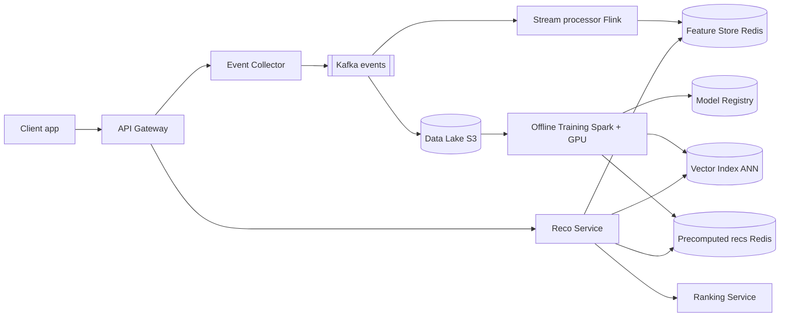
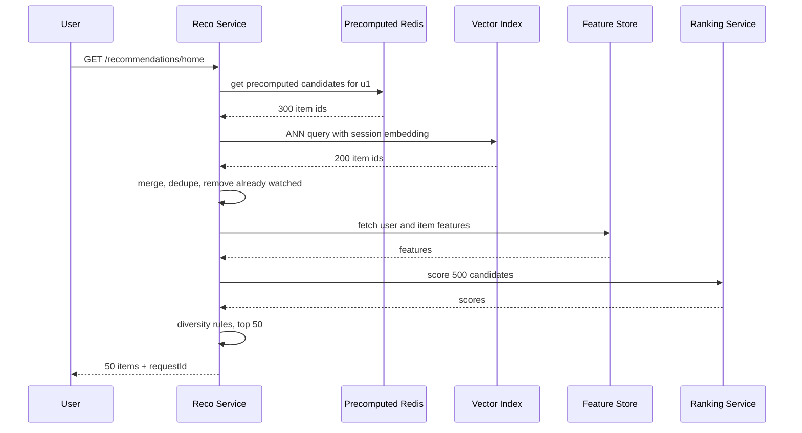
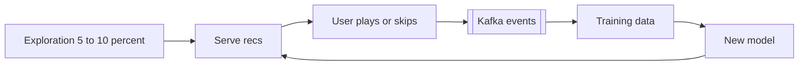

# Design a Recommendation System (YouTube / Spotify / Netflix)

**In one line:** Learn from the user's history (plays, skips, watch time) and show a "for you" list that is fast (< 200ms), fresh, and also works for new users and new content.

**What the interviewer checks in this question:** whether you can design the **system parts** without going deep into ML: the event pipeline, offline training vs online serving, the two-stage architecture (candidate generation → ranking), the precompute vs real-time trade-off, cold start, and A/B testing. The interviewer is not looking for an ML PhD; they look at data flow and the latency budget.

---

## Step 1: Clarify with the interviewer (3–5 min)

| You ask | Typical answer | Effect on design |
|---|---|---|
| "Which surface? Home page feed, 'Up next', or 'similar items'?" | Home feed + Up next | Two different use cases: a per-user list and a per-item similar list |
| "How big is the catalog?" | ~10M videos/songs | We cannot rank all items, candidate generation is a must |
| "How many users? Latency target?" | 200M DAU, < 200ms | Precompute + cache + ANN search |
| "How fresh must it be? Should what the user just watched have an effect?" | The effect should show within the session | Real-time features + online re-ranking |
| "Do we design the ML model internals or the system?" | The system, treat the model as a black box | Focus on the training pipeline and serving |
| "Do we need to run experiments?" | Yes, we need A/B testing | Experiment service + metrics logging |

> **Say:** "I will treat the ML model as a black box. The focus will be on the data pipeline, offline training, two-stage serving (candidates → ranking), caching and cold start. I will keep the latency target at 200ms."

## Step 2: Requirements

**Functional**
1. Users should be able to see a personalized list (top 50 items) on the home page
2. Users should be able to see "Up next" / similar items while watching an item
3. Users' actions (play, skip, like, watch time) should be recorded and change recommendations within the same session
4. New users and new / trending items should also get sensible recommendations (cold start)

**Out of scope:** ML model internals, search, ads ranking, content moderation, creator analytics.

**Non-functional (in priority order)**
1. **Latency:** home feed p99 < 200ms at ~40K peak QPS
2. **Availability:** 99.95%, the page must never look empty even if reco fails (popular-items fallback)
3. **Freshness:** session actions take effect in < 1 min (features), model refreshes daily
4. **Scale:** 200M DAU, ~115K events/sec avg, ~300K peak
5. **Consistency:** eventual is fine, a slightly stale list does no harm

**CAP choice:** **AP** everywhere. A stale or slightly wrong list is fine, an empty page is not. There is no data here that needs strong consistency (money, bookings).

## Step 3: Estimation (only what changes the design)

- 200M DAU × ~50 events/day = **10B events/day ≈ 115K events/sec**, peak ~300K/sec. So **Kafka**, not direct DB writes.
- Home feed requests: 200M × 5 opens/day = 1B/day ≈ **12K QPS**, peak ~40K. Running a heavy model on every request is expensive, so **precompute + cache**.
- Catalog is 10M items. Scoring 10M items on every request is impossible. **Get ~500 items via candidate generation**, then rank them.
- Precomputed list per user: 200M × 100 item IDs × 8 bytes ≈ **160 GB**. Fits easily in a Redis cluster.

> **Say:** "We cannot score 10M items on every request. So a two-stage design: first, cheap retrieval pulls 500 candidates, then the heavy ranking model runs only on those 500."

## Step 4: Core entities

- **User**: id, country, language, signup_time
- **Item**: id (video/song), title, tags, genre, creator_id, duration, upload_time
- **Event**: user_id, item_id, type (`PLAY`, `SKIP`, `LIKE`, `WATCH_PROGRESS`), watch_ms, timestamp, context (device, surface)
- **Embedding**: entity_id, vector (128 floats), model_version
- **Recommendation list**: user_id, item_ids[], scores[], model_version, generated_at
- **Experiment**: id, variants, traffic_split

## Step 5: APIs

```http
GET  /recommendations/home?userId=u1&limit=50       → [{itemId, reason}], requestId
GET  /recommendations/similar?itemId=v9&limit=20    → [{itemId}]
POST /events  [{userId, itemId, type, watchMs, ts, requestId}]   → 202 Accepted
```

> **Say:** "I send a `requestId` in the response. The client sends it back with events, so we know which recommendation got the click. That becomes the training label."

## Step 6: High-level design

**Start with a simple v1:** client → Reco Service → one Postgres. Events go to a table, a nightly batch job writes each user's top 50 to a table, and the Reco Service reads it. FR1 works. But three numbers break it: **~300K events/sec peak** (beyond one DB's write limit), **session freshness < 1 min** (a nightly batch is not enough), and **10M items** (we cannot score them per request). Every add-on below exists because of one of these.



**Why each component:**
- **Event Collector + Kafka:** ~300K events/sec peak (NFR4). Kafka because **three consumer groups** (Flink, S3 sink, analytics) read the same stream and we need **7-day replay** to backfill features. SQS has neither replay nor multi-consumer. The collector only validates + batches.
- **Stream processor (Flink):** real-time features for session freshness < 1 min (NFR3): "last 10 items played", "skips today", trending counts. A simpler 15-min batch job would not show an effect within the session.
- **Data Lake (S3):** ~1TB/day of events (10B × ~100 bytes). Cheap storage for training history.
- **Offline Training:** daily batch job. Builds embeddings, the ranking model, and precomputed lists for active users.
- **Vector Index (FAISS/ScaNN/Milvus):** FR2 and 10M items. "Items near this vector" via ANN in ~5ms. SQL / exact search over 10M vectors is slow.
- **Precomputed recs (Redis):** 40K peak QPS, ~160GB, reads < 5ms. Postgres would also work, but at this QPS Redis safely fits the 30ms retrieval budget.
- **Feature Store (online Redis):** the same features in training and serving (no skew). Features for 500 items are read in a batch per request, so in-memory.
- **Reco Service:** collects candidates, filters them, sends them to ranking, handles fallback.
- **Ranking Service (separate):** a heavy model (GBDT / neural net) scores the 500 candidates. Separate because it needs GPU/large-memory machines and its own model deploys. At small scale, a library inside the Reco Service is enough.

**FR → component:** FR1 → Reco Service + Precomputed Redis + Ranking. FR2 → Vector Index. FR3 → Kafka + Flink + Feature Store. FR4 → trending (Flink) + content embeddings + exploration slot.

## Step 7: Main flow: serving the home feed



**Latency budget (200ms):**

| Step | Budget |
|---|---|
| Precomputed fetch + ANN (parallel) | 30ms |
| Filter + dedupe | 10ms |
| Feature fetch (batched) | 30ms |
| Ranking 500 items | 60ms |
| Re-rank + network | 40ms |
| Buffer | 30ms |

## Step 8: Data model & DB choice

```text
events (Kafka → S3 Parquet, partitioned by date/hour)
  user_id, item_id, type, watch_ms, ts, request_id

precomputed recs (Redis)
  key: rec:{user_id}  → list of (item_id, score), TTL 2 days

feature store online (Redis / Cassandra)
  key: uf:{user_id}  → {last_10_items, genre_affinity, skip_rate}
  key: if:{item_id}  → {ctr_24h, avg_watch_pct, age_hours}

item catalog (Postgres / Cassandra) → metadata
vector index (FAISS / Milvus)       → item_id → 128-dim embedding
```

- Events are append-only and huge → Kafka + S3 Parquet. Online features are key-value → Redis. Embeddings → an ANN index (SQL has no "nearest vector" query).

## Step 9: Deep dives (where the interviewer will push)

### 9.1 Two-stage: candidate generation → ranking
**NFR:** p99 < 200ms with 10M items.
- **Candidate generation (recall):** cheap, fast, ~500 items from multiple sources. Sources:
  - **Collaborative filtering:** "people who watched what you watched also watched this". Learns from user-item interactions, no need to understand the content.
  - **Content-based:** "you listened to Arijit's songs, this is also by Arijit". Matches on the item's tags/genre/audio features.
  - **Trending / popular** in the user's region.
  - **Subscriptions / followed creators.**
- **Ranking (precision):** a heavy model gives each candidate a score: "how likely is the user to watch 70%+ of this". Features: user history, item stats, context (time, device).
- **Re-ranking:** business rules: max 3 items per creator, diversity, remove already-watched, policy filters.

> **Say:** "Retrieval's job is to not miss good items (recall). Ranking's job is the right order (precision). They have different cost profiles, so they are separate stages."

**Trade-off:** an item missed by retrieval is never seen by ranking. We keep multiple sources for recall.

### 9.2 Embeddings + ANN search
**NFR:** retrieval < 30ms over 10M items (FR2 + FR1).
- In training, every user and every item gets a vector (128 numbers). A user's vector ends up close to the vectors of items they like (two-tower model).
- At serving time: take the user vector and find the **approximate nearest neighbours** in the vector index. Exact search over 10M items is slow; ANN (HNSW / IVF) gives the top 200 in ~5ms, in exchange for a little accuracy.
- For "similar items": items near the item's vector. This can also be precomputed and cached.
- Item embeddings change on every training run. Build a new index, then do an **atomic swap** (blue-green), so serving does not break midway.

**Trade-off:** ~5ms latency in exchange for a little recall loss (ANN misses some true neighbours).

### 9.3 Offline vs online, precompute vs real-time
**NFR:** latency and session freshness together.
| Approach | How | Benefit | Drawback |
|---|---|---|---|
| **Full precompute** | Nightly batch job puts each user's top 100 in Redis | Super fast serving, cheap | Stale. Ignores today's session |
| **Full real-time** | Retrieval + ranking on every request | Fresh | Expensive, latency risk |
| **Hybrid (chosen)** | Precomputed candidates + session-based ANN + online ranking | Fast + fresh | A bit complex |

- For inactive users (who come once a month), precompute is wasted. Precompute **only for active users**, and on-demand for the rest.
- The **feature store**'s main job: the **same feature logic** in training and serving. Otherwise you get "training-serving skew": the model looks good offline but does badly in production.

**Trade-off:** hybrid means maintaining two code paths (batch + online), in return for both speed and freshness.

### 9.4 Cold start, freshness and feedback loop
**NFR:** freshness < 1 min, plus FR4 (new users/items).
- **New user:** no history. Ask for genre/language at signup, show regional trending, then build a session embedding from the first 5–10 clicks.
- **New item:** no interactions, so CF will not work. Start with a **content-based embedding** (title, tags, audio/video features), and give it an **exploration slot**: 5–10% of every feed goes to new items (bandit style), so they get data.
- **Trending:** per-region play counts in a Flink sliding window (last 1 hour), top-K in Redis. It becomes one candidate source.
- **Feedback loop:** what the model shows is what gets clicked, and that becomes the training data. Popular items get more and more popular. So keep exploration and correct for position bias in training.



**Trade-off:** the exploration slot lowers short-term watch time a little, in return for a healthy catalog.

### 9.5 A/B testing
**NFR:** availability, a bad model must not drop watch time.
- The experiment service hashes the user and assigns a variant (`hash(userId) % 100 < 5` → model B).
- The Reco Service picks the model version based on the variant. Every event logs `requestId` + `variant`.
- Metrics: watch time per user, CTR, skip rate, 7-day retention. Do not look only at CTR, or clickbait will win.
- A new model runs first in **shadow mode** (score, but do not show), then a 1% → 5% → 50% rollout.

**Trade-off:** a slow rollout means a good model reaches everyone later, but a bad model's blast radius stays small.

## Step 10: Decision table (what we chose, why, what we did not)

| Decision | Why we chose it | What we did not choose, and why |
|---|---|---|
| **Two-stage** (retrieval → ranking) | A heavy model on 10M items is impossible, on 500 it is easy | **A single model on everything:** latency and cost out of control. Sacrifice: an item missed by retrieval is never ranked |
| **Hybrid precompute + online** | Speed from precompute, session freshness from online | **Batch only:** stale. **Real-time only:** expensive at 40K QPS. Sacrifice: two code paths |
| **Kafka** for events | ~300K/sec peak, 3 consumer groups, 7-day replay | **Direct DB writes:** cannot take the load. **SQS:** no replay, no multi-consumer. Sacrifice: Kafka cluster ops |
| **Flink** real-time features | Session actions take effect in < 1 min | **15-min batch job:** no effect within the session. Sacrifice: complexity of a stateful stream job |
| **Redis** for precomputed recs + online features | 40K QPS, ~160GB, < 5ms reads | **Postgres:** p99 budget is risky. **Cassandra:** cheaper but slower tail. Sacrifice: RAM cost, rebuild after a Redis restart |
| **S3 data lake** | ~1TB/day of history, cheap, Spark reads it directly | **Raw events in a warehouse/DB:** very expensive. Sacrifice: batch latency for queries |
| **ANN vector index** | Nearest neighbours in ms, 10M+ items | **Exact search / SQL:** brute force is slow. Sacrifice: a little recall |
| **Feature store** | Same features for training and serving | **Each service with its own feature code:** skew, bugs. Sacrifice: one more platform to maintain |
| **Popular-items fallback + exploration slot** | The page is never empty, new items get data | **Showing an error / pure exploitation:** empty page, new content never rises. Sacrifice: slightly less personalised |

## Step 11: Failures & bottlenecks

| What failed | What happens | How to handle it |
|---|---|---|
| Ranking service slow/down | Latency budget broken | Timeout at 80ms, then just return the precomputed order |
| Precomputed Redis miss | User's list not found | Build it from on-demand ANN + trending, trigger async precompute |
| Training job fails | No new model | The old model keeps running (last good version from the model registry) |
| Bad model deployed | Watch time drops | A/B guardrail metrics, auto rollback |
| Kafka lag | Real-time features stale | Scale consumers, check `updated_at` on features, it still works with older features |
| Hot item (viral video) | Load on one key in the feature store | Local cache of item features for 1 min |

## Step 12: How to make it better (say this yourself at the end)

> "If I had more time, I would improve these:"
- A **session-based sequence model** (transformer) that predicts the next item from the last 20 actions
- **Multi-objective ranking:** watch time + likes + creator fairness together
- **Incremental update** of embeddings (hourly) so new items show up sooner

## Step 13: Likely follow-up questions

- "Difference between collaborative filtering and content-based?" → CF learns from behaviour (similar users), content-based from the item's attributes. CF fails on cold start, content-based works for new items. Mix both.
- "A new song was uploaded, how will it get recommended?" → content embedding + exploration slot (Step 9.4)
- "The user just skipped 3 songs, will the next reco change?" → yes, Flink updates the real-time feature `recent_skips`, and ranking uses it
- "How do you remove already-watched items?" → the user's recently watched set in Redis/a bloom filter, filtered during re-ranking
- "How do you know the new model is better?" → offline metrics (AUC, recall@K) first, then the online A/B test is the real judge
- "How does it fit in 200ms?" → latency budget table, parallel calls, batched feature fetch, timeouts + fallback
- **Senior signal:** raise on your own that the real bottleneck is ranking compute: 40K QPS × 500 candidates = **20M item-scorings/sec** and as many feature lookups. The plan: cut candidates 500 → 300, cache hot item features locally, fall back to the precomputed order on ranking timeout, and stop precomputing for inactive users.

## 2-minute recap (read this before the interview)

> A recommendation system is split into two halves: offline and online. Client events (play, skip, watch time) go to Kafka. From Kafka, Flink builds real-time features (feature store, Redis) and the history goes to the S3 data lake. Offline Spark/GPU jobs build daily embeddings, the ranking model, the ANN vector index and precomputed lists for active users. Serving is two-stage: candidate generation (~500 items from the precomputed list + ANN on the session embedding + trending + subscriptions), then the ranking model scores them with features, then re-ranking (diversity, already-watched filter). A 200ms latency budget, with a timeout at every stage and a popular-items fallback. For cold start: onboarding + content-based embedding + exploration slot. New models roll out via A/B tests and shadow mode. Break the feedback loop with exploration.

## Checklist

- [ ] I can explain why we need two stages (candidate generation → ranking), with numbers
- [ ] I can explain collaborative filtering vs content-based in simple words
- [ ] I can draw the event pipeline (Kafka → Flink → feature store, Kafka → S3 → training)
- [ ] I can tell the trade-off between precompute, real-time and hybrid
- [ ] I can explain how embeddings + ANN search work
- [ ] I can handle both new user and new item cold start
- [ ] I can explain the 200ms latency budget and the fallback
- [ ] I can explain A/B testing and the feedback loop problem
