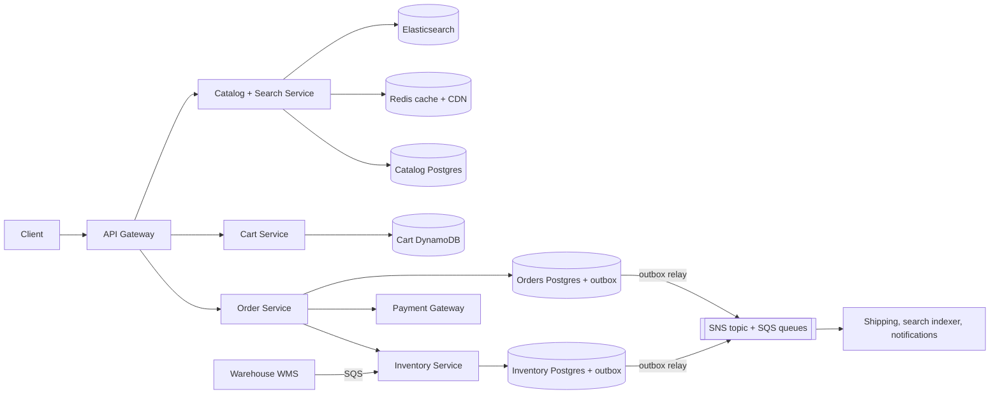
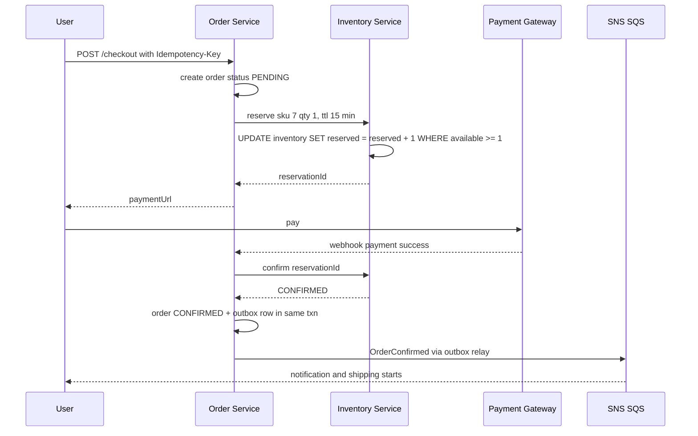
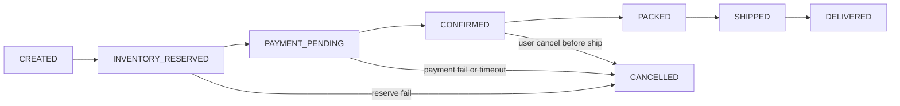

# Design E-commerce Inventory & Orders (Amazon / Flipkart)

**In one line:** Users browse products, add them to the cart, and check out. The core challenge is that **stock we do not have must never be sold (oversell)**, and data must stay consistent across separate services like order, payment, inventory and shipping.

**What the interviewer checks in this question:** how you think about the read path (catalog, search, cache) and the write path (inventory, orders) separately, reservation with TTL, oversell prevention, saga + compensation, the outbox pattern, and where eventual consistency is fine vs where you need strong.

---

## Step 1: Clarify with the interviewer (3–5 min)

| You ask | Typical answer | Effect on design |
|---|---|---|
| "Are catalog, cart, checkout, inventory and order tracking in scope? Is the payment gateway third-party?" | Yes, payment is third-party | No internal design for payment |
| "Are there multiple warehouses? Do we track stock per warehouse?" | Yes, 50+ warehouses | Inventory key = (sku, warehouse) |
| "Is oversell never acceptable?" | Not acceptable (a small buffer is ok) | Strong consistency at checkout |
| "Can 'In stock' on the product page be a bit stale?" | Yes, a few seconds | Cache + search index, eventual |
| "How long do we hold stock during checkout?" | 10–15 min | Reservation TTL |
| "Is flash sale (Big Billion Days) in scope?" | Focus on the normal flow, mention the spike | Flash sale is a separate deep dive, link it |

> **Say:** "I will keep the read path and the write path separate. Browse/search is eventually consistent and cached. Inventory reservation at checkout is strongly consistent. I will use a saga across order, payment, inventory and shipping."

## Step 2: Requirements

**Functional**
1. Users should be able to search products and see a product page (price, details, "In stock" badge)
2. Users should be able to add/remove items in the cart
3. Users should be able to check out: reserve stock → payment → confirm order
4. Users should be able to track order status (placed, packed, shipped, delivered, cancelled)

**Out of scope:** payment gateway internals, flash sale spikes (a separate problem), seller onboarding, pricing/discounts engine, reviews. Warehouse stock sync only as an input (WMS events).

**Non-functional (in priority order)**
1. **No oversell:** strong consistency on the checkout path
2. **Durability:** not a single confirmed order is lost
3. **Availability:** browse and cart 99.99%, checkout 99.9%
4. **Latency:** product page p99 < 200ms, checkout < 2s (excluding payment)
5. **Scale:** 50M DAU, ~60K peak read QPS, ~600 orders/sec peak (100:1 read/write)

**CAP choice:** **CP** for inventory reserve and orders (a failed checkout is better than selling stock we do not have). **AP** for catalog, the search badge and the cart (slightly stale is fine, a down page is not).

## Step 3: Estimation (only what changes the design)

- 50M DAU × 20 page views = **1B reads/day ≈ 12K QPS**, peak 5x ≈ 60K. Catalog cache + CDN are a must.
- Orders: 5M/day ≈ **60 orders/sec**, 10x on a sale day ≈ 600/sec. One Postgres primary handles it easily. **No sharding yet.**
- Catalog: 100M SKUs × 5KB ≈ **500 GB**. Fits in Postgres, Elasticsearch for search.
- Order events: ~5 per order → peak **~3K events/sec**. Not Kafka-level volume, a managed queue is enough.
- A hot SKU (a new iPhone) can get thousands of writes/sec on a single row. **The real problem is contention**, not throughput.

> **Say:** "The average order rate is small. Two things are hard: read scale, which a cache solves, and contention on one hot SKU, which conditional updates and reservations solve."

## Step 4: Core entities

- **Product / SKU**: sku_id, title, attributes, price, seller_id
- **Inventory**: sku_id, warehouse_id, total, reserved, version
- **Reservation**: id, order_id, sku_id, warehouse_id, qty, status (`HELD`, `CONFIRMED`, `RELEASED`), expires_at
- **Cart**: user_id, items[{sku_id, qty}]
- **Order**: id, user_id, items, amount, status, idempotency_key
- **Shipment**: id, order_id, warehouse_id, status, tracking_id

`available = total - reserved`, not a separate column.

## Step 5: APIs

```http
GET    /products/search?q=iphone&pincode=411001       → list + inStock badge
GET    /products/{sku}?pincode=411001                 → details, price, availability
POST   /cart/items        {sku, qty}                  → cart
POST   /checkout          {cartId, addressId}         → {orderId, reservationExpiresAt, paymentUrl}
       Header: Idempotency-Key: <uuid>
POST   /payments/webhook  {orderId, paymentId, status} → 200
GET    /orders/{orderId}                              → status timeline
POST   /orders/{orderId}/cancel                       → status
```

> **Say:** "Checkout reserves the stock and returns a payment URL. The order is confirmed on the payment webhook. So checkout takes an Idempotency-Key, so a double click does not create two orders."

## Step 6: High-level design

**Start with a simple v1:** client → one app service → one Postgres (catalog, cart, inventory, orders). Checkout does a conditional UPDATE + order insert in one transaction. This covers FR2–FR4. What pushes us beyond it: **60K peak read QPS** (Redis + CDN), **full-text search over 100M SKUs** (Elasticsearch), **cart 99.99% always-writable** (DynamoDB), and **external payment + shipping** (saga + outbox + queue).



**Why each component:**
- **Redis cache + CDN:** 60K peak read QPS, product page p99 < 200ms. Read replicas alone get a high tail latency at this QPS.
- **Elasticsearch:** FR1 search, full-text + typos + facets over 100M SKUs. Postgres full-text with facets is slow here.
- **Catalog Postgres (JSONB attributes):** 500GB, few writes. No need for a document store.
- **Cart DynamoDB:** the cart must be 99.99% always-writable (AP), per-user key-value, TTL for abandoned carts. In Redis a cart can be lost on eviction. The cart does **not** reserve stock.
- **Order Service:** the saga orchestrator. The order state machine lives here.
- **Inventory Service (separate):** the single source of truth for stock, with two writers (checkout + WMS). Keeps the hot-row load isolated from the orders DB.
- **Outbox + SNS/SQS:** the DB write and the event are atomic. Peak ~3K events/sec, each consumer needs its own queue + retries + DLQ, no replay. So a managed queue, **not Kafka**. Use Kafka when you need replay or the volume nears ~100K/sec.
- **Warehouse WMS → SQS:** physical stock changes (inward, damage, returns) handled as tasks, with retries.

**FR → component:** FR1 → Catalog + ES + Redis/CDN. FR2 → Cart DynamoDB. FR3 → Order + Inventory + Payment. FR4 → Orders Postgres + queue consumers.

## Step 7: Main flow: checkout to order confirm



## Step 8: Data model & DB choice

```sql
inventory(sku_id, warehouse_id, total INT, reserved INT, version INT,
          PRIMARY KEY(sku_id, warehouse_id), CHECK (reserved <= total))
reservations(id PK, order_id, sku_id, warehouse_id, qty, status, expires_at,
             INDEX(status, expires_at))
orders(id PK, user_id, status, amount, payment_id UNIQUE, idempotency_key UNIQUE, created_at)
order_items(order_id, sku_id, qty, price)
outbox(id PK, aggregate_id, event_type, payload JSON, created_at, published BOOL)
```

- **Inventory + Orders → Postgres:** ACID, conditional updates, unique constraints. Single primary + replica, 600 writes/sec is easy. Shard on `sku_id` once data grows.
- **Catalog → Postgres JSONB + Elasticsearch:** flexible attributes, search.
- **Cart → DynamoDB:** simple key-value, always writable, TTL for abandoned carts.

`CHECK (reserved <= total)` and the conditional `WHERE` together stop oversell at the DB level.

## Step 9: Deep dives (where the interviewer will push)

### 9.1 How will you stop oversell?
**NFR:** no oversell, strong consistency at checkout.

Option A, **conditional UPDATE** (atomic, simplest):
```sql
UPDATE inventory SET reserved = reserved + :qty
WHERE sku_id = :sku AND warehouse_id = :wh AND total - reserved >= :qty;
-- rows affected = 0  →  out of stock
```
Option B, **optimistic lock** (version column): read the row, check, `UPDATE ... SET version = version + 1 WHERE version = :old`. Retry on conflict. Good when contention is low.

Option C, **pessimistic** `SELECT FOR UPDATE`: works, but on a hot SKU the lock queue gets long.

> **Say:** "I will use a conditional UPDATE. Check and decrement in one statement, and the DB row lock lasts only milliseconds. Safe even on a hot SKU. For extreme spikes (flash sale) I will add a Redis pre-decrement + queue, which is covered in [Flash Sale](../02-questions/t2-15-flash-sale.md)."

**Trade-off:** on a hot SKU all writes serialize on one row. We trade throughput for correctness.

### 9.2 Reservation with TTL: reserve → confirm → release
**NFR:** no oversell + stock is not blocked for nothing.
- **Reserve** (at checkout): `reserved += qty`, reservation row `HELD`, `expires_at = now + 15 min`.
- **Confirm** (payment success): reservation `CONFIRMED`, `total -= qty`, `reserved -= qty`. Now the stock is physically allocated.
- **Release** (payment fail / user cancel / TTL expire): `reserved -= qty`, status `RELEASED`.
- **TTL expiry:** a sweeper job picks up `WHERE status = 'HELD' AND expires_at < now()` every minute and releases them. Or an SQS delay message (max 15 min) that triggers the release.
- A late payment arrives and the reservation is already released? Try to reserve again. If no stock is available, **auto refund**.
- Why not reserve in the cart? People keep things in the cart for weeks. Stock would stay blocked for nothing.

**Trade-off:** for up to 15 min, others may see "out of stock" for stock that never sells.

### 9.3 Order state machine + saga
**NFR:** durability, no confirmed order or payment gets stuck midway.


Saga (orchestration, the Order Service is the orchestrator):

| Step | Action | Compensation if a later step fails |
|---|---|---|
| 1 | Create order `CREATED` | Order `CANCELLED` |
| 2 | Inventory reserve | Release reservation |
| 3 | Payment | Refund |
| 4 | Inventory confirm | Put stock back `total += qty` |
| 5 | Create shipment | Cancel shipment |

- Every step must be **idempotent** (reservationId, paymentId unique), because there will be retries.
- Why orchestration and not choreography? The order flow has 5 steps in a clear order. State is visible in one place, so debugging is easy. Choreography turns into a web of events.
- No 2PC, because the payment gateway is external and 2PC holds locks for a long time.

**Trade-off:** intermediate states (reserved but unpaid) are visible for a while. We write compensation logic instead of getting atomicity.

### 9.4 Outbox + events, inventory sync, search updates
**NFR:** durability (no event lost) + badge freshness within seconds.
- **Dual write problem:** the order is saved in the DB but the queue publish fails → shipping never finds out. The solution is the **outbox**: in the same DB transaction, update `orders` + insert an `outbox` row. A relay (a poller every ~1 sec, or Debezium CDC) publishes from the outbox to SNS, and SNS fans out to each consumer's SQS queue. At-least-once, consumers are idempotent.
- **Warehouse sync:** WMS events (`STOCK_INWARD`, `DAMAGED`, `RETURN_RESTOCKED`) go to SQS. The Inventory Service applies them (`total += x`) with event id dedupe. Nightly **reconciliation**: WMS physical count vs DB, alert/adjust on mismatch.
- **Search index / "In stock" badge:** on an inventory change, a `StockChanged` event → the search indexer updates Elasticsearch and invalidates the Redis cache. Not on every unit change, only when a **threshold is crossed** (in stock ↔ out of stock ↔ "only 3 left"), otherwise you get a write storm on the index.

**Trade-off:** delivery is at-least-once, so every consumer must dedupe by event id.

### 9.5 Badge eventual, checkout strong
**NFR:** product page < 200ms + no oversell, together.
- The product page's "In stock" comes from the cache/ES and can be a few seconds stale. Even when it is wrong, the damage is small.
- At checkout, the **final truth is the conditional update in the Inventory DB**. If the badge says "In stock" but the reserve fails, show the user "Sorry, it just went out of stock".
- This is like CQRS: the write model (inventory DB) is strong, the read model (ES/cache) is eventual.

**Trade-off:** sometimes the user hits "out of stock" at checkout. A small bad experience in return for a fast page.

## Step 10: Decision table (what we chose, why, what we did not)

| Decision | Why we chose it | What we did not choose, and why |
|---|---|---|
| **Conditional UPDATE** for reserve | Atomic check + decrement, short lock, oversell impossible | **Read-then-write in the app:** race. **SELECT FOR UPDATE:** lock queue on hot SKUs. Sacrifice: writes serialize on a hot row |
| **Reservation with TTL** at checkout | Stock is safe during the payment window, auto release on abandon | **Reserve in the cart:** stock blocked for weeks. **Check after payment:** oversell + refunds. Sacrifice: stock held up to 15 min |
| **Saga (orchestration)** | Separate DBs, external payment, clear compensations | **2PC:** the gateway does not support it, long locks. Sacrifice: compensation code, temporary inconsistent states |
| **Outbox + SNS/SQS** | DB update and event are atomic, per-consumer retries + DLQ, ~3K events/sec | **Kafka:** no need for replay or 100K/sec, more ops. **Direct publish after commit:** event missed on a crash. Sacrifice: no replay, at-least-once dedupe |
| **Postgres single primary** (inventory, orders, catalog) | ACID + constraints, 600 writes/sec is easy | **Sharding now:** complexity with no need. **Cassandra:** weak conditional multi-row updates. Sacrifice: vertical limit, shard later |
| **ES + Redis/CDN for catalog** | Search, facets, 60K QPS reads | **Search straight from SQL:** slow, no typo handling. Sacrifice: badge stale for seconds, a sync pipeline |
| **DynamoDB for cart** | Always-writable, per-user key, TTL | **Postgres table:** works, but loads the checkout DB. **Redis:** cart lost on eviction. Sacrifice: one more datastore |
| **Per-warehouse stock** | Ship from the nearest warehouse, accurate allocation | **Single global count:** wrong fulfilment. Sacrifice: more rows, allocation logic |

## Step 11: Failures & bottlenecks

| What failed | What happens | How to handle it |
|---|---|---|
| Payment webhook missed | Money deducted, order PENDING, stock HELD | A reconciliation job asks the gateway for status, before the reservation TTL |
| Inventory Service down | Checkout stops | Browse/cart keep working. Multiple replicas, circuit breaker, clear error |
| Sweeper job stuck | Stock stays HELD for nothing | Make the job HA, ignore expired reservations in the `available` check |
| Outbox relay / queue lag | Shipping/search late | Alert on pending rows in the outbox, scale the relay, failed messages to a DLQ + replay script |
| Hot SKU | Thousands of updates on one row | Split stock into N sub-buckets, or use the flash sale flow (Redis + queue) |
| WMS and DB mismatch | Oversell or phantom stock | Nightly reconciliation + safety buffer (hold back 1–2 units) |

## Step 12: How to make it better (say this yourself at the end)

> "If I had more time, I would improve these:"
- **Smart allocation:** reserve from the warehouse nearest to the pincode, based on cost + delivery time
- **Inventory buckets** and a Redis front for hot SKUs, the flash sale pattern
- A **data warehouse** stream of order events (Kafka fits here: replay + many analytics consumers), for demand forecasting

## Step 13: Likely follow-up questions

- "What if two people buy the last unit at the same time?" → conditional UPDATE, one gets 1 row affected, the other gets 0 → out of stock (Step 9.1)
- "What happens to the stock if the user does not pay?" → TTL expires, the sweeper releases it, order `CANCELLED`
- "Payment succeeded, but inventory confirm failed?" → saga retry (idempotent). If it still fails, refund + cancel the order
- "Order from one warehouse, but stock was in another?" → reserve per (sku, warehouse), the allocation logic picks the nearest available
- "The order was saved in the DB, but the queue was down?" → outbox, the relay will publish later
- "Search showed in stock, but checkout did not find it?" → expected, the badge is eventual, checkout is strong (Step 9.5)
- "1 million people on one SKU during Big Billion Days?" → [Flash Sale](../02-questions/t2-15-flash-sale.md): Redis atomic decrement, queue, rate limit
- **Senior signal:** raise on your own that the bottleneck is not average load but **one hot SKU's inventory row**: all reserves serialize on it, and a missed payment webhook keeps stock HELD for 15 min. Fix: sub-buckets, the flash sale flow, and a webhook reconciliation job.

## 2-minute recap (read this before the interview)

> In e-commerce, the read path and the write path are separate. Catalog and search are read-heavy: Elasticsearch + Redis + CDN, with an eventually consistent "In stock" badge. The cart lives in DynamoDB and does not reserve stock. At checkout, the Order Service runs a saga: order CREATED → Inventory reserve (conditional `UPDATE ... WHERE total - reserved >= qty`, 15 min TTL) → payment → confirm → shipment. If anything fails, compensate: release, refund, cancel. Every step is idempotent. The order state machine is clear. Events go to SNS/SQS via the outbox pattern (only ~3K/sec, so not Kafka), and shipping, the search indexer and notifications run on them. One Postgres primary is enough, shard later. Inventory is per (sku, warehouse), synced from WMS events with nightly reconciliation. Badge eventual, checkout strong. The flash sale pattern for extreme spikes.

## Checklist

- [ ] I can explain the split between the read path (catalog/search) and the write path (inventory/orders)
- [ ] I can write out oversell prevention with a conditional UPDATE
- [ ] I can explain the reserve → confirm → release flow with TTL
- [ ] I can draw the order state machine
- [ ] I can tell the saga steps and the compensation for each step
- [ ] I can explain why the outbox pattern is needed and how it works
- [ ] I can explain the eventual "In stock" badge vs strong consistency at checkout
- [ ] I can explain warehouse sync and reconciliation
