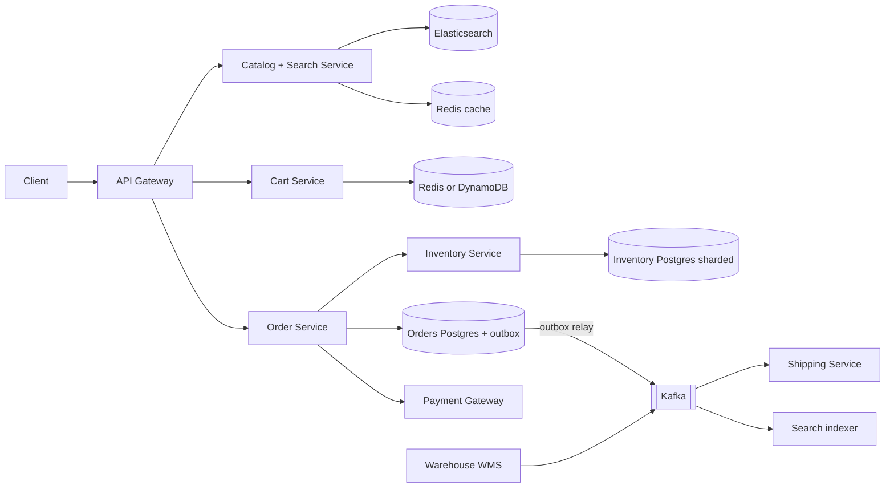
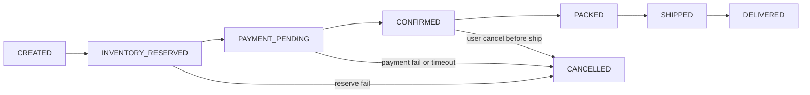

# Design E-commerce Inventory & Orders (Amazon / Flipkart)

**In one line:** Users browse products, add them to the cart, and check out. The core challenge is that **stock we do not have must never be sold (oversell)**, and data must stay consistent across separate services like order, payment, inventory and shipping.

**What the interviewer checks in this question:** how you think about the read path (catalog, search, cache) and the write path (inventory, orders) separately, reservation with TTL, oversell prevention, saga + compensation, the outbox pattern, and where eventual consistency is fine vs where you need strong.

---

## Step 1: Clarify with the interviewer (3–5 min)

| You ask | Typical answer | Effect on design |
|---|---|---|
| "Are catalog, cart, checkout, inventory and order tracking in scope? Is the payment gateway third-party?" | Yes, payment is third-party | No internal design for payment |
| "Are there multiple warehouses? Do we track stock per warehouse?" | Yes, 50+ warehouses | Inventory key = (sku, warehouse) |
| "Is oversell never acceptable?" | Not acceptable (a small buffer is ok) | Strong consistency at checkout |
| "Can 'In stock' on the product page be a bit stale?" | Yes, a few seconds | Cache + search index, eventual |
| "How long do we hold stock during checkout?" | 10–15 min | Reservation TTL |
| "Is flash sale (Big Billion Days) in scope?" | Focus on the normal flow, mention the spike | Flash sale is a separate deep dive, link it |

> **Say:** "I will keep the read path and the write path separate. Browse/search is eventually consistent and cached. Inventory reservation at checkout is strongly consistent. I will use a saga across order, payment, inventory and shipping."

## Step 2: Requirements

**Functional**
1. Product search and product page (price, details, "In stock" badge)
2. Add/remove items in the cart
3. Checkout: reserve stock → payment → confirm order
4. Track order state (placed, packed, shipped, delivered, cancelled)
5. Stock updates from the warehouse (inward, damage, returns) flow into the system

**Non-functional**
- **No oversell:** strong consistency on the checkout path
- **High availability:** browse and cart always work (99.99%)
- **Low latency:** product page < 200ms, checkout < 2s (excluding payment)
- **Read-heavy:** ~100:1 browse vs order
- **Durability:** not a single confirmed order is lost

## Step 3: Estimation (only what changes the design)

- 50M DAU × 20 page views = **1B reads/day ≈ 12K QPS**, peak 5x ≈ 60K. Catalog cache + CDN are a must.
- Orders: 5M/day ≈ **60 orders/sec**, 10x on a sale day ≈ 600/sec. Normal SQL can handle it, and more with sharding by sku/warehouse.
- Catalog: 100M SKUs × 5KB ≈ **500 GB**. Elasticsearch + document store.
- A hot SKU (a new iPhone) can get thousands of writes/sec on a single row. **The real problem is contention**, not throughput.

> **Say:** "The average order rate is small. Two things are hard: read scale, which a cache solves, and contention on one hot SKU, which conditional updates and reservations solve."

## Step 4: Core entities

- **Product / SKU**: sku_id, title, attributes, price, seller_id
- **Inventory**: sku_id, warehouse_id, total, reserved, version
- **Reservation**: id, order_id, sku_id, warehouse_id, qty, status (`HELD`, `CONFIRMED`, `RELEASED`), expires_at
- **Cart**: user_id, items[{sku_id, qty}]
- **Order**: id, user_id, items, amount, status, idempotency_key
- **Shipment**: id, order_id, warehouse_id, status, tracking_id

`available = total - reserved`, not a separate column.

## Step 5: APIs

```http
GET    /products/search?q=iphone&pincode=411001       → list + inStock badge
GET    /products/{sku}?pincode=411001                 → details, price, availability
POST   /cart/items        {sku, qty}                  → cart
POST   /checkout          {cartId, addressId}         → {orderId, reservationExpiresAt, paymentUrl}
       Header: Idempotency-Key: <uuid>
POST   /payments/webhook  {orderId, paymentId, status} → 200
GET    /orders/{orderId}                              → status timeline
POST   /orders/{orderId}/cancel                       → status
```

> **Say:** "Checkout reserves the stock and returns a payment URL. The order is confirmed on the payment webhook. So checkout takes an Idempotency-Key, so a double click does not create two orders."

## Step 6: High-level design



**Why each component:**
- **Catalog + Search:** read-heavy. Full-text + filters in Elasticsearch, product page from Redis/CDN.
- **Cart Service:** high-write, low-value data. Redis/DynamoDB, a key per user. The cart does **not** reserve stock.
- **Order Service:** the saga orchestrator. The order state machine lives here.
- **Inventory Service:** the single source of truth for stock. Reserve, confirm and release happen here. Sharded by sku_id.
- **Outbox + Kafka:** the DB write and the event publish are atomic. Shipping, the search indexer and notifications run on events.
- **Warehouse WMS:** sends events for physical stock changes (inward, damage, returns).

## Step 7: Main flow: checkout to order confirm


## Step 8: Data model & DB choice

```sql
inventory(sku_id, warehouse_id, total INT, reserved INT, version INT,
          PRIMARY KEY(sku_id, warehouse_id), CHECK (reserved <= total))
reservations(id PK, order_id, sku_id, warehouse_id, qty, status, expires_at,
             INDEX(status, expires_at))
orders(id PK, user_id, status, amount, payment_id UNIQUE, idempotency_key UNIQUE, created_at)
order_items(order_id, sku_id, qty, price)
outbox(id PK, aggregate_id, event_type, payload JSON, created_at, published BOOL)
```

- **Inventory + Orders → Postgres/MySQL:** ACID, conditional updates, unique constraints. Inventory shard key is `sku_id`.
- **Catalog → document store (MongoDB/DynamoDB) + Elasticsearch:** flexible attributes, search.
- **Cart → Redis/DynamoDB:** simple key-value, TTL for abandoned carts.

`CHECK (reserved <= total)` and the conditional `WHERE` together stop oversell at the DB level.

## Step 9: Deep dives (where the interviewer will push)

### 9.1 How will you stop oversell?
Option A, **conditional UPDATE** (atomic, simplest):
```sql
UPDATE inventory SET reserved = reserved + :qty
WHERE sku_id = :sku AND warehouse_id = :wh AND total - reserved >= :qty;
-- rows affected = 0  →  out of stock
```
Option B, **optimistic lock** (version column): read the row, check, `UPDATE ... SET version = version + 1 WHERE version = :old`. Retry on conflict. Good when contention is low.

Option C, **pessimistic** `SELECT FOR UPDATE`: works, but on a hot SKU the lock queue gets long.

> **Say:** "I will use a conditional UPDATE. Check and decrement in one statement, and the DB row lock lasts only milliseconds. Safe even on a hot SKU. For extreme spikes (flash sale) I will add a Redis pre-decrement + queue, which is covered in [Flash Sale](../02-questions/t2-15-flash-sale.md)."

### 9.2 Reservation with TTL: reserve → confirm → release
- **Reserve** (at checkout): `reserved += qty`, reservation row `HELD`, `expires_at = now + 15 min`.
- **Confirm** (payment success): reservation `CONFIRMED`, `total -= qty`, `reserved -= qty`. Now the stock is physically allocated.
- **Release** (payment fail / user cancel / TTL expire): `reserved -= qty`, status `RELEASED`.
- **TTL expiry:** a sweeper job picks up `WHERE status = 'HELD' AND expires_at < now()` every minute and releases them. Or a delay queue (Kafka/SQS delayed message) that triggers the release after 15 min.
- A late payment arrives and the reservation is already released? Try to reserve again. If no stock is available, **auto refund**.
- Why not reserve in the cart? People keep things in the cart for weeks. Stock would stay blocked for nothing.

### 9.3 Order state machine + saga


Saga (orchestration, the Order Service is the orchestrator):

| Step | Action | Compensation if a later step fails |
|---|---|---|
| 1 | Create order `CREATED` | Order `CANCELLED` |
| 2 | Inventory reserve | Release reservation |
| 3 | Payment | Refund |
| 4 | Inventory confirm | Put stock back `total += qty` |
| 5 | Create shipment | Cancel shipment |

- Every step must be **idempotent** (reservationId, paymentId unique), because there will be retries.
- Why orchestration and not choreography? The order flow has 5 steps in a clear order. State is visible in one place, so debugging is easy. Choreography turns into a web of events.
- No 2PC, because the payment gateway is external and 2PC holds locks for a long time.

### 9.4 Outbox + events, inventory sync, search updates
- **Dual write problem:** the order is saved in the DB but the Kafka publish fails → shipping never finds out. The solution is the **outbox**: in the same DB transaction, update `orders` + insert an `outbox` row. A relay (Debezium CDC or a poller) publishes from the outbox to Kafka. At-least-once, consumers are idempotent.
- **Warehouse sync:** WMS events (`STOCK_INWARD`, `DAMAGED`, `RETURN_RESTOCKED`) go to Kafka. The Inventory Service applies them (`total += x`) with event id dedupe. Nightly **reconciliation**: WMS physical count vs DB, alert/adjust on mismatch.
- **Search index / "In stock" badge:** on an inventory change, a `StockChanged` event → the search indexer updates Elasticsearch and invalidates the Redis cache. Not on every unit change, only when a **threshold is crossed** (in stock ↔ out of stock ↔ "only 3 left"), otherwise you get a write storm on the index.

### 9.5 Badge eventual, checkout strong
- The product page's "In stock" comes from the cache/ES and can be a few seconds stale. Even when it is wrong, the damage is small.
- At checkout, the **final truth is the conditional update in the Inventory DB**. If the badge says "In stock" but the reserve fails, show the user "Sorry, it just went out of stock".
- This is like CQRS: the write model (inventory DB) is strong, the read model (ES/cache) is eventual.

## Step 10: Decision table (what we chose, why, what we did not)

| Decision | Why we chose it | What we did not choose, and why |
|---|---|---|
| **Conditional UPDATE** for reserve | Atomic check + decrement, short lock, oversell impossible | **Read-then-write in the app:** race condition. **SELECT FOR UPDATE:** lock queue on hot SKUs |
| **Reservation with TTL** at checkout | Stock is safe during the payment window, auto release on abandon | **Reserve in the cart:** stock blocked for weeks. **Check after payment:** oversell + refunds |
| **Saga (orchestration)** | Services have separate DBs, external payment, clear compensations | **2PC:** the external gateway does not support it, long locks |
| **Outbox + Kafka** | DB update and event are atomic, no event is lost | **Direct publish after commit:** event missed on a crash |
| **Postgres sharded by sku** | ACID + constraints, hot SKUs spread out | **Cassandra:** weak conditional multi-row updates and constraints |
| **ES + Redis for catalog** | Search, filters, 60K QPS reads | **Search straight from SQL:** slow, LIKE does not understand typos |
| **Per-warehouse stock** | Ship from the nearest warehouse, accurate allocation | **Single global count:** wrong fulfilment, slow delivery |

## Step 11: Failures & bottlenecks

| What failed | What happens | How to handle it |
|---|---|---|
| Payment webhook missed | Money deducted, order PENDING, stock HELD | A reconciliation job asks the gateway for status, before the reservation TTL |
| Inventory Service down | Checkout stops | Browse/cart keep working. Multiple replicas, circuit breaker, clear error |
| Sweeper job stuck | Stock stays HELD for nothing | Make the job HA, ignore expired reservations in the `available` check |
| Kafka relay lag | Shipping/search late | Alert on pending rows in the outbox, scale the relay |
| Hot SKU | Thousands of updates on one row | Split stock into N sub-buckets, or use the flash sale flow (Redis + queue) |
| WMS and DB mismatch | Oversell or phantom stock | Nightly reconciliation + safety buffer (hold back 1–2 units) |

## Step 12: How to make it better (say this yourself at the end)

> "If I had more time, I would improve these:"
- **Smart allocation:** reserve from the warehouse nearest to the pincode, based on cost + delivery time
- **Split shipments:** items of one order from different warehouses
- **Backorder / pre-order** support, when stock is about to arrive
- **Inventory buckets** and a Redis front for hot SKUs, the flash sale pattern
- A **data warehouse** stream of order events, for demand forecasting

## Step 13: Likely follow-up questions

- "What if two people buy the last unit at the same time?" → conditional UPDATE, one gets 1 row affected, the other gets 0 → out of stock (Step 9.1)
- "What happens to the stock if the user does not pay?" → TTL expires, the sweeper releases it, order `CANCELLED`
- "Payment succeeded, but inventory confirm failed?" → saga retry (idempotent). If it still fails, refund + cancel the order
- "Order from one warehouse, but stock was in another?" → reserve per (sku, warehouse), the allocation logic picks the nearest available
- "The order was saved in the DB, but Kafka was down?" → outbox, the relay will publish later
- "Search showed in stock, but checkout did not find it?" → expected, the badge is eventual, checkout is strong (Step 9.5)
- "1 million people on one SKU during Big Billion Days?" → [Flash Sale](../02-questions/t2-15-flash-sale.md): Redis atomic decrement, queue, rate limit

## 2-minute recap (read this before the interview)

> In e-commerce, the read path and the write path are separate. Catalog and search are read-heavy: Elasticsearch + Redis + CDN, with an eventually consistent "In stock" badge. The cart lives in Redis/DynamoDB and does not reserve stock. At checkout, the Order Service runs a saga: order CREATED → Inventory reserve (conditional `UPDATE ... WHERE total - reserved >= qty`, 15 min TTL) → payment → confirm → shipment. If anything fails, compensate: release, refund, cancel. Every step is idempotent. The order state machine is clear. Events go to Kafka via the outbox pattern, and shipping, the search indexer and notifications run on them. Inventory is per (sku, warehouse), synced from WMS events with nightly reconciliation. Badge eventual, checkout strong. The flash sale pattern for extreme spikes.

## Checklist

- [ ] I can explain the split between the read path (catalog/search) and the write path (inventory/orders)
- [ ] I can write out oversell prevention with a conditional UPDATE
- [ ] I can explain the reserve → confirm → release flow with TTL
- [ ] I can draw the order state machine
- [ ] I can tell the saga steps and the compensation for each step
- [ ] I can explain why the outbox pattern is needed and how it works
- [ ] I can explain the eventual "In stock" badge vs strong consistency at checkout
- [ ] I can explain warehouse sync and reconciliation
