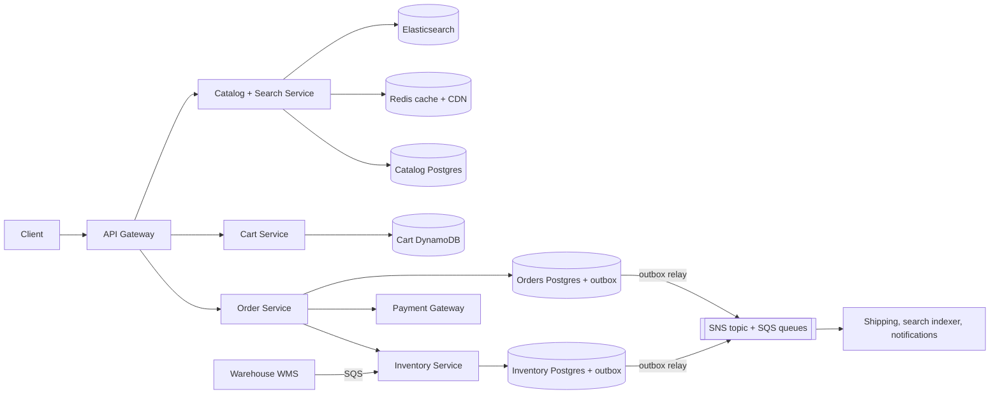
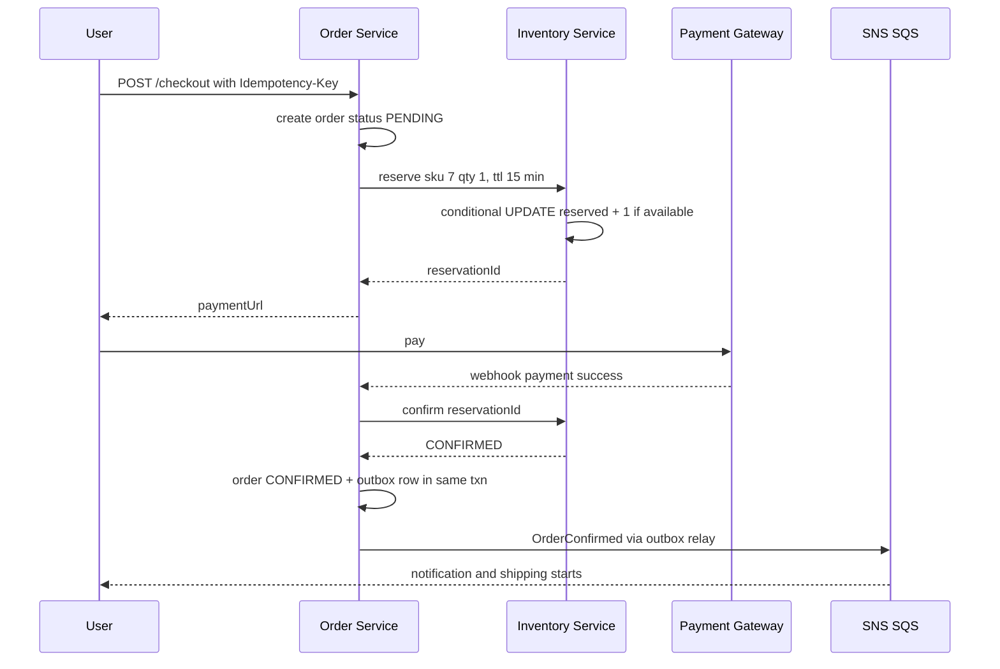
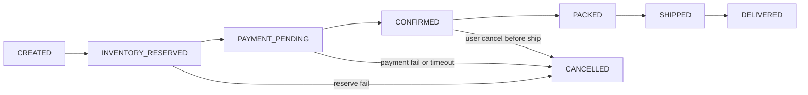

# Design E-commerce Inventory & Orders (Amazon / Flipkart)

**In one line:** browse → cart → checkout. Core challenge: **no oversell**, and consistent data across order, payment, inventory and shipping services.

**What the interviewer checks in this question:** read path (catalog, search, cache) vs write path (inventory, orders), reservation with TTL, oversell prevention, saga + compensation, outbox, where eventual vs strong.

---

## Step 1: Clarify with the interviewer (3–5 min)

| You ask | Typical answer | Effect on design |
|---|---|---|
| "Catalog, cart, checkout, inventory, tracking? Payment third-party?" | Yes | No payment internals |
| "Multiple warehouses? Stock per warehouse?" | Yes, 50+ | Inventory key = (sku, warehouse) |
| "Is oversell acceptable?" | No (small buffer ok) | Strong consistency at checkout |
| "Can the 'In stock' badge be a bit stale?" | Yes, a few seconds | Cache + search index, eventual |
| "How long to hold stock at checkout?" | 10–15 min | Reservation TTL |
| "Flash sale (Big Billion Days) in scope?" | Normal flow, mention the spike | Flash sale separate, link it |

> **Say:** "Browse/search is cached and eventual; checkout reservation is strong. A saga across order, payment, inventory and shipping."

## Step 2: Requirements

**Functional**
1. Search + product page (price, details, "In stock" badge)
2. Cart add/remove
3. Checkout: reserve stock → payment → confirm order
4. Order tracking (placed, packed, shipped, delivered, cancelled)

**Out of scope:** payment internals, flash sale spikes, seller onboarding, pricing/discounts, reviews. WMS events only as input.

**Non-functional (in priority order)**
1. **No oversell:** strong consistency at checkout
2. **Durability:** a confirmed order is never lost
3. **Availability:** browse/cart 99.99%, checkout 99.9%
4. **Latency:** product page p99 < 200ms, checkout < 2s (excl. payment)
5. **Scale:** 50M DAU, ~60K peak read QPS, ~600 orders/sec peak (100:1 read/write)

**CAP choice:** reserve + order → **CP** (a failed checkout beats selling missing stock). Catalog, badge, cart → **AP** (stale is fine, down is not).

## Step 3: Estimation (only what changes the design)

- 50M DAU × 20 views = **1B reads/day ≈ 12K QPS**, peak 5x ≈ 60K → cache + CDN.
- Orders 5M/day ≈ **60/sec**, 10x on sale day ≈ 600/sec → one Postgres primary. **No sharding yet.**
- Catalog 100M SKUs × 5KB ≈ **500 GB** → Postgres + Elasticsearch for search.
- ~5 events/order → peak **~3K events/sec** → managed queue, not Kafka.
- Hot SKU (new iPhone): thousands of writes/sec on one row → **the real problem is contention**.

> **Say:** "Two hard parts: read scale (cache) and hot SKU contention (conditional update + reservation)."

## Step 4: Core entities

- **Product / SKU**: sku_id, title, attributes, price, seller_id
- **Inventory**: sku_id, warehouse_id, total, reserved, version
- **Reservation**: id, order_id, sku_id, warehouse_id, qty, status (`HELD`, `CONFIRMED`, `RELEASED`), expires_at
- **Cart**: user_id, items[{sku_id, qty}]
- **Order**: id, user_id, items, amount, status, idempotency_key
- **Shipment**: id, order_id, warehouse_id, status, tracking_id

`available = total - reserved`, not a separate column.

## Step 5: APIs

```http
GET    /products/search?q=iphone&pincode=411001       → list + inStock badge
GET    /products/{sku}?pincode=411001                 → details, price, availability
POST   /cart/items        {sku, qty}                  → cart
POST   /checkout          {cartId, addressId}         → {orderId, reservationExpiresAt, paymentUrl}
       Header: Idempotency-Key: <uuid>
POST   /payments/webhook  {orderId, paymentId, status} → 200
GET    /orders/{orderId}                              → status timeline
POST   /orders/{orderId}/cancel                       → status
```

> **Say:** "Checkout reserves + returns a payment URL; confirm happens on the webhook. Idempotency-Key = one order even on a double click."

## Step 6: High-level design

**Simple v1:** app → one Postgres, checkout = one txn (conditional UPDATE + order insert). Add-ons: **60K read QPS** → Redis + CDN, **search over 100M SKUs** → Elasticsearch, **cart 99.99% writable** → DynamoDB, **external payment + shipping** → saga + outbox + queue.



**Why each component:**
- **Redis + CDN:** 60K QPS, p99 < 200ms; replicas get high tail latency.
- **Elasticsearch:** full-text + typos + facets on 100M SKUs; Postgres is slow.
- **Catalog Postgres (JSONB):** 500GB, few writes; no document store needed.
- **Cart DynamoDB:** 99.99% writable (AP), per-user KV, TTL. Redis eviction loses carts.
- **Order Service:** saga orchestrator + state machine.
- **Inventory Service (separate):** source of truth, 2 writers (checkout + WMS), hot row isolated.
- **Outbox + SNS/SQS:** DB write + event atomic; ~3K/sec, per-consumer retries + DLQ → **not Kafka** (that is for replay or ~100K/sec).
- **WMS → SQS:** stock changes (inward, damage, returns) with retries.

## Step 7: Main flow: checkout to order confirm



## Step 8: Data model & DB choice

```sql
inventory(sku_id, warehouse_id, total INT, reserved INT, version INT,
          PRIMARY KEY(sku_id, warehouse_id), CHECK (reserved <= total))
reservations(id PK, order_id, sku_id, warehouse_id, qty, status, expires_at,
             INDEX(status, expires_at))
orders(id PK, user_id, status, amount, payment_id UNIQUE, idempotency_key UNIQUE, created_at)
order_items(order_id, sku_id, qty, price)
outbox(id PK, aggregate_id, event_type, payload JSON, created_at, published BOOL)
```

- Postgres: ACID, conditional updates, unique constraints. `CHECK` + conditional `WHERE` = DB-level oversell guard. Shard on `sku_id` later.

## Step 9: Deep dives (where the interviewer will push)

### 9.1 How will you stop oversell?
**NFR:** no oversell.

Option A, **conditional UPDATE** (atomic, simplest):
```sql
UPDATE inventory SET reserved = reserved + :qty
WHERE sku_id = :sku AND warehouse_id = :wh AND total - reserved >= :qty;
-- rows affected = 0  →  out of stock
```
- Option B, **optimistic lock**: `... WHERE version = :old`, retry on conflict; for low contention.
- Option C, **`SELECT FOR UPDATE`**: long lock queue on a hot SKU.

> **Say:** "Conditional UPDATE: check + decrement in one statement, row lock for milliseconds. For extreme spikes, Redis pre-decrement + queue ([Flash Sale](../02-questions/t2-15-flash-sale.md))."

**Trade-off:** hot SKU writes serialize on one row: correctness vs throughput.

### 9.2 Reservation with TTL: reserve → confirm → release
**NFR:** no oversell + stock not blocked for nothing.
- **Reserve:** `reserved += qty`, `HELD`, `expires_at = now + 15 min`.
- **Confirm** (paid): `CONFIRMED`, `total -= qty`, `reserved -= qty`.
- **Release** (payment fail / cancel / TTL): `reserved -= qty`, `RELEASED`.
- **TTL:** sweeper every minute on `WHERE status = 'HELD' AND expires_at < now()`, or an SQS delay message (max 15 min).
- Late payment after release → re-reserve, else **auto refund**.
- No reserve in the cart: carts sit for weeks.

**Trade-off:** for up to 15 min, stock shows "out of stock" that may never sell.

### 9.3 Order state machine + saga
**NFR:** durability, no order/payment stuck midway.


Saga (Order Service is the orchestrator):

| Step | Action | Compensation if a later step fails |
|---|---|---|
| 1 | Create order `CREATED` | Order `CANCELLED` |
| 2 | Inventory reserve | Release reservation |
| 3 | Payment | Refund |
| 4 | Inventory confirm | Put stock back `total += qty` |
| 5 | Create shipment | Cancel shipment |

- Every step **idempotent** (reservationId, paymentId unique); retries will happen.
- Orchestration: 5 ordered steps, state in one place, easy debugging. Choreography = a web of events.
- No 2PC: payment gateway is external, long locks.

**Trade-off:** intermediate states (reserved, unpaid) are visible; compensation code instead of atomicity.

### 9.4 Outbox + events, inventory sync, search updates
**NFR:** no event lost + badge fresh within seconds.
- **Dual write:** DB saved, publish fails → shipping never knows. **Outbox:** same txn updates `orders` + inserts an `outbox` row. Relay (~1 sec poller or Debezium CDC) → SNS → each consumer's SQS queue.
- **Warehouse sync:** WMS events (`STOCK_INWARD`, `DAMAGED`, `RETURN_RESTOCKED`) via SQS, `total += x`, event id dedupe. Nightly **reconciliation**: physical count vs DB, alert/adjust on mismatch.
- **"In stock" badge:** `StockChanged` → ES update + Redis invalidate, only on a **threshold cross** (in stock ↔ out of stock ↔ "only 3 left"), else a write storm.

**Trade-off:** at-least-once → every consumer dedupes by event id.

### 9.5 Badge eventual, checkout strong
**NFR:** page < 200ms + no oversell.
- CQRS: read model (ES/cache badge) seconds stale; write model (Inventory DB conditional update) = final truth.
- Reserve fails → "Sorry, it just went out of stock".

**Trade-off:** occasional "out of stock" at checkout, in return for a fast page.

## Step 10: Decision table (what we chose, why, what we did not)

| Decision | Why we chose it | What we did not choose, and why |
|---|---|---|
| **Conditional UPDATE** for reserve | Atomic check + decrement, short lock | **App read-then-write:** race. **SELECT FOR UPDATE:** lock queue. Sacrifice: hot row serializes |
| **Reservation with TTL** at checkout | Payment window safe, auto release | **Reserve in cart:** blocked for weeks. **Check after payment:** oversell + refunds. Sacrifice: 15 min held |
| **Saga (orchestration)** | Separate DBs, external payment | **2PC:** gateway doesn't support it, long locks. Sacrifice: compensations, temp states |
| **Outbox + SNS/SQS** | Atomic DB + event, DLQ, ~3K/sec | **Kafka:** no replay needed, more ops. **Publish after commit:** missed on crash. Sacrifice: no replay, dedupe |
| **Postgres single primary** (inventory, orders, catalog) | ACID, 600 writes/sec easy | **Sharding now:** needless. **Cassandra:** weak conditional multi-row. Sacrifice: vertical limit |
| **ES + Redis/CDN for catalog** | Search, facets, 60K QPS | **SQL search:** slow, no typos. Sacrifice: stale badge, sync pipeline |
| **DynamoDB for cart** | Always-writable, per-user key, TTL | **Postgres:** loads checkout DB. **Redis:** lost on eviction. Sacrifice: one more datastore |
| **Per-warehouse stock** | Nearest warehouse, accurate allocation | **Global count:** wrong fulfilment. Sacrifice: rows + allocation logic |

## Step 11: Failures & bottlenecks

| What failed | What happens | How to handle it |
|---|---|---|
| Payment webhook missed | Money taken, PENDING, HELD | Reconciliation job asks the gateway before TTL |
| Inventory Service down | Checkout stops | Browse/cart keep working; replicas, circuit breaker |
| Sweeper stuck | Stock HELD for nothing | HA job; ignore expired in `available` |
| Outbox relay / queue lag | Shipping/search late | Pending-rows alert, scale relay, DLQ + replay script |
| Hot SKU | Thousands of updates on one row | N sub-buckets, or flash sale flow (Redis + queue) |
| WMS vs DB mismatch | Oversell / phantom stock | Nightly reconciliation + 1–2 unit safety buffer |

## Step 12: How to make it better (say this yourself at the end)

> "If I had more time, I would improve these:"
- **Smart allocation:** warehouse nearest the pincode, by cost + delivery time
- Order events → **data warehouse** for demand forecasting (Kafka fits here: replay + many consumers)

## Step 13: Likely follow-up questions

- "Two people buy the last unit at once?" → conditional UPDATE: one gets 1 row, the other 0 → out of stock
- "Payment succeeded, confirm failed?" → idempotent retry; still failing → refund + cancel
- "Which warehouse?" → reserve per (sku, warehouse), nearest available
- "1 million people on one SKU on Big Billion Days?" → [Flash Sale](../02-questions/t2-15-flash-sale.md): Redis atomic decrement, queue, rate limit
- **Senior signal:** the bottleneck is not avg load but **one hot SKU's row** (reserves serialize) + a missed webhook = 15 min HELD. Fix: sub-buckets, flash sale flow, webhook reconciliation.

## 2-minute recap (read this before the interview)

> Read path: ES + Redis + CDN, eventual badge. Cart: DynamoDB, no reserve. Checkout saga: reserve (conditional UPDATE, 15 min TTL) → payment → confirm → ship; on failure → release/refund/cancel, idempotent. Outbox → SNS/SQS. One Postgres primary. Stock per (sku, warehouse) + nightly reconciliation. Spikes → flash sale.

## Checklist

- [ ] I can explain the split between the read path (catalog/search) and the write path (inventory/orders)
- [ ] I can write out oversell prevention with a conditional UPDATE
- [ ] I can explain the reserve → confirm → release flow with TTL
- [ ] I can draw the order state machine
- [ ] I can tell the saga steps and the compensation for each step
- [ ] I can explain why the outbox pattern is needed and how it works
- [ ] I can explain the eventual "In stock" badge vs strong consistency at checkout
- [ ] I can explain warehouse sync and reconciliation
