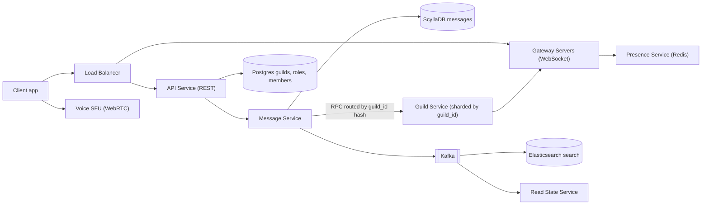
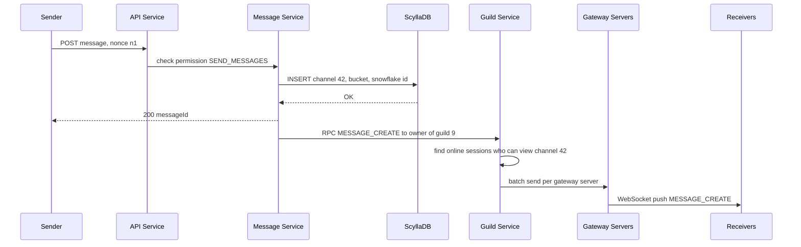
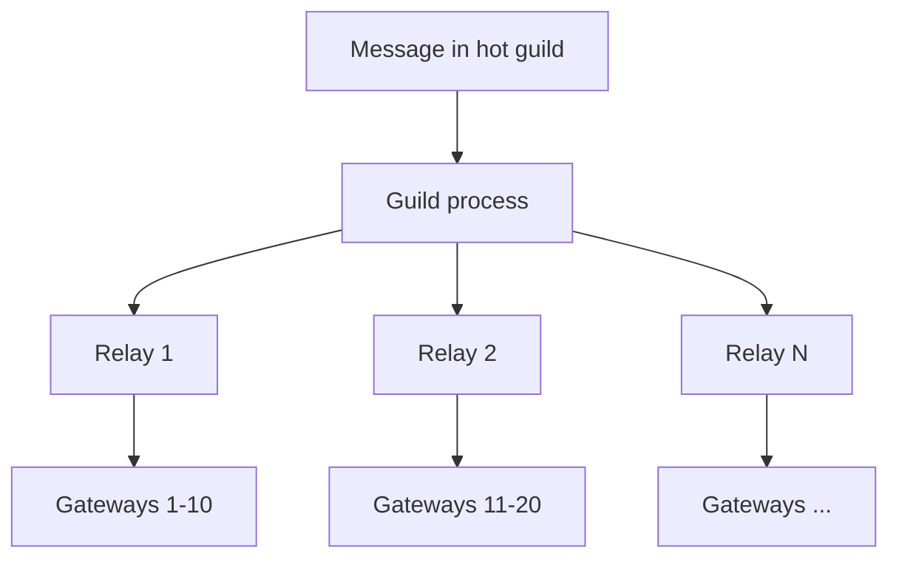

# Design Discord / Slack

**In one line:** guild (server) → channels → real-time messages. Core challenge: **a message shows up instantly for everyone in a 100K+ member channel**, and old history loads fast.

**What the interviewer checks in this question:** the difference from WhatsApp, WebSocket gateway, per-channel fan-out, ScyllaDB partitions, unread counts, cheap presence.

---

## Step 1: Clarify with the interviewer (3–5 min)

| You ask | Typical answer | Effect on design |
|---|---|---|
| "Servers, text channels, DMs, mentions? Voice/video?" | Text is core, voice high level | Separate SFU path for voice |
| "Max members per server / channel?" | Some servers 1M+, 100K+ online in a channel | No per-user inbox, per-channel fan-out |
| "How old should history go?" | Forever, scroll back | Time-bucketed partitions, cheap cold data |
| "How strict is ordering?" | Ordered within a channel | Snowflake ID, sorted in channel |
| "Unread and @mentions?" | Yes, badge needed | Read state per user per channel |
| "Show everyone's presence?" | Only the visible member list | Lazy presence, no broadcast |
| "Search, permissions/roles?" | Yes | Elasticsearch, role bitmask |

> **Say:** "WhatsApp has small groups and a per-user inbox. Here channels are huge and history is shared, so I store a message once and live-push only to online users."

## Step 2: Requirements

**Functional**
1. Send a message in a channel; everyone with permission sees it in real time
2. Scroll channel history (pagination, including old)
3. Unread / @mention badges + presence of visible members
4. Search within your servers (only visible channels)

**Out of scope:** voice/video internals (SFU high level), DMs, threads, bots, file upload, moderation ML.

**Non-functional (in priority order)**
1. **Durability:** an acked message is never lost
2. **Latency:** p99 < 300ms to online members
3. **Availability:** 99.99% send/receive, history read-heavy
4. **Scale:** ~100M MAU, ~10M concurrent WebSockets, ~60K msgs/sec avg (peak ~180K)
5. **Ordering:** only within a channel

**CAP choice:** **AP** + per-channel ordering. A late message during a partition is fine, a failed send is not. Strong consistency only for Postgres metadata (roles, membership).

## Step 3: Estimation (only what changes the design)

- ~10M connections ÷ ~100K per gateway → **~100+ gateway servers** (sticky, stateful).
- ~5B msgs/day ≈ **60K writes/sec**, peak 3x → no single SQL DB, Cassandra/ScyllaDB.
- 5B × 1KB ≈ **5TB/day**, PBs over years → cold tier.
- Fan-out: 1 msg × 100K online = 100K pushes; at 1 msg/sec that is 100K pushes/sec. **The hot guild is the real problem.**

> **Say:** "A wide-column store for writes; in big channels fan-out cost is set by member count, not message count."

## Step 4: Core entities

- **Guild (server)**: id, name, owner_id, member_count
- **Channel**: id, guild_id, type (`TEXT`, `VOICE`), name, permission_overwrites
- **Member**: guild_id, user_id, role_ids, joined_at
- **Role**: id, guild_id, permissions (bitmask), position
- **Message**: channel_id, bucket, message_id (Snowflake), author_id, content, mentions, attachments
- **ReadState**: user_id, channel_id, last_read_message_id, mention_count

## Step 5: APIs

```http
POST /guilds/{guildId}/channels            {name, type}            → {channelId}
POST /channels/{channelId}/messages        {content, nonce}        → {messageId}
GET  /channels/{channelId}/messages?before=<msgId>&limit=50        → [messages]
POST /channels/{channelId}/ack             {messageId}             → 204
GET  /search?guild=1&q=deploy&author=7                             → [messages]
WS   wss://gateway.app/?v=10   events: MESSAGE_CREATE, TYPING_START, PRESENCE_UPDATE
     client → GUILD_SUBSCRIBE {guildId, channelIds, memberListRange}
```

> **Say:** "Send via REST (simple auth, rate limit), receive via WebSocket. The client `nonce` prevents duplicates on retry."

## Step 6: High-level design

**Simple v1:** API → Postgres + one WebSocket server (fine for a small Slack workspace). Broken by: **10M connections** → Guild Service routing, **60K writes/sec + PBs** → ScyllaDB, **100K-member channels** → store once, **search** → ES.



**Why each component:**
- **Gateways:** stateful → only connections + subscriptions.
- **Message Service:** permission check, Snowflake ID, ScyllaDB write, RPC to Guild Service.
- **Guild Service (sharded by guild_id):** guild state (online sessions, who views what) in one process, routing lives here. "Every gateway hears everything" = 60K × 100+, waste. No pub/sub: owner known via consistent hashing, direct RPC.
- **ScyllaDB:** 60K writes/sec (peak 180K), 5TB/day; Postgres = manual sharding pain.
- **Postgres:** guilds, roles, members (relational, strong).
- **Presence (Redis):** 10M × heartbeat/40s ≈ 250K writes/sec, ephemeral data with TTL.
- **Kafka → ES / Read State:** ~180K/sec, **2 consumer groups** (indexer, mentions), **replay** for reindex; SQS has neither. Produce after the Scylla write, retry (or CDC).
- **Elasticsearch:** full-text over PBs (Scylla can't).
- **Voice SFU:** media on a separate path.

## Step 7: Main flow: sending a message in a channel



The Guild Service sends **one batch** per gateway (with all its receivers): ~100 calls, not 100K.

## Step 8: Data model & DB choice

```sql
-- ScyllaDB / Cassandra
messages(
  channel_id bigint, bucket int, message_id bigint,
  author_id bigint, content text, mentions list<bigint>, attachments text,
  PRIMARY KEY ((channel_id, bucket), message_id)
) WITH CLUSTERING ORDER BY (message_id DESC);
-- bucket = message_id timestamp / 10 days

read_states(user_id bigint, channel_id bigint, last_read_id bigint, mention_count int,
  PRIMARY KEY (user_id, channel_id));
```

```sql
-- Postgres
guilds(id PK, name, owner_id)
channels(id PK, guild_id, type, name, position)
members(guild_id, user_id, role_ids[], PRIMARY KEY(guild_id, user_id))
roles(id PK, guild_id, permissions BIGINT, position)
```

- **Snowflake ID** (41-bit time + worker + sequence): unique + time-sortable, no separate `created_at` index.
- **Time bucket:** without one, a busy channel's partition grows to GBs; a 10-day bucket keeps it bounded.
- History: `message_id < before LIMIT 50` in the latest bucket, empty → previous bucket.

## Step 9: Deep dives (where the interviewer will push)

### 9.1 How is this different from WhatsApp? How does fan-out work?
**NFR:** p99 < 300ms, 100K-member channels.
- WhatsApp: groups ~1K, a copy in every inbox (fan-out on write). Discord: 100K+ copies = explosion → **store once**, push only to **online + subscribed sessions**.
- Offline user → pulls history with `before/after`.
- `guild_id` hash → one Guild process; ordering is simple.

> **Say:** "Fan-out on write for small groups; for big channels, store once and push to online. Offline users pull."

**Trade-off:** no inbox for offline users; storage N → 1 copy.

### 9.2 Hot guilds (a server with 1M members)
**NFR:** latency + availability under one hot guild's load.
- **Relay layer:** Guild process → 10–20 relays → gateways (tree fan-out).
- **Lazy guilds:** the client subscribes only to the visible range (`memberListRange 0-99`).
- Typing/presence **throttled or off** in big guilds.
- Slow mode (1 msg / 10 sec per user) + rate limit.



**Trade-off:** an extra hop (a little latency), fewer typing/presence features in big guilds.

### 9.3 Unread counts and mentions
**NFR:** no write per member for badges.
- **Unread dot:** `last_message_id > read_state.last_read_id` → unread; no stored count.
- **Mention badge:** `@user` → Read State Service (Kafka consumer) `mention_count++`. `@everyone` (big server): compute on client or cap.
- Channel opened → `POST /ack` → update `last_read_id`, `mention_count = 0`; batch/debounce writes.

**Trade-off:** mention badge is async, a few seconds late.

### 9.4 Presence at scale
**NFR:** presence events must not be N².
- Naive: one user online in a 1M guild = 1M events.
- **Lazy presence:** only to subscribers of the visible range; the rest on demand.
- Heartbeat ~40 sec; missed → offline after a grace period. Redis `presence:{userId}` with TTL.

**Trade-off:** off-screen status is not live.

### 9.5 Permissions, voice, search (short)
**NFR:** only allowed people see it + FR4.
- **Permissions:** role = 64-bit bitmask (VIEW_CHANNEL, SEND_MESSAGES...). Effective = OR of roles, then channel overwrites (deny/allow). Cached in the Guild Service, checked at fan-out.
- **Voice:** WebRTC to the nearest **SFU**; the SFU forwards streams, no mixing. Signaling via gateway, media over UDP via the SFU.
- **Search:** Kafka → indexer → ES (sharded by guild_id), permission filter at query time.

**Trade-off:** search index lags by seconds.

## Step 10: Decision table (what we chose, why, what we did not)

| Decision | Why we chose it | What we did not choose, and why |
|---|---|---|
| **ScyllaDB, `(channel_id, bucket)`** | 60K writes/sec, bounded, fast range scan | **Postgres:** manual sharding. **channel_id only:** unbounded. Sacrifice: no joins/txns |
| **Store once, push to online** | Saves storage + writes | **Per-user inbox:** 100K copies. Sacrifice: offline pulls |
| **Guild-sharded Guild Service, direct RPC** | State in one place, simple ordering | **All gateways hear all:** waste. **Pub/sub:** extra hop. Sacrifice: hot guild → relay tree |
| **Kafka for search + mentions** | 180K/sec, 2 consumers, replay | **SQS:** no replay. **Sync:** latency. Sacrifice: Kafka ops |
| **Redis for presence** | 250K heartbeats/sec, TTL offline | **Postgres/Scylla:** durable waste. Sacrifice: rebuild after restart |
| **Snowflake IDs** | Time-sortable, coordination-free | **UUID:** not sortable. **Auto-increment:** not distributed. Sacrifice: clock skew |
| **Lazy presence + member list ranges** | Events only to viewers | **Broadcast:** N² events. Sacrifice: off-screen stale |
| **REST send, WebSocket receive** | Simple auth, rate limit, retry | **All over WebSocket:** heavy gateway. Sacrifice: a little send latency |
| **SFU for voice** | No mixing, cheap CPU | **MCU:** costly. **P2P:** bandwidth runs out at 5+. Sacrifice: client download |

## Step 11: Failures & bottlenecks

| What failed | What happens | How to handle it |
|---|---|---|
| Gateway crash | 100K disconnect | Jittered backoff, `RESUME` with last sequence → replay |
| Guild process down | Live events stop | Restart elsewhere, state from Postgres/cache; clients fetch history |
| ScyllaDB hot partition | Busy channel slow | Time buckets, read cache for latest messages, request coalescing |
| Thundering herd after outage | Everyone reconnects at once | Jittered backoff, gateway connection rate limit |
| Spam / raid | Flood | Rate limits, slow mode, new-account limits |

## Step 12: How to make it better (say this yourself at the end)

> "If I had more time, I would improve these:"
- A **data services layer** in front of ScyllaDB: coalesce parallel reads of one channel (what Discord did)
- Old buckets to cold storage (S3 + Parquet), latest in ScyllaDB
- Multi-region gateways, nearest region
- ML spam/abuse moderation from Kafka

## Step 13: Likely follow-up questions

- "What did an offline user miss?" → `last_read_id` vs channel's latest id, then fetch history
- "How is ordering handled?" → Snowflake ID, channel goes through one guild process, client sorts by ID
- "Events lost on a gateway crash?" → `RESUME` with sequence, short buffer replay, else fetch history
- "@everyone with 1M members?" → no per-member counter, client computes, restricted in big servers
- "How does voice scale?" → regional SFU nodes, one voice channel on one SFU
- **Senior signal:** the real bottleneck is **hot guild fan-out** (1 msg × 100K online, on one process) + the **reconnect storm of 10M clients** after an outage. Plan: relay tree, lazy member lists, typing/presence off, jittered backoff + gateway connection rate limit.

## 2-minute recap (read this before the interview)

> Store once in ScyllaDB (`(channel_id, bucket)`, Snowflake). Send REST, receive WebSocket. Message Service → Guild Service (by guild_id) → gateway batches. Hot guilds: relay tree, lazy lists. Unread = id compare, mentions via Kafka. Presence lazy. Search ES. Voice SFU.

## Checklist

- [ ] I can explain the fan-out difference between Discord and WhatsApp
- [ ] I can explain why the ScyllaDB partition key is `(channel_id, bucket)` and why Snowflake IDs
- [ ] I can draw the gateway → Guild Service → gateway batch fan-out flow
- [ ] I can explain the relay tree and lazy member list for hot guilds
- [ ] I can explain the logic for unread counts and mention badges
- [ ] I can explain why lazy presence is needed
- [ ] I can explain RESUME and the reconnect strategy on a gateway crash
- [ ] I can tell the SFU vs MCU vs P2P trade-off for voice
