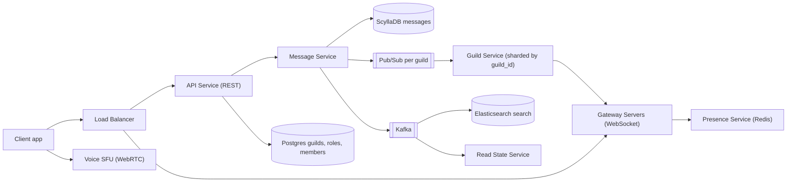
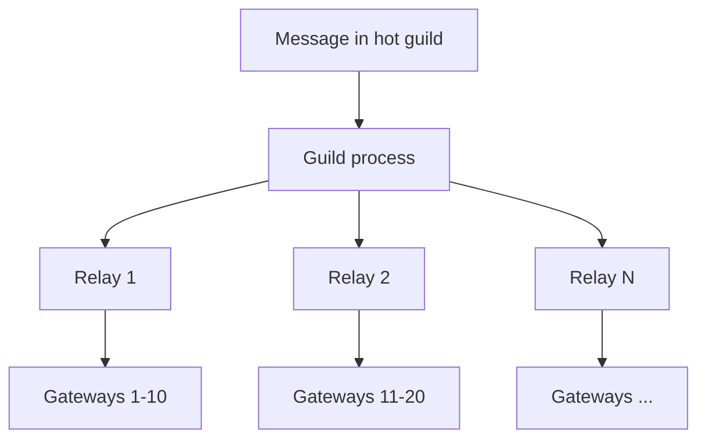

# Design Discord / Slack

**In one line:** Users join servers (guilds), each server has channels, and messages arrive in a channel in real time. The core challenge is that **a message must show up instantly for everyone in a channel with 100K+ members**, and old history must load fast.

**What the interviewer checks in this question:** understanding how this differs from WhatsApp (groups are huge, history is read-heavy), WebSocket gateway design, per-channel fan-out, Cassandra/ScyllaDB partition design, unread counts, and keeping presence cheap at scale.

---

## Step 1: Clarify with the interviewer (3–5 min)

| You ask | Typical answer | Effect on design |
|---|---|---|
| "Are servers, text channels, DMs and mentions in scope? Voice/video?" | Text is core, voice at a high level | A separate SFU path for voice, focus on text |
| "Max members in one server? How big can one channel be?" | Some servers have 1M+ members, 100K+ online in a channel | No per-user inbox like WhatsApp, per-channel fan-out |
| "How old should message history go?" | Forever, users can scroll back | Time-bucketed partitions, cold data on cheap storage |
| "How strict is ordering?" | Ordered within a channel | Snowflake ID per message, sorted within the channel |
| "Do we need unread counts and @mentions?" | Yes, the badge must show | Read state per user per channel |
| "Do we show everyone's presence (online/offline)?" | Only for the visible member list | Lazy presence, no broadcast to everyone |
| "Search, permissions/roles?" | Yes | Elasticsearch, role bitmask |

> **Say:** "This is different from WhatsApp. In WhatsApp groups are small and each user has an inbox. Here channels are huge and history is shared, so I will store a message once in the channel and fan out only to online people for the live push."

## Step 2: Requirements

**Functional**
1. Users can create/join a server, and a server has channels (text + voice)
2. Send a message in a channel, and everyone sees it in real time
3. Scroll through channel history (pagination, including old messages)
4. Unread count and @mention badges
5. Online presence + typing indicator
6. Roles/permissions (who can view/write which channel)
7. Message search, voice channels

**Non-functional**
- **Low latency:** message delivery p99 < 300ms
- **Availability > strict consistency:** a little delay is fine, but a message must never be lost
- **Scale:** ~100M MAU, ~10M concurrent WebSocket connections
- **Read-heavy history:** many people read one message

## Step 3: Estimation (only what changes the design)

- ~10M concurrent connections. One gateway server handles ~100K connections → **~100+ gateway servers**. Sticky WebSocket, a stateful layer.
- ~5B messages/day ≈ **60K writes/sec** avg, peak 3x. A single SQL DB will not work → Cassandra/ScyllaDB.
- Storage: 5B × 1KB ≈ **5TB/day**, years of data in petabytes. Old data goes to a cold tier.
- Fan-out: 1 message × 100K online members = 100K pushes. Even if one big server sends just 1 msg/sec, that is 100K pushes/sec. **The hot guild is the real problem.**

> **Say:** "We need a wide-column store for write throughput, and in big channels the fan-out cost is decided by the member count, not the message count."

## Step 4: Core entities

- **Guild (server)**: id, name, owner_id, member_count
- **Channel**: id, guild_id, type (`TEXT`, `VOICE`), name, permission_overwrites
- **Member**: guild_id, user_id, role_ids, joined_at
- **Role**: id, guild_id, permissions (bitmask), position
- **Message**: channel_id, bucket, message_id (Snowflake), author_id, content, mentions, attachments
- **ReadState**: user_id, channel_id, last_read_message_id, mention_count

## Step 5: APIs

```http
POST /guilds/{guildId}/channels            {name, type}            → {channelId}
POST /channels/{channelId}/messages        {content, nonce}        → {messageId}
GET  /channels/{channelId}/messages?before=<msgId>&limit=50        → [messages]
POST /channels/{channelId}/ack             {messageId}             → 204
GET  /search?guild=1&q=deploy&author=7                             → [messages]
WS   wss://gateway.app/?v=10   events: MESSAGE_CREATE, TYPING_START, PRESENCE_UPDATE
     client → GUILD_SUBSCRIBE {guildId, channelIds, memberListRange}
```

> **Say:** "I send via REST (rate limit and auth are simple), and receive via the WebSocket gateway. The `nonce` is client-generated, so a retry does not create a duplicate message."

## Step 6: High-level design



**Why each component:**
- **Gateway servers:** hold long-lived WebSocket connections. They are stateful, so they only handle connections + subscriptions, no business logic.
- **Message Service:** permission check, Snowflake ID, write to ScyllaDB, then publish on pub/sub.
- **Guild Service (sharded by guild_id):** all state of one guild (members, online sessions, who is viewing which channel) lives in one process. It decides what to send to which gateway.
- **ScyllaDB:** heavy writes, fast history with the `channel_id + time bucket` partition.
- **Postgres:** guilds, roles, members. Relational, few writes.
- **Presence Service:** user status in Redis, pushed only to subscribed viewers.
- **Kafka → ES / Read State:** search indexing and mention counts, async.
- **Voice SFU:** media on a separate path, no load on the text system.

## Step 7: Main flow: sending a message in a channel


The Guild Service sends **a single batch** to each gateway (with the list of all receivers on that gateway). Not 100K individual calls, but ~100 calls.

## Step 8: Data model & DB choice

```sql
-- ScyllaDB / Cassandra
messages(
  channel_id bigint, bucket int, message_id bigint,
  author_id bigint, content text, mentions list<bigint>, attachments text,
  PRIMARY KEY ((channel_id, bucket), message_id)
) WITH CLUSTERING ORDER BY (message_id DESC);
-- bucket = message_id timestamp / 10 days

read_states(user_id bigint, channel_id bigint, last_read_id bigint, mention_count int,
  PRIMARY KEY (user_id, channel_id));
```

```sql
-- Postgres
guilds(id PK, name, owner_id)
channels(id PK, guild_id, type, name, position)
members(guild_id, user_id, role_ids[], PRIMARY KEY(guild_id, user_id))
roles(id PK, guild_id, permissions BIGINT, position)
```

- **Snowflake ID** (41-bit time + worker + sequence): globally unique, time-sortable. `ORDER BY message_id` = time order, so no separate `created_at` index is needed.
- **Why time buckets:** without a bucket, a busy channel's partition grows to GBs over the years (a hot, huge partition). A 10-day bucket keeps the partition size bounded.
- History load: `message_id < before LIMIT 50` from the latest bucket; if it is empty, go to the previous bucket.

## Step 9: Deep dives (where the interviewer will push)

### 9.1 How is this different from WhatsApp? How does fan-out work?
- WhatsApp: a group has max ~1K members, and each message is copied into every member's inbox (fan-out on write). An offline user reads their inbox later.
- Discord: a channel has 100K+ members. A copy for each one = storage explosion. So **the message is stored once in the channel**, and fan-out is only a live push to **online + subscribed sessions of that guild**.
- When an offline user comes back, they read the channel history with `before/after`. No inbox needed.
- Guild-based sharding: a hash of `guild_id` maps to one Guild Service process (consistent hashing). All events of that guild come out of one place, so ordering is simple.

> **Say:** "Fan-out on write is fine for small groups, but for big channels I store once and push to online users. Offline users pull."

### 9.2 Hot guilds (a server with 1M members)
- One Guild process gets overloaded. **Relay layer:** the Guild process hands the message to 10–20 relay nodes, and each relay handles a few gateways (tree fan-out).
- **Lazy guilds:** in big servers we do not send the full member list to the client. The client subscribes only to the channel and the visible range of the member list (`memberListRange 0-99`).
- Typing/presence events are **throttled or turned off** in big guilds.
- Per-channel slow mode (1 msg / 10 sec per user) and a message rate limit.



### 9.3 Unread counts and mentions
- **Unread dot:** the client has the channel's `last_message_id`. If `last_message_id > read_state.last_read_id`, it is unread. No need to store a count.
- **Mention badge:** if a message has `@user`, the Read State Service (a Kafka consumer) does `mention_count++` for that user. For `@everyone` in a big server, do not increase every member's counter; compute it on the client or cap it.
- The user opens the channel → `POST /ack` → update `last_read_id`, `mention_count = 0`. Batch/debounce these writes.

### 9.4 Presence at scale
- Naive: send every status change to all friends + guild members → in a 1M-member guild, one user coming online means 1M events. Impossible.
- **Lazy presence:** send only to clients that subscribed to that member list range (it is visible on their screen). Fetch on demand for the rest.
- Heartbeat every ~40 sec. If missed, mark offline after a grace period. `presence:{userId}` in Redis with a TTL.

### 9.5 Permissions, voice, search (short)
- **Permissions:** a role's `permissions` is a 64-bit bitmask (VIEW_CHANNEL, SEND_MESSAGES...). Effective = OR of guild roles, then apply channel overwrites (deny/allow). Cached in the Guild Service, checked at fan-out time.
- **Voice:** the client connects to the nearest **SFU** media server with WebRTC. The SFU forwards each speaker's stream (it does not mix). Signaling goes through the gateway, media goes over UDP through the SFU. Zero load on the text path.
- **Search:** Kafka → indexer → Elasticsearch, index sharded by guild_id. Permission filter at query time (only visible channels).

## Step 10: Decision table (what we chose, why, what we did not)

| Decision | Why we chose it | What we did not choose, and why |
|---|---|---|
| **ScyllaDB, partition `(channel_id, bucket)`** | Heavy writes, bounded partition size, fast range scans | **Postgres:** sharding pain at 60K writes/sec and PBs of data. **Partition by channel_id only:** hot, unbounded partition |
| **Store once, push to online** | Saves storage and writes in big channels | **Per-user inbox (WhatsApp style):** 100K copies per message |
| **Guild-sharded Guild Service** | One guild's state in one place, simple ordering and permission checks | **Every gateway listens to all topics:** every message on every gateway, waste |
| **Snowflake IDs** | Time-sortable, coordination-free, simple pagination | **UUID:** cannot be sorted. **DB auto-increment:** not distributed |
| **Lazy presence + member list ranges** | Events go only to people who can see them | **Broadcast presence:** N² events, crash in big guilds |
| **REST send, WebSocket receive** | Simple auth, rate limit, retry | **Everything over WebSocket:** the gateway becomes stateful and heavy |
| **SFU for voice** | No mixing on the server, cheap CPU, scales well | **MCU:** mixing is costly. **P2P mesh:** bandwidth runs out with 5+ people |

## Step 11: Failures & bottlenecks

| What failed | What happens | How to handle it |
|---|---|---|
| Gateway server crash | 100K users disconnect | Client reconnects with exponential backoff + jitter, `RESUME` with the last sequence replays missed events |
| Guild Service process down | Live events for that guild stop | Restart on another node, rebuild state from Postgres/cache. Clients fill gaps by fetching history |
| Hot guild | One process overloaded | Relay tree, lazy member list, typing/presence off |
| ScyllaDB hot partition | One busy channel is slow | Time buckets, read cache for the latest messages, request coalescing |
| Thundering herd after an outage | Everyone reconnects at once | Jittered backoff, connection rate limit on the gateway |
| Spam / raid | Channel flood | Per-user, per-channel rate limits, slow mode, new-account limits |

## Step 12: How to make it better (say this yourself at the end)

> "If I had more time, I would improve these:"
- A **data services layer** in front of ScyllaDB: coalesce parallel reads of the same channel (this is what Discord did)
- Move old buckets to cold storage (S3 + Parquet), keep the latest in ScyllaDB
- Multi-region gateways, users connect to the nearest region
- Threads/forum channels: a model like a separate sub-channel
- Moderation pipeline: ML spam/abuse detection from Kafka
- Mobile push notifications only for mentions and DMs, through a Notification Service

## Step 13: Likely follow-up questions

- "Why not a per-user inbox like WhatsApp?" → copies explode in big channels, so store once + push to online (Step 9.1)
- "The user was offline and came back, how do we know what they missed?" → read state's `last_read_id` vs the channel's latest id, then fetch history
- "How is message ordering handled?" → Snowflake ID, one channel goes through one guild process, the client sorts by ID
- "Are events lost on a gateway crash?" → session `RESUME` with the sequence number, replay from a short buffer, otherwise fetch history
- "@everyone with 1M members?" → do not increase every counter, compute on the client, restrict it in big servers
- "What if a partition gets too big?" → time bucket, 10 days each
- "How does voice scale?" → SFU nodes per region, one voice channel on one SFU

## 2-minute recap (read this before the interview)

> Discord's model is guild → channel → message. The difference from WhatsApp: channels are huge and history is shared, so a message is stored once in ScyllaDB with a `(channel_id, bucket)` partition and Snowflake `message_id` clustering. Send via REST, receive via WebSocket gateways. The Message Service stores the message and publishes it on the guild topic. The Guild Service (sharded by guild_id) knows who is online and who can see the channel, and sends a batch to each gateway. For hot guilds: relay tree, lazy member list, typing/presence throttling. Unread = last_message_id > last_read_id, the mentions counter comes from a Kafka consumer. Presence is lazy, only for visible members. Permissions are a role bitmask + channel overwrites. Search is Elasticsearch via Kafka. Voice goes through a WebRTC SFU, on a separate path.

## Checklist

- [ ] I can explain the fan-out difference between Discord and WhatsApp
- [ ] I can explain why the ScyllaDB partition key is `(channel_id, bucket)` and why Snowflake IDs
- [ ] I can draw the gateway → Guild Service → gateway batch fan-out flow
- [ ] I can explain the relay tree and lazy member list for hot guilds
- [ ] I can explain the logic for unread counts and mention badges
- [ ] I can explain why lazy presence is needed
- [ ] I can explain RESUME and the reconnect strategy on a gateway crash
- [ ] I can tell the SFU vs MCU vs P2P trade-off for voice
