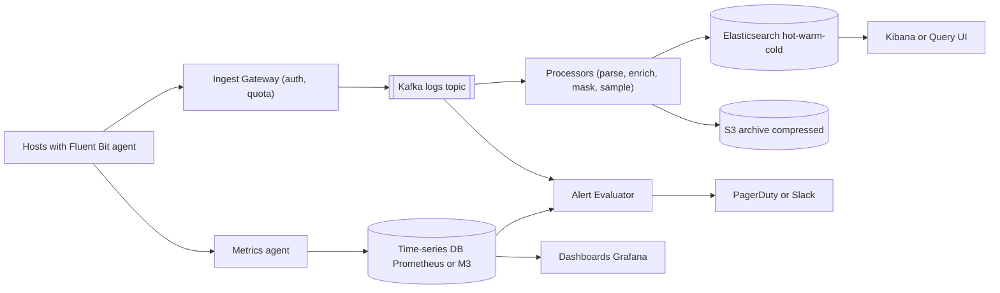
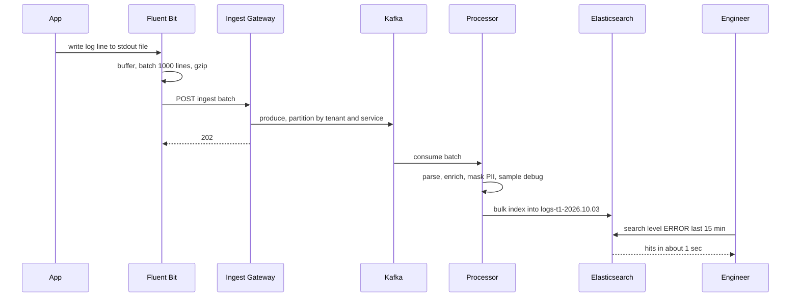
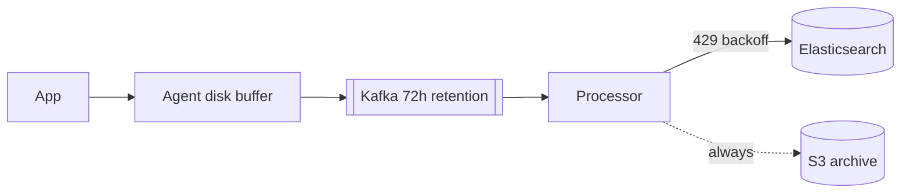

# Design Distributed Logging & Monitoring (ELK / Datadog)

**In one line:** Collect logs and metrics from thousands of servers, store them in one place, let engineers search them, and raise an alert when something goes wrong. The core challenge is that **the data volume is huge (TBs/day)**, ingestion must never slow down the app, and cost must stay under control.

**What the interviewer checks in this question:** write-heavy pipeline design, the Kafka buffer and back-pressure, Elasticsearch indexing and time-based indices, cost via hot/warm/cold tiers, the difference between metrics, logs and traces, and the high cardinality problem.

---

## Step 1: Clarify with the interviewer (3–5 min)

| You ask | Typical answer | Effect on design |
|---|---|---|
| "Only logs, or metrics and traces too?" | Logs are core, plus metrics + alerting | Two storage paths: search store + time-series DB |
| "How many hosts, how much volume?" | 50K hosts, ~10TB logs/day | Kafka buffer, sharded ES cluster |
| "What search latency? How soon after arrival must a log show up?" | Search < 2-5 sec, ingestion lag < 30 sec | Near real-time, refresh interval ~5-10 sec |
| "Retention?" | 7 days searchable, 1 year archive (compliance) | Hot/warm/cold + S3 archive |
| "Can some logs be dropped?" | Debug logs yes, error/audit no | Level-based sampling |
| "Multi-tenant (like Datadog) or internal?" | Multi-tenant | Per-tenant quotas, isolation |
| "Can PII appear in logs?" | Yes | Masking in the pipeline |

> **Say:** "This is a write-heavy, read-light system. There are many writers of logs, few readers, and readers mostly read recent data. So I will decouple ingestion with Kafka and tier storage by time."

## Step 2: Requirements

**Functional**
1. Collect logs from every host/container (app logs, system logs)
2. Parse, enrich (service, host, region) and store logs
3. Full-text + field search (service=payments AND level=ERROR, last 15 min)
4. Metrics (CPU, latency, error rate) dashboards
5. Alert rules (error rate > 5% for 5 min → PagerDuty/Slack)
6. Retention policy and archive

**Non-functional**
- **Zero impact on the app:** if logging is slow, the app must not get slow
- **Durability:** error/audit logs must never be lost
- **Scale:** ~10TB/day, peak 3x (logs grow during an incident)
- **Cost efficient:** storage is the biggest expense
- **Availability > consistency:** fine if logs show up 10 sec late

## Step 3: Estimation (only what changes the design)

- 10TB/day ÷ 86,400 ≈ **~120MB/sec** avg, peak ~400MB/sec. Avg log is 500 bytes → **~250K events/sec**, peak ~800K/sec.
- Index overhead in ES is ~1.2–1.5x, with 1 replica → 10TB raw ≈ **~25-30TB/day of ES disk**. 7 days hot = ~200TB. So keeping 1 year in ES is impossible; use an S3 archive.
- S3 compressed (~10x) → 1TB/day, 1 year ≈ 365TB, cheap.
- During an incident logs grow 5-10x, exactly when ES is also under load. **A buffer is a must.**

> **Say:** "Storage cost drives the design. Hot data on SSD, older data on cheap disk, and a year of data compressed on S3."

## Step 4: Core entities

- **LogEvent**: timestamp, tenant_id, service, host, level, message, trace_id, attributes (key-value)
- **Metric point**: name, tags (service, host, region), timestamp, value
- **Span (trace)**: trace_id, span_id, parent_id, service, duration
- **Index**: `logs-{tenant}-{yyyy.MM.dd}`, tier (hot/warm/cold)
- **AlertRule**: id, query, threshold, window, channel
- **Tenant**: id, daily_quota, retention_days

## Step 5: APIs

```http
POST /v1/logs/ingest      [ {ts, service, level, msg, attrs} ... ]    → 202
     Header: X-API-Key: <tenant key>, Content-Encoding: gzip
POST /v1/metrics          [ {name, tags, ts, value} ... ]             → 202
GET  /v1/logs/search?q=level:ERROR AND service:payments&from=-15m      → {hits, aggs}
POST /v1/alerts           {query, threshold, window: 5m, notify}      → {alertId}
```

> **Say:** "The ingest API takes batches and gzip and returns 202 right away. The agent does not send one line at a time."

## Step 6: High-level design



**Why each component:**
- **Agent (Filebeat/Fluent Bit):** tails files on the host, keeps a local disk buffer, batches + compresses and sends. The app only writes to stdout/a file and never waits on the network.
- **Ingest Gateway:** API key auth, tenant quota, rate limit.
- **Kafka:** the shock absorber. If ES is slow or down, data waits in Kafka (retention 24-72 hrs) and is not lost. Replay is also possible.
- **Processors (Logstash/Vector):** JSON/grok parsing, host/k8s metadata enrichment, PII masking, debug sampling.
- **Elasticsearch:** inverted index, full-text + field search, aggregations.
- **S3 archive:** all raw logs compressed, for compliance and rare queries.
- **Time-series DB:** separate for metrics, because aggregating numbers is much cheaper in a TSDB than in ES.
- **Alert Evaluator:** streaming rules on Kafka, threshold rules on the TSDB.

## Step 7: Main flow: from log line to search



## Step 8: Data model & DB choice

```json
// ES index template: logs-{tenant}-{date}
{
  "@timestamp": "date", "tenant_id": "keyword", "service": "keyword",
  "host": "keyword", "level": "keyword", "trace_id": "keyword",
  "message": "text", "attrs": "flattened"
}
// settings: shards based on size (~30-50GB per shard), refresh_interval 10s
```

- **Time-based indices** (daily, or rollover at 50GB): deleting old data = dropping a whole index. Deleting document by document is very costly.
- `message` = `text` (full-text), the rest = `keyword` (exact filter, aggregation). Do not make every field text, it doubles the disk.
- **Metrics:** TSDB (Prometheus/M3/VictoriaMetrics). Series = name + tag set, with compressed (Gorilla encoding) values.
- **Traces:** Jaeger/Tempo, stored by trace_id, on object storage.

## Step 9: Deep dives (where the interviewer will push)

### 9.1 Back-pressure: what if ES gets slow?
- ES slow → processors' bulk indexing slows → Kafka consumer lag grows. **The data is safe in Kafka**, it just shows up late in search.
- Processors keep bulk size and concurrency adaptive. If ES returns `429 Too Many Requests`, use exponential backoff.
- If Kafka also fills up (long outage) → the Gateway returns 429 to the tenant → the agent keeps data in its local disk buffer → if the disk also fills, **drop debug/info first**, keep error/audit until the very end.
- The app must never block. The agent's buffer is bounded; when full, drop + increment a counter metric.



> **Say:** "There is a buffer at every layer: agent disk, Kafka, processor retry. Even if ES is down, logs are not lost, only delayed. And the S3 archive is independent of ES, so we can also reindex from there."

### 9.2 Storage tiers, ILM and cost
- **Hot (0-2 days):** SSD nodes, recent data, most queries. Indexing happens here.
- **Warm (3-7 days):** HDD nodes, read-only, force-merge to 1 segment, fewer replicas.
- **Cold/Frozen (7-30 days):** searchable snapshots on S3, slow but cheap.
- **Delete / Archive:** drop from ES after 30 days, keep in S3 (Glacier) for 1 year.
- ILM (Index Lifecycle Management) does this rollover → move → delete automatically.
- Cost levers: **sampling** (debug 10%, info 50%, error 100%), **compression** (zstd/best_compression), **field drop** (remove useless fields), **build metrics from logs** (a count metric instead of keeping every request log).

### 9.3 Metrics vs logs vs traces
| | Metrics | Logs | Traces |
|---|---|---|---|
| What it is | Numbers over time | Text detail of an event | The path of one request across services |
| Question | "Did the error rate go up?" | "Why did it fail?" | "Which service is slow?" |
| Cost | Cheapest | Expensive (volume) | Sampled, medium |
| Store | TSDB | Elasticsearch | Jaeger/Tempo |

- Link all three with `trace_id`: alert (metric) → trace → logs of that request. This is the main value of Datadog.

### 9.4 High cardinality and multi-tenancy
- **Cardinality:** if you put `user_id` or `request_id` in metric tags → every value is a new series → TSDB memory blows up (tens of millions of series). Rule: only bounded values in metric tags (service, region, status_code). Unbounded IDs go in logs/traces.
- A per-tenant **series limit** at the gateway and an alert on new tags.
- In ES too, lots of dynamic fields → mapping explosion. Use the `flattened` type or a field limit (1000).
- **Multi-tenant:** small tenants in shared indices with a `tenant_id` filter, big tenants get dedicated indices/clusters. Per-tenant ingest quota + query timeout, so one tenant's big query does not slow everyone down (noisy neighbour).

### 9.5 Alerting pipeline
- **Metric alerts:** the evaluator runs a TSDB query every 30-60 sec (`error_rate > 5% for 5m`). The `for` window reduces flapping.
- **Log alerts:** streaming match on Kafka (Flink), cheaper than running an ES query every minute.
- Dedup + grouping (the same alert from 100 hosts → one incident), silence/maintenance windows, routing by team.
- The alerting system itself must be monitored (dead man's switch: page if the heartbeat alert does not arrive).

## Step 10: Decision table (what we chose, why, what we did not)

| Decision | Why we chose it | What we did not choose, and why |
|---|---|---|
| **Kafka buffer** in the middle | Absorbs spikes, data is safe when ES is down, replay possible | **Agent → ES directly:** if ES is slow, agents block or data is lost |
| **Time-based indices + ILM** | Retention = index drop, simple tiering | **One big index:** delete by query is very slow, shards get too big |
| **Hot/warm/cold + S3 archive** | 5-10x lower cost, recent data stays fast | **Everything on SSD for 1 year:** very expensive |
| **Separate TSDB for metrics** | Compressed numbers, fast aggregation | **Metrics in ES too:** costly and slow aggregation |
| **Level-based sampling** | Lower volume and cost, all errors kept | **Keep everything:** cost explodes. **Randomly drop errors too:** debugging breaks |
| **Agent with local buffer** | Zero impact on the app, data is safe on a network blip | **Direct HTTP log push from the app:** app latency goes up |
| **Per-tenant quotas** | Protects against noisy neighbours | **Shared with no limits:** one tenant's bug can stop everyone's ingestion |

## Step 11: Failures & bottlenecks

| What failed | What happens | How to handle it |
|---|---|---|
| ES cluster slow/down | Logs show up late in search | Buffer in Kafka, consumer lag alert, catch up later |
| Log storm during an incident | 10x volume | Kafka absorbs it, dynamic sampling of info/debug, 429 to the tenant |
| Kafka broker down | Partition unavailable | Replication factor 3, `acks=all` for error logs |
| Hot shard (one service with too many logs) | One ES node overloaded | Partition by tenant+service, an index per big service, more primary shards |
| Mapping explosion | ES master slow | Field limit, `flattened`, schema validation |
| Agent disk full | Logs dropped | Bounded buffer, drop low-priority first, agent health metric |
| Big query (30-day regex) | Cluster slow for everyone | Query timeout, per-tenant concurrency limit, async query on the cold tier |

## Step 12: How to make it better (say this yourself at the end)

> "If I had more time, I would improve these:"
- A columnar log store (ClickHouse/Loki style) that indexes only labels, cheaper than full-text ES
- Automatic metrics from logs (log-to-metric) and pattern clustering (grouping similar logs)
- Tail-based trace sampling: keep full traces only for slow/error ones
- Anomaly detection alerts (ML baseline) instead of static thresholds
- On-demand queries on the S3 archive (like Athena), so no rehydration is needed
- Multi-region: ingest + store within the region, global query fan-out

## Step 13: Likely follow-up questions

- "What happens to logs if ES goes down?" → Kafka buffer, lag will grow, no data lost (Step 9.1)
- "How will you cut cost?" → tiers, sampling, compression, field drop, S3 archive (Step 9.2)
- "Why no user_id tag in metrics?" → high cardinality, series explosion
- "Is log order guaranteed?" → roughly per host/service, sort by timestamp. Global order is not needed
- "How will you stop PII?" → regex/field-based masking in the processor (card, phone, email), allowlist of fields
- "One tenant is slowing everyone down?" → quotas, dedicated index, query limits
- "Need to search logs from 30 days ago?" → cold tier searchable snapshot, or rehydrate from S3

## 2-minute recap (read this before the interview)

> A logging system is write-heavy and driven by cost. On every host, an agent (Fluent Bit) tails files, batches + gzips them and sends them to the Ingest Gateway, which checks auth and tenant quota and puts them into Kafka. Kafka is the shock absorber: if ES is slow, data waits there. Processors parse, enrich, mask PII and sample debug logs, then bulk index into Elasticsearch, and at the same time write a compressed archive to S3. ES uses time-based indices and ILM: hot SSD, warm HDD, cold snapshots, then delete. Metrics go to a separate TSDB, traces to Jaeger, and all three are linked by trace_id. Alerts come from threshold rules on the TSDB and streaming rules on Kafka, with dedup and routing. No high cardinality tags in metrics, and per-tenant quotas control noisy neighbours.

## Checklist

- [ ] I can draw the Agent → Kafka → Processor → ES/S3 pipeline without looking
- [ ] I can explain the full chain of the Kafka buffer and back-pressure
- [ ] I can explain why we use time-based indices and hot/warm/cold ILM
- [ ] I can tell 4 ways to cut logging cost
- [ ] I can tell the difference between metrics, logs and traces, and how to link them
- [ ] I can explain the high cardinality problem and its fix
- [ ] I can explain multi-tenant isolation (quotas, dedicated indices)
- [ ] I can explain dedup and flapping handling in the alerting pipeline
