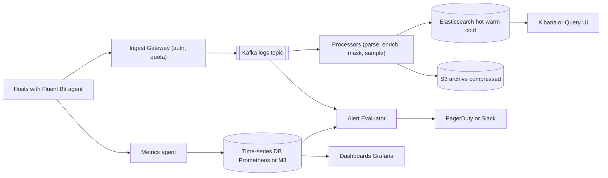
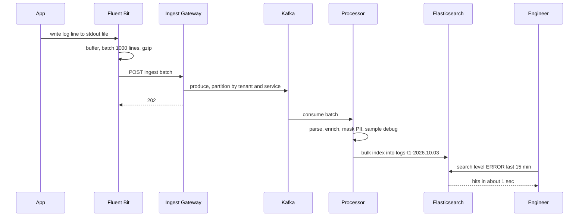
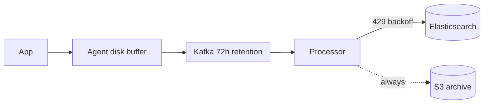

# Design Distributed Logging & Monitoring (ELK / Datadog)

**In one line:** logs + metrics from thousands of servers: collect, search, alert. Challenge: **TBs/day of volume**, zero impact on the app, cost under control.

**What the interviewer checks in this question:** Kafka buffer + back-pressure, ES time-based indices, cost tiers, metrics vs logs vs traces, high cardinality.

---

## Step 1: Clarify with the interviewer (3–5 min)

| You ask | Typical answer | Effect on design |
|---|---|---|
| "Logs, metrics, traces?" | Logs core + metrics/alerting | Search store + TSDB |
| "How many hosts, how much volume?" | 50K hosts, ~10TB logs/day | Kafka buffer, sharded ES |
| "Search latency? Ingest lag?" | < 2-5 sec, lag < 30 sec | Refresh ~5-10 sec |
| "Retention?" | 7 days fast, 30 days slow, 1 year archive | Hot/warm/cold + S3 |
| "Can some logs be dropped?" | Debug yes, error/audit no | Level-based sampling |
| "Multi-tenant (like Datadog)?" | Yes | Per-tenant quotas |
| "Can PII appear?" | Yes | Masking in the pipeline |

> **Say:** "Write-heavy, read-light, reads mostly recent. Decouple with Kafka, tier storage by time."

## Step 2: Requirements

**Functional**
1. Agent ships logs → parse + enrich → store
2. Search: full text + fields (service=payments AND level=ERROR, last 15 min)
3. Metrics dashboards (CPU, latency, error rate)
4. Alerts → PagerDuty/Slack (error rate > 5% for 5 min)

**Out of scope:** deep tracing (only trace_id linking), APM profiling, billing, query UI, ML anomaly detection.

**Non-functional (in priority order)**
1. **Zero impact on the app:** slow logging must not slow the app
2. **Durability:** error/audit never lost (debug may be sampled)
3. **Freshness + latency:** lag < 30 sec, last-15-min search p95 < 5 sec
4. **Scale:** ~10TB/day, ~250K events/sec avg, 5-10x during an incident
5. **Cost:** 7 days hot, 30 days slow-searchable, 1 year S3 archive

**CAP choice:** **AP**: ingest always accepts, search may lag 10-30 sec; dropping logs is worse than stale search.

## Step 3: Estimation (only what changes the design)

- 10TB/day ≈ **~120MB/sec** avg, peak ~400MB/sec; 500 bytes/log → **~250K events/sec**, peak ~800K.
- ES overhead ~1.2–1.5x + 1 replica → **~25-30TB/day disk**; 7 days hot ≈ 200TB → 1 year in ES is impossible, S3 archive.
- S3 compressed (~10x) → 1TB/day, 1 year ≈ 365TB, cheap.
- Kafka 72h: 120MB/sec × 72h ≈ 31TB raw, compressed (~5x) × RF 3 ≈ **~20TB** → 72h, not 7 days.
- Incidents bring 5-10x volume exactly when ES is loaded → **a buffer is a must.**

> **Say:** "Storage cost drives the design: hot on SSD, older on cheap disk, a year compressed on S3."

## Step 4: Core entities

- **LogEvent**: timestamp, tenant_id, service, host, level, message, trace_id, attributes (key-value)
- **Metric point**: name, tags (service, host, region), timestamp, value
- **Span (trace)**: trace_id, span_id, parent_id, service, duration
- **Index**: `logs-{tenant}-{yyyy.MM.dd}`, tier (hot/warm/cold)
- **AlertRule**: id, query, threshold, window, channel
- **Tenant**: id, daily_quota, retention_days

## Step 5: APIs

```http
POST /v1/logs/ingest      [ {ts, service, level, msg, attrs} ... ]    → 202
     Header: X-API-Key: <tenant key>, Content-Encoding: gzip
POST /v1/metrics          [ {name, tags, ts, value} ... ]             → 202
GET  /v1/logs/search?q=level:ERROR AND service:payments&from=-15m      → {hits, aggs}
POST /v1/alerts           {query, threshold, window: 5m, notify}      → {alertId}
```

> **Say:** "Ingest takes batches + gzip and returns 202 at once. The agent never sends one line at a time."

## Step 6: High-level design

**Simple v1:** Filebeat → Elasticsearch → Kibana (a few hundred hosts). Broken by: **800K/sec + incident bursts** → Kafka, **10TB/day × 1 year** → tiers + S3, **metrics** → TSDB, **tenant quotas** → Gateway.



**Why each component:**
- **Agent (Filebeat/Fluent Bit):** NFR1: tails files, disk buffer, batch + gzip; the app never waits on the network.
- **Ingest Gateway:** API key auth, per-tenant quota + rate limit.
- **Kafka:** 800K/sec peak, ES down → **72h** safe + **replay**, **2 consumer groups** (processors, alerts).
- **Processors (Vector/Logstash):** CPU-heavy parse/mask/sample, scale separately from ES.
- **Elasticsearch:** 7-30 day search; S3 grep / Athena = minutes.
- **S3 archive:** ~10x cheaper than ES. **TSDB:** aggregating numbers is cheaper + faster than ES.
- **Alert Evaluator:** thresholds on the TSDB, log patterns on the Kafka stream.

## Step 7: Main flow: from log line to search



## Step 8: Data model & DB choice

```json
// ES index template: logs-{tenant}-{date}
{
  "@timestamp": "date", "tenant_id": "keyword", "service": "keyword",
  "host": "keyword", "level": "keyword", "trace_id": "keyword",
  "message": "text", "attrs": "flattened"
}
// settings: shards based on size (~30-50GB per shard), refresh_interval 10s
```

- **Time-based indices** (daily / 50GB rollover): retention = index drop; per-document delete is costly.
- `message` = `text`, the rest `keyword` (filter, aggregation). All-text = double disk.
- **Metrics:** TSDB (Prometheus/M3/VictoriaMetrics), series = name + tags, Gorilla compression. **Traces:** Jaeger/Tempo on object storage.

## Step 9: Deep dives (where the interviewer will push)

### 9.1 Back-pressure: what if ES gets slow?
**NFR:** zero impact on the app + durable error logs.
- ES slow → Kafka lag grows; **data is safe**, just late. Processors use adaptive bulk; ES `429` → exponential backoff.
- Kafka full → Gateway 429 → agent disk buffer → full → **drop debug/info first**, error/audit last.
- The app never blocks: bounded buffer, drop + counter metric.



> **Say:** "A buffer at every layer: agent, Kafka, processor retry. ES down = delayed, not lost; we can also reindex from S3."

**Trade-off:** in a long outage search lags, in a very long one debug is dropped.

### 9.2 Storage tiers, ILM and cost
**NFR:** cost, 7 days fast + 1 year archive.
- **Hot (0-2 days):** SSD, indexing + most queries. **Warm (3-7):** HDD, read-only, force-merge to 1 segment, fewer replicas.
- **Cold/Frozen (7-30):** S3 searchable snapshots. **Archive:** dropped from ES after 30 days, S3 Glacier for 1 year.
- ILM: rollover → move → delete, automatically.
- Cost levers: **sampling** (debug 10%, info 50%, error 100%), **compression** (zstd/best_compression), **field drop**, **logs → metrics** (a count instead of every request log).

**Trade-off:** old logs are slow (cold) or need rehydration; in return 5-10x lower cost.

### 9.3 Metrics vs logs vs traces
**NFR:** cost + FR3, the cheapest store per question.
| | Metrics | Logs | Traces |
|---|---|---|---|
| What it is | Numbers over time | Text detail of an event | One request's path across services |
| Question | "Did error rate go up?" | "Why did it fail?" | "Which service is slow?" |
| Cost | Cheapest | Expensive (volume) | Sampled, medium |
| Store | TSDB | Elasticsearch | Jaeger/Tempo |

- Link via `trace_id`: alert (metric) → trace → that request's logs. This is Datadog's main value.

**Trade-off:** three stores to operate instead of one.

### 9.4 High cardinality and multi-tenancy
**NFR:** one tenant or bad tag must not take everyone down.
- **Cardinality:** `user_id`/`request_id` as a tag → tens of millions of series → TSDB memory blows up. Tags stay bounded (service, region, status_code); IDs go to logs/traces. Per-tenant **series limit** + new-tag alert.
- ES dynamic fields → mapping explosion → `flattened` / field limit (1000).
- **Multi-tenant:** small tenants in shared indices + `tenant_id`, big ones dedicated. Ingest quota + query timeout (noisy neighbour).

**Trade-off:** limits will sometimes reject genuine data/queries.

### 9.5 Alerting pipeline
**NFR:** alert within 1-2 min, few false pages.
- **Metric:** TSDB query every 30-60 sec (`error_rate > 5% for 5m`); the `for` window reduces flapping.
- **Log:** streaming match on Kafka (Flink), cheaper than a per-minute ES query.
- Dedup + grouping (100 hosts → 1 incident), silences, team routing.
- Dead man's switch: page if the heartbeat alert does not arrive.

**Trade-off:** `for` + dedup make alerts ~5 min late, but no flapping pages.

## Step 10: Decision table (what we chose, why, what we did not)

| Decision | Why we chose it | What we did not choose, and why |
|---|---|---|
| **Kafka buffer** | 800K/sec, 72h replay, 2 consumers | **Agent → ES:** block/loss. **SQS/RabbitMQ:** expensive, no replay. Sacrifice: ~20TB Kafka ops |
| **Elasticsearch** for logs | Search in seconds | **ClickHouse/Loki:** cheaper, weak free-text. **Athena:** minutes. Sacrifice: indexing cost, disk |
| **Time-based indices + ILM** | Index drop, simple tiering | **One big index:** slow delete. Sacrifice: many indices |
| **Hot/warm/cold + S3 archive** | 5-10x cheaper, recent stays fast | **All SSD for 1 year:** very expensive. Sacrifice: old data slow |
| **Separate TSDB for metrics** | Compressed, fast aggregation | **Metrics in ES:** costly, slow. Sacrifice: one more store |
| **Level-based sampling** | Less volume, all errors kept | **Keep all:** cost explodes. **Random drop:** loses errors. Sacrifice: less debug detail |
| **Agent with local buffer** | Zero app impact | **Direct HTTP:** app latency. Sacrifice: host disk |
| **Per-tenant quotas** | Noisy neighbour protection | **No limits:** one bug stops everyone. Sacrifice: 429 on bursts |

## Step 11: Failures & bottlenecks

| What failed | What happens | How to handle it |
|---|---|---|
| Log storm in an incident | 10x volume | Kafka absorbs, dynamic info/debug sampling, tenant 429 |
| Kafka broker down | Partition unavailable | RF 3, `acks=all` for error logs |
| Hot shard (one service) | ES node overloaded | Tenant+service partition, separate index, more primaries |
| Mapping explosion | ES master slow | Field limit, `flattened`, schema validation |
| Agent disk full | Logs dropped | Drop low-priority first, agent health metric |
| Big query (30-day regex) | Slow for all | Timeout, per-tenant concurrency, async on cold tier |

## Step 12: How to make it better (say this yourself at the end)

> "If I had more time, I would improve these:"
- Columnar log store (ClickHouse/Loki style) indexing only labels; cheaper than full-text ES
- Automatic log-to-metric + pattern clustering (grouping similar logs)
- Tail-based trace sampling: full traces only for slow/error ones
- On-demand queries on the S3 archive (like Athena), no rehydration

## Step 13: Likely follow-up questions

- "Why no user_id tag in metrics?" → high cardinality, series explosion
- "Log ordering?" → roughly per host/service, sort by timestamp; global order not needed
- "PII?" → regex/field masking in the processor (card, phone, email), allowlist
- "Noisy tenant?" → quotas, dedicated index, query limits
- "Logs from 30 days ago?" → cold tier searchable snapshot or rehydrate from S3
- **Senior signal:** the worst time is an **incident**: 5-10x volume while search also peaks, indexing vs search on hot nodes. Plan: prioritise errors, dynamic sampling, separate ingest/search capacity, logging stack must not depend on the systems it monitors.

## 2-minute recap (read this before the interview)

> Agent → Gateway (auth, quota) → Kafka (shock absorber) → processors (parse, mask, sample) → ES + S3. ILM: hot → warm → cold → delete. Metrics in a TSDB, traces in Jaeger, linked by trace_id. Alerts on TSDB + Kafka, with dedup. No high-cardinality tags; tenant quotas.

## Checklist

- [ ] I can draw the Agent → Kafka → Processor → ES/S3 pipeline without looking
- [ ] I can explain the full chain of the Kafka buffer and back-pressure
- [ ] I can explain why we use time-based indices and hot/warm/cold ILM
- [ ] I can tell 4 ways to cut logging cost
- [ ] I can tell the difference between metrics, logs and traces, and how to link them
- [ ] I can explain the high cardinality problem and its fix
- [ ] I can explain multi-tenant isolation (quotas, dedicated indices)
- [ ] I can explain dedup and flapping handling in the alerting pipeline
