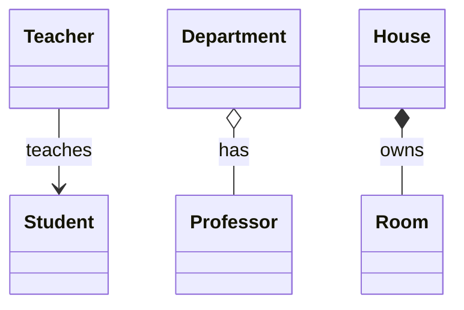

# OOP Basics

This is the base of every LLD round. Whether the interviewer asks for a Parking Lot or Splitwise, what they really check is whether you use classes, interfaces, inheritance and composition in the right places.

## ⭐ Class & Object

**In one line:** a class is a blueprint (what data, what behaviour). An object is the real thing built from that blueprint.

**Real example:** "Car" is a class. Your Maruti and your friend's Tata Nexon are two separate objects, each with its own speed.

**When to use / when not:**
- Make a class for every real-world entity (User, Vehicle, Booking), keeping its data and the methods that work on it together.
- If you only need to hold data with no logic, a `record` in Java or a `struct` in C++ is enough.

```java
class Car {
    private final String brand;   // state
    private int speed;

    Car(String brand) {           // constructor: runs when the object is created
        this.brand = brand;
        this.speed = 0;
    }

    void accelerate(int delta) {  // behaviour
        speed += delta;
    }

    void show() {
        System.out.println(brand + " @ " + speed + " km/h");
    }
}

public class Main {
    public static void main(String[] args) {
        Car c1 = new Car("Maruti");   // object 1
        Car c2 = new Car("Tata");     // object 2, with its own state
        c1.accelerate(40);
        c2.accelerate(60);
        c1.show();
        c2.show();
    }
}
```

```cpp
#include <iostream>
#include <string>
#include <utility>

class Car {
    std::string brand;   // state
    int speed;

public:
    explicit Car(std::string b) : brand(std::move(b)), speed(0) {}  // constructor

    void accelerate(int delta) { speed += delta; }  // behaviour

    void show() const {
        std::cout << brand << " @ " << speed << " km/h\n";
    }
};

int main() {
    Car c1("Maruti");   // object 1 (on the stack)
    Car c2("Tata");     // object 2, with its own state
    c1.accelerate(40);
    c2.accelerate(60);
    c1.show();
    c2.show();
}
```

**Where in LLD problems:** everywhere. In Parking Lot, `Vehicle`, `ParkingSpot` and `Ticket` are all classes.

**Say this in the interview:** "First I will pull out the entities from the nouns (classes), then their methods from the verbs."

**Common mistake:**
- Putting all the data and logic into one `Manager` class (a God class).

## ⭐ Encapsulation

**In one line:** keep data `private` and expose only controlled methods, so nobody can set a wrong state.

**Real example:** you cannot edit your Paytm wallet balance directly. It changes only through `addMoney()` / `pay()`, and those methods run checks.

**When to use / when not:**
- Whenever there is a rule (invariant): the balance must not go negative, a seat must not be booked twice.
- Blindly adding a getter and setter for every field is not encapsulation. Add a setter only when it is needed.

```java
class Wallet {
    private double balance;   // no direct access from outside

    void addMoney(double amount) {
        if (amount <= 0) throw new IllegalArgumentException("Amount must be positive");
        balance += amount;
    }

    boolean pay(double amount) {
        if (amount > balance) {
            System.out.println("Insufficient balance");
            return false;
        }
        balance -= amount;
        return true;
    }

    double getBalance() { return balance; }   // read-only access
}

public class Main {
    public static void main(String[] args) {
        Wallet w = new Wallet();
        w.addMoney(500);
        w.pay(200);
        w.pay(1000);              // gets rejected
        // w.balance = -100;      // compile error: it is private
        System.out.println("Balance: " + w.getBalance());
    }
}
```

```cpp
#include <iostream>
#include <stdexcept>

class Wallet {
    double balance = 0;   // private by default (in a class)

public:
    void addMoney(double amount) {
        if (amount <= 0) throw std::invalid_argument("Amount must be positive");
        balance += amount;
    }

    bool pay(double amount) {
        if (amount > balance) {
            std::cout << "Insufficient balance\n";
            return false;
        }
        balance -= amount;
        return true;
    }

    double getBalance() const { return balance; }   // read-only access
};

int main() {
    Wallet w;
    w.addMoney(500);
    w.pay(200);
    w.pay(1000);           // gets rejected
    // w.balance = -100;   // compile error: it is private
    std::cout << "Balance: " << w.getBalance() << "\n";
}
```

**Where in LLD problems:** `balance` in Splitwise, `stock` in Vending Machine, `seatStatus` in BookMyShow. All private, changed only through methods.

**Say this in the interview:** "State is private and every change goes through methods, so the invariants are enforced in one place."

**Common mistake:**
- Keeping fields `public` or giving a setter for every field. Then validation happens nowhere.

## ⭐ Abstraction

**In one line:** show the user only "what it does" and hide "how it does it".

**Real example:** on Swiggy you tap "Place Order". Payment, notifying the restaurant, assigning a delivery partner all happen inside, and you do not see any of it.

**When to use / when not:**
- When the caller does not care about the internal steps. Give one simple public method and keep the rest private.
- Do not put an interface on top of everything in the name of abstraction when there is only one implementation and there will only ever be one.

```java
abstract class PaymentGateway {
    // Public contract: just "pay"
    public final void pay(double amount) {
        validate(amount);
        process(amount);
        System.out.println("Receipt sent");
    }

    private void validate(double amount) {   // hidden detail
        if (amount <= 0) throw new IllegalArgumentException("Invalid amount");
    }

    protected abstract void process(double amount);  // each gateway has its own way
}

class UpiGateway extends PaymentGateway {
    @Override
    protected void process(double amount) {
        System.out.println("UPI collect request for Rs " + amount);
    }
}

class CardGateway extends PaymentGateway {
    @Override
    protected void process(double amount) {
        System.out.println("Card OTP + charge Rs " + amount);
    }
}

public class Main {
    public static void main(String[] args) {
        PaymentGateway g = new UpiGateway();
        g.pay(499);                // the caller knows nothing about the inside
        new CardGateway().pay(999);
    }
}
```

```cpp
#include <iostream>
#include <memory>
#include <stdexcept>

class PaymentGateway {
public:
    virtual ~PaymentGateway() = default;
    void pay(double amount) {   // public contract
        validate(amount);
        process(amount);
        std::cout << "Receipt sent\n";
    }

protected:
    virtual void process(double amount) = 0;   // each gateway has its own way

private:
    void validate(double amount) {   // hidden detail
        if (amount <= 0) throw std::invalid_argument("Invalid amount");
    }
};

class UpiGateway : public PaymentGateway {
protected:
    void process(double amount) override { std::cout << "UPI collect request for Rs " << amount << "\n"; }
};

class CardGateway : public PaymentGateway {
protected:
    void process(double amount) override { std::cout << "Card OTP + charge Rs " << amount << "\n"; }
};

int main() {
    std::unique_ptr<PaymentGateway> g = std::make_unique<UpiGateway>();
    g->pay(499);   // the caller knows nothing about the inside
    std::make_unique<CardGateway>()->pay(999);
}
```

**Where in LLD problems:** Payment, Notification (Email/SMS), `PaymentProcessor` in Parking Lot, `ElevatorController.request()` in Elevator.

**Say this in the interview:** "The client only calls `pay()`. Whether it is UPI or card, that detail is locked inside the gateway."

**Common mistake:**
- Saying Abstraction and Encapsulation are the same. Encapsulation = hiding data, Abstraction = hiding complexity.

## ⭐ Inheritance

**In one line:** a child class takes the parent's code and behaviour (an IS-A relation) and adds its own extras.

**Real example:** Car IS-A Vehicle, Bike IS-A Vehicle. Both share a number plate and `park()`.

**When to use / when not:**
- When there is a true IS-A relation and the parent's contract fully fits the child.
- Do not use inheritance just to reuse code. Composition is better there.
- Do not go deeper than 2–3 levels in the hierarchy.

```java
class Vehicle {
    protected final String number;

    Vehicle(String number) { this.number = number; }

    void park() { System.out.println(number + " parked"); }

    int wheels() { return 0; }
}

class Car extends Vehicle {
    Car(String number) { super(number); }   // parent constructor call

    @Override
    int wheels() { return 4; }
}

class Bike extends Vehicle {
    Bike(String number) { super(number); }

    @Override
    int wheels() { return 2; }

    void wheelie() { System.out.println(number + " doing wheelie"); }  // extra
}

public class Main {
    public static void main(String[] args) {
        Car car = new Car("KA01AB1234");
        Bike bike = new Bike("DL3CXY9876");
        car.park();                          // inherited from the parent
        bike.park();
        System.out.println(car.wheels() + " " + bike.wheels());
        bike.wheelie();
    }
}
```

```cpp
#include <iostream>
#include <string>
#include <utility>

class Vehicle {
protected:
    std::string number;

public:
    explicit Vehicle(std::string n) : number(std::move(n)) {}
    virtual ~Vehicle() = default;
    void park() const { std::cout << number << " parked\n"; }
    virtual int wheels() const { return 0; }
};

class Car : public Vehicle {
public:
    explicit Car(std::string n) : Vehicle(std::move(n)) {}   // parent constructor call
    int wheels() const override { return 4; }
};

class Bike : public Vehicle {
public:
    explicit Bike(std::string n) : Vehicle(std::move(n)) {}
    int wheels() const override { return 2; }
    void wheelie() const { std::cout << number << " doing wheelie\n"; }  // extra
};

int main() {
    Car car("KA01AB1234");
    Bike bike("DL3CXY9876");
    car.park();    // inherited from the parent
    bike.park();
    std::cout << car.wheels() << " " << bike.wheels() << "\n";
    bike.wheelie();
}
```

**Where in LLD problems:** Parking Lot (`Vehicle` → `Car`, `Bike`, `Truck`), Chess (`Piece` → `King`, `Queen`), `Request` types in Elevator.

**Say this in the interview:** "I will use inheritance only when there is a real IS-A relation. Everywhere else, composition."

**Common mistake:**
- In C++, not making the base class destructor `virtual`. When you delete through a base pointer, the child's destructor will not run.
- Java has no multiple class inheritance (`extends` only one). You can `implements` multiple interfaces.

## ⭐ Polymorphism (compile-time vs runtime)

**In one line:** one name, different behaviour. Compile-time = overloading (the compiler decides), runtime = overriding (the object's real type decides).

**Real example:** the "Pay" button is the same, but UPI, Card and Wallet each do different work inside (runtime). A calculator's `add(2,3)` and `add(2.5,3.5)` are different methods (compile-time).

**When to use / when not:**
- Runtime polymorphism: whenever you feel like writing `if-else` / `switch` on the type. That is exactly the place.
- Overloading: same job, different input types. Too many overloads confuse people, so avoid that.

| | Compile-time | Runtime |
|---|---|---|
| How | Method overloading (also operator overloading in C++) | Method overriding |
| Who decides | The compiler, by looking at the parameters | The JVM / vtable, by looking at the object |
| Needed in C++ | Nothing | The `virtual` keyword |

```java
import java.util.List;

abstract class Shape {
    abstract double area();
}

class Circle extends Shape {
    private final double r;
    Circle(double r) { this.r = r; }
    @Override double area() { return Math.PI * r * r; }
}

class Square extends Shape {
    private final double side;
    Square(double side) { this.side = side; }
    @Override double area() { return side * side; }
}

class Calculator {
    // Compile-time: same name, different parameters (overloading)
    int add(int a, int b) { return a + b; }
    double add(double a, double b) { return a + b; }
}

public class Main {
    public static void main(String[] args) {
        Calculator calc = new Calculator();
        System.out.println(calc.add(2, 3));       // int version
        System.out.println(calc.add(2.5, 3.5));   // double version

        // Runtime: the reference is Shape, the method runs based on the object's type (overriding)
        List<Shape> shapes = List.of(new Circle(1), new Square(2));
        for (Shape s : shapes) {
            System.out.println(s.getClass().getSimpleName() + " area = " + s.area());
        }
    }
}
```

```cpp
#include <iostream>
#include <memory>
#include <vector>

class Shape {
public:
    virtual ~Shape() = default;
    virtual double area() const = 0;   // virtual = runtime polymorphism
    virtual const char* name() const = 0;
};

class Circle : public Shape {
    double r;
public:
    explicit Circle(double r) : r(r) {}
    double area() const override { return 3.14159 * r * r; }
    const char* name() const override { return "Circle"; }
};

class Square : public Shape {
    double side;
public:
    explicit Square(double s) : side(s) {}
    double area() const override { return side * side; }
    const char* name() const override { return "Square"; }
};

// Compile-time: same name, different parameters (overloading)
int add(int a, int b) { return a + b; }
double add(double a, double b) { return a + b; }

int main() {
    std::cout << add(2, 3) << "\n";       // int version
    std::cout << add(2.5, 3.5) << "\n";   // double version

    std::vector<std::unique_ptr<Shape>> shapes;
    shapes.push_back(std::make_unique<Circle>(1));
    shapes.push_back(std::make_unique<Square>(2));
    for (const auto& s : shapes)          // the right area() runs at runtime
        std::cout << s->name() << " area = " << s->area() << "\n";
}
```

**Where in LLD problems:** `vehicle.getSpotType()` in Parking Lot, `piece.canMove()` in Chess, `sender.send()` in Notification, the states of a Vending Machine.

**Say this in the interview:** "Instead of a `switch` on the type, I will use polymorphism, so when a new type comes I do not have to touch the old code."

**Common mistake:**
- Forgetting `virtual` in C++. Then a base pointer calls the base method only (static binding).
- Thinking a different return type is overloading. If only the return type differs, it is not an overload, you get a compile error.

## ⭐ Interface vs Abstract class

**In one line:** interface = only a contract ("what it can do"), abstract class = contract + common code + state ("what it is").

**Real example:** `Flyable` is a capability: a Sparrow, a Drone and a Plane can all fly. `Bird` is an abstract base where the name and `eat()` are shared.

**When to use / when not:**
- **Interface:** when unrelated classes need the same capability, or you need multiple types. Keep this as the default choice in LLD.
- **Abstract class:** when related classes need to share common state / code (constructor, fields).

| | Interface | Abstract class |
|---|---|---|
| State (fields) | No (only constants) | Yes |
| Constructor | No | Yes |
| Multiple | One class can implement many | Can extend only one |
| Methods | abstract + `default` + `static` (Java 8+) | abstract + concrete |
| In C++ | A class with only pure virtual methods | Pure virtual + normal members |

```java
interface Flyable {
    void fly();                                    // contract
    default void land() { System.out.println("Landing..."); }  // Java 8+ default
}

abstract class Bird {
    protected final String name;                   // can hold state
    Bird(String name) { this.name = name; }        // and a constructor too
    abstract void makeSound();
    void eat() { System.out.println(name + " is eating"); }  // common code
}

class Sparrow extends Bird implements Flyable {
    Sparrow() { super("Sparrow"); }
    @Override void makeSound() { System.out.println("Chirp"); }
    @Override public void fly() { System.out.println(name + " is flying"); }
}

class Penguin extends Bird {                       // does not fly, so no Flyable
    Penguin() { super("Penguin"); }
    @Override void makeSound() { System.out.println("Squawk"); }
}

public class Main {
    public static void main(String[] args) {
        Sparrow s = new Sparrow();
        s.eat();
        s.fly();
        s.land();
        Bird p = new Penguin();
        p.makeSound();
    }
}
```

```cpp
#include <iostream>
#include <memory>
#include <string>
#include <utility>

class Flyable {                    // "interface": only pure virtual, no state
public:
    virtual ~Flyable() = default;
    virtual void fly() = 0;
};

class Bird {                       // abstract class: state + common code
protected:
    std::string name;
public:
    explicit Bird(std::string n) : name(std::move(n)) {}
    virtual ~Bird() = default;
    virtual void makeSound() = 0;
    void eat() const { std::cout << name << " is eating\n"; }
};

class Sparrow : public Bird, public Flyable {   // multiple inheritance in C++
public:
    Sparrow() : Bird("Sparrow") {}
    void makeSound() override { std::cout << "Chirp\n"; }
    void fly() override { std::cout << name << " is flying\n"; }
};

class Penguin : public Bird {
public:
    Penguin() : Bird("Penguin") {}
    void makeSound() override { std::cout << "Squawk\n"; }
};

int main() {
    Sparrow s;
    s.eat();
    s.fly();
    std::unique_ptr<Bird> p = std::make_unique<Penguin>();
    p->makeSound();
}
```

**Where in LLD problems:** `PaymentStrategy`, `NotificationSender`, `PricingStrategy` interfaces. Abstract `Vehicle` in Parking Lot, abstract `Piece` in Chess.

**Say this in the interview:** "Interface for a capability, abstract class for shared state. By default I start with an interface."

**Common mistake:**
- In Java, forgetting `public` when implementing an interface method. You get a compile error.

## ⭐ Composition over Inheritance

**In one line:** instead of "inheriting" behaviour from a parent, keep one object inside another (HAS-A) and delegate the work to it.

**Real example:** a Car has an Engine inside it. To go from petrol to EV, you do not replace the whole car, you swap the engine.

**When to use / when not:**
- When behaviour must change at runtime, or there are many combinations (engine x gearbox x fuel).
- When the relation is HAS-A, not IS-A.
- When it really is IS-A and the hierarchy is small, inheritance is fine.

```java
// With inheritance: PetrolManualCar, PetrolAutoCar, ElectricAutoCar ... class explosion.
// With composition: Car + pluggable Engine.
interface Engine {
    void start();
}

class PetrolEngine implements Engine {
    public void start() { System.out.println("Petrol engine: vroom"); }
}

class ElectricEngine implements Engine {
    public void start() { System.out.println("Electric engine: silent start"); }
}

class Car {
    private Engine engine;                       // Car HAS-A Engine

    Car(Engine engine) { this.engine = engine; }

    void setEngine(Engine engine) { this.engine = engine; }  // swap at runtime

    void drive() {
        engine.start();                          // work delegated
        System.out.println("Car is moving");
    }
}

public class Main {
    public static void main(String[] args) {
        Car car = new Car(new PetrolEngine());
        car.drive();
        car.setEngine(new ElectricEngine());     // behaviour changed without a new class
        car.drive();
    }
}
```

```cpp
#include <iostream>
#include <memory>
#include <utility>

// With inheritance: PetrolManualCar, PetrolAutoCar ... class explosion.
// With composition: Car + pluggable Engine.
class Engine {
public:
    virtual ~Engine() = default;
    virtual void start() = 0;
};

class PetrolEngine : public Engine {
public:
    void start() override { std::cout << "Petrol engine: vroom\n"; }
};

class ElectricEngine : public Engine {
public:
    void start() override { std::cout << "Electric engine: silent start\n"; }
};

class Car {
    std::unique_ptr<Engine> engine;   // Car HAS-A Engine (owns it)
public:
    explicit Car(std::unique_ptr<Engine> e) : engine(std::move(e)) {}
    void setEngine(std::unique_ptr<Engine> e) { engine = std::move(e); }  // runtime swap
    void drive() {
        engine->start();              // work delegated
        std::cout << "Car is moving\n";
    }
};

int main() {
    Car car(std::make_unique<PetrolEngine>());
    car.drive();
    car.setEngine(std::make_unique<ElectricEngine>());
    car.drive();
}
```

**Where in LLD problems:** the Strategy pattern is built on this. `PricingStrategy` in Parking Lot, `SchedulingStrategy` in Elevator, `Appender` in Logger.

**Say this in the interview:** "I will prefer composition. The behaviour sits behind an interface and is injected through the constructor, so it can be swapped at runtime and testing is easy too."

**Common mistake:**
- Saying "I need code reuse" and designing something like `Stack extends ArrayList`. Now `add(index, x)` can be called on the stack, which is wrong.

## Association / Aggregation / Composition

**In one line:** all three are levels of "objects know each other". The difference is ownership and lifetime.

**Real example:** a teacher teaches a student (association). A department has professors, and the professors remain even if the department closes (aggregation). The rooms of a house go down with the house (composition).

**When to use / when not:**
- **Association:** just uses it, does not own it (method parameter / reference).
- **Aggregation:** HAS-A, but the part comes from outside and can live independently.
- **Composition:** HAS-A, the part is created inside and dies with the owner. The strongest one.



```java
import java.util.ArrayList;
import java.util.List;

class Student { final String name; Student(String n) { name = n; } }

class Teacher {   // Association: only uses the student, does not own it
    void teach(Student s) { System.out.println("Teaching " + s.name); }
}

class Professor { final String name; Professor(String n) { name = n; } }

class Department {   // Aggregation: the professor comes from outside
    private final List<Professor> profs = new ArrayList<>();
    void add(Professor p) { profs.add(p); }
}

class Room { final String type; Room(String t) { type = t; } }

class House {   // Composition: rooms are created inside and end with the House
    private final List<Room> rooms = List.of(new Room("Bedroom"), new Room("Kitchen"));
    int roomCount() { return rooms.size(); }
}

public class Main {
    public static void main(String[] args) {
        new Teacher().teach(new Student("Rahul"));

        Professor p = new Professor("Dr. Sharma");
        Department cs = new Department();
        cs.add(p);
        cs = null;                     // the department is gone, p is still alive
        System.out.println(p.name + " still exists");

        System.out.println("Rooms: " + new House().roomCount());
    }
}
```

```cpp
#include <iostream>
#include <memory>
#include <string>
#include <utility>
#include <vector>

struct Student { std::string name; };

struct Teacher {   // Association: used by reference, not owned
    void teach(const Student& s) const { std::cout << "Teaching " << s.name << "\n"; }
};

struct Professor { std::string name; };

class Department {   // Aggregation: shared_ptr, the professor lives outside too
    std::vector<std::shared_ptr<Professor>> profs;
public:
    void add(std::shared_ptr<Professor> p) { profs.push_back(std::move(p)); }
};

struct Room { std::string type; };

class House {   // Composition: rooms by value, destroyed with the House
    std::vector<Room> rooms{{"Bedroom"}, {"Kitchen"}};
public:
    std::size_t roomCount() const { return rooms.size(); }
};

int main() {
    Teacher{}.teach(Student{"Rahul"});

    auto p = std::make_shared<Professor>(Professor{"Dr. Sharma"});
    {
        Department cs;
        cs.add(p);
    }                                  // the department is gone, p is still alive
    std::cout << p->name << " still exists\n";

    std::cout << "Rooms: " << House{}.roomCount() << "\n";
}
```

**Where in LLD problems:** Parking Lot `ParkingLot *-- Floor *-- Spot` (composition), `Spot --> Vehicle` (association). Splitwise `Group o-- User` (aggregation).

**Say this in the interview:** "A Floor cannot exist without the ParkingLot, so it is composition. A User still exists after leaving a group, so it is aggregation."

**Common mistake:**
- Mixing up the three arrows in a class diagram. Hollow diamond (`o--`) = aggregation, filled diamond (`*--`) = composition.

## Access modifiers

**In one line:** they control who can see/use which member. Encapsulation is enforced through them.

**Real example:** in a bank, the cashier counter is `public`, the staff room is `protected` (staff only), and the vault is `private` (manager only).

**When to use / when not:**
- Default thinking: fields `private`, and only as many methods `public` as needed.
- Use `protected` only when a child class really needs it. Too much `protected` = weak encapsulation.

| Modifier | Java | C++ |
|---|---|---|
| `public` | From everywhere | From everywhere |
| `protected` | Same package + subclasses | Only subclasses (and itself) |
| default (write nothing) | Only the same package | Private in a `class`, public in a `struct` |
| `private` | Only inside that class | Only inside that class (and `friend`) |

```java
class Account {
    public String owner;            // from everywhere
    protected double interestRate;  // same package + subclasses
    String branch;                  // default: only the same package
    private double balance;         // only inside this class

    Account(String owner, String branch) {
        this.owner = owner;
        this.branch = branch;
    }

    public void deposit(double amt) { balance += amt; }
    public double getBalance() { return balance; }
}

class SavingsAccount extends Account {
    SavingsAccount(String owner) { super(owner, "Andheri"); }

    void setRate() {
        interestRate = 4.0;         // protected: OK in the child
        // balance = 10;            // compile error: it is private
    }
}

public class Main {
    public static void main(String[] args) {
        SavingsAccount acc = new SavingsAccount("Priya");
        acc.setRate();
        acc.deposit(1000);
        System.out.println(acc.owner + " " + acc.branch + " " + acc.getBalance());
    }
}
```

```cpp
#include <iostream>
#include <string>
#include <utility>

class Account {
public:
    std::string owner;          // from everywhere
    explicit Account(std::string o) : owner(std::move(o)) {}
    void deposit(double amt) { balance += amt; }
    double getBalance() const { return balance; }
    friend void audit(const Account& a);   // a friend can see private members too

protected:
    double interestRate = 0;    // only child classes

private:
    double balance = 0;         // only inside this class
};

class SavingsAccount : public Account {
public:
    explicit SavingsAccount(std::string o) : Account(std::move(o)) {}
    void setRate() {
        interestRate = 4.0;     // protected: OK in the child
        // balance = 10;        // compile error: it is private
    }
};

void audit(const Account& a) { std::cout << "Audit balance: " << a.balance << "\n"; }

int main() {
    SavingsAccount acc("Priya");
    acc.setRate();
    acc.deposit(1000);
    std::cout << acc.owner << " " << acc.getBalance() << "\n";
    audit(acc);
}
```

**Where in LLD problems:** in every class. When you write code in the interview, just showing fields as `private` signals that you understand encapsulation.

**Say this in the interview:** "All fields are private. Only the methods the use case needs are public."

**Common mistake:**
- Thinking Java's default (package-private) and C++'s default (private in a `class`) are the same.

## Checklist

- [ ] I can explain class vs object with an example
- [ ] I can tell the difference between Encapsulation and Abstraction in one line
- [ ] I can write code for compile-time vs runtime polymorphism, and explain why C++ needs `virtual`
- [ ] I can tell when to use an interface vs an abstract class, with the table
- [ ] I can write the composition over inheritance example (Car + Engine) and explain why it is better
- [ ] I can explain the difference between association, aggregation and composition using lifetime
- [ ] I can tell the difference between Java and C++ access modifiers
