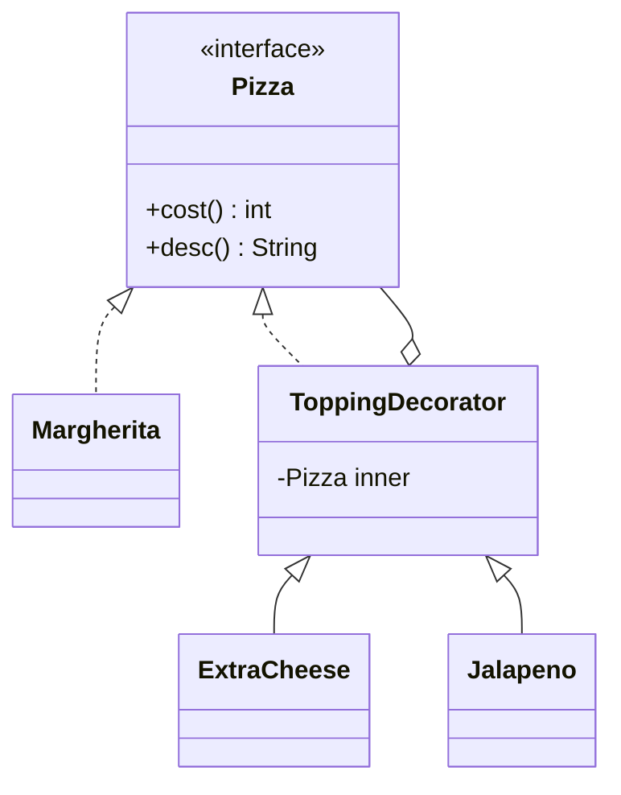

# Structural Patterns

Structural patterns show **how to connect classes and objects** (wrap, compose, share) so a big structure stays flexible and you can add new behaviour without touching existing code.

## ⭐ Adapter

**In one line:** connect two incompatible interfaces. It is a "converter plug" that makes a third-party class look like your own interface.

**Real example:** Swiggy has its own `PaymentGateway` interface: `pay(orderId, amountInRupees)`. The Razorpay SDK wants `createPayment(paise)`, and Paytm wants `initiateTxn(map)`. You write one adapter for each.

**When to use / when not:**
- Use it: you want to hide a third-party SDK or legacy code, which you cannot change, behind your own interface.
- Benefit: if PhonePe comes tomorrow, you just add a new adapter. Business code stays the same.
- Don't use it: both classes are yours. Just implement the interface directly.

```java
import java.util.Map;

interface PaymentGateway { boolean pay(String orderId, double rupees); }

// Third-party SDKs (we cannot change these)
class RazorpaySdk {
    boolean createPayment(String ref, long paise) {
        System.out.println("Razorpay: " + ref + " paise=" + paise); return true;
    }
}
class PaytmSdk {
    String initiateTxn(Map<String, String> params) {
        System.out.println("Paytm: " + params); return "TXN_SUCCESS";
    }
}

// Adapters
class RazorpayAdapter implements PaymentGateway {
    private final RazorpaySdk sdk = new RazorpaySdk();
    public boolean pay(String orderId, double rupees) {
        return sdk.createPayment(orderId, Math.round(rupees * 100)); // rupees -> paise
    }
}
class PaytmAdapter implements PaymentGateway {
    private final PaytmSdk sdk = new PaytmSdk();
    public boolean pay(String orderId, double rupees) {
        String res = sdk.initiateTxn(Map.of("ORDER_ID", orderId, "TXN_AMOUNT", String.valueOf(rupees)));
        return res.equals("TXN_SUCCESS");
    }
}

public class Main {
    public static void main(String[] args) {
        PaymentGateway gw = new RazorpayAdapter();   // can come from config
        System.out.println(gw.pay("ORD101", 349.50));
        gw = new PaytmAdapter();
        System.out.println(gw.pay("ORD102", 199.00));
    }
}
```

```cpp
#include <cmath>
#include <iostream>
#include <map>
#include <memory>
#include <string>

class PaymentGateway {
public:
    virtual bool pay(const std::string& orderId, double rupees) = 0;
    virtual ~PaymentGateway() = default;
};
// Third-party SDKs (cannot change)
struct RazorpaySdk {
    bool createPayment(const std::string& ref, long paise) {
        std::cout << "Razorpay: " << ref << " paise=" << paise << "\n"; return true;
    }
};
struct PaytmSdk {
    std::string initiateTxn(const std::map<std::string, std::string>& p) {
        std::cout << "Paytm: " << p.at("ORDER_ID") << " amt=" << p.at("TXN_AMOUNT") << "\n";
        return "TXN_SUCCESS"; }
};
// Adapters
class RazorpayAdapter : public PaymentGateway {
    RazorpaySdk sdk;
public:
    bool pay(const std::string& orderId, double rupees) override {
        return sdk.createPayment(orderId, std::lround(rupees * 100));
    }
};
class PaytmAdapter : public PaymentGateway {
    PaytmSdk sdk;
public:
    bool pay(const std::string& orderId, double rupees) override {
        return sdk.initiateTxn({{"ORDER_ID", orderId}, {"TXN_AMOUNT", std::to_string(rupees)}}) == "TXN_SUCCESS";
    }
};

int main() {
    std::unique_ptr<PaymentGateway> gw = std::make_unique<RazorpayAdapter>();
    std::cout << gw->pay("ORD101", 349.50) << "\n";
    gw = std::make_unique<PaytmAdapter>();
    std::cout << gw->pay("ORD102", 199.00) << "\n";
    return 0;
}
```

**Where in LLD problems:** Payment system (multiple gateways), Notification (Twilio/SendGrid/FCM adapters), Logger (behind log4j/slf4j), Maps provider (Google Maps vs MapMyIndia) in Uber.

**Say this in the interview:** "Every payment provider has a different SDK, so I will keep one `PaymentGateway` interface and one adapter per provider. New provider = new adapter, core code untouched."

**Common mistake:**
- Putting business logic in the adapter. An adapter should only translate (format, units, error codes).
- Confusing Adapter with Facade. Adapter **converts** an interface, Facade **simplifies** it.

## ⭐ Decorator

**In one line:** wrap an object to add new behaviour at runtime, without changing the class and without a subclass explosion.

**Real example:** Domino's pizza: base Margherita, then Extra Cheese, Jalapeno, Olives on top. Each topping is a wrapper that adds to the price and description. You don't need 50 classes like `CheeseJalapenoOlivePizza`.

**When to use / when not:**
- Use it: features can be combined and added/removed at runtime (toppings, add-ons, logging, compression, encryption).
- Java I/O is built on this: `new BufferedReader(new FileReader(...))`.
- Don't use it: there are only 1–2 fixed combinations. With too many layers, debugging gets hard.



```java
interface Pizza { int cost(); String desc(); }

class Margherita implements Pizza {
    public int cost() { return 199; }
    public String desc() { return "Margherita"; }
}

// Base decorator: holds a Pizza inside and implements the same interface
abstract class ToppingDecorator implements Pizza {
    protected final Pizza inner;
    ToppingDecorator(Pizza inner) { this.inner = inner; }
}
class ExtraCheese extends ToppingDecorator {
    ExtraCheese(Pizza p) { super(p); }
    public int cost() { return inner.cost() + 60; }
    public String desc() { return inner.desc() + " + Cheese"; }
}
class Jalapeno extends ToppingDecorator {
    Jalapeno(Pizza p) { super(p); }
    public int cost() { return inner.cost() + 40; }
    public String desc() { return inner.desc() + " + Jalapeno"; }
}

public class Main {
    public static void main(String[] args) {
        Pizza p = new Jalapeno(new ExtraCheese(new ExtraCheese(new Margherita())));
        System.out.println(p.desc() + " = Rs " + p.cost()); // 199+60+60+40 = 359
    }
}
```

```cpp
#include <iostream>
#include <memory>
#include <string>
#include <utility>

class Pizza {
public:
    virtual int cost() const = 0;
    virtual std::string desc() const = 0;
    virtual ~Pizza() = default;
};

class Margherita : public Pizza {
public:
    int cost() const override { return 199; }
    std::string desc() const override { return "Margherita"; }
};

class ToppingDecorator : public Pizza {
protected:
    std::unique_ptr<Pizza> inner;
public:
    explicit ToppingDecorator(std::unique_ptr<Pizza> p) : inner(std::move(p)) {}
};
class ExtraCheese : public ToppingDecorator {
public:
    using ToppingDecorator::ToppingDecorator;
    int cost() const override { return inner->cost() + 60; }
    std::string desc() const override { return inner->desc() + " + Cheese"; }
};
class Jalapeno : public ToppingDecorator {
public:
    using ToppingDecorator::ToppingDecorator;
    int cost() const override { return inner->cost() + 40; }
    std::string desc() const override { return inner->desc() + " + Jalapeno"; }
};

int main() {
    std::unique_ptr<Pizza> p = std::make_unique<Margherita>();
    p = std::make_unique<ExtraCheese>(std::move(p));
    p = std::make_unique<ExtraCheese>(std::move(p));
    p = std::make_unique<Jalapeno>(std::move(p));
    std::cout << p->desc() << " = Rs " << p->cost() << "\n"; // 359
    return 0;
}
```

**Where in LLD problems:** Pizza/Coffee ordering (Starbucks, Domino's), Logger (timestamp + JSON + encryption decorators), Vending Machine add-ons, wrapping a rate limiter around an existing API client, pricing add-on services (car wash, EV charging) in a Parking Lot.

**Say this in the interview:** "Topping combinations will explode if I make subclasses, so I will use Decorator. Each topping implements the same `Pizza` interface and wraps the inner one."

**Common mistake:**
- Forgetting to make the decorator implement the interface. Then you cannot wrap it in another decorator.
- Making a class for every combination using inheritance (class explosion).

## ⭐ Facade

**In one line:** give one simple entry point in front of many complex subsystems. The client does not see the complexity inside.

**Real example:** On Swiggy, "Place Order" is one button. Inside, it does inventory check, payment, restaurant notify, delivery partner assignment and notification. `OrderFacade.placeOrder()` orchestrates all of this.

**When to use / when not:**
- Use it: the client has to call 5 services in a fixed order. Facade keeps that sequence in one place.
- The subsystems can still be used directly. Facade does not block that.
- Don't use it: don't put all business logic in the Facade and turn it into a "God class".

```java
class InventoryService { boolean reserve(String item) { System.out.println("Reserved " + item); return true; } }
class PaymentService { boolean charge(String user, int amt) { System.out.println("Charged Rs " + amt); return true; } }
class DeliveryService { void assign(String orderId) { System.out.println("Rider assigned for " + orderId); } }
class NotificationService { void notify(String user, String msg) { System.out.println("To " + user + ": " + msg); } }

// Facade: one simple method, the full flow inside
class OrderFacade {
    private final InventoryService inventory = new InventoryService();
    private final PaymentService payment = new PaymentService();
    private final DeliveryService delivery = new DeliveryService();
    private final NotificationService notifier = new NotificationService();

    boolean placeOrder(String user, String item, int amount) {
        if (!inventory.reserve(item)) return false;
        if (!payment.charge(user, amount)) return false;
        String orderId = "ORD" + System.currentTimeMillis() % 1000;
        delivery.assign(orderId);
        notifier.notify(user, "Order " + orderId + " confirmed");
        return true;
    }
}

public class Main {
    public static void main(String[] args) {
        OrderFacade swiggy = new OrderFacade();
        swiggy.placeOrder("rahul", "Paneer Butter Masala", 280);
    }
}
```

```cpp
#include <iostream>
#include <string>

class InventoryService { public: bool reserve(const std::string& item) { std::cout << "Reserved " << item << "\n"; return true; } };
class PaymentService { public: bool charge(const std::string&, int amt) { std::cout << "Charged Rs " << amt << "\n"; return true; } };
class DeliveryService { public: void assign(const std::string& id) { std::cout << "Rider assigned for " << id << "\n"; } };
class NotificationService { public: void notify(const std::string& u, const std::string& m) { std::cout << "To " << u << ": " << m << "\n"; } };

class OrderFacade {
    InventoryService inventory;
    PaymentService payment;
    DeliveryService delivery;
    NotificationService notifier;
    int counter = 100;
public:
    bool placeOrder(const std::string& user, const std::string& item, int amount) {
        if (!inventory.reserve(item)) return false;
        if (!payment.charge(user, amount)) return false;
        std::string orderId = "ORD" + std::to_string(++counter);
        delivery.assign(orderId);
        notifier.notify(user, "Order " + orderId + " confirmed");
        return true;
    }
};

int main() {
    OrderFacade swiggy;
    swiggy.placeOrder("rahul", "Paneer Butter Masala", 280);
    return 0;
}
```

**Where in LLD problems:** BookMyShow `BookingFacade` (seat lock + payment + ticket), food delivery order placement, Parking Lot `ParkingLotSystem.park(vehicle)` (find spot + ticket + gate), home theater / smart home "movie mode".

**Say this in the interview:** "The client will only see `placeOrder()`. The orchestration of inventory, payment and delivery stays inside the Facade, so the client and subsystems stay loosely coupled."

**Common mistake:**
- Turning the Facade into a God class that holds every subsystem's logic. A Facade should only delegate.
- Mixing up Facade and Adapter. Facade gives a new simple interface, Adapter makes an existing interface match.

## ⭐ Proxy

**In one line:** put a "stand-in" with the same interface in front of the real object. It does access control, caching, lazy loading or logging.

**Real example:** **Caching proxy:** instead of loading a Zomato restaurant menu from the DB again and again, the proxy checks the cache first. **Protection proxy:** in the admin panel, only the `ADMIN` role can delete a restaurant.

**When to use / when not:**
- Caching proxy: the call is expensive (DB, remote API) and the same data is asked for again and again.
- Protection proxy: a permission check before the real object.
- Virtual proxy: load a heavy object (image, video) only when it is really needed.
- Don't use it: when the extra layer gives no benefit. It adds latency and complexity.

```java
import java.util.HashMap;
import java.util.Map;

interface MenuService { String getMenu(String restaurantId); }

class RealMenuService implements MenuService {
    public String getMenu(String id) {
        System.out.println("DB call for " + id);   // expensive
        return "Menu of " + id;
    }
}

// Caching + protection proxy: same interface
class MenuServiceProxy implements MenuService {
    private final MenuService real = new RealMenuService();
    private final Map<String, String> cache = new HashMap<>();
    private final String role;

    MenuServiceProxy(String role) { this.role = role; }

    public String getMenu(String id) {
        if (role.equals("BLOCKED")) throw new SecurityException("Access denied");
        return cache.computeIfAbsent(id, real::getMenu); // real call only on cache miss
    }
}

public class Main {
    public static void main(String[] args) {
        MenuService menu = new MenuServiceProxy("USER");
        System.out.println(menu.getMenu("R42")); // DB call
        System.out.println(menu.getMenu("R42")); // from cache
        try { new MenuServiceProxy("BLOCKED").getMenu("R42"); }
        catch (SecurityException e) { System.out.println(e.getMessage()); }
    }
}
```

```cpp
#include <iostream>
#include <memory>
#include <stdexcept>
#include <string>
#include <unordered_map>
#include <utility>

class MenuService {
public:
    virtual std::string getMenu(const std::string& id) = 0;
    virtual ~MenuService() = default;
};

class RealMenuService : public MenuService {
public:
    std::string getMenu(const std::string& id) override {
        std::cout << "DB call for " << id << "\n";
        return "Menu of " + id;
    }
};

class MenuServiceProxy : public MenuService {
    std::unique_ptr<MenuService> real = std::make_unique<RealMenuService>();
    std::unordered_map<std::string, std::string> cache;
    std::string role;
public:
    explicit MenuServiceProxy(std::string r) : role(std::move(r)) {}
    std::string getMenu(const std::string& id) override {
        if (role == "BLOCKED") throw std::runtime_error("Access denied");
        auto it = cache.find(id);
        if (it != cache.end()) return it->second;   // cache hit
        return cache[id] = real->getMenu(id);       // miss: real call + store
    }
};

int main() {
    MenuServiceProxy menu("USER");
    std::cout << menu.getMenu("R42") << "\n"; // DB call
    std::cout << menu.getMenu("R42") << "\n"; // from cache
    try { MenuServiceProxy("BLOCKED").getMenu("R42"); }
    catch (const std::runtime_error& e) { std::cout << e.what() << "\n"; }
    return 0;
}
```

**Where in LLD problems:** Rate limiter (a proxy in front of the API client that checks the limit), caching layer in URL shortener / menu service, access control for Splitwise group admin, lazy image loading in the Instagram feed, Logger proxy.

**Say this in the interview:** "The client won't even know it is talking to a proxy, because the interface is the same. I will keep caching and permission checks in the proxy, so the real service stays clean."

**Common mistake:**
- Confusing Proxy and Decorator. Both wrap, but Proxy does **access control** (often creates the real object itself), while Decorator **adds features** (the client wraps it, and they can be stacked).
- Forgetting invalidation/TTL in a caching proxy. You will get stale data.

## Composite

**In one line:** in a tree structure (whole-part), treat a single item and a group **the same way**.

**Real example:** Swiggy menu: the "Combos" category has items and also sub-categories. To get the total price, whether it is an item or a category, just call `price()`. Or a file system: both file and folder have `size()`.

**When to use / when not:**
- Use it: there is a hierarchy (folder/file, org chart, menu, UI component tree) and the client should not care about leaf vs group.
- Don't use it: the structure is flat, not a tree.

```java
import java.util.ArrayList;
import java.util.List;

interface MenuComponent { int price(); void print(String indent); }

class MenuItem implements MenuComponent {   // leaf
    private final String name; private final int price;
    MenuItem(String name, int price) { this.name = name; this.price = price; }
    public int price() { return price; }
    public void print(String in) { System.out.println(in + name + " Rs " + price); }
}

class MenuCategory implements MenuComponent { // composite
    private final String name;
    private final List<MenuComponent> children = new ArrayList<>();
    MenuCategory(String name) { this.name = name; }
    MenuCategory add(MenuComponent c) { children.add(c); return this; }
    public int price() { return children.stream().mapToInt(MenuComponent::price).sum(); }
    public void print(String in) {
        System.out.println(in + name + " (total Rs " + price() + ")");
        for (MenuComponent c : children) c.print(in + "  ");
    }
}

public class Main {
    public static void main(String[] args) {
        MenuCategory drinks = new MenuCategory("Drinks").add(new MenuItem("Lassi", 60));
        MenuCategory combo = new MenuCategory("Thali Combo")
            .add(new MenuItem("Dal", 120)).add(new MenuItem("Roti", 30)).add(drinks);
        combo.print("");
    }
}
```

```cpp
#include <iostream>
#include <memory>
#include <string>
#include <vector>
#include <utility>

class MenuComponent {
public:
    virtual int price() const = 0;
    virtual void print(const std::string& indent) const = 0;
    virtual ~MenuComponent() = default;
};

class MenuItem : public MenuComponent { // leaf
    std::string name; int cost;
public:
    MenuItem(std::string n, int c) : name(std::move(n)), cost(c) {}
    int price() const override { return cost; }
    void print(const std::string& in) const override { std::cout << in << name << " Rs " << cost << "\n"; }
};
class MenuCategory : public MenuComponent { // composite
    std::string name;
    std::vector<std::shared_ptr<MenuComponent>> children;
public:
    explicit MenuCategory(std::string n) : name(std::move(n)) {}
    void add(std::shared_ptr<MenuComponent> c) { children.push_back(std::move(c)); }
    int price() const override {
        int total = 0; for (const auto& c : children) total += c->price(); return total;
    }
    void print(const std::string& in) const override {
        std::cout << in << name << " (total Rs " << price() << ")\n";
        for (const auto& c : children) c->print(in + "  ");
    }
};

int main() {
    auto drinks = std::make_shared<MenuCategory>("Drinks");
    drinks->add(std::make_shared<MenuItem>("Lassi", 60));
    auto combo = std::make_shared<MenuCategory>("Thali Combo");
    combo->add(std::make_shared<MenuItem>("Dal", 120));
    combo->add(std::make_shared<MenuItem>("Roti", 30));
    combo->add(drinks); // category inside a category
    combo->print("");
    return 0;
}
```

**Where in LLD problems:** File system design, restaurant menu, organization hierarchy (employee/manager), sub-groups inside Splitwise groups, expression tree / calculator, UI component tree.

**Say this in the interview:** "Both folder and file will implement `FileSystemNode`. A folder's `size()` will be the recursive sum of its children, and the client won't see any difference."

**Common mistake:**
- Putting an `add()` method in the leaf and throwing an exception when it is not needed. Keep child management only in the composite (safe design).
- Creating a cycle (a folder becomes its own child). The recursion becomes infinite.

## Bridge

**In one line:** split abstraction and implementation into separate hierarchies so both can grow independently. Composition instead of inheritance.

**Real example:** Notification type (`OrderAlert`, `OtpAlert`) x channel (`SMS`, `WhatsApp`, `Email`). With inheritance you get `OtpSms`, `OtpWhatsApp`... 2x3 = 6 classes. With Bridge it is 2 + 3 = 5, and a new channel = just 1 class.

**When to use / when not:**
- Use it: two dimensions grow independently (shape x color, remote x device, message x channel).
- Don't use it: there is only one dimension. A simple Strategy or interface is enough there.

```java
// Implementation hierarchy: channel
interface Channel { void deliver(String to, String text); }
class SmsChannel implements Channel {
    public void deliver(String to, String text) { System.out.println("SMS to " + to + ": " + text); }
}
class WhatsAppChannel implements Channel {
    public void deliver(String to, String text) { System.out.println("WhatsApp to " + to + ": " + text); }
}

// Abstraction hierarchy: message type, holds a Channel reference inside (bridge)
abstract class Alert {
    protected final Channel channel;
    Alert(Channel channel) { this.channel = channel; }
    abstract void send(String to);
}
class OtpAlert extends Alert {
    private final String otp;
    OtpAlert(Channel c, String otp) { super(c); this.otp = otp; }
    void send(String to) { channel.deliver(to, "Your OTP is " + otp); }
}
class OrderAlert extends Alert {
    private final String orderId;
    OrderAlert(Channel c, String orderId) { super(c); this.orderId = orderId; }
    void send(String to) { channel.deliver(to, "Order " + orderId + " delivered"); }
}

public class Main {
    public static void main(String[] args) {
        new OtpAlert(new SmsChannel(), "4821").send("9876543210");
        new OrderAlert(new WhatsAppChannel(), "ORD55").send("9876543210");
    }
}
```

```cpp
#include <iostream>
#include <memory>
#include <string>
#include <utility>

class Channel {
public:
    virtual void deliver(const std::string& to, const std::string& text) = 0;
    virtual ~Channel() = default;
};
class SmsChannel : public Channel {
public:
    void deliver(const std::string& to, const std::string& t) override { std::cout << "SMS to " << to << ": " << t << "\n"; }
};
class WhatsAppChannel : public Channel {
public:
    void deliver(const std::string& to, const std::string& t) override { std::cout << "WhatsApp to " << to << ": " << t << "\n"; }
};

class Alert {
protected:
    std::shared_ptr<Channel> channel; // bridge
public:
    explicit Alert(std::shared_ptr<Channel> c) : channel(std::move(c)) {}
    virtual void send(const std::string& to) = 0;
    virtual ~Alert() = default;
};
class OtpAlert : public Alert {
    std::string otp;
public:
    OtpAlert(std::shared_ptr<Channel> c, std::string o) : Alert(std::move(c)), otp(std::move(o)) {}
    void send(const std::string& to) override { channel->deliver(to, "Your OTP is " + otp); }
};
class OrderAlert : public Alert {
    std::string orderId;
public:
    OrderAlert(std::shared_ptr<Channel> c, std::string id) : Alert(std::move(c)), orderId(std::move(id)) {}
    void send(const std::string& to) override { channel->deliver(to, "Order " + orderId + " delivered"); }
};

int main() {
    OtpAlert(std::make_shared<SmsChannel>(), "4821").send("9876543210");
    OrderAlert(std::make_shared<WhatsAppChannel>(), "ORD55").send("9876543210");
    return 0;
}
```

**Where in LLD problems:** Notification system (type x channel), remote control x TV brand, Shape x Renderer (drawing app), payment type x gateway, Logger (log format x destination).

**Say this in the interview:** "There are two independent dimensions, so inheritance will cause a class explosion. With Bridge, message type and channel stay in separate hierarchies, joined by composition."

**Common mistake:**
- Thinking Bridge is Adapter. Adapter connects an incompatible thing later, while Bridge keeps two hierarchies separate from design time.
- Confusing Bridge with Strategy. The structure looks the same, but in Bridge the abstraction side also has its own hierarchy.

## Flyweight

**In one line:** across lakhs of similar objects, share the data that is common (intrinsic) and pass the data that differs (extrinsic) from outside. Save memory.

**Real example:** 1 lakh restaurant markers on a Google Maps / Swiggy map. If you keep each marker's icon image (biryani, pizza) in a separate object, RAM runs out. Share the icon, only `(lat, lng)` is different.

**When to use / when not:**
- Use it: a huge number of objects, and a big part of them is the same (game particles, text editor characters, map markers, chess pieces).
- A flyweight must be **immutable**, because everyone shares it.
- Don't use it: there are few objects. The complexity is not worth it.

```java
import java.util.HashMap;
import java.util.Map;

// Flyweight: intrinsic (shared, immutable) state
final class MarkerIcon {
    private final String cuisine; private final String imageBytes;
    MarkerIcon(String cuisine) {
        this.cuisine = cuisine; this.imageBytes = "<big-png-of-" + cuisine + ">";
        System.out.println("Loaded icon: " + cuisine);
    }
    void draw(double lat, double lng) { // extrinsic state comes from outside
        System.out.println(cuisine + " icon at " + lat + "," + lng);
    }
}

class IconFactory {
    private static final Map<String, MarkerIcon> pool = new HashMap<>();
    static MarkerIcon get(String cuisine) {
        return pool.computeIfAbsent(cuisine, MarkerIcon::new);
    }
    static int size() { return pool.size(); }
}

public class Main {
    public static void main(String[] args) {
        String[] cuisines = {"Biryani", "Pizza", "Biryani", "Biryani", "Pizza"};
        for (int i = 0; i < cuisines.length; i++) {
            IconFactory.get(cuisines[i]).draw(12.9 + i * 0.01, 77.6);
        }
        System.out.println("Icons in memory: " + IconFactory.size()); // 2, not 5
    }
}
```

```cpp
#include <iostream>
#include <memory>
#include <string>
#include <unordered_map>
#include <vector>

class MarkerIcon { // flyweight: shared, immutable
    const std::string cuisine;
    const std::string imageBytes;
public:
    explicit MarkerIcon(const std::string& c) : cuisine(c), imageBytes("<big-png-of-" + c + ">") {
        std::cout << "Loaded icon: " << c << "\n";
    }
    void draw(double lat, double lng) const {
        std::cout << cuisine << " icon at " << lat << "," << lng << "\n";
    }
};

class IconFactory {
    std::unordered_map<std::string, std::shared_ptr<const MarkerIcon>> pool;
public:
    std::shared_ptr<const MarkerIcon> get(const std::string& c) {
        auto it = pool.find(c);
        if (it != pool.end()) return it->second;
        auto icon = std::make_shared<const MarkerIcon>(c);
        pool[c] = icon;
        return icon;
    }
    size_t size() const { return pool.size(); }
};

int main() {
    IconFactory factory;
    std::vector<std::string> cuisines = {"Biryani", "Pizza", "Biryani", "Biryani", "Pizza"};
    for (size_t i = 0; i < cuisines.size(); i++)
        factory.get(cuisines[i])->draw(12.9 + i * 0.01, 77.6);
    std::cout << "Icons in memory: " << factory.size() << "\n"; // 2
    return 0;
}
```

**Where in LLD problems:** Chess (piece type shared, position extrinsic), text editor (character glyphs), games (bullets, trees), map markers in Uber/Swiggy, spot type metadata in a Parking Lot.

**Say this in the interview:** "I will share the intrinsic state (icon image) and pass the extrinsic state (location) on every call. A factory will keep a pool so that only one object is created per type."

**Common mistake:**
- Keeping the flyweight mutable. A change in one place will show up everywhere.
- Putting extrinsic state (position) inside the flyweight too. Then the benefit of sharing is gone.

## Checklist

- [ ] I can write a Razorpay/Paytm Adapter in code for Swiggy payments
- [ ] I can write a Pizza/coffee Decorator and explain the class explosion problem
- [ ] I can tell the difference between Facade, Adapter, Proxy and Decorator in one line each
- [ ] I can give an example of a caching proxy and a protection proxy
- [ ] I can design a file system / menu tree with Composite
- [ ] I can tell when Bridge is needed (two independent dimensions)
- [ ] I can explain intrinsic vs extrinsic state in Flyweight
