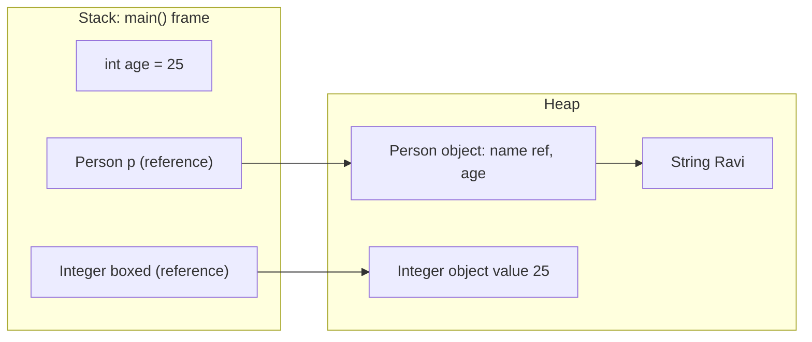

# Java Basics: primitives & types

Basic Java questions feel "easy" in an interview, but they are exactly where people get caught: the `Integer` cache, overflow, pass-by-value, the autoboxing NPE. This file closes those gaps.

## ⭐ 8 Primitive types

**In one line:** Java has 8 primitive types that store the value directly (not an object), and their size is fixed on every platform.

| Type | Size | Range | Default (field/array) |
|---|---|---|---|
| `byte` | 8 bit | -128 to 127 | `0` |
| `short` | 16 bit | -32,768 to 32,767 | `0` |
| `int` | 32 bit | -2^31 to 2^31-1 (~±2.1 × 10^9) | `0` |
| `long` | 64 bit | -2^63 to 2^63-1 (~±9.2 × 10^18) | `0L` |
| `float` | 32 bit | ~7 decimal digits precision | `0.0f` |
| `double` | 64 bit | ~15-16 decimal digits precision | `0.0d` |
| `char` | 16 bit | 0 to 65,535 (unsigned, UTF-16 unit) | `'\u0000'` |
| `boolean` | JVM dependent | `true` / `false` | `false` |

- Default values are given only to **fields and array elements**. Using a local variable before assigning it is a compile error.
- An integer literal is `int` by default, a decimal literal is `double` by default. That is why the `L` in `long x = 3_000_000_000L;` and the `f` in `float f = 1.5f;` are required.
- `char` is unsigned in Java; all the other integer types are signed.

```java
public class Main {
    static int count;       // field: default 0
    static boolean done;    // field: default false

    public static void main(String[] args) {
        int local;
        // System.out.println(local); // compile error: might not have been initialized
        long big = 3_000_000_000L;      // without L: "integer number too large"
        float price = 99.5f;            // without f: double -> float error
        char c = 'A';
        System.out.println(count + " " + done + " " + big + " " + price + " " + (int) c); // 0 false 3000000000 99.5 65
        System.out.println(Integer.MAX_VALUE + " " + Long.MAX_VALUE);
    }
}
```

**Interview tip:** "Why not `double` for money?" Answer: binary floating point is not exact (`0.1 + 0.2 != 0.3`). For money use `long` in paise or `BigDecimal`.

**Common mistake:** an `int` sum overflowing on LeetCode when the constraints are 10^5 elements × 10^9 value. Use `long` there.

## Wrapper classes

**In one line:** every primitive has an object version (`Integer`, `Long`, `Double`, `Character`, `Boolean`...) so it can be used in collections and generics.

- `List<int>` is not allowed; you need `List<Integer>`. Generics work only with objects.
- Wrappers are **immutable** and can be `null`. A primitive is never `null`.
- Mapping: `byte→Byte`, `short→Short`, `int→Integer`, `long→Long`, `float→Float`, `double→Double`, `char→Character`, `boolean→Boolean`.

**Important methods:**

| Method | What it does | Time complexity |
|---|---|---|
| `Integer.parseInt("42")` | String to `int` (`NumberFormatException` on bad input) | O(n) |
| `Integer.valueOf(42)` | returns an `Integer` object, uses the cache | O(1) |
| `Integer.MAX_VALUE / MIN_VALUE` | limits of the range | O(1) |
| `Integer.compare(a, b)` | overflow-safe compare (like -1/0/1) | O(1) |
| `Integer.toBinaryString(n)` | binary string | O(32) |
| `Integer.bitCount(n)` | count set bits | O(1) |
| `Character.isDigit(c) / isLetter(c)` | check char type | O(1) |
| `Character.getNumericValue('7')` | returns `7` | O(1) |

**Interview tip:** `parseInt` returns a primitive, `valueOf` returns an object. Using `valueOf` in a loop can create unnecessary objects.

**Common mistake:** `Integer.parseInt(" 42")` fails because of the space. Call `trim()` first.

## ⭐ Autoboxing & unboxing

**In one line:** the compiler does primitive ↔ wrapper conversion for you: `int → Integer` (autoboxing) and `Integer → int` (unboxing).

Under the hood `Integer x = 5;` becomes `Integer.valueOf(5)`, and `int y = x;` becomes `x.intValue()`. If `x` is null, you get a **NullPointerException**.

```java
import java.util.HashMap;
import java.util.Map;

public class Main {
    public static void main(String[] args) {
        Map<String, Integer> stock = new HashMap<>();
        stock.put("biryani", 10);

        int a = stock.get("biryani");     // unboxing, works
        // int b = stock.get("pizza");    // get() returns null -> NPE on unboxing

        int safe = stock.getOrDefault("pizza", 0); // the right way
        stock.merge("biryani", 1, Integer::sum);   // clean way to increment a count

        boolean flag = true;
        // Ternary trap: if one side is int, the whole expression becomes int
        // Integer x = flag ? stock.get("pizza") : 0; // NPE! null gets unboxed

        Long total = 0L;
        for (int i = 0; i < 1000; i++) total += i; // a new Long object every step: slow
        System.out.println(a + " " + safe + " " + total);
    }
}
```

**Interview tip:** "What is the cost of autoboxing?" An object allocation per box (outside the cache range), extra memory and GC pressure. Use primitives in hot loops.

**Common mistake:**
- Putting `map.get(key)` straight into an `int`. If the key is missing, NPE.
- Using a `Long sum` as a loop accumulator. Use `long`.

## ⭐ Integer cache (== vs equals)

**In one line:** `Integer.valueOf()` (and autoboxing) returns the **same cached object** for values from -128 to 127, so `==` is true inside that range and false outside it.

- On objects, `==` compares **references**, `equals()` compares **values**.
- Cache: `Byte`, `Short`, `Integer`, `Long` (-128..127), `Character` (0..127), `Boolean` (TRUE/FALSE). `Float`/`Double` have no cache.
- The upper limit for `Integer` can be raised with the JVM flag `-XX:AutoBoxCacheMax`.

```java
public class Main {
    public static void main(String[] args) {
        Integer a = 127, b = 127;
        System.out.println(a == b);       // true: both are the same cached object
        Integer c = 128, d = 128;
        System.out.println(c == d);       // false: two different objects
        System.out.println(c.equals(d));  // true: same value
        System.out.println(c.intValue() == d); // true: one side primitive -> unboxing

        Long big = 127L;
        System.out.println(big.equals(127));   // false: Integer vs Long, different type
        System.out.println(big.equals(127L));  // true
    }
}
```

**Interview tip:** on LeetCode, if you compare counts from two `HashMap<Character, Integer>` with `map1.get(c) == map2.get(c)`, small tests pass and big ones (count > 127) fail. Always use `equals()` or `Objects.equals()`.

**Common mistake:** thinking `Long.equals(Integer)` is true. `equals` checks the type first.

## ⭐ Type casting: widening & narrowing

**In one line:** going from a smaller type to a bigger one (widening) is automatic; going from bigger to smaller (narrowing) needs an explicit cast and can lose data.

Widening order: `byte → short → int → long → float → double`, and `char → int`.

```java
public class Main {
    public static void main(String[] args) {
        int i = 100;
        long l = i;              // widening: automatic
        double d = l;            // widening

        double price = 3.99;
        int rupees = (int) price;        // narrowing: 3 (truncates, does not round)
        byte b = (byte) 200;             // -56: the upper bits got cut off
        long round = Math.round(price);  // 4

        int big = 123_456_789;
        float f = big;                   // widening but precision loss: 1.23456792E8
        System.out.println(rupees + " " + b + " " + round + " " + f);

        byte x = 10;
        // x = x + 5;    // compile error: x + 5 has type int
        x += 5;          // works: compound assignment has a hidden cast
        char next = (char) ('a' + 1);    // 'b'
        System.out.println(x + " " + next);
    }
}
```

**Interview tip:** in arithmetic, `byte`, `short` and `char` are first promoted to `int` (binary numeric promotion). That is why `byte + byte` gives an `int`.

**Common mistake:** expecting `(int) 3.99` to be 4. A cast always truncates toward zero. Use `Math.round` for rounding.

## var (local type inference)

**In one line:** since Java 10 the compiler infers a local variable's type from the right side: `var list = new ArrayList<String>();`.

- Only for **local variables** (plus for-loops and try-with-resources). Not for fields, method parameters or return types.
- An initializer is required: `var x;` is an error, `var y = null;` is an error.
- The type is fixed at compile time. This is not JavaScript's dynamic `var`.

```java
import java.util.ArrayList;
import java.util.HashMap;
import java.util.List;
import java.util.Map;

public class Main {
    public static void main(String[] args) {
        var orders = new HashMap<String, List<Integer>>(); // no need to write the long type
        orders.put("Ravi", new ArrayList<>(List.of(101, 102)));
        for (var e : orders.entrySet()) {
            System.out.println(e.getKey() + " -> " + e.getValue());
        }
        var n = 10;          // int
        // n = "ten";        // compile error: type is already fixed as int
        var mixed = new ArrayList<>(); // became ArrayList<Object>, be careful
        mixed.add(1);
        System.out.println(n + " " + mixed);
    }
}
```

**Interview tip:** `var` is for readability when the type is obvious from the right side. When the type is not clear (`var x = service.process();`), write the explicit type.

**Common mistake:** writing `var list = new ArrayList<>();`. With the diamond, the inferred type is `Object`.

## ⭐ final

**In one line:** a `final` variable is assigned once, a `final` method cannot be overridden, a `final` class cannot be extended.

- A `final` reference means the reference will not change. **The data inside the object can still change.**
- Classes like `String` and `Integer` are `final` so nobody can subclass them and break immutability.
- A lambda/anonymous class can only use **effectively final** local variables (never changed after assignment).

```java
import java.util.ArrayList;
import java.util.List;

public class Main {
    static final int MAX_SEATS = 100;     // constant

    public static void main(String[] args) {
        final List<String> cart = new ArrayList<>();
        cart.add("Paneer Tikka");         // works: the object is being mutated
        // cart = new ArrayList<>();      // error: the reference is final

        final int gst;
        gst = 18;                         // blank final: assigned once
        // gst = 5;                       // error

        int discount = 10;                // effectively final
        Runnable r = () -> System.out.println("Discount " + discount);
        // discount = 20;                 // with this line, the lambda above would not compile
        r.run();
        System.out.println(cart + " " + gst + " " + MAX_SEATS);
    }
}
```

**Interview tip:** "final vs finally vs finalize?" `final` = keyword (variable/method/class), `finally` = the block after try that always runs, `finalize()` = method called before GC (deprecated since Java 9, do not use it).

**Common mistake:** treating a `final List` as an immutable list. For immutability use `List.of(...)` or `Collections.unmodifiableList`.

## ⭐ Operators gotchas

**In one line:** integer overflow wraps around silently, `/` truncates on integers, `%` takes its sign from the dividend, and `i++` vs `++i` give different values.

```java
public class Main {
    public static void main(String[] args) {
        // 1. Overflow: no exception, it wraps around
        int max = Integer.MAX_VALUE;
        System.out.println(max + 1);                 // -2147483648
        long wrong = 1_000_000 * 1_000_000;          // multiplied as int, then long: -727379968
        long right = 1_000_000L * 1_000_000;         // 1000000000000
        // Math.addExact(max, 1);                    // ArithmeticException: catches overflow
        System.out.println(Math.abs(Integer.MIN_VALUE)); // -2147483648 (even abs fails)

        // Binary search mid: (lo + hi) / 2 can overflow
        int lo = 2_000_000_000, hi = 2_100_000_000;
        int mid = lo + (hi - lo) / 2;                // safe

        // 2. Division and modulo
        System.out.println(7 / 2 + " " + -7 / 2);    // 3 -3 (truncates toward zero)
        System.out.println(-7 % 3);                  // -1 (sign of the dividend)
        System.out.println(Math.floorMod(-7, 3));    // 2 (always non-negative, use for mod)
        System.out.println(5.0 / 0 + " " + 0.0 / 0); // Infinity NaN
        // System.out.println(5 / 0);                // ArithmeticException: / by zero

        // 3. The ++ trap
        int i = 5;
        int j = i++ + ++i;                           // 5 + 7 = 12, i is now 7
        int k = 5;
        k = k++;                                     // k is still 5
        System.out.println(mid + " " + j + " " + i + " " + k);
        System.out.println(0.1 + 0.2 == 0.3);        // false
    }
}
```

**Interview tip:** "I stored `1_000_000 * 1_000_000` in a `long`, why is it wrong?" The right side is evaluated as `int` first, overflows, and only then widens. Make one operand `L`.

**Common mistake:**
- Using `n % k` on a negative number as an array index (you get a negative index). Use `Math.floorMod` or `((n % k) + k) % k`.
- `&&`/`||` short-circuit, `&`/`|` evaluate both sides. Using `&` in a null check gives an NPE.

## ⭐ Pass-by-value (objects too)

**In one line:** Java is **always pass-by-value**. For objects, a **copy of the reference** is passed, so the object can be mutated but the caller's reference cannot be changed.

```java
public class Main {
    static void change(int x) { x = 100; }                       // the copy changed
    static void addSurname(StringBuilder sb) { sb.append(" Kumar"); } // same object mutated
    static void reassign(StringBuilder sb) { sb = new StringBuilder("New"); } // local copy changed
    static void swap(Integer a, Integer b) { Integer t = a; a = b; b = t; }  // useless

    public static void main(String[] args) {
        int n = 5;
        change(n);
        StringBuilder name = new StringBuilder("Ravi");
        addSurname(name);
        reassign(name);
        Integer p = 1, q = 2;
        swap(p, q);
        System.out.println(n + " | " + name + " | " + p + " " + q); // 5 | Ravi Kumar | 1 2
    }
}
```

**Interview tip:** in one line: "Java passes references by value. A method can change an object's state, but it cannot change which object the caller's variable points to. That is why you cannot write a swap function in Java."

**Common mistake:** saying "objects are pass-by-reference". Interviewers catch exactly this. Give the reassign example.

## ⭐ static vs instance

**In one line:** a `static` member belongs to the class (only one copy); an instance member belongs to each object.

- A `static` method has no `this`, so it cannot directly access instance fields/methods.
- A `static` block runs once, when the class is loaded.
- A static method is not overridden, it is **hidden** (compile-time binding).

```java
public class Main {
    static class Order {
        static int totalOrders = 0;      // shared by all objects
        static final String APP;         // set in the static block
        final int orderId;               // each object has its own

        static { APP = "Zomato"; }       // runs once on class load

        Order() { totalOrders++; orderId = totalOrders; }

        static void report() {
            System.out.println(APP + " total: " + totalOrders);
            // System.out.println(orderId); // error: no instance field in a static context
        }
    }

    public static void main(String[] args) {
        Order o1 = new Order();
        Order o2 = new Order();
        System.out.println(o1.orderId + " " + o2.orderId); // 1 2
        Order.report();                                    // Zomato total: 2
    }
}
```

**Interview tip:** "Can a static method be overridden?" No. A subclass can declare a static method with the same signature, but that is hiding. The call is decided by the declared type of the reference, not by the object.

**Common mistake:** using a mutable `static` field as shared state in multi-threaded code. Without synchronization you get a race condition.

## main method

**In one line:** `public static void main(String[] args)` is the JVM's entry point.

- `public`: the JVM calls it from outside. `static`: it can be called without creating an object. `void`: nothing is returned to the JVM. `String[] args`: command line arguments.
- `String... args` (varargs) is also valid. Adding `final` or `synchronized` is allowed too.
- You can overload `main`, but the JVM only runs the `String[]` one.
- Java 21 had instance `main` and class-less files as a preview; they became final in Java 25. In an interview, state the classic signature.

```java
public class Main {
    public static void main(String[] args) {
        System.out.println("Args: " + args.length);   // 0 when there are no args, not null
        main(5);                                      // overload: called like a normal method
    }
    static void main(int x) { System.out.println("Overloaded " + x); }
}
```

**Interview tip:** "Why is main static?" Because the JVM has no object at that moment. Being static, it can be called right after the class is loaded.

**Common mistake:** assuming `args` can be `null`. With no arguments you get an empty array.

## Memory: primitives vs objects

**In one line:** local primitives and references live on the **stack** (in the method frame), objects always live on the **heap**; primitive fields inside an object also live on the heap with that object.



- `int` = 4 bytes. An `Integer` object = header (~12 bytes) + 4 bytes value + padding ≈ 16 bytes, plus 4–8 bytes for the reference.
- `int[1000]` is one contiguous block. `Integer[1000]` = 1000 references + 1000 separate objects (outside the cache range). It is not cache-friendly either.
- Each thread has its own stack, while the heap is shared by all threads. That is why local primitives are thread-safe.

**Interview tip:** "`ArrayList<Integer>` vs `int[]` memory?" `int[]` is ~4 bytes/element, `ArrayList<Integer>` is ~20 bytes/element (reference + boxed object). For big data, use a primitive array.

**Common mistake:** saying "primitives are always on the stack". As a field or array element, a primitive lives on the heap.

## Checklist

- [ ] I can state the size, range and default value of the 8 primitive types
- [ ] I can explain autoboxing/unboxing and the `map.get()` / ternary NPE
- [ ] I can predict the output of `==` because of the Integer cache (-128..127)
- [ ] I can explain widening vs narrowing casts and the result of `(int) 3.99` / `(byte) 200`
- [ ] I can spot integer overflow, `/`, `%` and `i++` gotchas in code
- [ ] I can explain why Java is pass-by-value, with the swap example
- [ ] I can state the rules of `final`, `var`, and `static` vs instance
- [ ] I can draw and explain primitive vs object memory (stack vs heap)
