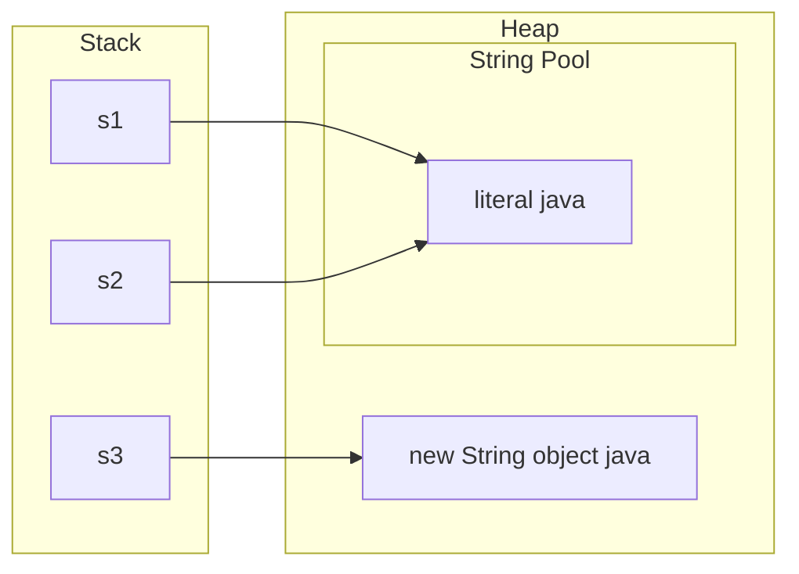

# Strings

The most common Java interview topic. They ask the theory (immutability, pool, `==`), and half the coding-round questions are on strings. Both are covered here.

## ⭐ Immutability and why

**In one line:** once a `String` object is created its content never changes; every "change" (`toUpperCase`, `replace`, `concat`) creates a new object.

**Why it was made immutable:**
- **String pool:** the same literal is shared in many places. If it were mutable, changing it in one place would change it everywhere.
- **Security:** file paths, DB URLs and class names travel as strings. Nobody should be able to change them after a check.
- **hashCode cache:** the hash is computed once and stored. That is why `String` is the best `HashMap` key.
- **Thread-safe:** threads can share it without a lock.
- The class is `final` and the internal array is `private final`, so you cannot break it even with a subclass. (Since Java 9 it uses `byte[]` + a coder internally, Compact Strings: Latin-1 text takes 1 byte/char.)

```java
public class Main {
    public static void main(String[] args) {
        String s = "swiggy";
        s.toUpperCase();            // a new object is created and thrown away
        System.out.println(s);      // swiggy (original unchanged)

        s = s.toUpperCase();        // now s points to the new object
        System.out.println(s);      // SWIGGY

        String a = "pay";
        String b = a;               // both point to the same object
        a = a + "tm";               // a is now a new object "paytm"
        System.out.println(b);      // pay (b is not affected)
    }
}
```

**Interview tip:** "Why is String immutable?" Give four points: pool sharing, security, hashCode caching, thread safety.

**Common mistake:** writing `s.trim();` or `s.replace(...)` without assigning the result. Capture the return value: `s = s.trim();`.

## ⭐ String pool and intern()

**In one line:** string literals are stored only once in a special area inside the heap (the String pool); `new String()` always creates a new object outside the pool.



- Since Java 7 the pool lives in the **heap** (it used to be in PermGen), so pooled strings can also be garbage collected.
- `new String("java")` = 1 or 2 objects: if the literal was not already in the pool it gets created too, plus a new object on the heap.
- `intern()` returns the pooled reference (and adds the string to the pool if it is not there).
- Compile-time constants (`"ja" + "va"`, or a `final` variable + a literal) are joined by the compiler and go to the pool. Runtime concatenation creates a new object.

```java
public class Main {
    public static void main(String[] args) {
        String s1 = "java";
        String s2 = "java";
        String s3 = new String("java");
        String s4 = s3.intern();
        String s5 = "ja" + "va";        // compile-time constant -> pool

        String part = "ja";
        String s6 = part + "va";        // runtime concat -> new heap object
        final String fpart = "ja";
        String s7 = fpart + "va";       // final, so it became a constant -> pool

        System.out.println(s1 == s2);       // true
        System.out.println(s1 == s3);       // false
        System.out.println(s1 == s4);       // true
        System.out.println(s1 == s5);       // true
        System.out.println(s1 == s6);       // false
        System.out.println(s1 == s7);       // true
        System.out.println(s1.equals(s3));  // true
    }
}
```

**Interview tip:** "How many objects does `String s = new String("abc")` create?" Answer: up to two. One literal in the pool (if not already there), one on the heap from `new`.

**Common mistake:** treating `intern()` as a performance trick to use everywhere. Interning lots of unique strings makes the pool big and lookups slow.

## ⭐ == vs equals()

**In one line:** `==` compares references (same object?), `equals()` compares content. For strings, **always use `equals()`**.

```java
import java.util.Objects;

public class Main {
    public static void main(String[] args) {
        String input = new String("UPI");       // as if it came from user input / network
        System.out.println(input == "UPI");      // false: different object
        System.out.println(input.equals("UPI")); // true

        String mode = null;
        // mode.equals("UPI");                   // NPE
        System.out.println("UPI".equals(mode));  // false, NPE-safe (literal first)
        System.out.println(Objects.equals(mode, "UPI")); // false, null-safe on both sides

        System.out.println("upi".equalsIgnoreCase("UPI")); // true
        System.out.println("apple".compareTo("banana"));   // -1 ('a' - 'b')
        System.out.println("app".compareTo("apple"));      // -2 (length difference)
    }
}
```

**Interview tip:** `compareTo` is lexicographic: the difference of the first mismatching chars, otherwise the difference in length. For sorting, look at 0 / negative / positive; do not depend on the exact number.

**Common mistake:** `==` worked in a test because both were literals from the pool; in production the input came at runtime and it failed. So never use `==`.

## ⭐ StringBuilder vs StringBuffer

**In one line:** both are mutable strings; `StringBuilder` is fast and not thread-safe, `StringBuffer` is synchronized (thread-safe) and slower.

| | `String` | `StringBuilder` | `StringBuffer` |
|---|---|---|---|
| Mutable | No | Yes | Yes |
| Thread-safe | Yes (immutable) | No | Yes (synchronized methods) |
| Speed | New object on each change | Fastest | Slower because of locks |
| When | Fixed text, map key | Building a string in a single thread (99% of cases) | Legacy code, rare |

- Default capacity is 16. When full it grows to ~2x + 2 (array copy). If you know the size, use `new StringBuilder(n)`.
- `StringBuilder` does not override `equals()`. To compare, use `sb1.toString().equals(sb2.toString())` or `sb1.compareTo(sb2) == 0` (Java 11+).

**Important methods:**

| Method | What it does | Time complexity |
|---|---|---|
| `append(x)` | add at the end | O(1) amortized |
| `insert(i, x)` | insert at an index | O(n) |
| `deleteCharAt(i)` | remove one char | O(n) (O(1) at the end) |
| `setCharAt(i, c)` | change a char | O(1) |
| `reverse()` | reverse in place | O(n) |
| `setLength(0)` | clear for reuse | O(1) |
| `toString()` | build a `String` | O(n) |

```java
public class Main {
    public static void main(String[] args) {
        StringBuilder sb = new StringBuilder("racecar");
        sb.reverse();
        System.out.println(sb.toString().equals("racecar")); // true: palindrome

        StringBuilder path = new StringBuilder();
        path.append("a").append("b").append("c");   // common in backtracking
        path.deleteCharAt(path.length() - 1);       // remove last char (undo)
        path.insert(0, '/');
        System.out.println(path);                   // /ab
    }
}
```

**Interview tip:** "When StringBuffer?" Practically never. Why would you need a shared mutable string at all? Use a local `StringBuilder` inside the thread.

**Common mistake:** writing `new StringBuilder('a')`. The `char` becomes an `int` capacity (97) and the content is empty. Write `new StringBuilder("a")` or `.append('a')`.

## ⭐ Concatenation in loops

**In one line:** `s += x` in a loop copies the whole string every time, **O(n²)** in total; with `StringBuilder` it is **O(n)**.

- A single expression `a + b + c` is fine. Since Java 9 the compiler optimizes it with `invokedynamic` (StringConcatFactory).
- The problem is only in loops: every iteration copies the entire old string.

```java
import java.util.List;
import java.util.stream.Collectors;

public class Main {
    public static void main(String[] args) {
        int n = 10_000;

        String slow = "";
        for (int i = 0; i < n; i++) slow += i;          // O(n^2): a new copy every time

        StringBuilder sb = new StringBuilder();
        for (int i = 0; i < n; i++) sb.append(i);       // O(n)
        String fast = sb.toString();
        System.out.println(slow.equals(fast));          // true, only the time differs

        List<String> items = List.of("Dosa", "Idli", "Vada");
        System.out.println(String.join(", ", items));  // Dosa, Idli, Vada
        System.out.println(items.stream().collect(Collectors.joining(" | ", "[", "]")));
    }
}
```

**Interview tip:** when you build a result string in a coding round, go straight to `StringBuilder` and say "`+=` in a loop is O(n²)".

**Common mistake:** writing `sb.append(a + " " + b)`. A temporary string is created inside again. `sb.append(a).append(' ').append(b)` is better.

## ⭐ Important methods

**In one line:** these methods come up again and again in coding rounds; remember their complexity and edge cases.

| Method | What it does | Time complexity |
|---|---|---|
| `length()` | char count (a method; for arrays `length` is a field) | O(1) |
| `charAt(i)` | i-th char, `StringIndexOutOfBoundsException` on a bad index | O(1) |
| `substring(a, b)` | the `[a, b)` part, a new string (copy) | O(b - a) |
| `indexOf(str)` / `lastIndexOf` | first / last position, -1 if not found | O(n·m) worst |
| `contains(str)` / `startsWith` / `endsWith` | checks | O(n·m) / O(m) |
| `split(regex)` | split by regex into `String[]` | O(n) |
| `trim()` / `strip()` | remove whitespace on both sides (`strip` is Java 11, Unicode aware) | O(n) |
| `replace(a, b)` | replace all occurrences (not regex) | O(n) |
| `replaceAll(regex, b)` | replace by regex | O(n) + regex |
| `toCharArray()` | new `char[]` copy | O(n) |
| `chars()` | `IntStream` of chars | O(n) |
| `compareTo(s)` | lexicographic compare | O(min(n, m)) |
| `equalsIgnoreCase(s)` | equals ignoring case | O(n) |
| `String.join(sep, parts)` | join parts with a separator | O(total) |
| `repeat(k)` | repeat k times (Java 11) | O(n·k) |
| `isEmpty()` / `isBlank()` | length 0? / only whitespace? (`isBlank` is Java 11) | O(1) / O(n) |
| `String.format(...)` / `formatted(...)` | string from a template (`formatted` is Java 15) | O(n), slow-ish |
| `toLowerCase()` / `toUpperCase()` | change case, new string | O(n) |

```java
import java.util.Arrays;

public class Main {
    public static void main(String[] args) {
        String s = "  Hello World  ";
        System.out.println(s.trim().length());              // 11
        System.out.println("Hello".substring(1, 3));        // el
        System.out.println("banana".indexOf("an"));         // 1
        System.out.println("banana".indexOf('z'));          // -1

        System.out.println(Arrays.toString("a.b.c".split(".")));    // [] : "." is a regex!
        System.out.println(Arrays.toString("a.b.c".split("\\.")));  // [a, b, c]
        System.out.println(Arrays.toString("a,b,,".split(",")));    // [a, b] : trailing empties removed
        System.out.println(Arrays.toString(" hi  there".split("\\s+"))); // [, hi, there] : leading empty

        System.out.println("ab".repeat(3));                 // ababab
        System.out.println("   ".isBlank() + " " + "   ".isEmpty()); // true false
        System.out.println("hello".chars().filter(c -> c == 'l').count()); // 2
        System.out.println(String.format("%s ordered %d items, Rs %.2f", "Ravi", 3, 249.5));
    }
}
```

**Interview tip:** "What is the complexity of `substring`?" Since Java 7u6 it is O(k) because a new array is copied. Earlier it shared the original array (which caused a memory leak issue).

**Common mistake:**
- `split(".")`, `split("|")`, `split("+")` without escaping. These are regex special chars.
- On a string with a leading space, `split("\\s+")` gives an empty first element. Call `trim()` first.

## ⭐ char arithmetic

**In one line:** a `char` is a 16-bit number internally; in arithmetic it becomes an `int`, which is why `c - 'a'` gives an index and `'a' + 'b'` gives a number.

```java
public class Main {
    public static void main(String[] args) {
        char c = 'd';
        int idx = c - 'a';                  // 3 : index into a freq array
        char next = (char) (c + 1);         // 'e' : cast required
        int digit = '7' - '0';              // 7 : char digit to int
        char back = (char) ('a' + 2);       // 'c'
        c++;                                // allowed: c is now 'e' (hidden cast)

        System.out.println('a' + 'b');      // 195 : int addition
        System.out.println("" + 'a' + 'b'); // ab  : string concat
        System.out.println('a' + 1 + "x");  // 98x : evaluated left to right
        System.out.println(idx + " " + next + " " + digit + " " + back + " " + c);

        System.out.println(Character.isLetterOrDigit('_')); // false
        System.out.println(Character.toUpperCase('q'));     // Q
        System.out.println((int) 'A' + " " + (int) 'a' + " " + (int) '0'); // 65 97 48
    }
}
```

**Interview tip:** remember the ASCII values: `'0'` = 48, `'A'` = 65, `'a'` = 97. To change case use `Character.toLowerCase`; the `+32` trick works only on English letters.

**Common mistake:** writing `char next = c + 1;`. Compile error, because `c + 1` is an `int`. Add a cast.

## ⭐ Common interview patterns

**In one line:** most string problems are built from 4 patterns: frequency count (`int[26]`), two pointers (palindrome/reverse), building with `StringBuilder`, and sliding window.

- **Frequency count:** if only lowercase letters, `int[26]`; otherwise `int[128]` (ASCII) or `HashMap<Character, Integer>`. The array is fast and has no boxing.
- **Two pointers:** `i` from the start, `j` from the end. Palindrome, reverse, valid palindrome with skips.
- **Reverse words:** `trim` + `split("\\s+")` + join in reverse.

```java
public class Main {
    // Anagram: O(n) time, O(1) space (26 is fixed)
    static boolean isAnagram(String s, String t) {
        if (s.length() != t.length()) return false;
        int[] freq = new int[26];
        for (int i = 0; i < s.length(); i++) {
            freq[s.charAt(i) - 'a']++;
            freq[t.charAt(i) - 'a']--;
        }
        for (int f : freq) if (f != 0) return false;
        return true;
    }

    // Palindrome: only letters/digits, ignore case (LeetCode 125)
    static boolean isPalindrome(String s) {
        int i = 0, j = s.length() - 1;
        while (i < j) {
            char a = s.charAt(i), b = s.charAt(j);
            if (!Character.isLetterOrDigit(a)) { i++; continue; }
            if (!Character.isLetterOrDigit(b)) { j--; continue; }
            if (Character.toLowerCase(a) != Character.toLowerCase(b)) return false;
            i++; j--;
        }
        return true;
    }

    // Reverse a string in place: two pointers on a char[]
    static String reverse(String s) {
        char[] arr = s.toCharArray();
        for (int i = 0, j = arr.length - 1; i < j; i++, j--) {
            char tmp = arr[i]; arr[i] = arr[j]; arr[j] = tmp;
        }
        return new String(arr);
    }

    // "  the sky  is blue " -> "blue is sky the"
    static String reverseWords(String s) {
        String[] words = s.trim().split("\\s+");
        StringBuilder sb = new StringBuilder();
        for (int i = words.length - 1; i >= 0; i--) {
            sb.append(words[i]);
            if (i > 0) sb.append(' ');
        }
        return sb.toString();
    }

    public static void main(String[] args) {
        System.out.println(isAnagram("listen", "silent"));                 // true
        System.out.println(isPalindrome("A man, a plan, a canal: Panama")); // true
        System.out.println(reverse("zomato"));                             // otamoz
        System.out.println(reverseWords("  the sky  is blue "));           // blue is sky the
    }
}
```

**Interview tip:** for frequency, say `int[26]` and give the reason: "fixed size, O(1) space, no hashing or boxing overhead like a HashMap".

**Common mistake:** applying `c - 'a'` on input with uppercase letters or spaces. You get a negative index and an `ArrayIndexOutOfBoundsException`. Confirm the constraints first.

## String.valueOf() vs toString()

**In one line:** `String.valueOf(obj)` returns `"null"` for null, `obj.toString()` throws an NPE on null; for primitives use `String.valueOf(42)` or `Integer.toString(42)`.

```java
public class Main {
    public static void main(String[] args) {
        Object o = null;
        System.out.println(String.valueOf(o));   // null (as a string)
        // System.out.println(o.toString());     // NPE

        char[] arr = {'h', 'i'};
        System.out.println(String.valueOf(arr)); // hi
        System.out.println(new String(arr));     // hi
        System.out.println(arr.toString());      // something like [C@1b6d3586 : type + hash, not content

        int n = 42;
        String a = String.valueOf(n);            // "42"
        String b = Integer.toString(n);          // "42"
        String c = "" + n;                       // "42", works but the intent is not clear
        System.out.println(a + b + c);

        // String.valueOf(null);                 // NPE! the compiler picks the char[] overload
    }
}
```

**Interview tip:** at an API boundary where a value can be null, use `String.valueOf` or `Objects.toString(o, "default")`.

**Common mistake:** writing `arr.toString()` to print a `char[]`. Use `new String(arr)` or `Arrays.toString(arr)`.

## Text blocks (Java 15+)

**In one line:** a multi-line string with `"""`, without `\n` or escapes; for JSON, SQL, HTML.

- A newline is required right after the opening `"""`. Common indentation is removed automatically.
- The result is a normal `String`, it goes to the pool, and all methods work.

```java
public class Main {
    public static void main(String[] args) {
        String json = """
            {
              "user": "Ravi",
              "city": "Pune"
            }
            """;
        String sql = """
            SELECT id, name FROM orders
            WHERE city = '%s'
            """.formatted("Pune");
        System.out.print(json);
        System.out.print(sql);
    }
}
```

**Interview tip:** in a Modern Java question, say: "Text blocks became standard in Java 15, which makes multi-line SQL/JSON readable."

**Common mistake:** writing content on the same line right after `"""`. That is a compile error.

## Checklist

- [ ] I can explain why String is immutable, with 4 reasons
- [ ] I can predict the output of `==` with the String pool, `new String()` and `intern()`
- [ ] I always compare strings with `equals()` and know the null-safe way
- [ ] I can explain StringBuilder vs StringBuffer vs String and the O(n²) of loop concatenation
- [ ] I can state the behaviour and complexity of `substring`, `split`, `indexOf`, `compareTo`
- [ ] I know the regex and empty-string pitfalls of `split`
- [ ] I can correctly write char arithmetic like `c - 'a'` and `'7' - '0'`
- [ ] I can write anagram (`int[26]`), palindrome and reverse words without looking
