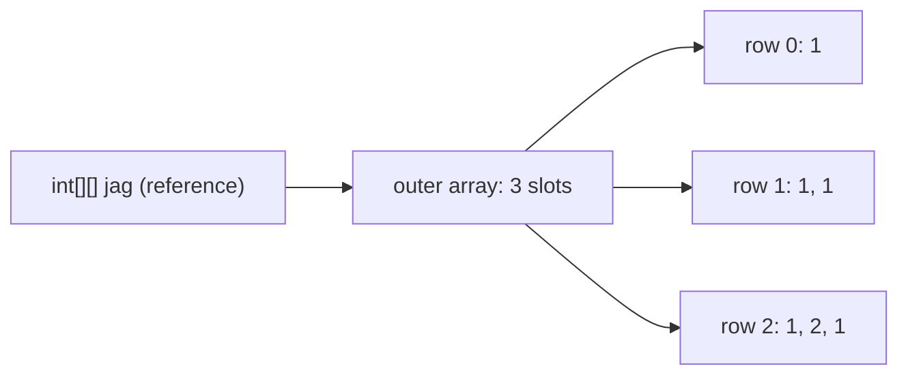

# Arrays

The base of the coding round. If you get the syntax wrong or do not know the pitfalls of the `Arrays` utility, you lose time even on simple questions. Everything from declaration to sorting internals is here.

## ⭐ Declaration and initialization

**In one line:** an array is an **object** holding a fixed number of same-type elements in contiguous memory on the heap; access by index is O(1).

- The size is fixed once and cannot change later. To grow, create a new array + copy (or use `ArrayList`).
- `length` is a **field** (`arr.length`), not a method. On String, `length()` is a method.
- An array variable is a reference. `int[] b = a;` does not make a copy; the same array is shared.

```java
import java.util.Arrays;

public class Main {
    static int sum(int[] nums) { return Arrays.stream(nums).sum(); }

    public static void main(String[] args) {
        int[] a = new int[5];              // size 5, all 0
        int[] b = {10, 20, 30};            // literal, only at declaration time
        int[] c = new int[]{1, 2, 3};      // anonymous array, for passing to a method
        int d[] = new int[2];              // C-style, valid but avoid it
        // int[] e = new int[3]{1, 2, 3};  // error: cannot give both size and values
        // b = {4, 5};                     // error: literal only at declaration

        int[] alias = b;                   // same object
        alias[0] = 99;
        int[] copy = b.clone();            // new array (a full copy for primitives)
        copy[1] = 0;

        System.out.println(b.length + " " + Arrays.toString(b)); // 3 [99, 20, 30]
        System.out.println(sum(new int[]{4, 5, 6}));             // 15
        System.out.println(b);             // [I@... : prints the reference, not the content
        System.out.println(a.length + " " + c.length + " " + d.length);
    }
}
```

**Interview tip:** "Is an array an object?" Yes. It is created on the heap, has `Object`'s methods (`clone`, `getClass`), and knows its own type at runtime (`int[]`, `String[]`).

**Common mistake:** trying to see the content with `System.out.println(arr)`. Use `Arrays.toString(arr)`.

## ⭐ Default values

**In one line:** all elements of an array created with `new` are filled with their type's default value.

| Array type | Default |
|---|---|
| `int[]`, `long[]`, `short[]`, `byte[]` | `0` |
| `double[]`, `float[]` | `0.0` |
| `boolean[]` | `false` |
| `char[]` | `'\u0000'` (null char, prints as blank) |
| `String[]`, `Integer[]`, any object array | `null` |

```java
import java.util.Arrays;

public class Main {
    public static void main(String[] args) {
        boolean[] visited = new boolean[4];      // ready-made for graph BFS/DFS
        String[] names = new String[2];
        Integer[] boxed = new Integer[2];

        System.out.println(Arrays.toString(visited)); // [false, false, false, false]
        System.out.println(Arrays.toString(names));   // [null, null]
        // System.out.println(names[0].length());     // NPE: the element is null
        // int x = boxed[0];                          // NPE: null unboxing

        int[] dp = new int[5];
        Arrays.fill(dp, -1);                          // "not computed" for memoization
        System.out.println(Arrays.toString(dp));      // [-1, -1, -1, -1, -1]
    }
}
```

**Interview tip:** in a DP memo, `0` can be a valid answer, so fill with `-1` or use an `Integer[]` where `null` = not computed.

**Common mistake:** treating an `Integer[]` like an `int[]` and doing arithmetic directly. The elements are `null`, NPE.

## 2D and jagged arrays

**In one line:** a 2D array in Java is really an **array of arrays**: the outer array holds a reference to each row, and each row can have a different size (jagged).



```java
import java.util.Arrays;

public class Main {
    public static void main(String[] args) {
        int[][] grid = new int[3][4];          // 3 rows x 4 cols, all 0
        System.out.println(grid.length + " x " + grid[0].length); // 3 x 4

        int[][] jag = new int[3][];            // only rows fixed, columns later
        jag[0] = new int[]{1};
        jag[1] = new int[]{1, 1};
        jag[2] = new int[]{1, 2, 1};           // like Pascal's triangle
        // int[][] bad = new int[][3];         // error: the first dimension is required

        int[][] dirs = {{0, 1}, {1, 0}, {0, -1}, {-1, 0}}; // 4 directions for grid BFS

        for (int[] row : grid) Arrays.fill(row, -1);       // 2D fill: row by row
        System.out.println(Arrays.deepToString(jag));      // [[1], [1, 1], [1, 2, 1]]
        System.out.println(Arrays.deepToString(grid));
        System.out.println(dirs.length);
    }
}
```

**Interview tip:** in `grid[r][c]` the row comes first, then the column. Bounds check: `r >= 0 && r < grid.length && c >= 0 && c < grid[0].length`.

**Common mistake:**
- Writing `Arrays.fill(grid, new int[4])`. All rows become the **same** array object; change one and all change.
- In a jagged array, treating `grid[0].length` as every row's length. Use `grid[i].length` for each row.

## ⭐ Arrays utility methods

**In one line:** the `java.util.Arrays` class has ready-made static methods to sort, search, fill, copy, compare and print.

**Important methods:**

| Method | What it does | Time complexity |
|---|---|---|
| `Arrays.sort(a)` | ascending sort (primitives: dual-pivot quicksort, objects: TimSort) | O(n log n) |
| `Arrays.sort(a, from, to)` | sort only the `[from, to)` range | O(k log k) |
| `Arrays.sort(objArr, comparator)` | custom order (object arrays only) | O(n log n) |
| `Arrays.binarySearch(a, key)` | search in a sorted array; if not found returns `-(insertionPoint) - 1` | O(log n) |
| `Arrays.fill(a, val)` | set all elements to one value | O(n) |
| `Arrays.copyOf(a, newLen)` | new array; padded with defaults if bigger, cut if smaller | O(n) |
| `Arrays.copyOfRange(a, from, to)` | copy of `[from, to)` | O(k) |
| `Arrays.asList(arr)` | fixed-size `List` view (pitfalls below) | O(1) |
| `Arrays.equals(a, b)` | compare content (1D) | O(n) |
| `Arrays.deepEquals(a, b)` | compare 2D/nested content | O(total) |
| `Arrays.toString(a)` | string like `[1, 2, 3]` | O(n) |
| `Arrays.deepToString(a)` | print a 2D array | O(total) |
| `Arrays.stream(a)` | `IntStream`/`Stream` (sum, max, map...) | O(n) |
| `Arrays.setAll(a, i -> ...)` | build values from the index | O(n) |
| `System.arraycopy(src, sp, dst, dp, len)` | fast native copy | O(len) |

```java
import java.util.Arrays;

public class Main {
    public static void main(String[] args) {
        int[] a = {5, 3, 8, 1};
        Arrays.sort(a);
        System.out.println(Arrays.toString(a));          // [1, 3, 5, 8]
        System.out.println(Arrays.binarySearch(a, 5));   // 2
        System.out.println(Arrays.binarySearch(a, 4));   // -3 : insertion point 2 -> -(2)-1

        int[] bigger = Arrays.copyOf(a, 6);              // [1, 3, 5, 8, 0, 0]
        int[] part = Arrays.copyOfRange(a, 1, 3);        // [3, 5]
        System.out.println(Arrays.toString(bigger) + " " + Arrays.toString(part));

        int[] same = {1, 3, 5, 8};
        System.out.println((a == same) + " " + Arrays.equals(a, same)); // false true

        int[][] g = {{1, 2}, {3, 4}};
        System.out.println(Arrays.toString(g));          // [[I@..., [I@...] : useless
        System.out.println(Arrays.deepToString(g));      // [[1, 2], [3, 4]]

        System.out.println(Arrays.stream(a).sum() + " " + Arrays.stream(a).max().getAsInt()); // 17 8
        int[] squares = new int[5];
        Arrays.setAll(squares, i -> i * i);              // [0, 1, 4, 9, 16]
        System.out.println(Arrays.toString(squares));
    }
}
```

**Interview tip:** a negative return from `binarySearch` gives the insertion point: `ins = -(result) - 1`. Useful for "lower bound" style problems. With duplicates, which index you get is not guaranteed.

**Common mistake:**
- `binarySearch` on an unsorted array. The result is undefined, and no error is thrown.
- `Arrays.equals` or `Arrays.toString` on a 2D array. You need `deepEquals` / `deepToString`.

## ⭐ Arrays.asList pitfalls

**In one line:** `Arrays.asList` returns a **fixed-size view** of the original array: `set` works (the array changes too), `add`/`remove` throw `UnsupportedOperationException`, and an `int[]` gives the wrong type.

```java
import java.util.ArrayList;
import java.util.Arrays;
import java.util.List;

public class Main {
    public static void main(String[] args) {
        String[] arr = {"Pune", "Delhi", "Goa"};
        List<String> view = Arrays.asList(arr);
        view.set(0, "Mumbai");                   // works
        System.out.println(arr[0]);              // Mumbai : write-through, the array changed too
        // view.add("Agra");                     // UnsupportedOperationException
        // view.remove(0);                       // UnsupportedOperationException

        List<String> mutable = new ArrayList<>(Arrays.asList(arr)); // a real resizable list
        mutable.add("Agra");

        int[] nums = {1, 2, 3};
        List<int[]> wrong = Arrays.asList(nums);  // List<int[]>, size 1!
        List<Integer> right = Arrays.stream(nums).boxed().toList(); // [1, 2, 3] (Java 16+)
        System.out.println(wrong.size() + " " + right);  // 1 [1, 2, 3]

        List<String> fixed = List.of("a", "b");  // fully immutable, no set, no null
        System.out.println(mutable + " " + fixed);
    }
}
```

**Interview tip:** explain the three options: `Arrays.asList` = fixed-size view (set allowed), `List.of` = fully immutable (null not allowed), `new ArrayList<>(...)` = a fully mutable copy.

**Common mistake:** expecting `List<Integer>` from `Arrays.asList(intArray)`. A primitive array cannot become the generic `T`, so the whole array becomes one element.

## ⭐ Sorting: primitives vs objects

**In one line:** `Arrays.sort(int[])` uses **Dual-Pivot Quicksort** (not stable), `Arrays.sort(Object[])` uses **TimSort** (stable, a merge sort + insertion sort hybrid).

| | Primitives (`int[]`, `double[]`) | Objects (`Integer[]`, `String[]`, custom) |
|---|---|---|
| Algorithm | Dual-Pivot Quicksort | TimSort |
| Stable | No (not needed) | Yes |
| Time | O(n log n) average; since JDK 14 a heapsort fallback makes the worst case O(n log n) too | O(n log n) worst, ~O(n) on nearly sorted data |
| Extra space | O(log n) | O(n) worst |
| Comparator | Cannot take one | Can take one |

- **Why stability for objects?** You cannot tell equal primitives apart. But with objects (say orders first sorted by time, then by amount), orders with equal amounts must keep their earlier order.
- `Collections.sort(list)` / `list.sort()` also use TimSort internally.
- On big arrays, `Arrays.parallelSort` uses multiple cores.

```java
import java.util.Arrays;
import java.util.Collections;
import java.util.Comparator;

public class Main {
    public static void main(String[] args) {
        int[] a = {5, 2, 9, 1};
        Arrays.sort(a);                                    // ascending
        // Arrays.sort(a, Collections.reverseOrder());     // compile error: no comparator on int[]

        Integer[] b = {5, 2, 9, 1};
        Arrays.sort(b, Collections.reverseOrder());        // [9, 5, 2, 1]

        // int[] descending: box it, or sort and then reverse
        int[] desc = Arrays.stream(a).boxed()
                .sorted(Comparator.reverseOrder())
                .mapToInt(Integer::intValue).toArray();
        for (int i = 0, j = a.length - 1; i < j; i++, j--) { // in-place reverse, no boxing
            int t = a[i]; a[i] = a[j]; a[j] = t;
        }
        System.out.println(Arrays.toString(b) + " " + Arrays.toString(desc) + " " + Arrays.toString(a));
    }
}
```

**Interview tip:** "Why does Java use quicksort for primitives and a merge-style sort for objects?" Objects need stability; for primitives stability is meaningless, and quicksort uses less memory and the cache better.

**Common mistake:** trying to sort an `int[]` descending with a comparator. A comparator works only on object arrays.

## ⭐ Comparator for object arrays

**In one line:** a `Comparator` decides which of two objects comes first; `Arrays.sort(arr, comparator)` gives you a custom order.

- Chaining `Comparator.comparingInt(...)`, `.reversed()`, `.thenComparing(...)` is readable.
- Do not write `(x, y) -> x - y`: it overflows on large/negative values. Use `Integer.compare(x, y)`.

```java
import java.util.Arrays;
import java.util.Comparator;

public class Main {
    record Player(String name, int runs) {}

    public static void main(String[] args) {
        // Sort by start before merging intervals
        int[][] intervals = {{5, 8}, {1, 3}, {2, 6}};
        Arrays.sort(intervals, (x, y) -> Integer.compare(x[0], y[0]));
        System.out.println(Arrays.deepToString(intervals)); // [[1, 3], [2, 6], [5, 8]]

        // IPL leaderboard: runs desc, name asc on a tie
        Player[] ps = {
            new Player("Rohit", 450), new Player("Virat", 520), new Player("Gill", 450)
        };
        Arrays.sort(ps, Comparator.comparingInt(Player::runs).reversed()
                                  .thenComparing(Player::name));
        System.out.println(Arrays.toString(ps)); // order: Virat (520), Gill (450), Rohit (450)

        // By length, then alphabetical
        String[] names = {"Ravi", "Bo", "Amit", "Zoya"};
        Arrays.sort(names, Comparator.comparingInt(String::length)
                                     .thenComparing(Comparator.naturalOrder()));
        System.out.println(Arrays.toString(names)); // [Bo, Amit, Ravi, Zoya]
    }
}
```

**Interview tip:** `Comparable` = the class's natural order (`compareTo` inside the class). `Comparator` = different orders from outside. If one class needs several sort orders, use `Comparator`.

**Common mistake:** writing `(a, b) -> a[0] - b[0]`. Values like `Integer.MIN_VALUE` overflow and give the wrong order. `Integer.compare` is safe.

## ⭐ Array vs ArrayList

**In one line:** an array has a fixed size and can hold primitives; an `ArrayList` has a dynamic size but holds only objects (boxed).

| | Array | ArrayList |
|---|---|---|
| Size | Fixed | Dynamic (grows ~1.5x when full) |
| Primitives | Yes (`int[]`) | No, `Integer` boxing |
| Length | `arr.length` | `list.size()` |
| Access | `arr[i]` | `list.get(i)` |
| Memory/speed | Less memory, fast | Boxing + object overhead |
| Generics | Covariant, runtime check | Invariant, compile-time type safety |
| Utility class | `Arrays` | `Collections` |
| Multi-dim | `int[][]` | `List<List<Integer>>` |

**Interview tip:** if you know the size and have primitives (DP table, freq count), use an array. If the size is unknown or you need insert/remove, use `ArrayList`.

**Common mistake:** thinking `list.remove(1)` removes the value 1. On a `List<Integer>` it removes **index** 1. For the value, use `list.remove(Integer.valueOf(1))`.

## Common patterns (short)

**In one line:** the two most common tricks in array problems: **two pointers** (sorted array, O(n)) and **prefix sum** (range sum in O(1)).

```java
import java.util.Arrays;

public class Main {
    // Two numbers in a sorted array that add up to target: O(n)
    static int[] pairSum(int[] a, int target) {
        int i = 0, j = a.length - 1;
        while (i < j) {
            int s = a[i] + a[j];
            if (s == target) return new int[]{i, j};
            if (s < target) i++; else j--;
        }
        return new int[]{-1, -1};
    }

    // p[i] = sum of the first i elements; sum(l..r) = p[r + 1] - p[l]
    static long[] prefix(int[] a) {
        long[] p = new long[a.length + 1];                // long: avoid overflow
        for (int i = 0; i < a.length; i++) p[i + 1] = p[i] + a[i];
        return p;
    }

    public static void main(String[] args) {
        int[] a = {1, 3, 4, 6, 9};
        System.out.println(Arrays.toString(pairSum(a, 10))); // [0, 4]
        long[] p = prefix(a);
        System.out.println(p[4] - p[1]);                     // 3 + 4 + 6 = 13
    }
}
```

**Interview tip:** state the O(n²) brute force and optimize right away: "the array is sorted, so two pointers", "range sums are needed repeatedly, so prefix sum".

**Common mistake:** making the prefix array size `n` and accessing `p[l - 1]` when `l = 0`. Use size `n + 1` and the edge case handles itself.

## ⭐ ArrayIndexOutOfBoundsException

**In one line:** valid indexes go from `0` to `length - 1`; accessing outside that range throws `ArrayIndexOutOfBoundsException` at runtime.

```java
public class Main {
    public static void main(String[] args) {
        int[] a = new int[3];
        try {
            for (int i = 0; i <= a.length; i++) a[i] = i;  // <= : off-by-one bug
        } catch (ArrayIndexOutOfBoundsException e) {
            System.out.println(e.getMessage());   // Index 3 out of bounds for length 3
        }
        int[] empty = new int[0];                 // valid: length 0
        // empty[0] = 1;                          // AIOOBE: the empty input edge case
        // int[] neg = new int[-1];               // NegativeArraySizeException
        System.out.println(empty.length);
    }
}
```

**Interview tip:** call out edge cases yourself while writing code: empty array, single element, boundaries on `i + 1` / `i - 1` access.

**Common mistake:** accessing `a[i + 1]` in a loop while keeping the condition `i < n`. You need `i < n - 1`.

## Arrays are covariant (ArrayStoreException)

**In one line:** a `String[]` is also an `Object[]` (covariance), so storing the wrong type compiles but throws `ArrayStoreException` at runtime.

- An array knows its element type at runtime (reified), so the JVM checks every store.
- Generics are **invariant** and their types are erased: `List<Object> l = new ArrayList<String>();` is a compile error. So generics protect you at compile time itself.
- For the same reason, `new T[n]` or `new List<String>[n]` (generic array creation) is not allowed.

```java
public class Main {
    public static void main(String[] args) {
        Object[] objs = new String[2];   // compiles: covariance
        objs[0] = "ok";
        try {
            objs[1] = 42;                // caught at runtime
        } catch (ArrayStoreException e) {
            System.out.println("ArrayStoreException: " + e.getMessage()); // java.lang.Integer
        }
        // java.util.List<Object> list = new java.util.ArrayList<String>(); // compile error
    }
}
```

**Interview tip:** "Why are arrays covariant and generics invariant?" Arrays came before generics, and the runtime type check gives them safety. Generics use erasure, so the type is unknown at runtime, which is why they were kept invariant at compile time.

**Common mistake:** storing anything into an `Object[]` parameter and assuming it is safe. If the caller passed a `String[]`, it crashes at runtime.

## Checklist

- [ ] I know all the valid ways to declare/initialize an array and the `length` field
- [ ] I can state the default value for every array type and the null pitfall of `Integer[]`
- [ ] I can create 2D and jagged arrays and explain the shared-row bug with `Arrays.fill`
- [ ] I can state the main `Arrays` methods (sort, binarySearch, copyOf, equals, deepToString) and their complexity
- [ ] I can explain `Arrays.asList` vs `List.of` vs `new ArrayList<>()`
- [ ] I can explain primitive (dual-pivot quicksort) vs object (TimSort) sorting and stability
- [ ] I can sort intervals / custom objects with a Comparator without the overflow bug
- [ ] I can explain array vs ArrayList and covariance (`ArrayStoreException`)
