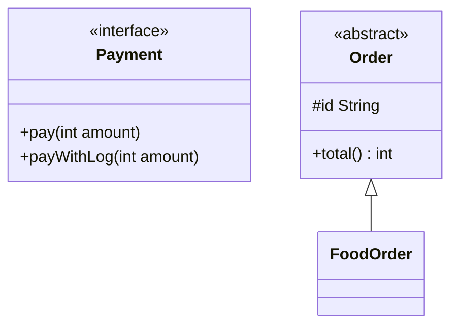

# OOP in Java

Everyone knows the 4 pillars of OOP (encapsulation, inheritance, polymorphism, abstraction). In a Java interview the real questions are about their **Java-specific rules**: constructor chaining, overriding rules, the default-method diamond, the `equals`/`hashCode` contract, immutable classes. This file covers exactly that.

## ⭐ Class, object & constructor

**In one line:** a class is the blueprint, an object is its instance created on the heap, and the constructor puts the object into a valid state.

- A constructor has the same name as the class and no return type. It is not inherited.
- If you write no constructor, the compiler adds a **default no-arg constructor**. Write even one and the default disappears.
- `this(...)` calls another constructor of the same class, `super(...)` calls the parent's. Both must be the **first statement**, so one constructor cannot have both.
- If you do not write `super(...)`, the compiler inserts `super()`. If the parent has no no-arg constructor, that is a **compile error**.
- Construction order: parent first, then child (top to bottom).

```java
public class Main {
    static class Vehicle {
        protected final String brand;
        Vehicle(String brand) {
            this.brand = brand;                // this = current object
            System.out.println("Vehicle ctor");
        }
    }

    static class Car extends Vehicle {
        private final int seats;
        Car(String brand) {
            this(brand, 4);                    // another ctor of the same class (chaining)
        }
        Car(String brand, int seats) {
            super(brand);                      // parent ctor, first line
            this.seats = seats;
            System.out.println("Car ctor");
        }
    }

    public static void main(String[] args) {
        Car c = new Car("Tata");               // Vehicle ctor -> Car ctor
        System.out.println(c.brand + " " + c.seats); // Tata 4
    }
}
```

**Interview tip:** "Why can't a constructor have both `this()` and `super()`?" → both must be the first statement. The constructor reached via `this()` will call `super()` anyway, so the parent is initialized exactly once.

**Common mistake:** writing a parameterized constructor and assuming `new Car()` still works. The default constructor is gone at that point.

## ⭐ Encapsulation

**In one line:** keep data `private` and expose only controlled methods, so the object never goes into an invalid state.

Getters/setters are not just "a long way of making fields public". The real benefit: **validation** and **invariants** live in one place. Where a setter is not needed, do not provide one.

```java
public class Main {
    static class Wallet {                      // like a Paytm wallet
        private long balance;                  // no direct access from outside

        public long getBalance() { return balance; }

        public void add(long amount) {
            if (amount <= 0) throw new IllegalArgumentException("amount must be > 0");
            balance += amount;
        }

        public void pay(long amount) {
            if (amount > balance) throw new IllegalStateException("insufficient balance");
            balance -= amount;
        }
        // setBalance() deliberately not provided
    }

    public static void main(String[] args) {
        Wallet w = new Wallet();
        w.add(500);
        w.pay(200);
        System.out.println(w.getBalance()); // 300
    }
}
```

**Access modifiers:** `private` (class only) < default/package-private (same package) < `protected` (package + subclasses) < `public` (everyone).

**Interview tip:** "Encapsulation vs abstraction?" → encapsulation **hides data** (how it is stored), abstraction **hides complexity** (what it does, not how).

**Common mistake:** returning an internal mutable `List` directly from a getter. The caller can modify it from outside and encapsulation is broken.

## ⭐ Inheritance

**In one line:** with `extends`, a child class reuses the parent's code (an "is-a" relation).

- Java classes have **only single inheritance**: a class can extend just one class.
- **Why no multiple class inheritance?** The diamond problem: if two parents have the same method or field, which one wins? State (fields) coming from two places causes confusion. Java blocks it at the class level.
- A class can implement multiple interfaces. After Java 8 `default` methods, interfaces can hit a diamond too, and the rules are fixed:
  1. **Class wins:** if the class (or a superclass) has the method, that one runs.
  2. **More specific interface wins:** if `B extends A` and both have a default, `B`'s wins.
  3. If there is still a conflict, the class **must override**, or it is a compile error. You can call one of them with `X.super.method()`.

```java
public class Main {
    interface Camera { default String click() { return "Camera click"; } }
    interface Scanner { default String click() { return "Scanner click"; } }

    // Same default method in both -> override is required
    static class Phone implements Camera, Scanner {
        @Override
        public String click() {
            return Camera.super.click() + " + " + Scanner.super.click();
        }
    }

    public static void main(String[] args) {
        System.out.println(new Phone().click()); // Camera click + Scanner click
    }
}
```

**Interview tip:** "Does Java have multiple inheritance?" → "Not of classes, but of types. You can implement multiple interfaces. A default-method conflict is caught at compile time and the class has to resolve it."

**Common mistake:** using inheritance only for code reuse when there is no "is-a" relation. See the composition section below.

## ⭐ Polymorphism: overloading vs overriding

**In one line:** one name, different behaviour. Overloading is decided at compile time, overriding at runtime (by the object's actual type).

| | Overloading | Overriding |
|---|---|---|
| Where | same class (or subclass) | parent-child |
| Signature | **different** parameter list | **same** name + params |
| Return type | anything (changing only the return type is not enough) | same or **covariant** (subtype) |
| Access | anything | same or **wider** (protected → public OK, not the reverse) |
| Checked exceptions | anything | same, narrower or none. No new/broader checked ones |
| Binding | compile time (static) | runtime (dynamic dispatch) |
| static / private / final | can be overloaded | **cannot** be overridden |

A `static` method with the same signature in the child is **method hiding**, not overriding: the call is decided by the reference type. Fields are not polymorphic either; they also come from the reference type.

```java
import java.io.FileNotFoundException;
import java.io.IOException;

public class Main {
    static class Animal {
        protected String sound() { return "..."; }
        Animal copy() throws IOException { return new Animal(); }
        static String type() { return "Animal"; }
    }

    static class Dog extends Animal {
        @Override public String sound() { return "Woof"; }   // protected -> public: OK
        @Override Dog copy() throws FileNotFoundException {  // covariant return + narrower exception
            return new Dog();
        }
        static String type() { return "Dog"; }               // hiding, not overriding
    }

    // Overloading: different params
    static int add(int a, int b) { return a + b; }
    static long add(long a, long b) { return a + b; }
    static int add(int a, int b, int c) { return a + b + c; }

    public static void main(String[] args) {
        Animal a = new Dog();
        System.out.println(a.sound());     // Woof   (runtime object is Dog)
        System.out.println(Animal.type()); // Animal (static: no dispatch)
        System.out.println(add(2, 3));     // 5 -> int version
        System.out.println(add(2, 3L));    // 5 -> long version (2 is widened)
    }
}
```

**Interview tip:** "Can a static method be overridden?" → "No, it is hidden. With `Animal a = new Dog(); a.type()` Animal's version runs, because static calls bind to the reference type at compile time."

**Common mistake:**
- Not using `@Override`. A typo or wrong param type creates an overload and the bug stays hidden. The annotation would give a compile error.
- Writing `equals(Dog d)`. That is an overload of `equals(Object)`, not an override.

## ⭐ Abstraction: abstract class vs interface

**In one line:** state "what to do" and leave "how" to the subclass. Java has two tools: abstract class and interface.

| Point | Abstract class | Interface (Java 8+) |
|---|---|---|
| Methods | abstract + concrete | abstract, `default` (8), `static` (8), `private` (9) |
| State | can have instance fields | only `public static final` constants |
| Constructor | yes (subclass calls it via `super()`) | no |
| Inheritance | extend only one | implement many |
| Access | any modifier | methods are `public` by default |
| When | related classes, shared state + code | capability / contract ("can-do") across unrelated classes |

```java
public class Main {
    interface Payment {
        void pay(int amount);                          // abstract

        default void payWithLog(int amount) {          // Java 8 default
            log("start " + amount);
            pay(amount);
            log("done");
        }

        static Payment upi() {                         // Java 8 static factory
            return amt -> System.out.println("Paid via UPI " + amt);
        }

        private void log(String msg) {                 // Java 9 private helper
            System.out.println("[LOG] " + msg);
        }
    }

    static abstract class Order {
        protected final String id;                     // state
        Order(String id) { this.id = id; }             // constructor
        abstract int total();                          // subclass decides
        void print() { System.out.println(id + " -> Rs " + total()); }
    }

    static class FoodOrder extends Order {
        FoodOrder(String id) { super(id); }
        @Override int total() { return 350; }
    }

    public static void main(String[] args) {
        Payment.upi().payWithLog(350);
        new FoodOrder("SWG-101").print();              // SWG-101 -> Rs 350
    }
}
```



**Interview tip:** "Since Java 8 interfaces have default methods, so why do we need abstract classes?" → "An interface cannot have instance state or a constructor. For shared state + common logic use an abstract class; for just a contract or multiple types use an interface."

**Common mistake:** putting heavy business logic in an interface default method. The real purpose of default methods is backward compatibility (e.g. `List.sort` was added in Java 8 without breaking old classes).

## ⭐ final & static

**In one line:** `final` = cannot change, `static` = belongs to the class, not the object.

| Keyword | Variable | Method | Class |
|---|---|---|---|
| `final` | assigned once (reference fixed, object may still be mutable) | cannot be overridden | cannot be extended (`String`, `Integer`) |
| `static` | one copy shared by all objects | called without an object, no `this` | only a nested class can be `static` |

- **Blank final:** if no value at declaration, every constructor must assign it.
- A `static` method cannot directly access instance fields/methods.
- A `static` block runs once when the class is loaded.

```java
import java.util.ArrayList;
import java.util.List;

public class Main {
    static class Ticket {
        static int counter = 0;                 // shared by all tickets
        static final String PREFIX;             // constant
        static { PREFIX = "BMS-"; }             // once, on class load

        private final String id;                // blank final, set in ctor
        Ticket() { id = PREFIX + (++counter); }
        String getId() { return id; }
    }

    public static void main(String[] args) {
        System.out.println(new Ticket().getId()); // BMS-1
        System.out.println(new Ticket().getId()); // BMS-2

        final List<String> seats = new ArrayList<>();
        seats.add("A1");                        // OK: the object can change
        // seats = new ArrayList<>();           // compile error: reference is final
    }
}
```

**Interview tip:** "Can you add to a `final` list?" → "Yes. `final` locks the reference, not the object. To lock the contents use `List.of` or `Collections.unmodifiableList`."

**Common mistake:** using a `static` mutable field as a shared cache in multi-threaded code without synchronization.

## Nested, inner, local & anonymous classes

**In one line:** a class inside a class. A static nested class needs no outer object; an inner class does.

| Type | Where it is written | Needs outer instance? | Use |
|---|---|---|---|
| Static nested | inside a class, `static` | no | Builder, `Map.Entry`, helpers |
| Inner (non-static) | inside a class | yes (`outer.new Inner()`) | an iterator that reads outer's data |
| Local | inside a method | in the method's context | helper for one method |
| Anonymous | in an expression, no name | depends on context | one-off implementation (pre-lambda) |

Local and anonymous classes can capture only **effectively final** local variables.

```java
public class Main {
    private int x = 10;

    static class StaticNested { int get() { return 1; } }   // no outer object needed
    class Inner { int get() { return x; } }                 // reads outer's x

    public static void main(String[] args) {
        StaticNested sn = new StaticNested();
        Main outer = new Main();
        Main.Inner in = outer.new Inner();                  // created from an outer instance

        int base = 5;                                        // effectively final
        class Local { int get() { return base * 2; } }       // local class

        Runnable r = new Runnable() {                        // anonymous class
            @Override public void run() { System.out.println("run " + base); }
        };

        System.out.println(sn.get() + " " + in.get() + " " + new Local().get()); // 1 10 10
        r.run();                                             // run 5
    }
}
```

**Interview tip:** "Why prefer static nested?" → an inner class holds a hidden reference to the outer object. A long-lived inner object keeps the outer from being GC'd (memory leak). If you do not need the outer, make it `static`.

**Common mistake:** changing a captured variable later when an anonymous class uses it. Compile error: "must be final or effectively final".

## ⭐ equals & hashCode contract

**In one line:** if `a.equals(b)` is true, then `a.hashCode() == b.hashCode()` must hold. The reverse is not required (same hash, different objects = collision, allowed).

**Rules of equals:** reflexive (`a.equals(a)`), symmetric, transitive, consistent, and `a.equals(null)` is always `false`.

The default `Object.equals` compares references only (`==`). `HashSet`/`HashMap` first find the bucket by `hashCode`, then match by `equals`. Override `equals` without `hashCode` and equal objects land in different buckets.

```java
import java.util.HashSet;
import java.util.Objects;
import java.util.Set;

public class Main {
    static class Point {
        final int x, y;
        Point(int x, int y) { this.x = x; this.y = y; }

        @Override
        public boolean equals(Object o) {
            if (this == o) return true;
            if (!(o instanceof Point p)) return false;   // Java 16 pattern matching
            return x == p.x && y == p.y;
        }
        // hashCode NOT overridden -> contract broken
    }

    static class GoodPoint extends Point {
        GoodPoint(int x, int y) { super(x, y); }
        @Override public int hashCode() { return Objects.hash(x, y); }
    }

    public static void main(String[] args) {
        Set<Point> bad = new HashSet<>();
        bad.add(new Point(1, 2));
        System.out.println(bad.contains(new Point(1, 2))); // false (different bucket)
        bad.add(new Point(1, 2));
        System.out.println(bad.size());                    // 2 -> a "duplicate" got in

        Set<Point> good = new HashSet<>();
        good.add(new GoodPoint(1, 2));
        System.out.println(good.contains(new GoodPoint(1, 2))); // true
    }
}
```

**Interview tip:** "What if only hashCode is overridden, not equals?" → they go to the same bucket, but `equals` compares references, so you still get duplicates. **Override both together**, using the same fields. In Java 16+, a `record` generates both for you.

**Common mistake:**
- Building hashCode from a mutable field and changing that field after putting the object in a HashSet. The object gets "lost": `contains` returns false and `remove` does nothing.
- `instanceof` vs `getClass()` in `equals`: if a subclass adds a field, `instanceof` can break symmetry. Keep value classes `final`.

## toString & Object class methods

**In one line:** every class implicitly extends `Object` and gets its methods.

| Method | What it does | Note |
|---|---|---|
| `equals(Object)` | logical equality | default is `==` |
| `hashCode()` | int for hash buckets | override together with equals |
| `toString()` | readable string | default `ClassName@hexHash` |
| `getClass()` | runtime class | final, cannot be overridden |
| `clone()` | copy (protected) | needs `Cloneable`, shallow copy by default. Copy constructor is better |
| `wait()` / `notify()` / `notifyAll()` | thread coordination | call only inside a `synchronized` block |
| `finalize()` | hook before GC | deprecated since Java 9, do not use |

```java
public class Main {
    static class Order {
        private final String id;
        private final int amount;
        Order(String id, int amount) { this.id = id; this.amount = amount; }

        @Override
        public String toString() {
            return "Order{id=" + id + ", amount=" + amount + "}";
        }
    }

    public static void main(String[] args) {
        Order o = new Order("ZOM-7", 499);
        System.out.println(o);              // Order{id=ZOM-7, amount=499}
        System.out.println(o.getClass().getSimpleName()); // Order
    }
}
```

**Interview tip:** "List the Object class methods" → equals, hashCode, toString, getClass, clone, finalize, wait (3 overloads), notify, notifyAll.

**Common mistake:** printing a password or card number in `toString()`. It leaks into logs.

## ⭐ How to make an immutable class

**In one line:** once the object is created, its state never changes. `String`, `Integer`, `LocalDate` are built this way.

**Steps:**
1. Make the class `final` (so a subclass cannot add mutable behaviour).
2. All fields `private final`.
3. No setters.
4. **Defensive copy** of mutable inputs in the constructor.
5. Getters return a copy or an unmodifiable view of mutable fields.
6. For a "change", return a new object (`withX()` style).

**Benefits:** thread-safe without locks, safe as a HashMap key, can be cached.

```java
import java.util.ArrayList;
import java.util.List;

public class Main {
    static final class Cart {                            // 1. final
        private final String userId;                     // 2. private final
        private final List<String> items;

        Cart(String userId, List<String> items) {
            this.userId = userId;
            this.items = List.copyOf(items);             // 4. defensive copy (immutable)
        }

        String getUserId() { return userId; }
        List<String> getItems() { return items; }        // 5. already unmodifiable

        Cart withItem(String item) {                     // 6. new object
            List<String> copy = new ArrayList<>(items);
            copy.add(item);
            return new Cart(userId, copy);
        }
    }

    public static void main(String[] args) {
        List<String> input = new ArrayList<>(List.of("Milk"));
        Cart c1 = new Cart("u1", input);
        input.add("Bread");                              // no effect on c1
        Cart c2 = c1.withItem("Eggs");
        System.out.println(c1.getItems());               // [Milk]
        System.out.println(c2.getItems());               // [Milk, Eggs]
        // c1.getItems().add("X");                       // UnsupportedOperationException
    }
}
```

**Interview tip:** "Is a `record` immutable?" → "Shallowly. Fields are final, but if the record holds a `List`, the list contents can still change. Do `List.copyOf` in the compact constructor."

**Common mistake:** making fields `final` and calling it immutable, while a reference to an internal mutable `List`/`Date` leaks outside.

## Composition vs inheritance

**In one line:** use inheritance only for "is-a"; otherwise use "has-a", i.e. composition (hold another object inside and delegate work to it). Default choice: **composition**.

| | Inheritance | Composition |
|---|---|---|
| Relation | is-a (Dog is an Animal) | has-a (Car has an Engine) |
| Coupling | tight: a parent change can break the child | loose: through an interface |
| Change at runtime | no | yes (inject a different Engine) |
| Testing | harder | easy to inject a mock |

Classic bug: extend `HashSet` and increment a counter in both `add` and `addAll`. `HashSet.addAll` calls `add` internally, so the count doubles. Depending on parent internals = the fragile base class problem. The JDK's own mistake: `Stack extends Vector`, which is why you can insert into the middle of a Stack.

```java
public class Main {
    interface Engine { void start(); }
    static class PetrolEngine implements Engine {
        public void start() { System.out.println("Petrol engine on"); }
    }
    static class ElectricEngine implements Engine {
        public void start() { System.out.println("EV motor on"); }
    }

    static class Car {
        private final Engine engine;                 // has-a
        Car(Engine engine) { this.engine = engine; }
        void drive() {
            engine.start();                          // work is delegated
            System.out.println("Car is moving");
        }
    }

    public static void main(String[] args) {
        new Car(new PetrolEngine()).drive();
        new Car(new ElectricEngine()).drive();       // engine changed without changing Car
    }
}
```

**Interview tip:** say "favor composition over inheritance" and give an example: the Strategy pattern, or the JDK's `Stack extends Vector` mistake.

**Common mistake:** extending a big class just to reuse 2 methods, and exposing its whole public API along the way.

## Checklist

- [ ] I can explain the rules of constructor chaining (`this()` / `super()`) and the order of object construction
- [ ] I can explain why Java has no multiple class inheritance and how the default-method diamond is resolved
- [ ] I can explain the overriding rules (access, checked exceptions, covariant return) and static method hiding
- [ ] I can explain abstract class vs interface in Java 8+ and when to use which
- [ ] I can explain the effect of `final` and `static` on variables, methods and classes
- [ ] I can tell the difference between static nested, inner, local and anonymous classes
- [ ] I can state the `equals`/`hashCode` contract and give an example that breaks a HashSet
- [ ] I can build an immutable class step by step (with defensive copies)
- [ ] I can explain the composition vs inheritance trade-off with an example
