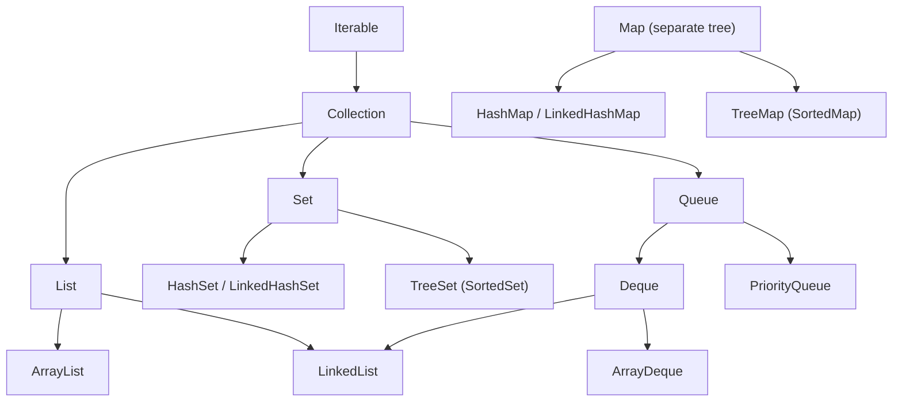

# Collections Framework

The `java.util` Collections Framework = **interfaces** (List, Set, Queue, Map) + their **implementations** (ArrayList, HashSet, HashMap...) + **utilities** (`Collections`, `Arrays`). The most common interview questions: the hierarchy, which collection when, complexities, iterators, and Comparable vs Comparator.

## ⭐ Collections hierarchy

**In one line:** `Iterable` is at the top, below it `Collection`, then `List`, `Set`, `Queue`. `Map` is a separate tree and does not extend `Collection`.



- **List:** ordered, index access, duplicates allowed.
- **Set:** no duplicates. Order depends on the implementation (Hash = no order, Linked = insertion order, Tree = sorted).
- **Queue / Deque:** add/remove at one or both ends. `PriorityQueue` gives elements in heap order.
- **Map:** key → value. Keys are unique. `Map` is not Iterable; you iterate via `keySet()`, `values()`, `entrySet()`.
- Java 21 added `SequencedCollection` / `SequencedMap`: `getFirst()`, `getLast()`, `reversed()` on List, Deque, LinkedHashSet, LinkedHashMap.

**Interview tip:** "Why doesn't Map extend Collection?" → a Collection is a group of single elements (`add(E)`), a Map is a group of pairs. `add(E)` makes no sense for a Map.

**Common mistake:** mixing up `Collection` (the interface) and `Collections` (the utility class).

## Interfaces vs implementations

**In one line:** declare the variable with the interface type and create the object from an implementation. If the implementation changes tomorrow, one line changes.

```java
import java.util.*;

public class Main {
    // Method takes the interface -> ArrayList, LinkedList, List.of all work
    static int total(List<Integer> prices) {
        int sum = 0;
        for (int p : prices) sum += p;
        return sum;
    }

    public static void main(String[] args) {
        List<Integer> cart = new ArrayList<>();      // "program to interface"
        cart.add(120);
        cart.add(80);
        Map<String, Integer> stock = new HashMap<>(); // need a TreeMap later? change only here
        stock.put("Maggi", 40);
        System.out.println(total(cart) + " " + stock); // 200 {Maggi=40}
    }
}
```

**Interview tip:** "Which is better: `List<String> l = new ArrayList<>()` or `ArrayList<String> l = ...`?" → the interface one. Loose coupling, easier testing, and flexible method signatures.

**Common mistake:** returning/accepting concrete `ArrayList`/`HashMap` types in a public API.

## ⭐ Which collection to choose (decision table)

**In one line:** ask first: duplicates? order? sorted? key-value? index access? thread-safe? The answers give you the collection.

| Need | Choose | Complexity of key operations |
|---|---|---|
| Index access, mostly append | `ArrayList` | get O(1), add at end O(1) amortized, insert/remove in middle O(n) |
| Unique elements, fast lookup | `HashSet` | add / contains / remove O(1) avg |
| Unique + remember insertion order | `LinkedHashSet` | O(1) avg |
| Sorted unique, range / floor / ceiling | `TreeSet` | O(log n) |
| Key-value, fast lookup | `HashMap` | get / put O(1) avg, worst O(log n) (treeified bucket) |
| Key-value + insertion/access order (LRU) | `LinkedHashMap` | O(1) avg |
| Sorted keys, floorKey / ceilingKey | `TreeMap` | O(log n) |
| Stack or queue or both ends | `ArrayDeque` | push / pop / offer / poll O(1) |
| Repeatedly take min/max (top-K, Dijkstra) | `PriorityQueue` | offer / poll O(log n), peek O(1) |
| Multi-threaded map | `ConcurrentHashMap` | O(1) avg, fine-grained locking |
| Multi-threaded list, many reads, few writes | `CopyOnWriteArrayList` | read O(1), write O(n) (copy) |

**Interview tip:** "What would you use for a stack?" → "`ArrayDeque`, not the legacy `Stack`. Stack is built on `Vector` and every method is synchronized."

**Common mistake:** calling `contains` on a `List` again and again (O(n) every time). If there are many lookups, build a `HashSet`.

## ⭐ Iterable, Iterator & ListIterator

**In one line:** `Iterable` means "can be used in for-each". It provides an `Iterator` that does `hasNext()` / `next()` / `remove()`. `ListIterator` works only on Lists, moves in both directions and can also `set`/`add`.

| Method | What it does | Where |
|---|---|---|
| `hasNext()` / `next()` | next element | Iterator |
| `remove()` | remove the element returned by the last `next()` (safe) | Iterator |
| `hasPrevious()` / `previous()` | move backwards | ListIterator |
| `nextIndex()` / `previousIndex()` | current index | ListIterator |
| `set(e)` | replace the last returned element | ListIterator |
| `add(e)` | insert at the cursor | ListIterator |

```java
import java.util.*;

public class Main {
    // To use your own class in for-each, implement Iterable
    static class Range implements Iterable<Integer> {
        private final int from, to;
        Range(int from, int to) { this.from = from; this.to = to; }

        @Override
        public Iterator<Integer> iterator() {
            return new Iterator<>() {
                int cur = from;
                public boolean hasNext() { return cur < to; }
                public Integer next() {
                    if (!hasNext()) throw new NoSuchElementException();
                    return cur++;
                }
            };
        }
    }

    public static void main(String[] args) {
        for (int i : new Range(1, 4)) System.out.print(i + " "); // 1 2 3
        System.out.println();

        List<Integer> nums = new ArrayList<>(List.of(1, 2, 3, 4, 5));
        Iterator<Integer> it = nums.iterator();
        while (it.hasNext()) {
            if (it.next() % 2 == 0) it.remove();   // safe removal
        }
        System.out.println(nums);                  // [1, 3, 5]

        ListIterator<Integer> li = nums.listIterator();
        while (li.hasNext()) {
            int n = li.next();
            li.set(n * 10);                        // replace
            if (n == 3) li.add(99);                // insert after the current one
        }
        System.out.println(nums);                  // [10, 30, 99, 50]
        while (li.hasPrevious()) System.out.print(li.previous() + " "); // 50 99 30 10
    }
}
```

**Interview tip:** a for-each loop compiles into `iterator()` + `hasNext()`/`next()`. That is why `list.remove()` inside for-each throws CME, but `it.remove()` does not.

**Common mistake:** calling `it.remove()` before `next()`, or twice for one `next()` → `IllegalStateException`.

## ⭐ Fail-fast vs fail-safe iterators

**In one line:** a fail-fast iterator throws `ConcurrentModificationException` (CME) as soon as it sees a structural change during iteration. A fail-safe (weakly consistent) iterator works on a copy or snapshot and does not throw CME.

**How it works inside:** `ArrayList` keeps a `modCount` (++ on every add/remove). When the iterator is created it saves `expectedModCount = modCount`. Every `next()` compares them; a mismatch means CME. This is a best-effort check, not a thread-safety guarantee.

| | Fail-fast | Fail-safe / weakly consistent |
|---|---|---|
| Examples | iterators of `ArrayList`, `HashMap`, `HashSet` | `CopyOnWriteArrayList`, `ConcurrentHashMap` |
| Modify during iteration | CME | no exception |
| Works on | the original collection | a snapshot (COW) or live data, may or may not show latest changes |
| Memory cost | none | COW copies the whole array on every write |

```java
import java.util.*;
import java.util.concurrent.*;

public class Main {
    public static void main(String[] args) {
        List<String> list = new ArrayList<>(List.of("a", "b", "c"));
        try {
            for (String s : list) {
                if (s.equals("a")) list.remove(s);   // structural change
            }
        } catch (ConcurrentModificationException e) {
            System.out.println("CME!");
        }

        List<String> cow = new CopyOnWriteArrayList<>(List.of("a", "b", "c"));
        for (String s : cow) {
            if (s.equals("a")) cow.add("d");        // no CME, iterator sees the old snapshot
        }
        System.out.println(cow);                    // [a, b, c, d]

        Map<String, Integer> chm = new ConcurrentHashMap<>(Map.of("x", 1, "y", 2));
        for (String k : chm.keySet()) {
            if (k.equals("x")) chm.remove(k);       // safe
        }
        System.out.println(chm);                    // {y=2}
    }
}
```

**Interview tip:** trick question: in `[a, b, c]`, removing `"b"` (second to last) inside for-each does **not** throw CME. After the remove, size is 2 and the cursor is also at 2, so `hasNext()` returns false, the loop silently ends, and `"c"` is never checked. So do not rely on CME; use the correct approach.

**Common mistake:** thinking CME is only a multi-threading issue. It happens in a single thread too, with `list.remove()` inside for-each.

## Collections utility class

**In one line:** `java.util.Collections` holds static helpers: sort, reverse, wrappers, empty/singleton collections.

**Important methods**

| Method | What it does | Time complexity |
|---|---|---|
| `sort(list)` / `sort(list, cmp)` | stable sort (TimSort) | O(n log n) |
| `reverse(list)` | reverse the order | O(n) |
| `shuffle(list)` | random order | O(n) |
| `frequency(c, o)` | how many times `o` occurs | O(n) |
| `max(c)` / `min(c)` (also with cmp) | largest / smallest | O(n) |
| `binarySearch(list, key)` | search in a sorted list | O(log n) (on a RandomAccess list) |
| `swap(list, i, j)` | swap two indexes | O(1) |
| `nCopies(n, o)` | immutable list of n same elements | O(1) |
| `unmodifiableList(list)` | read-only **view** | O(1) |
| `synchronizedList(list)` | wrapper with a lock on every method | O(1) |
| `emptyList()` / `singletonList(o)` | small immutable lists | O(1) |

```java
import java.util.*;

public class Main {
    public static void main(String[] args) {
        List<Integer> nums = new ArrayList<>(List.of(5, 3, 8, 3, 1));
        Collections.sort(nums);                              // [1, 3, 3, 5, 8]
        System.out.println(Collections.binarySearch(nums, 5)); // 3
        Collections.reverse(nums);                           // [8, 5, 3, 3, 1]
        System.out.println(Collections.frequency(nums, 3));  // 2
        System.out.println(Collections.max(nums) + " " + Collections.min(nums)); // 8 1
        Collections.shuffle(nums);                           // random order
        System.out.println(Collections.nCopies(3, "-"));     // [-, -, -]

        List<Integer> view = Collections.unmodifiableList(nums);
        // view.add(9);                                      // UnsupportedOperationException
        nums.add(9);                                         // original changed...
        System.out.println(view.contains(9));                // true -> visible in the view too

        List<Integer> sync = Collections.synchronizedList(new ArrayList<>());
        sync.add(1);
        synchronized (sync) {                                // manual lock needed for iteration
            for (int x : sync) System.out.println(x);
        }
    }
}
```

**Interview tip:** "`unmodifiableList` vs `List.of`?" → `unmodifiableList` is just a **view**; if the original changes, the view shows it. `List.of` / `List.copyOf` is a truly immutable copy.

**Common mistake:** iterating a `synchronizedList` without a `synchronized(list)` block. Single calls are safe, iteration is not.

## ⭐ Immutable collections: List.of, Set.of, Map.of (Java 9+)

**In one line:** factory methods that create small, truly immutable collections.

- Any modification (`add`, `remove`, `set`, `put`) → `UnsupportedOperationException`.
- **`null` is not allowed**: `List.of(1, null)` → NPE. Even `List.of(1).contains(null)` throws NPE.
- A duplicate in `Set.of` or a duplicate key in `Map.of` → `IllegalArgumentException`.
- Iteration order of `Set.of` / `Map.of` is **not fixed** (can change between JVM runs).
- `Map.of` takes at most 10 pairs. For more, use `Map.ofEntries(Map.entry(k, v), ...)`.
- `List.copyOf(coll)`: immutable copy. Java 16 `stream.toList()` also returns an unmodifiable list.

| | `Arrays.asList` | `Collections.unmodifiableList` | `List.of` |
|---|---|---|---|
| add/remove | no | no | no |
| set | **yes** (writes to the array too) | no | no |
| null | allowed | allowed | NPE |
| Sees changes to the original? | yes (array-backed) | yes (view) | no (own copy) |

```java
import java.util.*;

public class Main {
    public static void main(String[] args) {
        List<String> cities = List.of("Delhi", "Mumbai");
        Set<Integer> ids = Set.of(1, 2, 3);
        Map<String, Integer> price = Map.of("Tea", 10, "Coffee", 25);
        Map<String, Integer> big = Map.ofEntries(Map.entry("Samosa", 15), Map.entry("Vada", 20));

        try {
            cities.add("Pune");
        } catch (UnsupportedOperationException e) {
            System.out.println("immutable!");
        }
        // Set.of(1, 1);          // IllegalArgumentException: duplicate
        // List.of("a", null);    // NullPointerException

        List<String> mutable = new ArrayList<>(cities);   // need to change it? make a copy
        mutable.add("Pune");
        System.out.println(mutable + " " + ids.size() + " " + price.get("Tea") + " " + big.size());
    }
}
```

**Interview tip:** use `List.of` / `List.copyOf` for constants, config, test data, and for "safe" returns from methods.

**Common mistake:** returning `List.of(...)` and then the caller calls `add`. UOE at runtime, no warning at compile time.

## ⭐ Comparable vs Comparator

**In one line:** `Comparable` defines a class's **natural order** inside the class itself (`compareTo`). `Comparator` defines a **custom order** from outside (`compare`), as many as you want.

| | Comparable | Comparator |
|---|---|---|
| Package | `java.lang` | `java.util` |
| Method | `compareTo(T o)` | `compare(T a, T b)` |
| Where written | inside the class | separately (lambda / method ref) |
| How many orders | one (natural) | many |
| Used by | `Collections.sort(list)`, `TreeSet` default | `list.sort(cmp)`, `new TreeSet<>(cmp)` |

Return: negative = first is smaller, 0 = equal, positive = first is bigger.

```java
import java.util.*;

public class Main {
    record Player(String name, int runs, int age) implements Comparable<Player> {
        @Override
        public int compareTo(Player o) {
            return Integer.compare(o.runs, runs);    // natural order: runs desc
        }
    }

    public static void main(String[] args) {
        List<Player> team = new ArrayList<>(List.of(
                new Player("Rohit", 82, 37),
                new Player("Gill", 45, 24),
                new Player("Virat", 82, 35)));

        Collections.sort(team);                       // uses Comparable
        team.sort(Comparator.comparing(Player::name)); // name A-Z: Gill, Rohit, Virat

        // runs desc, then age asc
        team.sort(Comparator.comparingInt(Player::runs).reversed()
                .thenComparingInt(Player::age));
        team.forEach(p -> System.out.print(p.name() + " ")); // Virat Rohit Gill
        System.out.println();

        // TreeSet decides duplicates by compareTo, not equals!
        Set<Player> set = new TreeSet<>(team);
        System.out.println(set.size());               // 2 -> Rohit/Virat same runs = "duplicate"
    }
}
```

**Interview tip:** remember the chains: `Comparator.comparing(...)`, `.thenComparing(...)`, `.reversed()`, `Comparator.reverseOrder()`, `Comparator.nullsFirst(...)`. For primitives use `comparingInt` (avoids boxing).

**Common mistake:**
- Writing `return a.runs - b.runs;`. With big numbers, int overflow gives the wrong sign. Use `Integer.compare`.
- Keeping `compareTo` inconsistent with `equals`. `TreeSet`/`TreeMap` silently drop elements (example above).

## Why equals & hashCode matter in collections

**In one line:** every collection relies on some method to compare elements. Implement it wrong and the collection misbehaves, without even an exception.

| Collection | Relies on |
|---|---|
| `List.contains` / `indexOf` / `remove(Object)` | `equals` |
| `HashSet` / `HashMap` / `LinkedHashMap` | `hashCode` + `equals` |
| `TreeSet` / `TreeMap` | `compareTo` / `compare` (not equals) |
| `IdentityHashMap` | `==` (reference) |

```java
import java.util.*;

public class Main {
    record Seat(String row, int no) {}               // record: equals/hashCode for free

    public static void main(String[] args) {
        Set<Seat> booked = new HashSet<>();
        booked.add(new Seat("A", 5));
        System.out.println(booked.contains(new Seat("A", 5))); // true

        Map<List<Integer>, String> map = new HashMap<>();
        List<Integer> key = new ArrayList<>(List.of(1, 2));
        map.put(key, "v");
        key.add(3);                                   // mutable key changed -> hashCode changed
        System.out.println(map.get(key));             // null -> entry is "lost" (stored hash is old)
    }
}
```

**Interview tip:** "Best class for a HashMap key?" → an immutable class with proper `equals`/`hashCode`: `String`, `Integer`, a `record`. String even caches its hashCode.

**Common mistake:** using a mutable object as a HashMap key or HashSet element and changing it later.

## Checklist

- [ ] I can draw the collections hierarchy (Iterable → Collection → List/Set/Queue, Map separate)
- [ ] I can pick the right collection for a need and state its complexity
- [ ] I can safely remove / set / add with Iterator and ListIterator
- [ ] I can explain fail-fast vs fail-safe iterators and the modCount mechanism
- [ ] I can explain the main `Collections` methods and `unmodifiableList` vs `List.of`
- [ ] I can state the rules of `List.of` / `Set.of` / `Map.of` (null, duplicates, UOE)
- [ ] I can write Comparable and Comparator, including a `comparing().thenComparing().reversed()` chain
- [ ] I can tell which collection relies on equals, hashCode or compareTo
