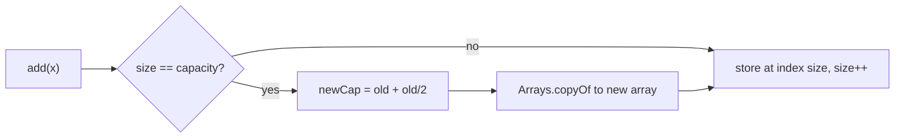
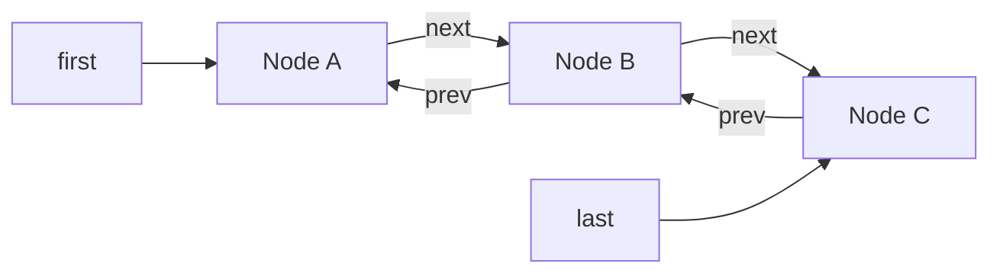

# ArrayList & LinkedList

`List` = ordered collection, index access, duplicates allowed. In real code you want `ArrayList` 95% of the time. Interviews ask: how ArrayList grows internally, when LinkedList wins (almost never), `remove(int)` vs `remove(Object)`, CME and the `Arrays.asList` pitfalls.

## ⭐ ArrayList internals

**In one line:** inside, `ArrayList` is an `Object[] elementData`. When it is full, a new array ~1.5x bigger is created and the old elements are copied over.

- `new ArrayList<>()` starts with an empty shared array. **Capacity 10 is created on the first `add`** (lazy).
- Growth: `newCapacity = old + (old >> 1)`, i.e. 1.5x. Sequence: 10 → 15 → 22 → 33 → 49...
- Copy happens via `Arrays.copyOf` (`System.arraycopy` inside), which is O(n). But resizes are rare, so `add` is **amortized O(1)**: n adds cause ~3n copies in total.
- `size` = how many elements, `capacity` = how big the array is. `remove` does **not shrink** the array. Call `trimToSize()` manually.
- If you know the size, use `new ArrayList<>(n)` or `ensureCapacity(n)`. It avoids repeated resizing.
- Implements the `RandomAccess` marker interface: `get(i)` is O(1).



```java
import java.util.ArrayList;
import java.util.List;

public class Main {
    public static void main(String[] args) {
        List<Integer> orders = new ArrayList<>();        // capacity 0 now, 10 on first add
        for (int i = 0; i < 11; i++) orders.add(i);      // 11th add grows it: 10 -> 15
        System.out.println(orders.size());               // 11 (capacity is 15, not visible)

        List<Integer> big = new ArrayList<>(100_000);    // presize: no resize + copy
        for (int i = 0; i < 100_000; i++) big.add(i);

        ArrayList<Integer> tmp = new ArrayList<>(big);
        tmp.clear();                                     // size 0, but the array is still big
        tmp.trimToSize();                                // now the memory is freed
    }
}
```

**Interview tip:** "How is ArrayList add O(1) when resize is O(n)?" → "Amortized. Capacity grows 1.5x each time, so resizes happen at geometric gaps. The total work for n adds is O(n), i.e. O(1) per add."

**Common mistake:** thinking `new ArrayList<>(n)` is "a list with n elements". It is only capacity; `size()` is still 0 and `get(0)` → `IndexOutOfBoundsException`.

## LinkedList internals

**In one line:** a doubly linked list. Each element is a `Node { item, prev, next }`, and the list keeps `first`, `last`, `size`.

- Add/remove at both ends is O(1). It implements both `List` and `Deque`.
- `get(i)` is O(n): it walks from the end nearer to the index (first or last), at most n/2 steps.
- Each node is a separate object: ~24 bytes of header/fields + the element. Much more than one reference (4-8 bytes) in an ArrayList.
- Nodes are scattered in memory, **poor CPU cache locality**, so even iteration is slower than ArrayList.



```java
import java.util.LinkedList;

public class Main {
    public static void main(String[] args) {
        LinkedList<String> songs = new LinkedList<>();
        songs.add("Kesariya");             // at the end
        songs.addFirst("Tum Hi Ho");       // O(1) front
        songs.addLast("Apna Bana Le");     // O(1) back
        System.out.println(songs.getFirst() + " | " + songs.getLast());
        System.out.println(songs.get(1));  // Kesariya, but an O(n) walk
        songs.removeFirst();               // O(1)
        System.out.println(songs);         // [Kesariya, Apna Bana Le]
    }
}
```

**Interview tip:** "Isn't insert in the middle O(1) for LinkedList?" → "Only if you are already at the node (via a ListIterator). `add(i, e)` first walks to the index, which is O(n)."

**Common mistake:** running `for (int i = 0; i < list.size(); i++) list.get(i)` on a LinkedList. Each `get` is O(n), so the whole loop is **O(n²)**. Use an iterator / for-each.

## ⭐ Important methods & complexities

**In one line:** both have the same `List` methods, with different complexities.

| Method | What it does | ArrayList | LinkedList |
|---|---|---|---|
| `add(e)` | add at the end | O(1) amortized | O(1) |
| `add(i, e)` | insert at index, shift the rest | O(n) | O(n) walk (O(1) at ends) |
| `get(i)` | read by index | O(1) | O(n) |
| `set(i, e)` | replace, return the old one | O(1) | O(n) |
| `remove(int i)` | remove by index, return the element | O(n) (O(1) at the end) | O(n) walk (O(1) at ends) |
| `remove(Object o)` | remove the first match, return boolean | O(n) | O(n) |
| `contains(o)` / `indexOf(o)` | linear search using `equals` | O(n) | O(n) |
| `subList(from, to)` | a **view** of the original (to is exclusive) | O(1) | O(1) |
| `sort(cmp)` | stable TimSort (`null` = natural order) | O(n log n) | O(n log n) |
| `removeIf(pred)` | remove all that match | O(n) | O(n) |
| `iterator().remove()` | remove while iterating | O(n) per remove (shift) | O(1) |
| `addFirst` / `removeFirst` | at the front | O(n) (Java 21) | O(1) |
| `size()` / `isEmpty()` | count | O(1) | O(1) |

```java
import java.util.*;

public class Main {
    public static void main(String[] args) {
        List<String> list = new ArrayList<>(List.of("Delhi", "Mumbai", "Pune"));
        list.add("Chennai");                   // [Delhi, Mumbai, Pune, Chennai]
        list.add(1, "Agra");                   // [Delhi, Agra, Mumbai, Pune, Chennai]
        String old = list.set(0, "Noida");     // old = Delhi
        System.out.println(old + " " + list.get(2));                          // Delhi Mumbai
        System.out.println(list.indexOf("Pune") + " " + list.contains("Goa")); // 3 false

        list.removeIf(c -> c.startsWith("P")); // [Noida, Agra, Mumbai, Chennai]
        list.sort(null);                       // natural: [Agra, Chennai, Mumbai, Noida]

        List<String> sub = list.subList(0, 2); // [Agra, Chennai] -> a view, not a copy
        sub.clear();                           // removed from the original too!
        System.out.println(list);              // [Mumbai, Noida]
    }
}
```

**Interview tip:** `subList` is a view. For a copy use `new ArrayList<>(list.subList(a, b))`. Shortcut for deleting a range: `list.subList(a, b).clear()`.

**Common mistake:** adding/removing on the original list after creating a `subList`, then using the subList → `ConcurrentModificationException`.

## ⭐ remove(int) vs remove(Object) pitfall

**In one line:** on a `List<Integer>`, `list.remove(1)` removes **index 1**, not the value 1. Overload resolution picks the exact `int` match first, boxing only later.

```java
import java.util.*;

public class Main {
    public static void main(String[] args) {
        List<Integer> nums = new ArrayList<>(List.of(10, 20, 30, 1));
        nums.remove(1);                    // removes index 1 -> [10, 30, 1]
        nums.remove(Integer.valueOf(1));   // removes value 1 -> [10, 30]
        System.out.println(nums);          // [10, 30]
        // nums.remove(30);                // IndexOutOfBoundsException: 30 treated as an index

        // Related pitfall: comparing Integer with ==
        List<Integer> big = List.of(1000, 1000);
        System.out.println(big.get(0) == big.get(1));      // false (cache is only -128..127)
        System.out.println(big.get(0).equals(big.get(1))); // true
    }
}
```

**Interview tip:** to remove a value use `remove(Integer.valueOf(x))` or `remove((Integer) x)`. To remove all occurrences use `removeIf(v -> v == x)` (here `x` is an int, so unboxing makes the comparison correct).

**Common mistake:** `remove(Object)` removes only the **first** match, not all of them.

## ⭐ ArrayList vs LinkedList: when to use which

**In one line:** default to `ArrayList`. For a queue/stack use `ArrayDeque`. `LinkedList` only in very rare cases.

| Point | ArrayList | LinkedList |
|---|---|---|
| Storage | contiguous `Object[]` | scattered nodes |
| `get(i)` | O(1) | O(n) |
| Add at end | O(1) amortized | O(1) |
| Add/remove at front | O(n) | O(1) |
| Insert in middle | O(n) shift (but `arraycopy` is very fast) | O(n) walk + O(1) link |
| Memory per element | one reference (+ spare capacity) | a node object (~24+ bytes) |
| Cache locality | good | poor |

**Why LinkedList practically never wins:** even an insert in the middle needs a walk first, and the walk is slower than ArrayList's memory shift. For front/back operations `ArrayDeque` is faster than LinkedList and uses less memory.

**When LinkedList is fine:** many inserts/removes while walking with an iterator (`ListIterator.add/remove` is O(1)), or when you need a queue with `null` elements (`ArrayDeque` does not allow null).

```java
import java.util.*;

public class Main {
    public static void main(String[] args) {
        Deque<String> queue = new ArrayDeque<>();   // BFS / order queue
        queue.offer("order-1");
        queue.offer("order-2");
        System.out.println(queue.poll());           // order-1 (FIFO)

        Deque<Character> stack = new ArrayDeque<>(); // bracket check / undo
        stack.push('(');
        stack.push('[');
        System.out.println(stack.pop());            // [ (LIFO)
    }
}
```

**Interview tip:** "When would you use LinkedList?" → "Almost never. ArrayList for random access, ArrayDeque for both ends. LinkedList only when there are many inserts/removes while walking with an iterator."

**Common mistake:** choosing LinkedList "because there are many inserts/deletes" without considering that reaching the position costs O(n).

## ⭐ ConcurrentModificationException & safe removal

**In one line:** if you change a list with `list.add` / `list.remove` during a for-each, the next `next()` throws CME. Safe ways: `Iterator.remove()`, `removeIf`, or a reverse index loop.

```java
import java.util.*;

public class Main {
    public static void main(String[] args) {
        List<Integer> nums = new ArrayList<>(List.of(1, 2, 3, 4, 5, 6));

        // Wrong: CME
        // for (Integer n : nums) if (n % 2 == 0) nums.remove(n);

        // Right 1: Iterator.remove
        Iterator<Integer> it = nums.iterator();
        while (it.hasNext()) {
            if (it.next() % 2 == 0) it.remove();
        }
        System.out.println(nums);                  // [1, 3, 5]

        // Right 2: removeIf (Java 8), one pass, O(n)
        nums.removeIf(n -> n > 3);
        System.out.println(nums);                  // [1, 3]

        // Right 3: reverse index loop (shifting does not skip elements)
        for (int i = nums.size() - 1; i >= 0; i--) {
            if (nums.get(i) == 1) nums.remove(i);  // remove(int) -> index
        }
        System.out.println(nums);                  // [3]
    }
}
```

**Interview tip:** to remove many elements from an ArrayList, `removeIf` is best: it compacts in a single pass, O(n). Iterator.remove shifts on every remove, worst case O(n²).

**Common mistake:** removing in a forward index loop with `i++`. After a remove the next element shifts into `i` and `i++` skips it. No CME, just a silently wrong result.

## ⭐ Arrays.asList pitfall

**In one line:** `Arrays.asList(arr)` returns a **fixed-size** list backed by the original array. `set` works, `add`/`remove` → `UnsupportedOperationException`.

```java
import java.util.*;

public class Main {
    public static void main(String[] args) {
        String[] arr = {"a", "b", "c"};
        List<String> fixed = Arrays.asList(arr);
        fixed.set(0, "z");                       // OK, and arr[0] becomes "z" too (write-through)
        System.out.println(arr[0]);              // z
        // fixed.add("d");                       // UnsupportedOperationException
        // fixed.remove(0);                      // UnsupportedOperationException

        List<String> real = new ArrayList<>(Arrays.asList(arr)); // resizable copy
        real.add("d");

        int[] prim = {1, 2, 3};
        List<int[]> oops = Arrays.asList(prim);  // size 1! a single int[] element
        List<Integer> ok = Arrays.stream(prim).boxed().toList();  // [1, 2, 3]
        System.out.println(oops.size() + " " + ok);              // 1 [1, 2, 3]
    }
}
```

**Interview tip:** "Does `Arrays.asList` return an ArrayList?" → "The class is named `ArrayList`, but it is a private nested class of `java.util.Arrays`, not `java.util.ArrayList`. It wraps the array directly, so it is fixed-size."

**Common mistake:** passing a primitive array (`int[]`) to `Arrays.asList` and expecting a `List<Integer>`.

## Vector, Stack (legacy) & CopyOnWriteArrayList

**In one line:** `Vector`/`Stack` are synchronized classes from Java 1.0; do not use them in new code. For a thread-safe list use `CopyOnWriteArrayList` (read-heavy) or `Collections.synchronizedList`.

| Class | What it is | When |
|---|---|---|
| `Vector` | synchronized ArrayList, grows 2x by default | legacy, avoid |
| `Stack` | extends `Vector`, push/pop/peek | avoid → `ArrayDeque` |
| `Collections.synchronizedList` | one lock on every method | low contention, simple cases |
| `CopyOnWriteArrayList` | copies the whole array on every write, reads without a lock | listeners / config lists: many reads, few writes |

```java
import java.util.*;
import java.util.concurrent.CopyOnWriteArrayList;

public class Main {
    public static void main(String[] args) {
        List<Runnable> listeners = new CopyOnWriteArrayList<>();
        listeners.add(() -> System.out.println("Send SMS"));
        listeners.add(() -> System.out.println("Send email"));

        for (Runnable r : listeners) {      // iterates a snapshot, no CME
            r.run();
            listeners.add(() -> {});        // write -> new array copy
        }
        System.out.println(listeners.size()); // 4
    }
}
```

**Interview tip:** "Why avoid the Stack class?" → it extends Vector, so non-stack operations like `stack.add(0, x)` / `get(i)` are allowed (a wrong abstraction), and every call takes an unnecessary lock.

**Common mistake:** calling `remove()` on a `CopyOnWriteArrayList` iterator → `UnsupportedOperationException`. Also using COW for write-heavy cases: every add is O(n).

## List ↔ array conversion

**In one line:** list to array: `toArray(new T[0])` or `toArray(T[]::new)`. Array to list: `new ArrayList<>(Arrays.asList(arr))`, `List.of(arr)`, or a stream for primitives.

```java
import java.util.*;

public class Main {
    public static void main(String[] args) {
        List<String> list = new ArrayList<>(List.of("x", "y"));

        String[] a1 = list.toArray(new String[0]);   // preferred, typed array
        String[] a2 = list.toArray(String[]::new);   // Java 11
        Object[] a3 = list.toArray();                // you get an Object[]
        // String[] bad = (String[]) list.toArray(); // ClassCastException

        List<Integer> nums = List.of(4, 5, 6);
        int[] prim = nums.stream().mapToInt(Integer::intValue).toArray(); // unboxing

        List<String> back1 = new ArrayList<>(Arrays.asList(a1)); // mutable
        List<String> back2 = List.of(a1);                        // immutable
        Collections.addAll(list, "z", "w");                      // add via varargs

        System.out.println(a2.length + " " + a3.length + " " + prim.length
                + " " + back1 + " " + back2 + " " + list);
        // 2 2 3 [x, y] [x, y] [x, y, z, w]
    }
}
```

**Interview tip:** `toArray(new String[0])` is not slower than `toArray(new String[size])`. On modern JVMs the zero-size version is as fast or faster, and safer with concurrent collections.

**Common mistake:** casting `(String[]) list.toArray()`. The runtime type is `Object[]`, so you get a `ClassCastException`.

## Checklist

- [ ] I can explain ArrayList's backing array, lazy capacity 10, 1.5x growth and amortized O(1) add
- [ ] I can explain LinkedList's node structure and why `get(i)` is O(n)
- [ ] I can state the complexity of every common List method for both ArrayList and LinkedList
- [ ] I can explain the `remove(int)` vs `remove(Object)` pitfall on a `List<Integer>`
- [ ] I can justify the right choice between ArrayList, LinkedList and ArrayDeque
- [ ] I can write safe removal during iteration (Iterator.remove, removeIf, reverse loop)
- [ ] I can explain the fixed-size and `int[]` pitfalls of `Arrays.asList`
- [ ] I can explain why Vector/Stack are legacy and when to use CopyOnWriteArrayList
- [ ] I can write List ↔ array conversion (for both objects and primitives)
