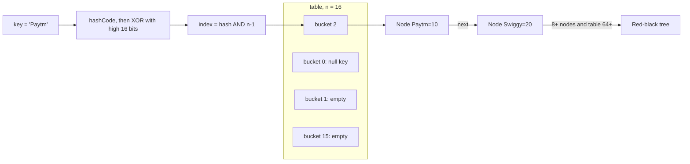

# HashMap, TreeMap & Sets

A Map takes you from a key to its value in O(1) or O(log n). HashMap internals (hash, buckets, treeify, resize) come up in almost every Java interview. Sets are Maps underneath, so study them together.

## ⭐ HashMap internals: buckets and hashing

**In one line:** HashMap is an array of buckets; it spreads the key's `hashCode()` into a bucket index and stores the entry (a Node) in that bucket.

Steps on `put(key, value)`:
1. `hash(key)` = `h ^ (h >>> 16)` where `h = key.hashCode()`. It mixes the upper 16 bits into the lower bits, so high bits matter even in a small table.
2. `index = hash & (n - 1)`. `n` is always a power of 2, so this behaves like `hash % n` but is faster (bitwise AND).
3. If the bucket is empty, add a new Node. Otherwise walk the chain looking for the same key using `equals()`: found means replace the value, not found means append at the end.
4. If `size > capacity * loadFactor`, resize.

- Default capacity 16, load factor 0.75, so it resizes after 12 entries. The table is created lazily on the first `put`.
- One `null` key is allowed. `hash(null) = 0`, so it lives in bucket 0. Any number of `null` values.
- Each Node holds `hash`, `key`, `value`, `next`.



```java
import java.util.*;

public class Main {
    // This is what HashMap's real hash() looks like
    static int spread(Object key) {
        int h;
        return (key == null) ? 0 : (h = key.hashCode()) ^ (h >>> 16);
    }

    public static void main(String[] args) {
        int n = 16;
        for (String k : List.of("Paytm", "Swiggy", "Zomato")) {
            int idx = spread(k) & (n - 1);   // bucket index
            System.out.println(k + " -> bucket " + idx);
        }
        Map<String, Integer> m = new HashMap<>();
        m.put(null, 0);                      // null key allowed
        System.out.println(m.get(null));     // 0
    }
}
```

**Interview tip:** "Why is capacity a power of 2?" So that `hash & (n-1)` acts as modulo, and on resize each entry either stays at the same index or moves to `index + oldCap`. No full `%` rehash is needed.

**Common mistake:** saying get is always O(1). It is O(1) on average; with heavy collisions the worst case is O(log n) thanks to trees (Java 8+), it used to be O(n).

## ⭐ Collisions, treeify and resize

**In one line:** keys landing in the same bucket first form a linked list; a long list turns into a red-black tree; too many entries double the table.

| Constant | Value | Meaning |
|---|---|---|
| `DEFAULT_INITIAL_CAPACITY` | 16 | starting table size |
| `DEFAULT_LOAD_FACTOR` | 0.75 | how full before resize |
| `TREEIFY_THRESHOLD` | 8 | 8+ nodes in a bucket becomes a tree |
| `MIN_TREEIFY_CAPACITY` | 64 | below 64 the table resizes instead of treeifying |
| `UNTREEIFY_THRESHOLD` | 6 | a tree at 6 or fewer goes back to a list |

- **Treeify:** when a bucket's chain goes past 8 and table size is >= 64, it becomes a red-black tree. If the table is small it resizes first, because the real problem is probably just the small table.
- **Resize:** capacity doubles (16 → 32 → 64). Each entry's new index is either `i` or `i + oldCap`, decided by the `hash & oldCap` bit. O(n) work, but put stays amortized O(1).
- Java 8 inserts at the list **tail**. Java 7 inserted at the head, and a concurrent resize could create an infinite loop.
- 0.75 load factor balances time and memory. Lower load factor = fewer collisions, more memory.

```java
import java.util.*;

public class Main {
    // Bad hashCode: every key lands in one bucket
    record BadKey(int id) {
        @Override public int hashCode() { return 42; }
    }

    public static void main(String[] args) {
        // If you know the expected size, presize to avoid resizes
        int expected = 1000;
        Map<Integer, String> orders = new HashMap<>((int) (expected / 0.75f) + 1);
        for (int i = 0; i < expected; i++) orders.put(i, "order-" + i);

        Map<BadKey, Integer> bad = new HashMap<>();
        for (int i = 0; i < 100; i++) bad.put(new BadKey(i), i); // one bucket, becomes a tree
        System.out.println(bad.get(new BadKey(50)));              // 50, but slow path
    }
}
```

**Interview tip:** "Do keys need to be Comparable for the tree?" Not required. The tree orders by hash first, then by `compareTo` if the keys are `Comparable`, otherwise a tie-break (`System.identityHashCode`). Trees work best with Comparable keys.

**Common mistake:** thinking treeify always happens at 8 nodes. If the table is smaller than 64, it resizes first.

## ⭐ equals() and hashCode() contract

**In one line:** two objects that are equal by `equals()` must have the same `hashCode()`; otherwise HashMap looks for them in different buckets.

Rules:
- `a.equals(b)` true ⇒ `a.hashCode() == b.hashCode()`.
- Same hashCode does **not** imply equals is true (collisions are allowed).
- Override only `equals` and not `hashCode` ⇒ `map.get(sameLookingKey)` returns null.
- **Keep keys immutable.** If you change a key's field after putting it, its hashCode changes and the entry is stuck in the old bucket. That's why `String`, `Integer` and `record` make the best keys.

```java
import java.util.*;

public class Main {
    static class Seat {               // hashCode not overridden: bug
        final String id;
        Seat(String id) { this.id = id; }
        @Override public boolean equals(Object o) {
            return o instanceof Seat s && s.id.equals(id);
        }
    }

    record SeatKey(String screen, String seat) {} // equals + hashCode generated

    public static void main(String[] args) {
        Map<Seat, String> m1 = new HashMap<>();
        m1.put(new Seat("A1"), "booked");
        System.out.println(m1.get(new Seat("A1")));  // null (different hashCode)

        Map<SeatKey, String> m2 = new HashMap<>();
        m2.put(new SeatKey("S1", "A1"), "booked");
        System.out.println(m2.get(new SeatKey("S1", "A1"))); // booked

        // The mutable key problem
        List<Integer> key = new ArrayList<>(List.of(1, 2));
        Map<List<Integer>, String> m3 = new HashMap<>();
        m3.put(key, "x");
        key.add(3);                                 // hashCode changed
        System.out.println(m3.get(key));            // null
        System.out.println(m3.containsKey(List.of(1, 2))); // false: hash matches, equals fails
    }
}
```

**Interview tip:** "Why is String the best HashMap key?" It is immutable and caches its hashCode (computed once).

**Common mistake:** using a mutable field or a random value inside `hashCode`.

## ⭐ HashMap important methods

**In one line:** Java 8's `merge`, `computeIfAbsent` and `getOrDefault` remove the if-else boilerplate.

| Method | What it does | Time complexity |
|---|---|---|
| `put(k, v)` | insert or replace, returns old value | O(1) avg |
| `get(k)` | value or `null` | O(1) avg |
| `getOrDefault(k, d)` | value or default (does **not** insert) | O(1) avg |
| `putIfAbsent(k, v)` | inserts only if key is absent or mapped to null | O(1) avg |
| `computeIfAbsent(k, fn)` | if absent, inserts `fn(k)`; returns the value | O(1) avg |
| `merge(k, v, fn)` | absent → `v`, else `fn(old, v)`; null result removes | O(1) avg |
| `containsKey(k)` | is the key present | O(1) avg |
| `containsValue(v)` | scans all values | O(n) |
| `remove(k)` | removes, returns value | O(1) avg |
| `keySet()` / `values()` / `entrySet()` | views (not copies) | O(1) view, iterate O(n + capacity) |
| `forEach((k, v) -> ...)` | action on each entry | O(n + capacity) |

```java
import java.util.*;

public class Main {
    public static void main(String[] args) {
        Map<String, List<String>> graph = new HashMap<>();
        // Adjacency list: create the list if absent
        graph.computeIfAbsent("Delhi", k -> new ArrayList<>()).add("Mumbai");
        graph.computeIfAbsent("Delhi", k -> new ArrayList<>()).add("Pune");

        Map<String, Integer> stock = new HashMap<>();
        stock.put("pizza", 5);
        stock.merge("pizza", 3, Integer::sum);      // 8
        stock.putIfAbsent("burger", 2);             // 2
        int x = stock.getOrDefault("dosa", 0);      // 0, dosa not added to map

        // Iterate entrySet: key + value together, no extra get()
        for (Map.Entry<String, Integer> e : stock.entrySet()) {
            System.out.println(e.getKey() + "=" + e.getValue());
        }
        stock.forEach((k, v) -> System.out.println(k + ":" + v));
        stock.entrySet().removeIf(e -> e.getValue() < 3); // safe removal
        System.out.println(graph + " " + stock + " " + x);
    }
}
```

**Interview tip:** calling `map.remove()` while iterating throws `ConcurrentModificationException`. Use `iterator.remove()` or `entrySet().removeIf()`.

**Common mistake:** looping over `keySet()` and calling `get()` for each key. Use `entrySet()`.

## ⭐ Frequency count pattern

**In one line:** count how many times each element appears with one line: `merge(x, 1, Integer::sum)`.

The most common DSA pattern: anagram check, first unique char, top-K frequent, two-sum, subarray sum = k (prefix sum counts).

```java
import java.util.*;

public class Main {
    public static void main(String[] args) {
        String s = "bookmyshow";
        Map<Character, Integer> freq = new HashMap<>();
        for (char c : s.toCharArray()) freq.merge(c, 1, Integer::sum);
        System.out.println(freq.get('o'));            // 3

        // First non-repeating char: LinkedHashMap keeps order
        Map<Character, Integer> ordered = new LinkedHashMap<>();
        for (char c : s.toCharArray()) ordered.merge(c, 1, Integer::sum);
        for (var e : ordered.entrySet()) {
            if (e.getValue() == 1) { System.out.println(e.getKey()); break; } // b
        }

        // Subarray sum = k: frequency of prefix sums
        int[] a = {1, 1, 1}; int k = 2, sum = 0, count = 0;
        Map<Integer, Integer> seen = new HashMap<>(Map.of(0, 1));
        for (int v : a) {
            sum += v;
            count += seen.getOrDefault(sum - k, 0);
            seen.merge(sum, 1, Integer::sum);
        }
        System.out.println(count);                    // 2
    }
}
```

**Interview tip:** if input is only lowercase letters, an `int[26]` array is faster than a HashMap. Mention this tradeoff.

**Common mistake:** `map.get(c) + 1` when the key is absent: `null` gets unboxed and throws NPE.

## ⭐ LinkedHashMap and LRU cache

**In one line:** HashMap + a doubly linked list that remembers order: insertion order (default) or access order.

- `new LinkedHashMap<>(cap, 0.75f, true)`: third arg `true` = access order. `get`/`put` move the entry to the end.
- Override `removeEldestEntry` and the oldest entry can be dropped after each `put`. That is an LRU cache.
- Ops are O(1), slightly more memory (before/after pointers).

```java
import java.util.*;

public class Main {
    static class LRUCache<K, V> extends LinkedHashMap<K, V> {
        private final int capacity;
        LRUCache(int capacity) {
            super(capacity, 0.75f, true);   // access order
            this.capacity = capacity;
        }
        @Override
        protected boolean removeEldestEntry(Map.Entry<K, V> eldest) {
            return size() > capacity;       // over the limit, drop the oldest
        }
    }

    public static void main(String[] args) {
        LRUCache<String, String> cache = new LRUCache<>(2);
        cache.put("u1", "Rahul");
        cache.put("u2", "Priya");
        cache.get("u1");                    // u1 is now most recent
        cache.put("u3", "Amit");            // u2 evicted
        System.out.println(cache.keySet()); // [u1, u3]
    }
}
```

**Interview tip:** interviewers often say "don't use LinkedHashMap". Then build HashMap<K, Node> + your own doubly linked list (head/tail sentinels). Mention the short version first, then do the manual one.

**Common mistake:** forgetting `accessOrder = true` in the constructor. Then it is a FIFO cache, not LRU.

## ⭐ TreeMap

**In one line:** a Map with sorted keys, backed by a red-black tree; every op is O(log n), and range queries like floor/ceiling come for free.

- Keys must be `Comparable` or you pass a `Comparator` to the constructor.
- `null` key is not allowed (NPE with natural ordering).
- Use for: leaderboards, time-based lookup ("what was the price at this time"), calendar booking overlap, interval problems.

```java
import java.util.*;

public class Main {
    public static void main(String[] args) {
        TreeMap<Integer, String> slabs = new TreeMap<>();
        slabs.put(0, "no offer");
        slabs.put(199, "Rs 20 off");
        slabs.put(499, "free delivery");

        int cart = 350;
        System.out.println(slabs.floorEntry(cart).getValue()); // Rs 20 off
        System.out.println(slabs.ceilingKey(400));             // 499
        System.out.println(slabs.headMap(199));                // {0=...} (199 exclusive)
        System.out.println(slabs.tailMap(199).keySet());       // [199, 499] (inclusive)
        System.out.println(slabs.firstKey() + " " + slabs.lastKey());

        TreeMap<String, Integer> desc = new TreeMap<>(Comparator.reverseOrder());
        desc.put("a", 1); desc.put("c", 3); desc.put("b", 2);
        System.out.println(desc);                              // {c=3, b=2, a=1}
    }
}
```

| Method | What it does | Time complexity |
|---|---|---|
| `put` / `get` / `remove` | basic ops | O(log n) |
| `floorKey(k)` / `ceilingKey(k)` | greatest `<= k` / smallest `>= k` | O(log n) |
| `lowerKey(k)` / `higherKey(k)` | strictly `<` / `>` | O(log n) |
| `firstKey()` / `lastKey()` | min / max | O(log n) |
| `pollFirstEntry()` | remove and return min | O(log n) |
| `headMap(k)` / `tailMap(k)` / `subMap(a, b)` | range view | O(log n) to create view |
| `descendingMap()` | reverse-order view | O(1) |

**Interview tip:** "HashMap vs TreeMap?" HashMap is O(1) avg with no order. TreeMap is O(log n) with sorted order and range queries. Need order? Use TreeMap.

**Common mistake:** a Comparator inconsistent with `equals`. TreeMap decides uniqueness by `compare() == 0`, not `equals`. Two different objects that compare as 0 become the same key.

## ⭐ HashSet, LinkedHashSet, TreeSet

**In one line:** a Set is a duplicate-free collection; underneath every Set is a Map where the element is the key and the value is a dummy `PRESENT` object.

| Set | Backed by | Order | add/contains/remove |
|---|---|---|---|
| `HashSet` | `HashMap` | none | O(1) avg |
| `LinkedHashSet` | `LinkedHashMap` | insertion order | O(1) avg |
| `TreeSet` | `TreeMap` | sorted | O(log n) |

```java
import java.util.*;

public class Main {
    public static void main(String[] args) {
        Set<String> cities = new HashSet<>(List.of("Delhi", "Pune"));
        System.out.println(cities.add("Delhi"));   // false, duplicate

        Set<Integer> seen = new LinkedHashSet<>();
        for (int x : new int[]{3, 1, 3, 2, 1}) seen.add(x);
        System.out.println(seen);                  // [3, 1, 2] dedupe + order

        TreeSet<Integer> ts = new TreeSet<>(List.of(10, 40, 20, 30));
        System.out.println(ts.floor(25) + " " + ts.ceiling(25)); // 20 30
        System.out.println(ts.headSet(30));        // [10, 20]
        System.out.println(ts.first() + " " + ts.pollLast());   // 10 40

        // Set operations
        Set<Integer> a = new HashSet<>(List.of(1, 2, 3));
        Set<Integer> b = Set.of(2, 3, 4);
        a.retainAll(b);                            // intersection
        System.out.println(a);                     // [2, 3]
    }
}
```

**Interview tip:** "How does HashSet block duplicates?" `add(e)` internally does `map.put(e, PRESENT) == null`. If the key already existed, it returns false.

**Common mistake:** putting a custom class in a HashSet without `equals`/`hashCode`. Duplicates get in.

## EnumMap and EnumSet

**In one line:** when keys are enums, use `EnumMap`: internally it is just an array indexed by `ordinal()`, faster and more compact than HashMap.

- `EnumMap` order = enum declaration order. No `null` key.
- `EnumSet` is a bit vector (up to 64 constants in one `long`). `EnumSet.of`, `allOf`, `range`.

```java
import java.util.*;

public class Main {
    enum Status { PLACED, PREPARING, OUT_FOR_DELIVERY, DELIVERED }

    public static void main(String[] args) {
        Map<Status, Integer> counts = new EnumMap<>(Status.class);
        counts.merge(Status.PLACED, 1, Integer::sum);
        counts.merge(Status.DELIVERED, 1, Integer::sum);
        System.out.println(counts);   // {PLACED=1, DELIVERED=1}

        Set<Status> active = EnumSet.range(Status.PLACED, Status.OUT_FOR_DELIVERY);
        System.out.println(active.contains(Status.DELIVERED)); // false
    }
}
```

**Interview tip:** in state machines (order status, elevator state) EnumMap is a natural fit for transitions.

**Common mistake:** using HashMap for enum keys when EnumMap is available.

## ⭐ Hashtable vs HashMap vs ConcurrentHashMap

**In one line:** HashMap is not thread-safe; Hashtable locks every method (legacy, slow); ConcurrentHashMap uses fine-grained locking + CAS (the right choice for multi-threaded code).

| | HashMap | Hashtable | ConcurrentHashMap |
|---|---|---|---|
| Thread-safe | No | Yes, `synchronized` on the whole object | Yes, bucket-level |
| `null` key/value | 1 null key, null values ok | No | No |
| Iterator | fail-fast (CME) | fail-fast | weakly consistent, no CME |
| Performance | fastest single-thread | slow under contention | high concurrency |
| Status | default | legacy, avoid | concurrent default |

- ConcurrentHashMap (Java 8+): CAS insert into an empty bucket, `synchronized` on the head node of a non-empty bucket. Reads are mostly lock-free.
- Why no `null`? If `get(k)` returns null you can't tell "no key" from "null value", and `containsKey` + `get` is not atomic under concurrency.
- For atomic updates use `compute`/`merge`, not `get` then `put`.
- `Collections.synchronizedMap(map)` is single-lock like Hashtable.

Details: [Concurrency](14-concurrency.md).

```java
import java.util.concurrent.*;

public class Main {
    public static void main(String[] args) throws InterruptedException {
        ConcurrentHashMap<String, Integer> views = new ConcurrentHashMap<>();
        Runnable task = () -> {
            for (int i = 0; i < 1000; i++) views.merge("ipl-final", 1, Integer::sum); // atomic
        };
        Thread t1 = new Thread(task), t2 = new Thread(task);
        t1.start(); t2.start();
        t1.join(); t2.join();
        System.out.println(views.get("ipl-final"));   // always 2000
    }
}
```

**Interview tip:** "What happens if you use HashMap across threads?" Lost updates, wrong size, and in Java 7 an infinite loop during resize. Use ConcurrentHashMap.

**Common mistake:** writing `if (!map.containsKey(k)) map.put(k, v)` on a ConcurrentHashMap. That is a check-then-act race; use `putIfAbsent` or `computeIfAbsent`.

## Checklist

- [ ] I can explain HashMap's `hash()` spreading and `index = hash & (n-1)`
- [ ] I can explain collisions, treeify (8 and 64) and untreeify (6)
- [ ] I can explain load factor 0.75 and resize doubling, with entries going to `i` or `i + oldCap`
- [ ] I can show the equals/hashCode contract and the mutable key bug in code
- [ ] I can use `merge`, `computeIfAbsent`, `getOrDefault`, `putIfAbsent` correctly and state their complexity
- [ ] I can write an LRU cache with LinkedHashMap and `removeEldestEntry`
- [ ] I can solve a range problem with TreeMap's `floorKey`/`ceilingKey`/`headMap`/`tailMap`
- [ ] I can state the backing Map and complexity of HashSet/LinkedHashSet/TreeSet
- [ ] I can explain Hashtable vs HashMap vs ConcurrentHashMap (null, locking, iterator)
