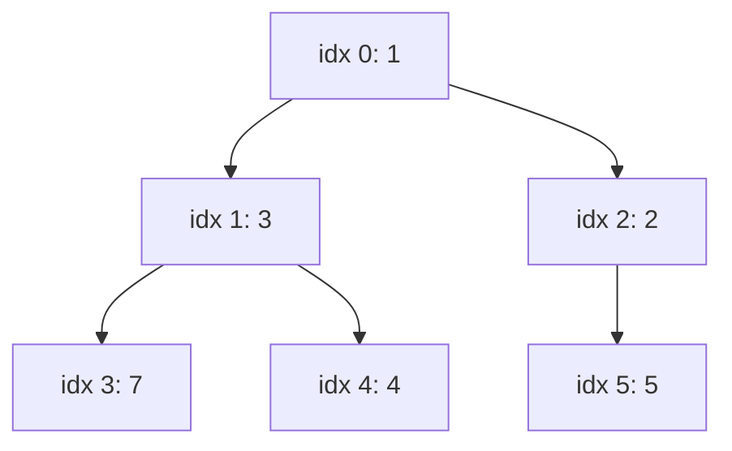

# Queue, Deque & PriorityQueue

BFS, sliding window, top-K, scheduling, producer-consumer: all of them run on queues. For day-to-day Java you only need two classes: `ArrayDeque` (stack + queue) and `PriorityQueue` (heap).

## ⭐ Queue interface: offer/poll/peek vs add/remove/element

**In one line:** every Queue operation has two versions: one throws an exception on failure, the other returns `false`/`null`.

| Operation | Throws exception | Returns special value |
|---|---|---|
| Insert (tail) | `add(e)`: `IllegalStateException` if full | `offer(e)`: `false` if full |
| Remove (head) | `remove()`: `NoSuchElementException` if empty | `poll()`: `null` if empty |
| Examine (head) | `element()`: `NoSuchElementException` if empty | `peek()`: `null` if empty |

- "Full" only happens in capacity-bounded queues (like `ArrayBlockingQueue`). In `ArrayDeque`/`LinkedList`, `add` and `offer` behave the same.
- In interview code write `offer`/`poll`/`peek`. It is cleaner and the empty check is just `null`.

```java
import java.util.*;
import java.util.concurrent.ArrayBlockingQueue;

public class Main {
    public static void main(String[] args) {
        Queue<String> q = new ArrayDeque<>();
        q.offer("Rahul");
        q.offer("Priya");
        System.out.println(q.peek());   // Rahul (not removed)
        System.out.println(q.poll());   // Rahul
        q.poll();                       // Priya
        System.out.println(q.poll());   // null, queue is empty
        try {
            q.remove();
        } catch (NoSuchElementException e) {
            System.out.println("remove() on empty: exception");
        }

        Queue<Integer> bounded = new ArrayBlockingQueue<>(1); // capacity 1
        bounded.offer(1);
        System.out.println(bounded.offer(2)); // false
        try {
            bounded.add(2);
        } catch (IllegalStateException e) {
            System.out.println("add() on full: Queue full");
        }
    }
}
```

**Interview tip:** "offer vs add?" Both insert; on a full bounded queue `offer` returns false while `add` throws.

**Common mistake:** `while (q.poll() != null)` on a queue that can hold `null` (LinkedList allows it). So never put null into a queue.

## ⭐ ArrayDeque as stack and queue

**In one line:** `ArrayDeque` is a resizable circular array; add/remove at both ends is amortized O(1); it is Java's default for both stacks and queues.

**Why not `Stack`:**
- `Stack` extends `Vector`: every method is `synchronized`, so you pay lock overhead for nothing.
- Inheriting from `Vector` exposes methods like `add(index, e)` in the middle, which breaks the stack contract.
- The Java docs themselves say: use `Deque` for stacks.

**Why not `LinkedList`:**
- A separate Node object per element: more memory, cache-unfriendly, GC pressure.
- `ArrayDeque` is a contiguous array and faster in practice.

**Keep in mind:** `ArrayDeque` does not allow `null` (NPE), and it is not thread-safe.

```java
import java.util.*;

public class Main {
    // Stack use: balanced brackets
    static boolean isValid(String s) {
        Deque<Character> st = new ArrayDeque<>();
        for (char c : s.toCharArray()) {
            if (c == '(') st.push(')');
            else if (c == '[') st.push(']');
            else if (c == '{') st.push('}');
            else if (st.isEmpty() || st.pop() != c) return false;
        }
        return st.isEmpty();
    }

    public static void main(String[] args) {
        System.out.println(isValid("{[()]}"));  // true
        System.out.println(isValid("(]"));      // false

        // Queue use: BFS levels
        Map<Integer, List<Integer>> g = Map.of(1, List.of(2, 3), 2, List.of(4), 3, List.of(), 4, List.of());
        Deque<Integer> q = new ArrayDeque<>();
        Set<Integer> seen = new HashSet<>(List.of(1));
        q.offer(1);
        while (!q.isEmpty()) {
            int u = q.poll();
            System.out.print(u + " ");          // 1 2 3 4
            for (int v : g.get(u)) if (seen.add(v)) q.offer(v);
        }
    }
}
```

**Interview tip:** "Why avoid the Stack class?" It is a legacy class built on synchronized Vector; `Deque<Integer> st = new ArrayDeque<>()` is faster and cleaner.

**Common mistake:** iterating a `Stack` and expecting items from the top. `Stack` iterates from the bottom, `ArrayDeque` (used with push) from the top. The order differs.

## ⭐ Deque methods

**In one line:** Deque = double-ended queue; insert/remove/peek at both ends, each with an exception version and a null version.

| Method | What it does | Time complexity |
|---|---|---|
| `offerFirst(e)` / `addFirst(e)` | insert at front | O(1) amortized |
| `offerLast(e)` / `addLast(e)` | insert at back | O(1) amortized |
| `pollFirst()` / `removeFirst()` | remove from front (null / exception) | O(1) |
| `pollLast()` / `removeLast()` | remove from back | O(1) |
| `peekFirst()` / `getFirst()` | look at front | O(1) |
| `peekLast()` / `getLast()` | look at back | O(1) |
| `push(e)` / `pop()` / `peek()` | stack: `addFirst` / `removeFirst` / `peekFirst` | O(1) |
| `offer(e)` / `poll()` | queue: `offerLast` / `pollFirst` | O(1) |
| `contains(o)` / `remove(o)` | linear scan | O(n) |
| `descendingIterator()` | iterate back to front | O(n) total |

```java
import java.util.*;

public class Main {
    public static void main(String[] args) {
        Deque<String> dq = new ArrayDeque<>();
        dq.offerLast("B");
        dq.offerFirst("A");
        dq.offerLast("C");              // [A, B, C]
        System.out.println(dq.peekFirst() + " " + dq.peekLast()); // A C
        dq.pollLast();                  // [A, B]
        dq.push("Z");                   // stack push = front: [Z, A, B]
        System.out.println(dq.pop());   // Z
        System.out.println(dq);         // [A, B]
    }
}
```

**Interview tip:** `push`/`pop` always work on the **front**. Remember this if you mix stack and queue operations on one deque.

**Common mistake:** mixing `push` (stack) and `poll` (queue) on the same deque and then getting confused about the order.

## ⭐ PriorityQueue (binary heap)

**In one line:** `PriorityQueue` is a binary heap stored in an array; it is a **min-heap** by default; the smallest (or "first" per the comparator) element is at the head.

- Array layout: index `i` has children `2i+1`, `2i+2`; parent `(i-1)/2`.
- `offer`: add at the end, **sift up**. `poll`: move the last element to the root, **sift down**. Both O(log n).
- `new PriorityQueue<>(collection)` = **heapify**, O(n), better than n offers (O(n log n)).
- The iterator / `toString` do **not** give sorted order. For sorted output, `poll()` repeatedly.
- `null` not allowed. Not thread-safe (use `PriorityBlockingQueue` for that).



```java
import java.util.*;

public class Main {
    record Order(String id, int etaMins) {}

    public static void main(String[] args) {
        PriorityQueue<Integer> minHeap = new PriorityQueue<>(List.of(5, 1, 7, 3)); // heapify O(n)
        System.out.println(minHeap.poll());          // 1

        PriorityQueue<Integer> maxHeap = new PriorityQueue<>(Comparator.reverseOrder());
        maxHeap.addAll(List.of(5, 1, 7, 3));
        System.out.println(maxHeap.peek());          // 7

        // Custom objects: Swiggy orders, lower ETA first, tie broken by id
        PriorityQueue<Order> pq = new PriorityQueue<>(
            Comparator.comparingInt(Order::etaMins).thenComparing(Order::id));
        pq.offer(new Order("o2", 30));
        pq.offer(new Order("o1", 15));
        pq.offer(new Order("o3", 15));
        while (!pq.isEmpty()) System.out.print(pq.poll().id() + " "); // o1 o3 o2
    }
}
```

| Method | What it does | Time complexity |
|---|---|---|
| `offer(e)` / `add(e)` | insert + sift up | O(log n) |
| `poll()` / `remove()` | remove head + sift down | O(log n) |
| `peek()` | look at head | O(1) |
| `remove(Object o)` | find + remove | O(n) |
| `contains(o)` | linear scan | O(n) |
| `new PriorityQueue<>(coll)` | heapify | O(n) |
| `size()` / `isEmpty()` | count | O(1) |

**Interview tip:** for a max-heap write `Comparator.reverseOrder()` or `(a, b) -> Integer.compare(b, a)`. `(a, b) -> b - a` overflows on large/negative numbers.

**Common mistake:** printing `pq` and assuming it is sorted. It is just the heap array.

## ⭐ Top-K pattern with heap

**In one line:** to get the K largest, keep a **min-heap** of size K; when it grows past K, drop the smallest. O(n log k).

- K largest → min-heap of size K. K smallest → max-heap of size K.
- Kth largest = the heap's `peek()` at the end.
- Full sort is O(n log n); the heap is O(n log k) with only O(k) memory, and it works on streaming data too (trending hashtags, top sellers).

```java
import java.util.*;

public class Main {
    static int kthLargest(int[] nums, int k) {
        PriorityQueue<Integer> heap = new PriorityQueue<>(); // min-heap
        for (int x : nums) {
            heap.offer(x);
            if (heap.size() > k) heap.poll();                // drop the smallest
        }
        return heap.peek();
    }

    static List<String> topKFrequent(String[] words, int k) {
        Map<String, Integer> freq = new HashMap<>();
        for (String w : words) freq.merge(w, 1, Integer::sum);
        PriorityQueue<Map.Entry<String, Integer>> heap =
            new PriorityQueue<>((a, b) -> Integer.compare(a.getValue(), b.getValue())); // min-heap on freq
        for (var e : freq.entrySet()) {
            heap.offer(e);
            if (heap.size() > k) heap.poll();
        }
        List<String> res = new ArrayList<>();
        while (!heap.isEmpty()) res.add(heap.poll().getKey());
        Collections.reverse(res);                            // highest freq first
        return res;
    }

    public static void main(String[] args) {
        System.out.println(kthLargest(new int[]{3, 2, 1, 5, 6, 4}, 2)); // 5
        String[] tags = {"ipl", "csk", "ipl", "rcb", "ipl", "csk"};
        System.out.println(topKFrequent(tags, 2));           // [ipl, csk]
    }
}
```

**Interview tip:** first say "sort it, O(n log n)", then "heap, O(n log k)", and as a bonus: "Quickselect, average O(n)".

**Common mistake:** pushing all n elements into a max-heap for K largest. It works, but uses O(n) memory and misses the point.

## Monotonic deque: sliding window max

**In one line:** keep indices in the deque so their values stay decreasing; the front is always the current window's max. O(n) total.

For each new index:
1. If the front has left the window (`<= i - k`), `pollFirst`.
2. Remove smaller values from the back (`pollLast`); they can never be the max.
3. `offerLast` the current index. Once the window is full, the front's value is the answer.

```java
import java.util.*;

public class Main {
    static int[] maxSlidingWindow(int[] nums, int k) {
        int n = nums.length;
        int[] res = new int[n - k + 1];
        Deque<Integer> dq = new ArrayDeque<>();        // indices, values decreasing
        for (int i = 0; i < n; i++) {
            if (!dq.isEmpty() && dq.peekFirst() <= i - k) dq.pollFirst(); // out of window
            while (!dq.isEmpty() && nums[dq.peekLast()] <= nums[i]) dq.pollLast();
            dq.offerLast(i);
            if (i >= k - 1) res[i - k + 1] = nums[dq.peekFirst()];
        }
        return res;
    }

    public static void main(String[] args) {
        int[] a = {1, 3, -1, -3, 5, 3, 6, 7};
        System.out.println(Arrays.toString(maxSlidingWindow(a, 3))); // [3, 3, 5, 5, 6, 7]
    }
}
```

**Interview tip:** "Why is it O(n)?" Each index enters the deque once and leaves at most once.

**Common mistake:** storing values in the deque instead of indices. Then you can't tell when an element has left the window.

## BlockingQueue and producer-consumer

**In one line:** `BlockingQueue` is a thread-safe queue where `put` waits when full and `take` waits when empty; producer-consumer without manual `wait/notify`.

| Method | When full/empty | Use |
|---|---|---|
| `put(e)` / `take()` | blocks | normal producer-consumer |
| `offer(e)` / `poll()` | immediately `false` / `null` | non-blocking try |
| `offer(e, t, unit)` / `poll(t, unit)` | waits up to timeout | need a timeout |
| `add(e)` / `remove()` | exception | rare |

- `ArrayBlockingQueue`: fixed capacity, array. `LinkedBlockingQueue`: optional bound (default `Integer.MAX_VALUE`, dangerous). `PriorityBlockingQueue`: heap. `DelayQueue`: available after a delay. `SynchronousQueue`: capacity 0, direct handoff.
- `ThreadPoolExecutor` uses a BlockingQueue internally. Details: [Concurrency](14-concurrency.md).

```java
import java.util.concurrent.*;

public class Main {
    public static void main(String[] args) throws InterruptedException {
        BlockingQueue<String> q = new ArrayBlockingQueue<>(2); // backpressure: max 2
        Thread producer = new Thread(() -> {
            try {
                for (int i = 1; i <= 5; i++) q.put("order-" + i); // waits when full
                q.put("DONE");                                    // poison pill
            } catch (InterruptedException e) { Thread.currentThread().interrupt(); }
        });
        Thread consumer = new Thread(() -> {
            try {
                String s;
                while (!(s = q.take()).equals("DONE")) System.out.println("Processing " + s);
            } catch (InterruptedException e) { Thread.currentThread().interrupt(); }
        });
        producer.start(); consumer.start();
        producer.join(); consumer.join();
    }
}
```

**Interview tip:** for "write producer-consumer", lead with the BlockingQueue version; if they ask for `wait/notify`, write the manual one.

**Common mistake:** an unbounded `LinkedBlockingQueue` with a slow consumer. The queue keeps growing until OOM.

## Checklist

- [ ] I can explain `offer/poll/peek` vs `add/remove/element` and their exceptions
- [ ] I can explain why ArrayDeque is preferred over Stack and LinkedList
- [ ] I can run both a stack and a queue with Deque methods (push/pop work on the front)
- [ ] I can explain PriorityQueue's heap layout, sift up/down and complexities
- [ ] I can write a max-heap and a custom-object heap with a Comparator, without overflow
- [ ] I can write Top-K / Kth largest in O(n log k) with a heap
- [ ] I can write sliding window max in O(n) with a monotonic deque
- [ ] I can write producer-consumer with BlockingQueue and explain put/take vs offer/poll
