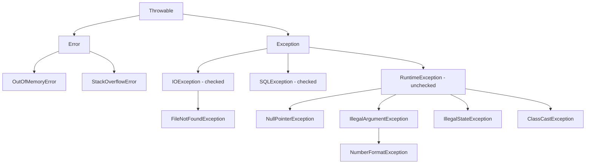

# Exceptions

An exception means something went wrong while the program was running (file not found, method called on null, bad input). In Java an exception is an **object** that gets "thrown" up the stack until someone `catch`es it. If nobody catches it, the thread dies and a stack trace is printed.

## ⭐ Exception hierarchy

**In one line:** everything comes from `Throwable`. It has two children: `Error` (a JVM problem, do not catch) and `Exception` (an app problem, handle it).



- **Error:** `OutOfMemoryError`, `StackOverflowError`. Recovery is practically impossible. Do not catch.
- **Exception (checked):** everything except `RuntimeException`. The compiler forces you to either `catch` it or declare `throws`.
- **RuntimeException (unchecked):** programming bugs. The compiler does not force anything.

**Interview tip:** "Error is unchecked too." Unchecked = `RuntimeException` + `Error` and their subclasses. Everything else is checked.

**Common mistake:** writing `catch (Throwable t)`. You will also catch `OutOfMemoryError` and the app keeps running in a zombie state.

## ⭐ Checked vs Unchecked

**In one line:** checked = must be handled at compile time (recoverable, outside world), unchecked = runtime bug (fix the code).

| | Checked | Unchecked |
|---|---|---|
| Parent | `Exception` (not RuntimeException) | `RuntimeException`, `Error` |
| Compiler check | Yes, catch or `throws` required | No |
| When it happens | Something external fails: file, network, DB | Bug in code: null, bad index, bad argument |
| Example | `IOException`, `SQLException`, `InterruptedException` | `NullPointerException`, `ArrayIndexOutOfBoundsException` |

```java
import java.io.*;

public class Main {
    // Checked: must declare throws, otherwise compile error
    static String readFirstLine(String path) throws IOException {
        try (BufferedReader br = new BufferedReader(new FileReader(path))) {
            return br.readLine();
        }
    }

    // Unchecked: compiler says nothing
    static int divide(int a, int b) {
        return a / b; // if b == 0 then ArithmeticException
    }

    public static void main(String[] args) {
        try {
            System.out.println(readFirstLine("missing.txt"));
        } catch (FileNotFoundException e) {
            System.out.println("File not found: " + e.getMessage());
        } catch (IOException e) {
            System.out.println("IO problem: " + e.getMessage());
        }
        System.out.println(divide(10, 2)); // 5
    }
}
```

**Interview tip:** modern frameworks like Spring/Hibernate mostly use unchecked exceptions because writing `throws` at every layer is noise. Say: "If the caller can meaningfully recover, checked; otherwise unchecked."

**Common mistake:** catch block order: specific first, general later. Writing `catch (IOException)` before `FileNotFoundException` is a compile error (unreachable catch).

## ⭐ try / catch / finally

**In one line:** risky code in `try`, handling in `catch`, and `finally` always runs (exception or not, even with a `return`).

`finally` does not run only when `System.exit()` is called, the JVM crashes, or the thread is killed.

**Gotcha: return in finally.** A `return` in `finally` overrides the `return` in try, and also swallows any exception.

```java
public class Main {
    static int test1() {
        try {
            return 1;
        } finally {
            return 2;          // overwrites try's 1, answer is 2
        }
    }

    static int test2() {
        int x = 10;
        try {
            return x;          // 10 is saved right here
        } finally {
            x = 20;            // no effect on the returned value
        }
    }

    static int test3() {
        try {
            throw new RuntimeException("boom");
        } finally {
            return 3;          // exception gone! the caller never finds out
        }
    }

    public static void main(String[] args) {
        System.out.println(test1()); // 2
        System.out.println(test2()); // 10
        System.out.println(test3()); // 3
    }
}
```

**Interview tip:** `test2` is the most common trick question. The primitive value is copied before return, so 10. If you returned an object (like a `StringBuilder`) and changed its content in finally, the change would show (same reference).

**Common mistake:** writing `return` or `throw` inside `finally`. The original exception is lost. Use finally only for cleanup.

## ⭐ try-with-resources & AutoCloseable

**In one line:** open anything that implements `AutoCloseable` inside `try (...)` and Java calls `close()` for you (Java 7+).

- With multiple resources, they close in **reverse order** (last opened, first closed).
- If the `try` body throws and `close()` also throws, the body's exception stays the main one, and the close exception is added to it as **suppressed** (`e.getSuppressed()`).

```java
public class Main {
    static class Conn implements AutoCloseable {
        private final String name;
        Conn(String name) { this.name = name; System.out.println("open " + name); }
        @Override
        public void close() throws Exception {
            System.out.println("close " + name);
            throw new IllegalStateException("close fail " + name);
        }
    }

    public static void main(String[] args) {
        try (Conn db = new Conn("db"); Conn cache = new Conn("cache")) {
            throw new RuntimeException("query fail");
        } catch (Exception e) {
            System.out.println("main: " + e.getMessage());          // query fail
            for (Throwable s : e.getSuppressed()) {
                System.out.println("suppressed: " + s.getMessage()); // close fail cache, close fail db
            }
        }
    }
}
// Output: open db, open cache, close cache, close db, main: query fail, ...
```

**Interview tip:** "In the old `finally { conn.close(); }` style, if close also failed, the original exception was lost. try-with-resources keeps both using suppressed exceptions."

**Common mistake:** `AutoCloseable` vs `Closeable`: `Closeable` (java.io) throws `IOException` and should be idempotent. `AutoCloseable` is generic and can throw `Exception`.

## Multi-catch

**In one line:** catch several exceptions in one `catch` with `|` when the handling is the same (Java 7+).

```java
try {
    int n = Integer.parseInt(args[0]);
    System.out.println(100 / n);
} catch (NumberFormatException | ArithmeticException e) {
    System.out.println("Bad input: " + e);
    // e = ...;  compile error: a multi-catch variable is implicitly final
}
```

**Common mistake:** putting types from the same hierarchy together: `catch (IOException | FileNotFoundException e)` is a compile error, because one is a subclass of the other.

## ⭐ throw vs throws

**In one line:** `throw` = throw an exception now (a statement, inside the method body). `throws` = declare in the method signature that this method may throw this exception.

| | `throw` | `throws` |
|---|---|---|
| Where | In the method body | In the method signature |
| Takes | One exception object | One or more exception classes |
| Example | `throw new IllegalArgumentException("amount < 0");` | `void pay() throws PaymentException` |

```java
static void withdraw(double balance, double amount) throws InsufficientFundsException {
    if (amount <= 0) throw new IllegalArgumentException("amount must be > 0"); // unchecked, not declared
    if (amount > balance) throw new InsufficientFundsException(amount - balance); // checked, declared
}
```

**Interview tip:** listing unchecked exceptions in `throws` is allowed (for documentation) but not required.

## ⭐ Custom exceptions & chaining

**In one line:** give the domain error a name (`InsufficientFundsException`), and keep the lower-level technical error inside as the **cause** so the root cause is not lost.

**Checked or unchecked?**
- Checked (`extends Exception`): the caller really should do something. For example, low balance in a Paytm wallet: the UI shows "Add money".
- Unchecked (`extends RuntimeException`): validation/bugs, or when `throws` at every layer would be noise. This is the usual default today.

```java
class InsufficientFundsException extends Exception {
    private final double shortBy;
    InsufficientFundsException(double shortBy) {
        super("Balance too low, short by " + shortBy);
        this.shortBy = shortBy;
    }
    double getShortBy() { return shortBy; }
}

class OrderServiceException extends RuntimeException {
    OrderServiceException(String msg, Throwable cause) { super(msg, cause); } // chaining
}

public class Main {
    static void saveOrder(String id) {
        try {
            throw new java.sql.SQLException("connection timeout"); // DB layer fails
        } catch (java.sql.SQLException e) {
            throw new OrderServiceException("Order save fail: " + id, e); // pass the cause
        }
    }

    public static void main(String[] args) {
        try {
            saveOrder("ORD-42");
        } catch (OrderServiceException e) {
            System.out.println(e.getMessage());            // Order save fail: ORD-42
            System.out.println(e.getCause().getMessage()); // connection timeout
        }
    }
}
```

**Interview tip:** "I translate exceptions at layer boundaries (SQLException → domain exception) but always pass the cause. The `Caused by:` part of the stack trace gives the root cause."

**Common mistake:** writing `throw new MyException(e.getMessage())`. The original stack trace is lost. Always use `new MyException(msg, e)`.

## ⭐ Best practices

- **Do not swallow:** an empty `catch (Exception e) {}` is the worst code. At least log it, or rethrow.
- **Do not catch broadly:** if you write `catch (Exception e)` everywhere, bugs (NPE) get hidden too. Catch specific exceptions. Use a broad catch only at the top level (request handler, thread boundary).
- **Fail fast:** validate input at the start of the method: `Objects.requireNonNull(user, "user")`, `if (qty <= 0) throw new IllegalArgumentException(...)`.
- **Log or rethrow, not both:** doing both makes one error show up 3-4 times in the logs.
- **Exceptions are not for control flow:** throwing an exception to break a loop is slow (building the stack trace is expensive).
- **Meaningful message:** `"Invalid amount: -50 for user 123"`, not `"error"`.
- **Resources:** always use try-with-resources.
- If you catch `InterruptedException`, restore the flag with `Thread.currentThread().interrupt()`.

## Overriding rules with exceptions

**In one line:** a child method cannot throw **more or broader checked** exceptions than the parent. Fewer, narrower, or any unchecked is fine.

```java
class Parent {
    void load() throws java.io.IOException {}
}
class Child1 extends Parent {
    @Override void load() throws java.io.FileNotFoundException {} // OK: narrower
}
class Child2 extends Parent {
    @Override void load() {}                                       // OK: nothing
}
class Child3 extends Parent {
    @Override void load() throws IllegalStateException {}         // OK: unchecked
}
// class Child4 extends Parent {
//     @Override void load() throws Exception {}                  // compile error: broader
// }
```

**Interview tip:** the reason is Liskov substitution. A caller holding `Parent p` only handles `IOException`. If the child threw `Exception`, the caller would be unprepared.

## ⭐ Common runtime exceptions

| Exception | When it happens | Example |
|---|---|---|
| `NullPointerException` | method/field access on a null reference | `String s = null; s.length();` |
| `ClassCastException` | cast to the wrong type | `Object o = "hi"; Integer i = (Integer) o;` |
| `IllegalArgumentException` | bad argument passed to a method | `Thread.sleep(-1)` |
| `IllegalStateException` | object is in the wrong state for this call | `iterator.remove()` without `next()` |
| `ConcurrentModificationException` | collection modified while iterating | `list.remove(x)` inside for-each |
| `NumberFormatException` | string is not a number | `Integer.parseInt("12a")` |
| `ArrayIndexOutOfBoundsException` | bad index | `arr[arr.length]` |
| `ArithmeticException` | integer divide by zero | `5 / 0` |
| `UnsupportedOperationException` | modifying an immutable collection | `List.of(1).add(2)` |

```java
import java.util.*;

public class Main {
    public static void main(String[] args) {
        List<Integer> list = new ArrayList<>(List.of(1, 2, 3, 4));
        // for (Integer x : list) if (x % 2 == 0) list.remove(x); // ConcurrentModificationException
        list.removeIf(x -> x % 2 == 0);   // the right way
        System.out.println(list);          // [1, 3]

        Integer boxed = null;
        // int n = boxed;                  // NPE: auto-unboxing null
    }
}
```

**Common mistake:** `5.0 / 0` does not throw, it gives `Infinity`. `ArithmeticException` only happens in integer division.

## Avoid NPE with Optional (brief)

**In one line:** a method that may or may not have a value should return `Optional<T>` instead of `null` (Java 8+).

```java
import java.util.*;

public class Main {
    static Optional<String> findCity(String userId) {
        return "u1".equals(userId) ? Optional.of("Pune") : Optional.empty();
    }

    public static void main(String[] args) {
        String city = findCity("u2").orElse("Unknown");
        System.out.println(city);                                    // Unknown
        findCity("u1").map(String::toUpperCase).ifPresent(System.out::println); // PUNE
        // findCity("u2").orElseThrow(); // NoSuchElementException
    }
}
```

Optional is covered in detail in the [Lambdas & Streams](12-streams-lambdas.md) file.

**Common mistake:** `opt.get()` without checking. That crashes just like an NPE, only with a different name (`NoSuchElementException`).

## Checklist

- [ ] I can draw the Throwable → Error / Exception → RuntimeException hierarchy
- [ ] I can explain checked vs unchecked with 2 examples each
- [ ] I can predict the output of finally-with-return trick questions (override, primitive copy, swallowed exception)
- [ ] I can explain try-with-resources close order and suppressed exceptions
- [ ] I can explain throw vs throws and the multi-catch rules
- [ ] I can write a custom exception and justify the checked vs unchecked choice
- [ ] I can explain why exception chaining (cause) matters
- [ ] I can explain the exception rules for overriding and the reason (LSP)
- [ ] I can name common runtime exceptions and their causes without thinking
