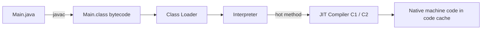
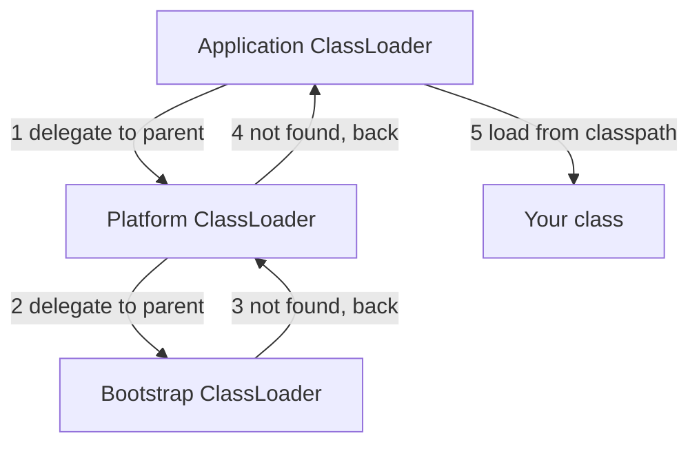
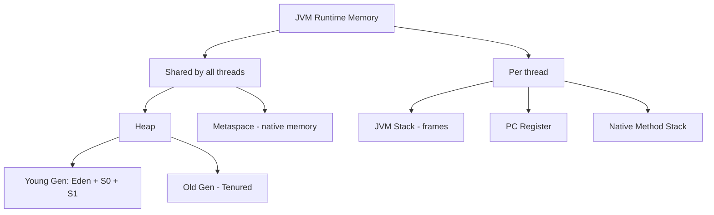
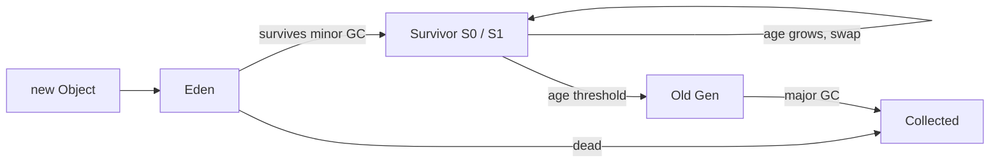

# JVM & Memory

Java code does not run directly on the machine. `javac` turns it into **bytecode**, and the JVM runs that bytecode, manages memory, and cleans up garbage on its own. Interview questions like "where does an object live", "how does GC work", "how can Java leak memory" all come from this file.

## ⭐ JDK vs JRE vs JVM

**In one line:** the JVM runs bytecode, JRE = JVM + standard libraries (to run), JDK = JRE + developer tools (to build).

| | What it is | Who needs it |
|---|---|---|
| JVM | Bytecode interpreter + JIT + GC + memory manager | Every Java program |
| JRE | JVM + core libraries (`java.lang`, `java.util`...) | Anyone who only runs apps |
| JDK | JRE + `javac`, `jar`, `jdb`, `jshell`, `jcmd`... | Developers |

**Interview tip:** the bytecode is platform independent, not the JVM. Each OS has its own JVM while the bytecode stays the same: "write once, run anywhere". Since Java 11 Oracle does not ship a separate JRE; you build a custom runtime with `jlink`.

## ⭐ Compilation: bytecode + JIT

**In one line:** `javac` → `.class` (bytecode) → the JVM interprets it first → code that runs again and again (hot code) gets compiled to native machine code by the JIT.



- **Interpreter:** starts instantly, but slow.
- **JIT (Just-In-Time):** HotSpot has C1 (fast, light optimization) and C2 (slower, heavy optimization). This is called **tiered compilation**.
- JIT optimizations: method inlining, escape analysis (object on stack or split into scalars), loop unrolling, dead code removal.

**Interview tip:** "That is why a Java app has a warm-up time. Slow for the first few seconds, fast after the JIT kicks in." AOT/GraalVM native image make startup fast.

## ⭐ Class loading

**In one line:** a class is loaded the first time it is used (lazy), and loaders follow **parent delegation**: ask the parent first, load it yourself only if the parent cannot.

Three built-in loaders (Java 9+):
1. **Bootstrap:** native code, core classes like `java.base` (`String`, `Object`). In Java its reference shows as `null`.
2. **Platform** (formerly Extension): the remaining Java SE modules (`java.sql` etc).
3. **Application / System:** your classpath / module path.



Phases: **Loading** (read the bytes) → **Linking** (verify, prepare: static fields get default values, resolve) → **Initialization** (static blocks and static initializers run).

```java
public class Main {
    public static void main(String[] args) {
        System.out.println(String.class.getClassLoader());   // null (bootstrap)
        System.out.println(java.sql.Connection.class.getClassLoader()); // PlatformClassLoader
        System.out.println(Main.class.getClassLoader());     // AppClassLoader
    }
}
```

**Interview tip:** why delegation? **Security + uniqueness.** Even if someone puts a fake `java.lang.String` on the classpath, the bootstrap one is loaded. Also, a class's identity in the JVM = class name + loader, so the same class loaded by two loaders becomes two different types (you can get a `ClassCastException`, common in app servers).

## ⭐ Runtime memory areas

**In one line:** heap and metaspace are shared by all threads; stack, PC register and native stack belong to each thread.



| Area | What it holds | Error |
|---|---|---|
| Heap | All objects and arrays, String pool (Java 7+) | `OutOfMemoryError: Java heap space` |
| Metaspace | Class metadata, method bytecode, constant pool (Java 8+, replaced PermGen) | `OutOfMemoryError: Metaspace` |
| JVM Stack | A frame per method call: local variables, operand stack, return address | `StackOverflowError` |
| PC Register | Address of the current bytecode instruction | - |
| Native Method Stack | For JNI / native methods | - |

**Interview tip:** "Java 8 removed PermGen and added Metaspace. Metaspace lives in native memory and auto-grows by default, so setting `MaxMetaspaceSize` is a good idea."

## ⭐ Stack vs Heap

**In one line:** the stack holds primitives and references (method locals), the heap holds the actual objects. The stack is cleaned automatically (method ends), the heap is cleaned by GC.

```java
public class Main {
    static int orderCount = 0;          // static field: on the heap with the Class object (metadata in Metaspace)
    int price = 100;                    // instance field: inside the object, on the heap

    public static void main(String[] args) {
        int qty = 2;                    // primitive local: in main's stack frame
        Main order = new Main();        // 'order' reference on the stack, Main object on the heap
        String city = "Pune";           // reference on the stack, "Pune" in the heap's String pool
        int total = calc(order, qty);   // a new frame is pushed on the stack
        System.out.println(total);      // 200
    }                                   // main's frame pops, the Main object is now unreachable

    static int calc(Main o, int q) {    // o and q are this frame's locals (o points to the heap object)
        return o.price * q;
    }
}
```

| | Stack | Heap |
|---|---|---|
| What | Frames, primitive locals, references | Objects, arrays |
| Scope | One thread | All threads |
| Size | Small (`-Xss`, often 512KB-1MB) | Large (`-Xmx`) |
| Cleanup | Automatic on method return | GC |
| Speed | Very fast (LIFO) | Fast allocation (TLAB), GC cost |
| Thread safe | Yes (private) | No, needs sync |

**Common mistake:** saying "primitives always live on the stack". Wrong. An object's `int` field lives on the heap. Only **local** primitives are on the stack.

## ⭐ Garbage Collection

**In one line:** GC removes objects that are not reachable from any **GC root**. It is not reference counting, so cycles get collected too.

**GC roots:** local variables on active threads' stacks, static fields, JNI references, active threads themselves, synchronized monitors.

**Generational hypothesis:** most objects die young (temporary objects of a request). So the heap is split into young and old:
- A new object is created in **Eden**.
- Eden full → **Minor GC**: live objects are copied to Survivor (S0/S1), age +1 on each survival.
- Age crosses the threshold (max 15) → promoted to **Old Gen**.
- Old Gen full → **Major / Full GC**: expensive, long pause.



**Stop-the-world (STW):** during some GC phases all application threads pause. In interviews, latency discussions always come down to pause time.

| Collector | When | Note |
|---|---|---|
| Serial | Small heap, single core | One thread, STW |
| Parallel | Throughput matters (batch jobs) | Multiple threads, STW |
| **G1** | **Default since Java 9** | Splits heap into regions, pause target (`-XX:MaxGCPauseMillis=200`) |
| ZGC | Very large heap, under 1ms pause | Mostly concurrent, production since Java 15, generational in Java 21 |
| Shenandoah | Low pause (Red Hat) | Concurrent compaction |

**Interview tip:** "System.gc() is only a request, not a guarantee. Do not call it in production code."

**Common mistake:** "Java has GC so it cannot leak memory." It can: if an object is reachable but useless, GC cannot remove it.

## ⭐ Memory leaks in Java

**In one line:** a leak = an object is no longer useful but some reference still holds it, so GC cannot free it.

Common sources:
- **Static collections:** a `static Map cache` that only ever gets `put`, never `remove`.
- **Listeners / callbacks:** registered, but you forgot to unregister.
- **ThreadLocal in thread pools:** pool threads never die, so without `remove()` the value lives forever (and the next request may even see wrong data).
- **Unclosed resources:** streams, connections, `ResultSet`.
- **Inner class:** a non-static inner class holds a hidden reference to its outer object.
- **Bad `equals`/`hashCode` key:** a mutable key in a HashMap that changes later, so the entry can never be found.

```java
import java.util.*;

public class Main {
    private static final Map<String, byte[]> CACHE = new HashMap<>(); // leak: never cleared
    private static final ThreadLocal<StringBuilder> BUF = ThreadLocal.withInitial(StringBuilder::new);

    static void handle(String reqId) {
        CACHE.put(reqId, new byte[1024 * 1024]); // 1MB per request, never removed
        try {
            BUF.get().append(reqId);
        } finally {
            BUF.remove();                         // always remove ThreadLocal in finally
        }
    }

    public static void main(String[] args) {
        for (int i = 0; i < 100; i++) handle("req-" + i);
        System.out.println(CACHE.size()); // 100 -> keeps growing
    }
}
```

Fix: bounded cache (LRU via `LinkedHashMap.removeEldestEntry`, Caffeine), TTL, `WeakHashMap` where the key's lifetime is decided elsewhere.

**Interview tip:** how would you debug it: "I keep `-XX:+HeapDumpOnOutOfMemoryError` on, open the heap dump in Eclipse MAT / VisualVM and check the dominator tree to see which object retains the most memory."

## ⭐ OutOfMemoryError vs StackOverflowError

| | `OutOfMemoryError` | `StackOverflowError` |
|---|---|---|
| Where | Heap / Metaspace / native | The thread's stack |
| Cause | Too many objects, leak, heap too small | Very deep / infinite recursion |
| Fix | Find the leak, increase `-Xmx` | Fix the base case, make it iterative, increase `-Xss` |

```java
public class Main {
    static int depth = 0;
    static void recurse() { depth++; recurse(); } // no base case

    public static void main(String[] args) {
        try {
            recurse();
        } catch (StackOverflowError e) {
            System.out.println("Depth reached: " + depth); // ~10-20k, depends on -Xss
        }
    }
}
```

OOM variants: `Java heap space`, `Metaspace`, `GC overhead limit exceeded` (98% of time spent in GC yet less than 2% of heap recovered), `unable to create new native thread`.

## Strong / Soft / Weak / Phantom references

**In one line:** the strength of a reference decides when GC may remove the object.

| Type | When GC removes it | Use |
|---|---|---|
| Strong (`Obj o = new Obj()`) | Never, while reachable | Normal code |
| `SoftReference` | Only when memory is low (before OOM) | Memory-sensitive cache |
| `WeakReference` | At the next GC (if only weak refs remain) | `WeakHashMap`, metadata, listeners |
| `PhantomReference` | `get()` always returns `null`; enqueued after collection | Cleanup tracking (`Cleaner`) |

```java
import java.lang.ref.WeakReference;

public class Main {
    public static void main(String[] args) {
        Object strong = new Object();
        WeakReference<Object> weak = new WeakReference<>(strong);
        System.out.println(weak.get() != null); // true
        strong = null;                           // only the weak ref remains
        System.gc();                             // just a hint
        System.out.println(weak.get());          // usually null
    }
}
```

## ⭐ JVM flags

| Flag | What it does |
|---|---|
| `-Xms512m` | Initial heap size |
| `-Xmx2g` | Max heap size |
| `-Xss1m` | Stack size per thread |
| `-Xmn256m` | Young gen size |
| `-XX:MaxMetaspaceSize=256m` | Metaspace limit |
| `-XX:+UseG1GC` / `-XX:+UseZGC` | Choose the collector |
| `-XX:+HeapDumpOnOutOfMemoryError` | Heap dump on OOM |
| `-Xlog:gc` | GC logs (Java 9+) |

**Interview tip:** "In production we keep `-Xms` and `-Xmx` the same to avoid heap resize cost. In containers I use `-XX:MaxRAMPercentage=75`."

**Common mistake:** raising `-Xss` in an app with many threads can exhaust native memory (every thread gets a stack of that size).

## finalize() deprecated

**In one line:** `finalize()` was deprecated in Java 9 and marked "for removal" in Java 18. You do not know when it runs or whether it runs at all, it slows GC, and it can resurrect objects.

Alternative: **try-with-resources** (`AutoCloseable`) for deterministic cleanup, and `java.lang.ref.Cleaner` as a safety net.

## ⭐ String pool location

**In one line:** the String pool (interned strings) has been on the **heap** since Java 7. Up to Java 6 it was in PermGen, which is why heavy `intern()` caused PermGen OOM.

```java
public class Main {
    public static void main(String[] args) {
        String a = "Swiggy";                 // in the pool
        String b = "Swiggy";                 // same object from the pool
        String c = new String("Swiggy");     // new heap object
        System.out.println(a == b);          // true
        System.out.println(a == c);          // false
        System.out.println(a == c.intern()); // true
    }
}
```

**Interview tip:** the benefit of being on the heap: unused strings in the pool can also be garbage collected. Details are in the [Strings](02-strings.md) file.

## Checklist

- [ ] I can explain JDK vs JRE vs JVM and the bytecode + JIT flow
- [ ] I can explain the three class loaders and parent delegation (and why)
- [ ] I can draw the JVM memory areas and say which are shared and which are per-thread
- [ ] Given a code snippet, I can say which variable is on the stack and which object is on the heap
- [ ] I can explain GC roots, the generational hypothesis, and minor vs major GC
- [ ] I can explain why G1 is the default and when to use ZGC/Shenandoah
- [ ] I can give 4 real causes of memory leaks in Java and how to debug them
- [ ] I can explain OOM vs StackOverflowError and soft/weak/phantom references
- [ ] I can explain the -Xms, -Xmx, -Xss flags and where the String pool lives
