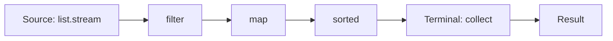

# Lambdas & Streams

Java 8 brought a functional style: **lambdas** (small anonymous functions) and the **Stream API** (a declarative pipeline over collections: say "what you want", not "how to loop"). In interviews you will often hear: "Write this in one line with streams."

## ⭐ Functional interfaces

**In one line:** an interface with **exactly one abstract method** is a functional interface, and a lambda creates an object of it.

The `@FunctionalInterface` annotation is optional, but add it: if someone adds a second abstract method, you get a compile error. `default` and `static` methods are allowed.

| Interface | Method | Input → Output | Example |
|---|---|---|---|
| `Function<T, R>` | `apply` | T → R | `s -> s.length()` |
| `Predicate<T>` | `test` | T → boolean | `n -> n % 2 == 0` |
| `Consumer<T>` | `accept` | T → void | `s -> System.out.println(s)` |
| `Supplier<T>` | `get` | () → T | `() -> new ArrayList<>()` |
| `BiFunction<T, U, R>` | `apply` | (T, U) → R | `(a, b) -> a + b` |
| `UnaryOperator<T>` | `apply` | T → T | `s -> s.trim()` |
| `BinaryOperator<T>` | `apply` | (T, T) → T | `Integer::sum` |

```java
import java.util.function.*;

public class Main {
    @FunctionalInterface
    interface DiscountRule {
        double apply(double amount);           // exactly one abstract method
        default DiscountRule then(DiscountRule next) {
            return amt -> next.apply(apply(amt));
        }
    }

    public static void main(String[] args) {
        Function<String, Integer> len = s -> s.length();
        Predicate<Integer> isEven = n -> n % 2 == 0;
        Consumer<String> printer = s -> System.out.println("Order: " + s);
        Supplier<Double> random = Math::random;
        BiFunction<Integer, Integer, Integer> add = (a, b) -> a + b;
        UnaryOperator<String> upper = String::toUpperCase;

        System.out.println(len.apply("Zomato"));          // 6
        System.out.println(isEven.and(n -> n > 10).test(12)); // true
        printer.accept("ORD-1");
        System.out.println(add.andThen(x -> x * 10).apply(2, 3)); // 50
        System.out.println(upper.apply("paytm"));         // PAYTM

        DiscountRule flat50 = amt -> amt - 50;
        DiscountRule tenPct = amt -> amt * 0.9;
        System.out.println(flat50.then(tenPct).apply(500)); // 405.0
    }
}
```

**Interview tip:** there are primitive versions too (`IntPredicate`, `IntFunction`, `ToIntFunction`, `IntUnaryOperator`) that avoid boxing. `Runnable` and `Comparator` are functional interfaces as well.

**Common mistake:** "Comparator has two abstract methods (`compare`, `equals`)". `equals` is a public method of `Object`, so it does not count.

## ⭐ Lambda syntax & effectively final

**In one line:** `(params) -> expression` or `(params) -> { statements; }`. A lambda can use an outer local variable, but only if it is **effectively final** (never changed after assignment).

```java
import java.util.*;

public class Main {
    public static void main(String[] args) {
        Runnable r = () -> System.out.println("no args");
        Comparator<String> byLen = (a, b) -> Integer.compare(a.length(), b.length());
        java.util.function.BiFunction<Integer, Integer, Integer> max = (a, b) -> {
            if (a > b) return a;
            return b;
        };

        int gst = 18;                         // effectively final
        java.util.function.Function<Integer, Integer> withTax = p -> p + p * gst / 100;
        // gst = 12;                           // this would make the lambda above a compile error
        System.out.println(withTax.apply(100)); // 118

        // Counter workaround: array/AtomicInteger (but avoid side effects in streams)
        int[] count = {0};
        List.of("a", "b", "c").forEach(s -> count[0]++);
        System.out.println(count[0]);          // 3
        r.run();
    }
}
```

**Interview tip:** why effectively final? A lambda captures a **copy** of the local variable (the stack frame may be gone after the method returns, and the lambda may run later / on another thread). If changes were allowed, the copy and the original would differ: confusing + race conditions. Instance fields do not have this rule (they are on the heap, reached through `this`).

**Common mistake:** `this` inside a lambda is not like in an anonymous class. In a lambda, `this` = the enclosing class's object. In an anonymous class, `this` = the anonymous object itself.

## ⭐ Method references

**In one line:** when a lambda only calls one existing method, write `Class::method`. There are four kinds.

| Kind | Syntax | Lambda equivalent |
|---|---|---|
| Static method | `Integer::parseInt` | `s -> Integer.parseInt(s)` |
| Bound instance (specific object) | `System.out::println` | `x -> System.out.println(x)` |
| Unbound instance (arbitrary object of type) | `String::toUpperCase` | `s -> s.toUpperCase()` |
| Constructor | `ArrayList::new` | `() -> new ArrayList<>()` |

```java
import java.util.*;
import java.util.function.*;

public class Main {
    public static void main(String[] args) {
        Function<String, Integer> parse = Integer::parseInt;            // static
        Consumer<String> print = System.out::println;                   // bound
        BiFunction<String, String, Boolean> eq = String::equalsIgnoreCase; // unbound: first arg is the object
        Supplier<List<String>> listMaker = ArrayList::new;              // constructor
        Function<Integer, int[]> arrMaker = int[]::new;                 // array constructor

        print.accept(String.valueOf(parse.apply("42") + 1)); // 43
        System.out.println(eq.apply("IPL", "ipl"));            // true
        List<String> l = listMaker.get();
        l.add("x");
        System.out.println(l + " " + arrMaker.apply(3).length); // [x] 3
    }
}
```

**Common mistake:** in an unbound reference, the first parameter is the object the method runs on. `String::compareTo` is a `BiFunction<String,String,Integer>` / `Comparator<String>`, not a `Function`.

## ⭐ Stream pipeline

**In one line:** **source → zero or more intermediate ops → one terminal op**. Intermediate ops are **lazy**: nothing runs until a terminal op is attached.



- A stream does not store data and does not modify the source.
- Elements flow through the whole pipeline one at a time (vertically); each op does not run a separate loop over the whole list. Stateful ops (`sorted`, `distinct`) are the exception, they must see everything.
- **Short-circuit** ops (`findFirst`, `anyMatch`, `limit`) do not process the remaining elements at all.

```java
import java.util.*;

public class Main {
    public static void main(String[] args) {
        List<String> names = List.of("amit", "bhavna", "chirag", "deepa");
        var stream = names.stream()
            .filter(n -> { System.out.println("filter " + n); return n.length() > 4; })
            .map(n -> { System.out.println("map " + n); return n.toUpperCase(); });
        System.out.println("Nothing printed yet (lazy)");

        Optional<String> first = stream.findFirst();   // runs now
        System.out.println(first.get());
        // filter amit, filter bhavna, map bhavna, BHAVNA  -> chirag/deepa never touched
    }
}
```

**Interview tip:** "A stream can be consumed only once." A second terminal op gives `IllegalStateException: stream has already been operated upon or closed`. If you need it again, keep a `Supplier<Stream<T>>` or call `list.stream()` again.

## ⭐ Important operations

| Method | What it does | Type |
|---|---|---|
| `filter(Predicate)` | Keep the elements that match | Intermediate |
| `map(Function)` | Transform each element | Intermediate |
| `flatMap(Function)` | A stream per element, then flatten them all | Intermediate |
| `distinct()` | Remove duplicates (`equals`/`hashCode`) | Intermediate, stateful |
| `sorted()` / `sorted(Comparator)` | Sort | Intermediate, stateful |
| `limit(n)` / `skip(n)` | Take the first n / drop the first n | Intermediate, short-circuit (limit) |
| `peek(Consumer)` | Look for debugging, do not change | Intermediate |
| `mapToInt` / `boxed()` | `Stream<T>` ↔ `IntStream` | Intermediate |
| `reduce(identity, op)` | Combine everything into one value | Terminal |
| `collect(Collector)` | Gather into a List/Set/Map | Terminal |
| `toList()` | Unmodifiable list (Java 16+) | Terminal |
| `count()` | Number of elements | Terminal |
| `anyMatch` / `allMatch` / `noneMatch` | Boolean check | Terminal, short-circuit |
| `findFirst` / `findAny` | One element in an `Optional` | Terminal, short-circuit |
| `min` / `max(Comparator)` | Min/max in an `Optional` | Terminal |
| `forEach(Consumer)` | Action on each element | Terminal |

```java
import java.util.*;
import java.util.stream.*;

public class Main {
    public static void main(String[] args) {
        List<Integer> nums = List.of(5, 3, 8, 3, 1, 9, 8);

        System.out.println(nums.stream().distinct().sorted().toList());        // [1, 3, 5, 8, 9]
        System.out.println(nums.stream().map(n -> n * n).limit(3).toList());   // [25, 9, 64]
        System.out.println(nums.stream().skip(5).toList());                     // [9, 8]
        System.out.println(nums.stream().reduce(0, Integer::sum));              // 37
        System.out.println(nums.stream().mapToInt(Integer::intValue).sum());    // 37
        System.out.println(nums.stream().anyMatch(n -> n > 8));                 // true
        System.out.println(nums.stream().allMatch(n -> n > 0));                 // true
        System.out.println(nums.stream().max(Comparator.naturalOrder()).get()); // 9
        System.out.println(nums.stream().filter(n -> n > 100).findFirst());     // Optional.empty

        List<List<String>> orders = List.of(List.of("pizza", "coke"), List.of("burger"));
        System.out.println(orders.stream().flatMap(List::stream).toList());     // [pizza, coke, burger]

        List<Integer> squares = IntStream.rangeClosed(1, 5).map(i -> i * i).boxed().toList();
        System.out.println(squares);                                            // [1, 4, 9, 16, 25]
        System.out.println(IntStream.range(0, 5).sum());                        // 10 (0..4)
    }
}
```

**Interview tip:** `map` vs `flatMap`: `map` is one-to-one (stays `Stream<List<String>>`), `flatMap` is one-to-many and flattens (`Stream<String>`).

**Common mistake:** changing state in `peek`, or `add`ing to an outside list inside `forEach`. Side effects break in parallel. Use `collect`.

## ⭐ Collectors

**In one line:** inside `collect(...)`, `Collectors` say what shape you want the result in: List, Set, Map, groups, string.

```java
import java.util.*;
import java.util.function.Function;
import java.util.stream.*;

public class Main {
    record Order(String city, String item, int amount) {}

    public static void main(String[] args) {
        List<Order> orders = List.of(
            new Order("Pune", "pizza", 300), new Order("Delhi", "biryani", 250),
            new Order("Pune", "burger", 150), new Order("Mumbai", "pizza", 400));

        List<String> items = orders.stream().map(Order::item).collect(Collectors.toList());
        Set<String> cities = orders.stream().map(Order::city).collect(Collectors.toSet());

        // toMap: a merge function is required for duplicate keys, otherwise IllegalStateException
        Map<String, Integer> amountByCity = orders.stream()
            .collect(Collectors.toMap(Order::city, Order::amount, Integer::sum));
        System.out.println(amountByCity);   // Pune=450, Delhi=250, Mumbai=400 (HashMap order)

        Map<String, Long> countByCity = orders.stream()
            .collect(Collectors.groupingBy(Order::city, Collectors.counting()));

        Map<String, List<String>> itemsByCity = orders.stream()
            .collect(Collectors.groupingBy(Order::city, TreeMap::new,
                     Collectors.mapping(Order::item, Collectors.toList())));
        System.out.println(itemsByCity);    // {Delhi=[biryani], Mumbai=[pizza], Pune=[pizza, burger]}

        Map<Boolean, List<Order>> bigSmall = orders.stream()
            .collect(Collectors.partitioningBy(o -> o.amount() >= 300));
        System.out.println(bigSmall.get(true).size()); // 2

        String csv = orders.stream().map(Order::item).distinct()
            .collect(Collectors.joining(", ", "[", "]"));
        System.out.println(csv);            // [pizza, biryani, burger]

        Map<String, Integer> sumByCity = orders.stream()
            .collect(Collectors.groupingBy(Order::city, Collectors.summingInt(Order::amount)));
        System.out.println(countByCity + " " + sumByCity);  // Pune=2 ... Pune=450 ...
        System.out.println(items.size() + " items, " + cities.size() + " cities"); // 4 items, 3 cities
    }
}
```

| Collector | Result |
|---|---|
| `toList()` / `toSet()` | List / Set |
| `toMap(k, v, merge)` | Map, merges on duplicate key |
| `groupingBy(k)` | `Map<K, List<T>>` |
| `groupingBy(k, counting())` | `Map<K, Long>` |
| `groupingBy(k, mapping(f, toList()))` | Transform inside each group |
| `partitioningBy(pred)` | `Map<Boolean, List<T>>` (always both keys) |
| `joining(sep, prefix, suffix)` | String |
| `summingInt`, `averagingInt`, `maxBy` | Aggregates |

**Common mistake:** `toMap` without a merge function when keys can repeat: `IllegalStateException: Duplicate key`. A null value in `toMap` also throws an NPE.

## ⭐ Optional: do's & don'ts

**In one line:** `Optional` is meant for return types, so the caller clearly knows "there may be no value".

```java
import java.util.*;

public class Main {
    static Optional<String> findCoupon(String user) {
        return user.startsWith("vip") ? Optional.of("FLAT100") : Optional.empty();
    }
    static String expensiveDefault() { System.out.println("called!"); return "NONE"; }

    public static void main(String[] args) {
        String c1 = findCoupon("vip_amit").orElse(expensiveDefault());      // still prints "called!"
        String c2 = findCoupon("vip_amit").orElseGet(Main::expensiveDefault); // not called
        System.out.println(c1 + " " + c2);                                  // FLAT100 FLAT100

        findCoupon("ravi").map(String::toLowerCase).ifPresentOrElse(
            System.out::println, () -> System.out.println("no coupon"));    // no coupon

        Optional<String> maybeNull = Optional.ofNullable(null);              // of(null) would throw NPE
        System.out.println(maybeNull.isPresent());                          // false
        // findCoupon("ravi").orElseThrow(() -> new IllegalStateException("no coupon"));
    }
}
```

**Do:** use it as a return type, chain with `map`/`flatMap`/`filter`/`orElse`/`orElseGet`/`orElseThrow`, use `ofNullable` when the value can be null.

**Don't:**
- Do not use `Optional` for fields, method parameters, or collection elements (not serializable, overhead).
- Do not return `null` for an `Optional` itself.
- Do not write the `isPresent()` + `get()` combo, use `map`/`orElse`.
- Do not use `Optional<List<T>>`, return an empty list.
- Do not write `orElse(expensiveCall())`, use `orElseGet` (the argument of orElse is always evaluated).

## Parallel streams: caution

**In one line:** `parallelStream()` splits work across the common `ForkJoinPool`. It is faster only when the data is large, the work is CPU-heavy, and there is no shared state.

When to avoid:
- Small data (thread coordination overhead is higher).
- IO / blocking calls (all common pool threads block, the whole app slows down).
- Shared mutable state (`ArrayList.add` from many threads = race condition).
- Order matters (`forEach` does not guarantee order, `forEachOrdered` does but is slower).
- Sources like `LinkedList` or `Stream.iterate` that do not split well.

```java
import java.util.*;
import java.util.stream.*;

public class Main {
    public static void main(String[] args) {
        List<Integer> unsafe = new ArrayList<>();
        IntStream.range(0, 10_000).parallel().forEach(unsafe::add);   // race condition
        System.out.println(unsafe.size());                            // often < 10000 or an exception

        List<Integer> safe = IntStream.range(0, 10_000).parallel().boxed().toList();
        System.out.println(safe.size());                              // 10000
    }
}
```

**Interview tip:** "I keep streams sequential by default. Parallel only after measuring, on large CPU-bound data."

## ⭐ Common interview stream questions

```java
import java.util.*;
import java.util.function.Function;
import java.util.stream.*;

public class Main {
    record Emp(String name, String dept, double salary) {}

    public static void main(String[] args) {
        // 1. Word frequency map
        String text = "ipl csk mi csk rcb mi csk";
        Map<String, Long> freq = Arrays.stream(text.split(" "))
            .collect(Collectors.groupingBy(Function.identity(), Collectors.counting()));
        System.out.println(freq.get("csk"));                                // 3

        // 2. Second highest (distinct)
        List<Integer> nums = List.of(10, 40, 30, 40, 20);
        Optional<Integer> second = nums.stream().distinct()
            .sorted(Comparator.reverseOrder()).skip(1).findFirst();
        System.out.println(second.orElse(-1));                              // 30

        // 3. First non-repeated character
        String s = "swiss";
        Character firstUnique = s.chars().mapToObj(c -> (char) c)
            .collect(Collectors.groupingBy(Function.identity(), LinkedHashMap::new, Collectors.counting()))
            .entrySet().stream().filter(e -> e.getValue() == 1)
            .map(Map.Entry::getKey).findFirst().orElse(null);
        System.out.println(firstUnique);                                    // w

        // 4. Group by dept, highest paid per dept, average salary per dept
        List<Emp> emps = List.of(new Emp("Amit", "Eng", 90), new Emp("Neha", "Eng", 120),
                                 new Emp("Ravi", "HR", 60));
        Map<String, Optional<Emp>> topByDept = emps.stream().collect(Collectors.groupingBy(
            Emp::dept, Collectors.maxBy(Comparator.comparingDouble(Emp::salary))));
        System.out.println(topByDept.get("Eng").get().name());              // Neha
        Map<String, Double> avg = emps.stream()
            .collect(Collectors.groupingBy(Emp::dept, Collectors.averagingDouble(Emp::salary)));
        System.out.println(avg.get("Eng"));                                 // 105.0

        // 5. Duplicates in a list
        Set<Integer> seen = new HashSet<>();
        Set<Integer> dups = nums.stream().filter(n -> !seen.add(n)).collect(Collectors.toSet());
        System.out.println(dups);                                           // [40]

        // 6. Names of the top 2 salaries
        System.out.println(emps.stream().sorted(Comparator.comparingDouble(Emp::salary).reversed())
            .limit(2).map(Emp::name).toList());                             // [Neha, Amit]
    }
}
```

**Interview tip:** in Q5, `seen.add` is a side effect; it works in a sequential stream but not in parallel. If the interviewer asks, say so and give the alternative: `groupingBy(identity, counting())` then filter `count > 1`.

## Checklist

- [ ] I can name the 6 core functional interfaces (Function, Predicate, Consumer, Supplier, BiFunction, UnaryOperator) and their method names
- [ ] I can explain the effectively final rule and the reason behind it
- [ ] I can write the 4 kinds of method references with examples
- [ ] I can show the stream pipeline (source, intermediate, terminal) and laziness with an example
- [ ] I can explain map vs flatMap, findFirst vs findAny, and when to use reduce
- [ ] I can write toMap with merge, groupingBy + counting, partitioningBy, joining
- [ ] I can explain Optional do's & don'ts and the orElse vs orElseGet difference
- [ ] I can explain when not to use parallel streams
- [ ] I can write the frequency map, second highest, and group-by stream questions without looking
