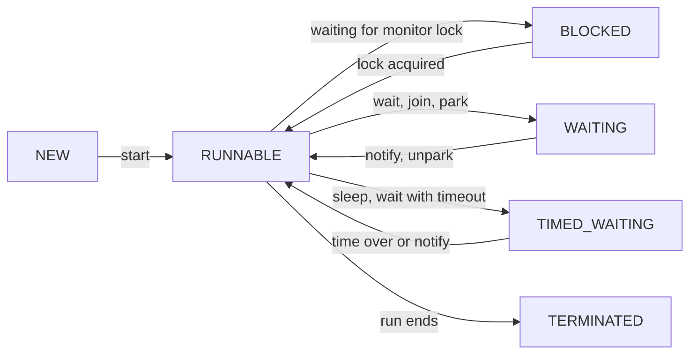

# Concurrency

Concurrency means many things at once. In Java this happens through threads. SDE-1/SDE-2 interviews almost always ask from here: race condition, `synchronized` vs `volatile`, deadlock, thread pool, `CompletableFuture`, `ConcurrentHashMap`.

## Thread vs process

**In one line:** a process = a running program with its own memory; a thread = a lightweight execution unit inside a process that shares memory.

| | Process | Thread |
|---|---|---|
| Memory | own address space | shares the process heap, own stack |
| Create / switch | expensive | cheap |
| Communication | IPC (socket, pipe) | shared objects (hence locks) |
| Crash | other processes are safe | one thread's OOM can take down the whole JVM |

**Interview tip:** "Chrome makes a process per tab (isolation), Tomcat a thread per request (speed)." Remember this example.

## ⭐ Creating threads: Thread, Runnable, Callable

**In one line:** `Runnable` = work that returns nothing, `Callable` = work that returns a value and can throw a checked exception. `Thread` = what runs it.

```java
import java.util.concurrent.*;

public class Main {
    static class MyThread extends Thread {               // Way 1: extend (less flexible)
        public void run() { System.out.println("extends Thread"); }
    }

    public static void main(String[] args) throws Exception {
        new MyThread().start();

        Runnable task = () -> System.out.println("Runnable on " + Thread.currentThread().getName());
        Thread t = new Thread(task, "worker-1");          // Way 2: Runnable (preferred)
        t.start();
        t.join();                                         // wait until t finishes

        Callable<Integer> price = () -> 499;              // Way 3: Callable + executor
        ExecutorService pool = Executors.newSingleThreadExecutor();
        Future<Integer> f = pool.submit(price);
        System.out.println(f.get());                      // 499 (blocks)
        pool.shutdown();
    }
}
```

**Interview tip:** "`start()` vs `run()`?" `start()` creates a new thread that runs `run()`. Calling `run()` directly is just a normal method call on the current thread. Calling `start()` twice on one thread = `IllegalThreadStateException`.

**Common mistake:** extending `Thread` when you only need to define the work. Java has single inheritance; use `Runnable`.

## ⭐ Thread lifecycle

**In one line:** `Thread.State` has 6 states: NEW, RUNNABLE, BLOCKED, WAITING, TIMED_WAITING, TERMINATED.



- RUNNABLE covers both "ready" and "actually running on a CPU". Java does not give a separate state.
- BLOCKED is only for waiting on a `synchronized` lock. A thread waiting on a `ReentrantLock` shows as WAITING (internally `LockSupport.park`).

**Interview tip:** "`sleep` vs `wait`?" `sleep` does **not release** the lock and is a static method of `Thread`. `wait` **releases** the lock, is a method of `Object`, and is called only inside `synchronized`.

## ⭐ Race condition

**In one line:** when two threads read-modify-write shared data without coordination and the result depends on timing.

```java
public class Main {
    static int count = 0;

    public static void main(String[] args) throws InterruptedException {
        Runnable inc = () -> { for (int i = 0; i < 100_000; i++) count++; };
        Thread a = new Thread(inc), b = new Thread(inc);
        a.start(); b.start();
        a.join(); b.join();
        System.out.println(count); // 200000 expected, often prints less
    }
}
```

`count++` is not one step but three: read, +1, write. If two threads read the same value and both write, one increment is lost (lost update). Fix: `synchronized`, `AtomicInteger`, or a lock.

**Interview tip:** give the BookMyShow seat booking or Paytm wallet balance example: two requests read the same balance, both deduct, one deduction is lost.

## ⭐ synchronized

**In one line:** only one thread at a time can enter that block/method. Every Java object has an **intrinsic lock (monitor)**, and `synchronized` takes that lock.

```java
class Wallet {
    private int balance = 1000;
    private final Object lock = new Object();

    public synchronized void add(int amt) { balance += amt; }       // lock: this

    public static synchronized void audit() { }                     // lock: Wallet.class

    public boolean pay(int amt) {
        synchronized (lock) {                                        // block: lock only what is needed
            if (balance < amt) return false;
            balance -= amt;
            return true;
        }
    }

    public synchronized void refundAndAdd(int amt) {
        add(amt);   // reentrant: this thread already holds the 'this' lock, it can take it again
    }
}
```

- **Reentrancy:** the thread holding a lock can acquire it again (a counter goes up). That is why calling one synchronized method from another does not deadlock.
- `synchronized` also gives **visibility**: writes made before releasing the lock are visible to the next thread that takes it.
- If an exception is thrown, the lock is released automatically.

**Interview tip:** lock a small block instead of the whole method, and lock on a `private final Object lock` so outside code cannot grab your lock.

**Common mistake:** thinking a `synchronized` instance method and a `static synchronized` method share the same lock. One is on `this`, the other on the `Class` object; both can run at the same time.

## ⭐ volatile and happens-before

**In one line:** `volatile` guarantees **visibility** (every read sees the latest value from main memory) and prevents reordering, but does **not give atomicity**.

```java
class Worker implements Runnable {
    private volatile boolean running = true;   // without volatile the loop may never stop
    public void stop() { running = false; }
    public void run() { while (running) { /* work */ } }
}
```

- Right use: one thread writes, others read (stop flag, config refresh, the `instance` in a DCL singleton).
- Wrong use: `volatile int count; count++;` is still a race. Use `AtomicInteger`.

**Happens-before (short):** if A happens-before B, A's writes are visible to B. Main rules:
- Monitor unlock → the next lock of the same monitor.
- `volatile` write → a later read of the same variable.
- `thread.start()` → actions inside that thread.
- All actions of a thread → `join()` returning in another thread.

**Interview tip:** "volatile vs synchronized?" volatile = visibility only, no locking, no atomic compound ops. synchronized = mutual exclusion + visibility.

## wait / notify

**In one line:** a low-level way to signal between threads. A thread calls `wait()` for a condition; another wakes it with `notify()`/`notifyAll()`.

```java
class OrderBox {
    private String order;

    public synchronized void put(String o) throws InterruptedException {
        while (order != null) wait();      // box is full, wait
        order = o;
        notifyAll();
    }
    public synchronized String take() throws InterruptedException {
        while (order == null) wait();      // always while, not if (spurious wakeup)
        String o = order; order = null;
        notifyAll();
        return o;
    }
}
```

**Interview tip:** three rules: (1) call inside `synchronized`, else `IllegalMonitorStateException`, (2) check the condition in a `while`, (3) when there is more than one kind of waiter, `notifyAll` is safe. In real code prefer `BlockingQueue` or `Condition`.

## ⭐ Deadlock

**In one line:** two (or more) threads wait forever for each other's lock.

```java
public class Main {
    static final Object A = new Object(), B = new Object();

    public static void main(String[] args) {
        new Thread(() -> {
            synchronized (A) { sleep(); synchronized (B) { System.out.println("T1 done"); } }
        }).start();
        new Thread(() -> {
            synchronized (B) { sleep(); synchronized (A) { System.out.println("T2 done"); } } // reverse order
        }).start();
        // T1 holds A, needs B. T2 holds B, needs A. Both are stuck.
    }
    static void sleep() { try { Thread.sleep(100); } catch (InterruptedException e) { } }
}
```

**4 conditions (Coffman):** mutual exclusion, hold and wait, no preemption, circular wait. Break one and the deadlock is gone.

**Prevention:**
- **Lock ordering:** all threads take locks in one fixed order (e.g. smaller account id first). Say this for bank transfer.
- **`tryLock` with timeout:** if you cannot get the lock, release and retry.
- Reduce nested locks; do not make external calls while holding a lock.

```java
// Transfer: lock ordering by id
void transfer(Account from, Account to, int amt) {
    Account first = from.id < to.id ? from : to;
    Account second = from.id < to.id ? to : from;
    synchronized (first) { synchronized (second) { from.balance -= amt; to.balance += amt; } }
}
```

**Interview tip:** "How would you detect a deadlock?" A `jstack <pid>` thread dump shows "Found one Java-level deadlock", or use `ThreadMXBean.findDeadlockedThreads()`.

## ReentrantLock and ReadWriteLock

**In one line:** a flexible version of `synchronized`: `tryLock`, timeout, interruptible locking, fairness and multiple `Condition`s.

```java
import java.util.concurrent.TimeUnit;
import java.util.concurrent.locks.*;

class Inventory {
    private final ReentrantLock lock = new ReentrantLock();
    private int stock = 10;

    boolean reserve() throws InterruptedException {
        if (lock.tryLock(500, TimeUnit.MILLISECONDS)) {   // give up if no lock within 500ms
            try {
                if (stock == 0) return false;
                stock--; return true;
            } finally {
                lock.unlock();                             // always in finally
            }
        }
        return false;
    }
}

class PriceCache {
    private final ReadWriteLock rw = new ReentrantReadWriteLock();
    private int price = 100;
    int get() { rw.readLock().lock(); try { return price; } finally { rw.readLock().unlock(); } }   // many readers together
    void set(int p) { rw.writeLock().lock(); try { price = p; } finally { rw.writeLock().unlock(); } } // writer alone
}
```

**Interview tip:** use `ReadWriteLock` for read-heavy data (config, price cache). For very read-heavy cases, `StampedLock` (optimistic read) is also an option.

**Common mistake:** not putting `unlock()` in `finally`. If an exception is thrown, the lock is never released.

## Atomic classes and CAS

**In one line:** `AtomicInteger`, `AtomicLong`, `AtomicReference` do thread-safe updates without locks, using the **CAS (compare-and-swap)** CPU instruction.

CAS: "if the value is still X, make it Y, else fail". On failure, read the latest value and retry (spin loop).

```java
import java.util.concurrent.atomic.*;

AtomicInteger hits = new AtomicInteger();
hits.incrementAndGet();                       // ++hits, atomic
hits.updateAndGet(x -> Math.min(x * 2, 100));  // custom update

// CAS loop by hand
int old, next;
do { old = hits.get(); next = old + 5; } while (!hits.compareAndSet(old, next));

LongAdder views = new LongAdder();            // high contention counter, fast
views.increment();
System.out.println(views.sum());
```

**Interview tip:** **ABA problem:** the value went A to B and back to A, and CAS did not notice. Fix: `AtomicStampedReference` (version stamp). For a high-contention counter use `LongAdder` (separate cells, summed at the end).

## ⭐ ExecutorService and thread pools

**In one line:** instead of creating threads again and again, keep a pool that picks tasks from a queue and runs them.

| Factory | What is inside | When |
|---|---|---|
| `newFixedThreadPool(n)` | n threads, **unbounded** queue | steady load |
| `newCachedThreadPool()` | 0 to unlimited threads, killed after 60s idle | small short-lived tasks |
| `newScheduledThreadPool(n)` | delayed / periodic tasks | cron-like work, heartbeat |
| `newSingleThreadExecutor()` | 1 thread, keeps order | sequential tasks |
| `newVirtualThreadPerTaskExecutor()` (21) | a new virtual thread per task | I/O-bound |

**ThreadPoolExecutor params:** `corePoolSize`, `maximumPoolSize`, `keepAliveTime`, `workQueue`, `threadFactory`, `RejectedExecutionHandler`.

Flow: new task → no free core thread → goes to the queue → queue full → new threads up to max → still full → **reject**.

```java
import java.util.concurrent.*;

ThreadPoolExecutor pool = new ThreadPoolExecutor(
    4, 8,                                   // core, max
    60, TimeUnit.SECONDS,                   // idle timeout for extra threads
    new ArrayBlockingQueue<>(100),          // bounded queue
    new ThreadPoolExecutor.CallerRunsPolicy() // when full, the caller runs it (backpressure)
);
pool.submit(() -> System.out.println("order processed"));

ScheduledExecutorService sch = Executors.newScheduledThreadPool(1);
sch.scheduleAtFixedRate(() -> System.out.println("heartbeat"), 0, 5, TimeUnit.SECONDS);

pool.shutdown();                                      // no new tasks, old ones finish
if (!pool.awaitTermination(30, TimeUnit.SECONDS)) {
    pool.shutdownNow();                               // interrupt the running ones
}
```

Rejection policies: `AbortPolicy` (default, exception), `CallerRunsPolicy`, `DiscardPolicy`, `DiscardOldestPolicy`.

**Interview tip:** pool size: CPU-bound ≈ cores, I/O-bound ≈ cores × (1 + wait time / compute time). In production people avoid `Executors.newFixedThreadPool` because the unbounded queue can cause OOM. Build a `ThreadPoolExecutor` with a bounded queue.

**Common mistake:** forgetting `shutdown()`. Non-daemon threads keep the JVM from exiting.

## ⭐ Future vs CompletableFuture

**In one line:** `Future` only gives the result by blocking on `get()`. `CompletableFuture` can chain callbacks, combine futures and handle exceptions without blocking.

```java
import java.util.concurrent.*;

public class Main {
    static String fetchUser(int id) { return "user" + id; }
    static String fetchCart(String user) { return user + "-cart"; }

    public static void main(String[] args) {
        ExecutorService pool = Executors.newFixedThreadPool(4);

        CompletableFuture<String> cartF = CompletableFuture
            .supplyAsync(() -> fetchUser(1), pool)
            .thenCompose(u -> CompletableFuture.supplyAsync(() -> fetchCart(u), pool)); // async after async: flat
        CompletableFuture<Integer> priceF = CompletableFuture
            .supplyAsync(() -> 499, pool)
            .thenApply(p -> p * 2);                          // transform the value

        CompletableFuture.allOf(cartF, priceF).join();      // wait for both
        System.out.println(cartF.join() + " " + priceF.join()); // user1-cart 998

        CompletableFuture<Integer> safe = CompletableFuture
            .supplyAsync(() -> Integer.parseInt("abc"), pool)
            .exceptionally(ex -> -1);                        // fallback on error
        System.out.println(safe.join());                     // -1
        pool.shutdown();
    }
}
```

| Method | What it does |
|---|---|
| `thenApply(f)` | transform the result (like `map`) |
| `thenCompose(f)` | f itself returns a CompletableFuture, flatten it (like `flatMap`) |
| `thenCombine(other, f)` | join the results of two independent futures |
| `allOf` / `anyOf` | wait for all / any one to complete |
| `exceptionally(f)` | fallback value only on error |
| `handle((res, ex) -> ...)` | handle both success and error |

**Interview tip:** pass an executor. Without one, `supplyAsync` uses the common `ForkJoinPool`, which can get stuck with blocking I/O.

**Common mistake:** returning a future inside `thenApply` and ending up with `CompletableFuture<CompletableFuture<T>>`. That needs `thenCompose`.

## ⭐ Concurrent collections

**In one line:** collections built for multi-threaded use, faster than whole-collection locking like `Collections.synchronizedMap`.

**ConcurrentHashMap internals (Java 8+):**
- Java 7 had 16 segments (separate locks). Java 8 removed segments.
- Insert into an empty bucket = **CAS**, no lock. For a non-empty bucket, `synchronized` on that bucket's first node only. So locking is at bucket level.
- Reads are lock-free (`volatile` reads). A bucket with 8+ entries becomes a red-black tree (treeify), like HashMap.
- **No null key/value:** if `get()` returns null you cannot tell "key absent" from "value is null", and under concurrency the value may change while you check with `containsKey`.
- Iterators are **weakly consistent**: they do not throw `ConcurrentModificationException`.

```java
ConcurrentHashMap<String, Integer> clicks = new ConcurrentHashMap<>();
clicks.merge("ad-42", 1, Integer::sum);                 // atomic increment
clicks.computeIfAbsent("ad-7", k -> 0);
// wrong: if (!map.containsKey(k)) map.put(k, v);  check-then-act is a race
```

**CopyOnWriteArrayList:** copies the whole array on every write. Reads take no lock. When: many reads, few writes (listener list, config). Very slow when write-heavy.

**BlockingQueue: producer-consumer**

```java
import java.util.concurrent.*;

public class Main {
    public static void main(String[] args) {
        BlockingQueue<Integer> q = new ArrayBlockingQueue<>(5);   // bounded
        Thread producer = new Thread(() -> {
            try {
                for (int i = 1; i <= 10; i++) q.put(i);   // waits if full
                q.put(-1);                                // poison pill: "work done"
            } catch (InterruptedException e) { Thread.currentThread().interrupt(); }
        });
        Thread consumer = new Thread(() -> {
            try {
                while (true) {
                    int order = q.take();                 // waits if empty
                    if (order == -1) break;
                    System.out.println("processed order " + order);
                }
            } catch (InterruptedException e) { Thread.currentThread().interrupt(); }
        });
        producer.start(); consumer.start();
    }
}
```

Types: `ArrayBlockingQueue` (bounded, array), `LinkedBlockingQueue` (optionally bounded), `PriorityBlockingQueue`, `DelayQueue`, `SynchronousQueue` (capacity 0, direct handoff).

**Interview tip:** for "write producer-consumer", give the `BlockingQueue` version first, then say "I can also do it with wait/notify" and show the `OrderBox` above.

## CountDownLatch, Semaphore, CyclicBarrier

| Utility | What it does | Example |
|---|---|---|
| `CountDownLatch(n)` | one or more threads wait until the count reaches 0. Cannot be reset | wait for 3 services to be ready before app start |
| `Semaphore(n)` | at most n permits at a time | max 10 concurrent DB calls, rate limiting |
| `CyclicBarrier(n)` | n threads meet at a point, then all move on. Reusable | sync after each round of a parallel simulation |

```java
CountDownLatch ready = new CountDownLatch(3);
for (String s : List.of("db", "cache", "kafka")) {
    new Thread(() -> { System.out.println(s + " up"); ready.countDown(); }).start();
}
ready.await();                         // continue only after all three
System.out.println("server started");

Semaphore permits = new Semaphore(10);
permits.acquire();
try { /* DB call */ } finally { permits.release(); }
```

**Interview tip:** "Latch vs barrier?" A latch is one-time and the waiting thread can be different (main thread waits for workers). A barrier is reusable and all threads wait for each other.

## ThreadLocal

**In one line:** a variable where each thread has its own separate copy. No locking needed.

```java
private static final ThreadLocal<SimpleDateFormat> FMT =
    ThreadLocal.withInitial(() -> new SimpleDateFormat("yyyy-MM-dd")); // SimpleDateFormat is not thread-safe

private static final ThreadLocal<String> REQUEST_ID = new ThreadLocal<>();
void handle(String reqId) {
    REQUEST_ID.set(reqId);
    try { /* REQUEST_ID.get() in logs */ } finally { REQUEST_ID.remove(); } // required in a pool
}
```

Uses: request context (user id, trace id), per-thread non-thread-safe objects. Spring's `@Transactional` and security context also run on this.

**Common mistake:** not calling `remove()` in a thread pool. Threads are reused, so the next request can see the previous request's user, plus a memory leak.

## Virtual threads

For Java 21 virtual threads (millions of lightweight threads for I/O-bound work) and the pinning issue, see: [Modern Java 8–21](13-modern-java.md).

## ⭐ Common interview coding questions

**1. Print odd/even in order with two threads (1 to 10).**

```java
public class Main {
    private int n = 1;
    private final int max = 10;
    private final Object lock = new Object();

    void print(boolean odd) {
        synchronized (lock) {
            while (n <= max) {
                if ((n % 2 == 1) == odd) {                 // my turn
                    System.out.println(Thread.currentThread().getName() + ": " + n++);
                    lock.notify();                         // wake the other one
                } else {
                    try { lock.wait(); }                   // release lock, wait
                    catch (InterruptedException e) { Thread.currentThread().interrupt(); return; }
                }
            }
            lock.notifyAll();                              // let the other thread exit too
        }
    }

    public static void main(String[] args) {
        Main p = new Main();
        new Thread(() -> p.print(true), "odd").start();
        new Thread(() -> p.print(false), "even").start();
    }
}
```

Variant: it also works with `Semaphore` (odd starts with 1 permit, even with 0; after printing, release the other one's permit).

**2. Thread-safe singleton.** Three safe ways: enum singleton, double-checked locking with `volatile`, and the holder idiom:

```java
class Config {
    private Config() {}
    private static class Holder { static final Config INSTANCE = new Config(); } // lazy, JVM makes class loading thread-safe
    static Config get() { return Holder.INSTANCE; }
}
```

Why `volatile` in DCL: without it `instance = new Config()` can be reordered (reference assigned first, constructor later), and another thread can see a half-built object. Detail: [Creational Patterns](../03-lld/03-creational.md).

**Also asked often:** `ConcurrentHashMap` vs `Hashtable` vs `synchronizedMap`, `Runnable` vs `Callable`, `shutdown` vs `shutdownNow`, how you would size a thread pool, `notify` vs `notifyAll`.

## Checklist

- [ ] I can give a race condition example and 3 fixes (`synchronized`, `AtomicInteger`, lock)
- [ ] I can explain the 6 thread lifecycle states and `sleep` vs `wait`
- [ ] I can explain `synchronized` (intrinsic lock, reentrancy) vs `volatile` (visibility only)
- [ ] I can write deadlock code and fix it with lock ordering or `tryLock`
- [ ] I can explain `ThreadPoolExecutor` params, task flow and rejection policies
- [ ] I can use `thenApply`, `thenCompose`, `allOf`, `exceptionally` in `CompletableFuture`
- [ ] I can explain `ConcurrentHashMap` internals (CAS, bucket lock, no null)
- [ ] I can write producer-consumer with `BlockingQueue`
- [ ] I can write odd/even printing with two threads and a thread-safe singleton
