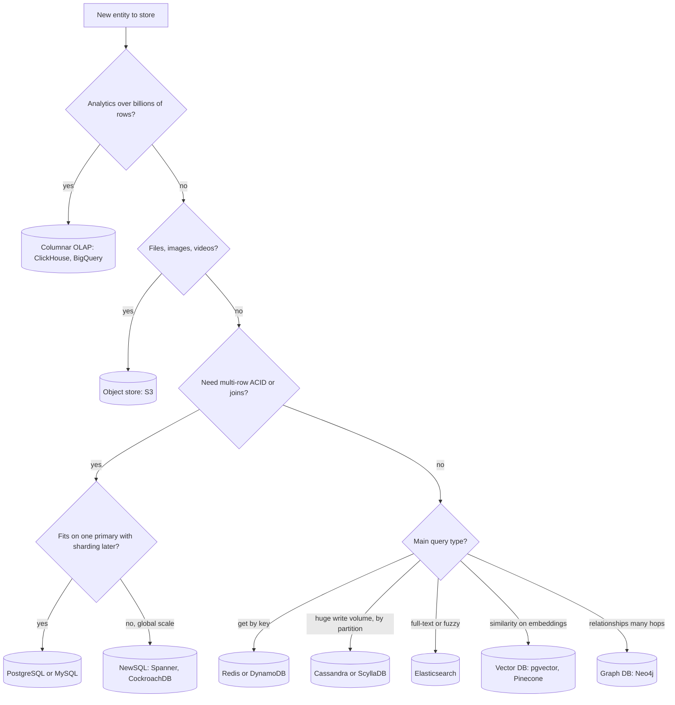
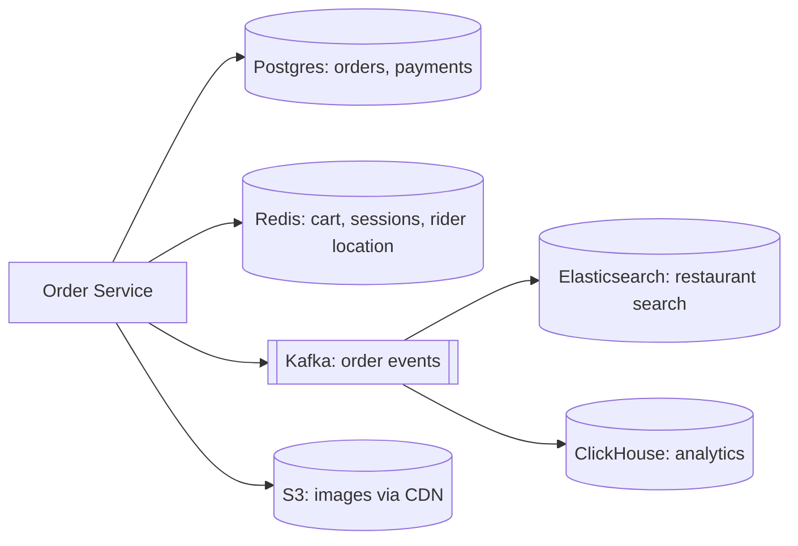

# Choosing a Database

Every system design interview reaches the moment: "Where will you store this data?" A wrong answer, or an answer with no reason, gets caught fastest here. This page gives you a decision framework: data shape, query pattern, consistency need, scale, and analytics vs transactions. With it you can justify any DB choice in 2–3 lines.

## ⭐ The 5 questions that decide the DB

**In one line:** you pick a DB from the data and the access pattern, not from what is popular.

Ask these 5 questions for every entity:

| Question | Options | Points you towards |
|---|---|---|
| What is the **data shape**? | tables with relations / nested JSON / key → blob / graph / vectors / time-stamped points | relational / document / KV / graph / vector / time-series |
| What is the **query pattern**? | key lookup / range scan / joins + ad-hoc filters / full-text / similarity / aggregates | KV / wide-column / SQL / search / vector / columnar |
| How much **consistency** do you need? | strong + multi-row transactions / eventual is fine | SQL, NewSQL / Cassandra, DynamoDB |
| What is the **scale**? | GBs, thousands of QPS / TBs-PBs, hundreds of thousands of writes/sec | single Postgres + replicas / sharded or distributed DB |
| **OLTP or OLAP?** | small fast transactions / big scans and aggregates | row store (Postgres) / columnar (ClickHouse, BigQuery) |

Also look at the read/write ratio. Write-heavy (logs, chat, metrics) → LSM-tree DBs (Cassandra, ScyllaDB). Read-heavy + complex queries → B-tree relational DB + cache.

**Interview tip:** write down the access patterns first ("last 50 orders of a user", "order by id"), then name the DB. The interviewer wants to see the process, not just a name.

**Common mistake:** naming one DB for the whole system. Each entity can be different.

## ⭐ Decision flowchart

**In one line:** walk top to bottom; the first "yes" is your starting point.

What the flowchart does not cover:
- **Time-stamped metrics** (CPU, latency, prices) → time-series DB (Prometheus, InfluxDB, TimescaleDB).
- **Flexible nested JSON** where the schema differs per record → document DB (MongoDB), or Postgres JSONB.
- When in doubt, **start with PostgreSQL**. It does a bit of everything: relational, JSONB, full-text, pgvector, PostGIS.

**Interview tip:** do not read the flowchart aloud. Just say: "This data needs multi-row transactions, so Postgres" or "These are pure key lookups with high writes, so DynamoDB."

**Common mistake:** saying "NoSQL scales, SQL doesn't". Postgres goes a very long way with sharding (Citus) and read replicas. The reason must be the access pattern.

## ⭐ Cheat table: use case → DB → why

**In one line:** memorise this table; it covers 80% of interview DB choices.

| Use case | DB | Why |
|---|---|---|
| **Payments, wallet, ledger** (Paytm, Razorpay) | PostgreSQL / MySQL | ACID, multi-row transaction (debit + credit together), constraints, audit. Money cannot be eventually consistent |
| **Product catalog** (Flipkart) | MongoDB / Postgres JSONB + Elasticsearch for search | each category has different attributes (phone RAM, shirt size), nested docs; search in a separate index |
| **Shopping cart** | Redis (active) + DynamoDB / Postgres (persist) | key = user_id, very fast read/write, TTL; the order goes to SQL at checkout |
| **Sessions, OTP, rate limit counters** | Redis | in-memory, TTL built in, atomic `INCR` |
| **Chat messages** (WhatsApp, Discord) | Cassandra / ScyllaDB / HBase | huge write volume, partition = chat_id, clustering = time; "last 50 messages" is one partition scan |
| **News feed / timeline** | Redis (precomputed feed lists) + Cassandra (posts) | fan-out on write keeps the feed ready; O(1) read |
| **Search, autocomplete** | Elasticsearch / OpenSearch | inverted index, relevance scoring, fuzzy match |
| **Metrics, monitoring** | Prometheus / InfluxDB / TimescaleDB | time-ordered writes, downsampling, retention, time-window aggregates |
| **Social graph** (followers, mutual friends) | Neo4j / adjacency in Cassandra or MySQL | multi-hop traversal; a simple follow list works fine in KV/wide-column |
| **Recommendations / semantic search / RAG** | Vector DB (pgvector, Pinecone, Milvus) | ANN search over embeddings (HNSW) |
| **Analytics, dashboards, BI** | ClickHouse / BigQuery / Redshift / Snowflake | columnar storage, compression, fast scans over billions of rows |
| **Files, images, videos, backups** | S3 / GCS + CDN | cheap, durable (11 nines), metadata in a separate DB |
| **Inventory, seat booking** (BookMyShow) | PostgreSQL | row locks, `SELECT ... FOR UPDATE`, no overselling |
| **Ride location updates** (Uber) | Redis (GEO) / in-memory + Cassandra for history | update every 4 sec, only latest location matters, geo query |
| **URL shortener mappings** | DynamoDB / Cassandra / Redis cache | pure key lookup, read-heavy, horizontal scale |
| **Leaderboard** | Redis Sorted Set | `ZADD`, `ZREVRANGE` in O(log n) |

**Interview tip:** whenever you name a DB, attach an access pattern to the "why": "Cassandra for chat, because the query is always by `chat_id` and we need the latest messages; partition key `chat_id`, clustering key `message_time desc`."

**Common mistake:** saying only MongoDB for the product catalog and forgetting search. Catalog search always needs a separate index like Elasticsearch.

## ⭐ DB families overview

**In one line:** each family is optimised for one access pattern; identify the family first, the product later.

| Family | One line | Examples | Detail page |
|---|---|---|---|
| **Relational (SQL)** | tables + joins + ACID, the default choice | PostgreSQL, MySQL | [Relational SQL](02-relational-sql.md), [Transactions](03-transactions-acid.md), [Indexes](04-indexes.md) |
| **Key-Value** | value by key, fastest and simplest | Redis, DynamoDB, Memcached | [Key-Value](05-key-value.md) |
| **Document** | JSON documents, flexible schema, nested data | MongoDB, Firestore | [Document](06-document.md) |
| **Wide-column** | partition key + sorted rows, massive writes | Cassandra, ScyllaDB, HBase | [Wide-column](07-wide-column.md) |
| **Search** | inverted index, full-text, relevance | Elasticsearch, OpenSearch | [Search](08-search.md) |
| **Time-series** | timestamped points, retention, downsampling | Prometheus, InfluxDB, TimescaleDB | [Time-series](09-time-series.md) |
| **Graph** | nodes + edges, multi-hop queries | Neo4j, Neptune | [Graph](10-graph.md) |
| **Vector** | embeddings, nearest-neighbour search | Pinecone, Milvus, pgvector | [Vector](11-vector.md) |
| **Columnar / OLAP** | column-wise storage, analytics scans | ClickHouse, BigQuery, Snowflake | [Columnar / OLAP](12-columnar-olap.md) |
| **NewSQL** | SQL + ACID + horizontal scale | Spanner, CockroachDB, TiDB, YugabyteDB | [NewSQL](13-newsql.md) |
| **Object store** | files/blobs by key, cheap and durable | S3, GCS, Azure Blob | [Object Storage](15-object-storage.md) |

For scaling (replication, sharding, partitioning) see [Scaling Databases](14-scaling-databases.md), and for last-minute revision see [Database Interview Rapid-fire](16-interview-qa.md).

### Effect of the storage engine

| Engine | Used by | Good at | Weak at |
|---|---|---|---|
| **B-tree** | Postgres, MySQL InnoDB, MongoDB WiredTiger | reads, range queries, in-place update | heavy random writes (page splits, random IO) |
| **LSM-tree** | Cassandra, ScyllaDB, RocksDB, HBase | write-heavy (sequential append) | reads may check multiple SSTables (bloom filters help) |

**Interview tip:** "Why are Cassandra writes fast?" A write first goes to the commit log (append) and the memtable (memory), and is flushed to an SSTable later. No random disk seek.

**Common mistake:** treating document DBs and KV stores as the same. A document DB can query and index fields inside the document; a pure KV store only by key.

## ⭐ SQL vs NoSQL: a straight comparison

**In one line:** SQL = structure + transactions + flexible queries; NoSQL = horizontal scale for a specific access pattern.

| Point | SQL (Postgres/MySQL) | NoSQL (Dynamo/Cassandra/Mongo) |
|---|---|---|
| Schema | fixed, migrations | flexible / schema-on-read |
| Queries | ad-hoc, joins, aggregates | mostly key / partition based, no joins |
| Transactions | multi-row ACID | single item/partition (some have limited multi-doc) |
| Scale | vertical + read replicas, manual sharding | horizontal built in |
| Consistency | strong by default | tunable / eventual by default |
| Data modeling | entities first, queries later | queries first, tables shaped to them |

Details: [SQL vs NoSQL](../01-topics/02-sql-vs-nosql.md), [CAP & Consistency](../01-topics/06-cap-consistency.md).

**Interview tip:** say "query-first modeling" for NoSQL. In Cassandra/DynamoDB one query = one table design. A new query pattern means a new table or a GSI.

**Common mistake:** calling NoSQL "schema-less" and skipping modeling. The schema moves into app code; it does not disappear.

## ⭐ Polyglot persistence

**In one line:** using different DBs for different data in one system, each best at its own job.

> **Example:** Swiggy order flow. Orders and payments in Postgres (ACID). Restaurant + dish search in Elasticsearch. Delivery partner live location in Redis GEO. Order events through Kafka into ClickHouse for analytics. Dish images on S3 + CDN.

**How to keep them in sync:**
- **Keep one source of truth** (Postgres here). The others are derived stores.
- **CDC (Change Data Capture)**: Debezium reads the Postgres WAL and publishes events to Kafka; consumers update ES/ClickHouse.
- **Outbox pattern**: write the event into an outbox table in the same transaction; a relay ships it to Kafka. This removes the dual-write problem. Details: [Distributed transactions](../01-topics/16-distributed-transactions.md).

**The cost (tradeoffs):**
- Every new DB = new ops burden (backups, monitoring, on-call, upgrades).
- Derived stores are eventually consistent (a new restaurant shows up in search 1–2 sec later).
- The team needs expertise in each DB.

**Interview tip:** say "Postgres is the source of truth; Elasticsearch and ClickHouse are derived via CDC, so a small lag there is acceptable."

**Common mistake:** writing to both DBs directly from the app (dual write). If one fails, data diverges. Use CDC or outbox.

## ⭐ How to justify a DB choice in an interview (ready script)

**In one line:** say it in this order: access pattern → requirement → DB → tradeoff → mitigation.

Template:

> "For **[entity]** the main access patterns are **[pattern 1]** and **[pattern 2]**. It needs **[requirement: ACID / high write / full-text / low latency]**. So I'll use **[DB]**, because **[one technical reason]**. The tradeoff is **[weakness]**, which I'll handle with **[mitigation]**."

**Example 1 (BookMyShow seats):**
> "Seat booking patterns are: read all seats of a show, and atomically book 2–6 seats. Double booking must never happen, so we need strong consistency and transactions. So PostgreSQL, with a `SELECT ... FOR UPDATE` row lock. Tradeoff: write limit on a single primary. I'll shard shows by `city_id` and cache the seat map in Redis."

**Example 2 (WhatsApp messages):**
> "The message pattern is: very high writes (billions/day), and reads are always the latest messages of one chat. No cross-chat joins. So Cassandra: partition key `chat_id`, clustering key `message_id` (time-sortable) desc. The LSM-tree is fast for writes. Tradeoff: eventual consistency and no ad-hoc queries. Quorum (`LOCAL_QUORUM`) reads/writes keep consistency good."

**Example 3 (URL shortener):**
> "Pure key lookup: `short_code → long_url`, 100:1 read-write. No joins or transactions. DynamoDB or Cassandra with partition key `short_code`, Redis cache in front. Tradeoff: analytics queries are hard, so click events go via Kafka to ClickHouse."

Related questions: [URL Shortener](../02-questions/t1-01-url-shortener.md), [WhatsApp Chat](../02-questions/t1-04-whatsapp-chat.md), [BookMyShow](../02-questions/t1-05-bookmyshow.md), [Payment System](../02-questions/t1-11-payment-system.md), [Food Delivery](../02-questions/t2-14-food-delivery.md), [Ad Click Aggregator](../02-questions/t2-17-ad-click-aggregator.md), [E-commerce Inventory](../02-questions/t2-24-ecommerce-inventory.md).

**Interview tip:** state the tradeoff yourself, before the interviewer asks. That signals seniority.

**Common mistake:** naming a DB and moving on. A DB choice without a "why" earns no points.

## ⭐ Common mistakes (in DB choice)

**In one line:** most mistakes come from a "trendy" pick and ignoring the access pattern.

| Mistake | What goes wrong | Right thinking |
|---|---|---|
| **"NoSQL for scale"** with no numbers | Cassandra for 1000 QPS = needless complexity, transactions lost | do the estimation; Postgres + replicas reaches hundreds of thousands of reads/sec |
| Eventually consistent store for payments | double debit, lost money | ACID DB, idempotency key, ledger |
| MongoDB "because we don't know the schema" | schema scattered in the app, joins in the app | define core entities first; put the flexible part in JSONB |
| Analytics queries on the primary OLTP DB | heavy scans slow down production | read replica or columnar warehouse |
| Elasticsearch as source of truth | ES is not built for durability and transactions | primary DB + CDC into ES |
| Images/videos as DB BLOBs | DB bloat, slow backups, expensive | file in S3, only URL/metadata in DB |
| A different DB family per service with no reason | ops nightmare | 2–3 well-known stores unless there is a strong reason |
| Treating a cache as a DB | data loss on Redis restart (depends on config) | Redis for cache/ephemeral; durable data in a DB |
| Ignoring hot partitions | one celebrity/IPL match key takes all the load | high-cardinality partition key, salting |

**Interview tip:** if the interviewer asks "Why not Cassandra?", answer with numbers and pattern: "Our write volume is 2K/sec and we need multi-row transactions. Postgres handles that easily; with Cassandra we'd lose transactions."

**Common mistake:** switching DB immediately when the interviewer pushes back. Stand by your reason, or switch clearly because of a new requirement.

## Rough scale numbers (for DB choice)

**In one line:** the estimation numbers tell you whether one Postgres is enough or you need a distributed DB.

| Store | Rough capacity (one node, good hardware) | When you hit the limit |
|---|---|---|
| PostgreSQL / MySQL | ~10K–50K simple writes/sec, hundreds of thousands of reads/sec with replicas, a few TB comfortably | write-heavy + multi-TB, then sharding (Citus, Vitess) |
| Redis | ~100K+ ops/sec per node, data up to RAM | data larger than RAM, then Redis Cluster |
| Cassandra / ScyllaDB | ~10K–100K+ writes/sec per node, linear scale | hot partitions, wide partitions (100MB+) |
| DynamoDB | practically unlimited, per partition ~1000 WCU / 3000 RCU | hot key |
| Elasticsearch | indexing ~10K docs/sec per node, shard ~10–50 GB | too many shards, deep pagination |
| ClickHouse | billions of rows/sec scanned | high-QPS point lookups (not its job) |

Number details: [Numbers cheatsheet](../01-topics/21-numbers-cheatsheet.md), scaling: [Scaling basics](../01-topics/01-scaling-basics.md), sharding: [Sharding & consistent hashing](../01-topics/04-sharding-consistent-hashing.md).

**Rule of thumb:**
1. Writes < 10K/sec and data < 1–2 TB → one Postgres primary + replicas + cache.
2. Very heavy reads → read replicas + Redis cache, same DB.
3. Hundreds of thousands of writes/sec with a simple key pattern → Cassandra / DynamoDB.
4. Heavy writes + transactions too → shard Postgres (Citus/Vitess) or NewSQL.

**Interview tip:** reuse the estimation number in the DB choice: "We estimated 5K writes/sec; one Postgres primary handles that comfortably."

**Common mistake:** doing the estimation and then never using the numbers in the DB choice.

## Full walkthrough: an Uber-like ride app

**In one line:** in a single system each entity's DB comes from its own reason.

| Entity | Access pattern | DB | Reason |
|---|---|---|---|
| Users, driver profiles | get by id, occasional update | Postgres | relational, small data |
| Trips | create, status update, user trip history | Postgres (shard by city) | trip + payment in one transaction, history via `user_id` index |
| Driver live location | write every 4 sec, nearby-driver query | Redis GEO | in-memory, `GEOSEARCH`, old values are useless |
| Location history | billions of writes, replay for a trip | Cassandra | partition `trip_id`, time-ordered |
| Payments | debit/credit, idempotent | Postgres | ACID ledger |
| Surge / analytics | city-wise aggregates | ClickHouse via Kafka | columnar scans |
| Receipts, documents | files | S3 | cheap, durable |

Related: [Uber](../02-questions/t1-06-uber.md), [Geospatial](../01-topics/13-geospatial.md).

**Interview tip:** show the DB choice as a table in the design (entity | DB | reason). The interviewer gets the whole picture at a glance.

**Common mistake:** doing an UPDATE in Postgres every 4 sec for location. Across millions of drivers that brings write load and dead-tuple bloat.

## When NOT to pick each DB

**In one line:** you should also know the "don't pick" case of every DB.

- **Don't pick Postgres/MySQL** when: write volume is hundreds of thousands/sec with a simple key/partition pattern, or data is PB-scale analytics.
- **Don't pick Redis** when: data is larger than RAM and durability is critical.
- **Don't pick Cassandra** when: you need ad-hoc queries, joins or multi-row transactions; or the write volume is low.
- **Don't pick MongoDB** when: data is highly relational (many-to-many) and strong cross-document transactions are needed everywhere.
- **Don't pick Elasticsearch** when: you need primary storage or strong consistency.
- **Don't pick a graph DB** when: the query is only 1 hop (followers list) — an adjacency table is enough.
- **Don't add a separate vector DB** when: you only have a few million vectors and already run Postgres — pgvector is enough.

**Interview tip:** keep a "Why not X?" answer ready for at least one alternative.

**Common mistake:** never mentioning alternatives. One line like "X was an option, but I didn't pick it because of Y" adds a lot of value.

## Say this in the interview

- "I first list the access patterns of each entity, then choose the DB. The default is Postgres unless there's a strong reason."
- "Postgres is the source of truth; search and analytics are derived stores via CDC, so a small lag there is acceptable."

## Checklist

- [ ] I can choose a DB using the 5 questions: data shape, query pattern, consistency, scale, OLTP vs OLAP
- [ ] I can name the DB and the reason for payments, chat, catalog, cart, search, metrics, analytics and files
- [ ] I can explain each DB family (relational through object store) in one line
- [ ] I can explain B-tree vs LSM-tree and which workload suits each
- [ ] I can explain source of truth, CDC and outbox in polyglot persistence
- [ ] I can justify a DB choice with the access pattern → requirement → DB → tradeoff script
- [ ] I can name common mistakes like "NoSQL for scale" and the right answer to each
