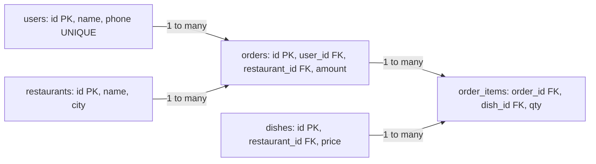
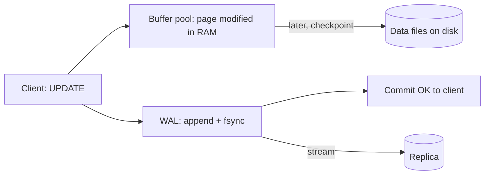

# Relational Databases: PostgreSQL & MySQL

Relational DB = data in tables, tables linked by keys, and any query through SQL. In system design it is the **default choice**, and SDE interviews ask you to write SQL directly (2nd highest salary, top N per group). This page goes from tables to Postgres vs MySQL and storage internals.

## ⭐ Tables, keys and constraints

**In one line:** a table = rows and columns; keys identify rows uniquely and link tables; constraints stop bad data at the DB level.

| Concept | Meaning | Example |
|---|---|---|
| **Primary key (PK)** | unique, NOT NULL id of each row | `orders.id` |
| **Foreign key (FK)** | points to another table's PK, referential integrity | `orders.user_id → users.id` |
| **Unique** | no duplicates in the column | `users.phone` |
| **NOT NULL** | value required | `orders.amount` |
| **CHECK** | custom rule | `CHECK (amount > 0)` |
| **DEFAULT** | used when no value is given | `status DEFAULT 'PLACED'` |
| **Composite key** | 2+ columns unique together | `(order_id, item_id)` |
| **Surrogate vs natural key** | auto id vs business value (PAN, email) | prefer surrogate, put UNIQUE on the natural one |



**Relationships:**
- **1:1** user ↔ user_profile (FK + UNIQUE).
- **1:N** user → orders (FK on the many side).
- **M:N** orders ↔ dishes, with a **junction table** `order_items` in between.

**Interview tip:** "Auto-increment or UUID for the PK?" On a single DB, a `BIGINT` identity (small, index friendly). In a distributed system, UUIDv7 / Snowflake (time-sortable, no random inserts into the B-tree). Details: [Unique ID generation](../01-topics/17-unique-id-generation.md).

**Common mistake:** making a random UUIDv4 the PK without thinking. Random inserts into a B-tree increase page splits and cache misses.

## ⭐ Normalization: 1NF to 3NF

**In one line:** normalization = splitting data so that each fact lives in exactly one place, so update anomalies cannot happen.

**The starting bad table:**

| order_id | customer | customer_phone | items | restaurant | restaurant_city |
|---|---|---|---|---|---|
| 1 | Rahul | 98xxx | "Dosa, Idli" | MTR | Bangalore |
| 2 | Rahul | 98xxx | "Vada" | MTR | Bangalore |

Problems: phone in two places (update anomaly), items packed into one string, restaurant city repeated.

| Form | Rule | Fix |
|---|---|---|
| **1NF** | every cell atomic, no repeating groups | move `items` into separate rows: `order_items(order_id, item)` |
| **2NF** | 1NF + no non-key column depends on **part** of a composite key (no partial dependency) | in `order_items(order_id, dish_id, qty)` the dish price goes to `dishes`, because price depends only on `dish_id` |
| **3NF** | 2NF + no non-key column depends on another non-key column (no transitive dependency) | `restaurant_city` depends on the restaurant, not the order → move to `restaurants` |
| **BCNF** | every determinant is a candidate key | stricter 3NF; knowing the name is enough for interviews |

Line to remember: **"The key, the whole key, and nothing but the key."**

### When to denormalize

- **Read-heavy** path with an expensive join (feed, order history page): copy `restaurant_name` into `orders`.
- **Historical value** needed: store the price at order time in `order_items.price`, otherwise a menu price change rewrites old bills. (Strictly this is not denormalization, it is a different fact.)
- **Counters**: keep `posts.like_count` instead of `COUNT(*)` every time.
- **Analytics**: star schema, wide fact tables.

Cost: every copy must be updated on write (trigger, app code, or async event).

**Interview tip:** "Normalize by default, denormalize for specific read paths, and explain the update path for the denormalized copy."

**Common mistake:** showing an order's price by joining the `dishes` table. When the price changes, old orders become wrong.

## ⭐ Joins

**In one line:** a join combines rows of two tables on a condition.

Example data: `users(1 Rahul, 2 Priya, 3 Amit)`, `orders(101 user 1, 102 user 1, 103 user 2, 104 user 9)`.

| Join | What it returns | Result example |
|---|---|---|
| **INNER JOIN** | only rows that match on both sides | Rahul-101, Rahul-102, Priya-103 |
| **LEFT JOIN** | all left rows, NULL when no right match | the above + Amit-NULL |
| **RIGHT JOIN** | all right rows | the first 3 + NULL-104 |
| **FULL OUTER JOIN** | all rows of both | everything + Amit-NULL + NULL-104 (not in MySQL, build it with UNION) |
| **CROSS JOIN** | every pair (cartesian) | 3 × 4 = 12 rows |
| **SELF JOIN** | a table with itself | employee → manager |
| **Anti join** | left rows with no match | `LEFT JOIN ... WHERE o.id IS NULL` or `NOT EXISTS` → Amit |

```sql
-- Users who never ordered (anti join)
SELECT u.id, u.name
FROM users u
LEFT JOIN orders o ON o.user_id = u.id
WHERE o.id IS NULL;

-- Same with NOT EXISTS (NULL-safe, often a better plan)
SELECT u.id, u.name
FROM users u
WHERE NOT EXISTS (SELECT 1 FROM orders o WHERE o.user_id = u.id);

-- Self join: employee and their manager
SELECT e.name AS employee, m.name AS manager
FROM employees e
LEFT JOIN employees m ON m.id = e.manager_id;
```

**Join algorithms (you see them in EXPLAIN):**
- **Nested loop**: small outer table, index on the inner. Best for small results.
- **Hash join**: build a hash table from the small table, scan the big one. Equality joins, large data.
- **Merge join**: both inputs sorted (via index), then merged. Large sorted inputs.

**Interview tip:** with `NOT IN (subquery)`, a single NULL in the subquery makes the result empty. Use `NOT EXISTS`.

**Common mistake:** putting a condition on the right table in `WHERE` after a LEFT JOIN (`WHERE o.status = 'PAID'`). That turns the LEFT JOIN into an INNER join. Put the condition in `ON`.

## ⭐ Important SQL commands

**In one line:** these commands are 90% of interview and day-to-day work.

| Command | What it does | Example |
|---|---|---|
| `SELECT ... WHERE` | filter rows | `SELECT * FROM orders WHERE status = 'PAID'` |
| `GROUP BY` | group and aggregate | `SELECT user_id, COUNT(*) FROM orders GROUP BY user_id` |
| `HAVING` | filter after aggregation | `... GROUP BY user_id HAVING COUNT(*) > 5` |
| `ORDER BY` | sort | `ORDER BY created_at DESC` |
| `LIMIT / OFFSET` | page | `LIMIT 20 OFFSET 40` (slow on deep pages) |
| Keyset pagination | continue from the last seen value | `WHERE id < 9876 ORDER BY id DESC LIMIT 20` |
| `JOIN` | combine tables | `FROM orders o JOIN users u ON u.id = o.user_id` |
| `INSERT` | new row | `INSERT INTO users(name, phone) VALUES ('Rahul', '98xxx')` |
| UPSERT (Postgres) | update if present, else insert | `INSERT ... ON CONFLICT (phone) DO UPDATE SET name = EXCLUDED.name` |
| UPSERT (MySQL) | same | `INSERT ... ON DUPLICATE KEY UPDATE name = VALUES(name)` |
| `UPDATE` | change | `UPDATE orders SET status = 'DELIVERED' WHERE id = 101` |
| `DELETE` | remove | `DELETE FROM sessions WHERE expires_at < now()` |
| `RETURNING` (Postgres) | return the changed row | `UPDATE ... RETURNING id, status` |
| `ROW_NUMBER()` | 1,2,3... within each partition | `ROW_NUMBER() OVER (PARTITION BY city ORDER BY rating DESC)` |
| `RANK()` / `DENSE_RANK()` | rank with ties (1,1,3 / 1,1,2) | `DENSE_RANK() OVER (ORDER BY salary DESC)` |
| `LAG()` / `LEAD()` | previous / next row's value | `LAG(amount) OVER (PARTITION BY user_id ORDER BY created_at)` |
| `SUM() OVER` | running total | `SUM(amount) OVER (ORDER BY day)` |
| CTE `WITH` | named subquery, readable | `WITH paid AS (SELECT ...) SELECT ... FROM paid` |
| Recursive CTE | tree/hierarchy | `WITH RECURSIVE chain AS (...)` |
| `EXPLAIN ANALYZE` | actual plan + timing | `EXPLAIN ANALYZE SELECT ...` |
| `CREATE INDEX` | create an index | `CREATE INDEX idx_orders_user ON orders(user_id, created_at DESC)` |
| `CREATE INDEX CONCURRENTLY` (Postgres) | index without locking the table | use this in production |

**SQL execution order** (differs from writing order):
`FROM/JOIN → WHERE → GROUP BY → HAVING → SELECT → window functions → DISTINCT → ORDER BY → LIMIT`.
That is why you cannot use a SELECT alias or a window function in `WHERE`.

### OFFSET vs keyset pagination

```sql
-- OFFSET: the DB must read and throw away 100000 rows
SELECT id, amount FROM orders
WHERE user_id = 42
ORDER BY created_at DESC, id DESC
LIMIT 20 OFFSET 100000;

-- Keyset (cursor): the index jumps straight there, each page O(log n + 20)
SELECT id, amount, created_at FROM orders
WHERE user_id = 42
  AND (created_at, id) < ('2026-09-01 10:00:00', 98765)   -- last row of the previous page
ORDER BY created_at DESC, id DESC
LIMIT 20;
```

Keyset is fast and new inserts do not cause skipped/duplicate rows. Downside: you cannot "jump to page 57". Feeds and infinite scroll use keyset. Details: [API design](../01-topics/19-api-design.md).

**Interview tip:** "WHERE vs HAVING?" WHERE filters rows before grouping (can use an index), HAVING filters groups afterwards.

**Common mistake:** `SELECT *` in production. Extra columns, no covering-index benefit, and the app can break on schema changes.

## ⭐ Realistic example: Swiggy orders schema + queries

**In one line:** a small but real schema, and the queries an interviewer or product team asks for.

```sql
CREATE TABLE users (
  id          BIGINT GENERATED ALWAYS AS IDENTITY PRIMARY KEY,
  name        TEXT NOT NULL,
  phone       TEXT NOT NULL UNIQUE,
  created_at  TIMESTAMPTZ NOT NULL DEFAULT now()
);

CREATE TABLE restaurants (
  id     BIGINT GENERATED ALWAYS AS IDENTITY PRIMARY KEY,
  name   TEXT NOT NULL,
  city   TEXT NOT NULL,
  rating NUMERIC(2,1) CHECK (rating BETWEEN 0 AND 5)
);

CREATE TABLE orders (
  id             BIGINT GENERATED ALWAYS AS IDENTITY PRIMARY KEY,
  user_id        BIGINT NOT NULL REFERENCES users(id),
  restaurant_id  BIGINT NOT NULL REFERENCES restaurants(id),
  status         TEXT NOT NULL DEFAULT 'PLACED'
                 CHECK (status IN ('PLACED','PREPARING','OUT_FOR_DELIVERY','DELIVERED','CANCELLED')),
  amount         NUMERIC(10,2) NOT NULL CHECK (amount > 0),
  idempotency_key TEXT UNIQUE,              -- no duplicate order on retry
  created_at     TIMESTAMPTZ NOT NULL DEFAULT now()
);

CREATE TABLE order_items (
  order_id  BIGINT NOT NULL REFERENCES orders(id) ON DELETE CASCADE,
  dish_id   BIGINT NOT NULL,
  qty       INT NOT NULL CHECK (qty > 0),
  price     NUMERIC(10,2) NOT NULL,          -- price at order time
  PRIMARY KEY (order_id, dish_id)
);

-- "My orders" page: a user's latest orders
CREATE INDEX idx_orders_user_time ON orders (user_id, created_at DESC);
-- Restaurant dashboard: active orders
CREATE INDEX idx_orders_rest_active ON orders (restaurant_id)
  WHERE status IN ('PLACED','PREPARING');   -- partial index
```

```sql
-- 1. A user's last 10 orders with restaurant name
SELECT o.id, r.name, o.amount, o.status, o.created_at
FROM orders o
JOIN restaurants r ON r.id = o.restaurant_id
WHERE o.user_id = 42
ORDER BY o.created_at DESC
LIMIT 10;

-- 2. Revenue per city for the last 7 days, only cities above 1 lakh
SELECT r.city, SUM(o.amount) AS revenue, COUNT(*) AS orders
FROM orders o
JOIN restaurants r ON r.id = o.restaurant_id
WHERE o.status = 'DELIVERED'
  AND o.created_at >= now() - INTERVAL '7 days'
GROUP BY r.city
HAVING SUM(o.amount) > 100000
ORDER BY revenue DESC;

-- 3. Top 3 restaurants per city by orders (top N per group)
WITH counts AS (
  SELECT r.city, r.id, r.name, COUNT(*) AS n
  FROM orders o JOIN restaurants r ON r.id = o.restaurant_id
  GROUP BY r.city, r.id, r.name
),
ranked AS (
  SELECT *, ROW_NUMBER() OVER (PARTITION BY city ORDER BY n DESC) AS rn
  FROM counts
)
SELECT city, name, n FROM ranked WHERE rn <= 3;

-- 4. Gap between each user's orders (repeat behaviour)
SELECT user_id, id, created_at,
       created_at - LAG(created_at) OVER (PARTITION BY user_id ORDER BY created_at) AS gap
FROM orders;

-- 5. Idempotent order create (retry safe)
INSERT INTO orders (user_id, restaurant_id, amount, idempotency_key)
VALUES (42, 7, 349.00, 'req-7f3a')
ON CONFLICT (idempotency_key) DO NOTHING
RETURNING id;
```

Related: [Food Delivery](../02-questions/t2-14-food-delivery.md), [Idempotency](../01-topics/10-idempotency-retries.md).

**Interview tip:** while writing the schema, say which query each index serves. "An index without a query" = wasted writes.

**Common mistake:** `FLOAT`/`DOUBLE` for money. You get rounding errors. Use `NUMERIC(10,2)` or store money as integer paise (cents).

## ⭐ PostgreSQL vs MySQL

**In one line:** both are mature and fast; Postgres leads on features and correctness, MySQL is popular for simple ops and read-heavy web workloads.

| Point | PostgreSQL | MySQL (InnoDB) |
|---|---|---|
| **MVCC** | old row versions stay in the table (dead tuples), `VACUUM` cleans them | old versions in the undo log, the purge thread cleans them |
| **Default isolation** | Read Committed | Repeatable Read |
| **Table storage** | heap (rows in any order), indexes separate | clustered index: rows stored inside the PK B-tree in PK order |
| **Secondary index** | points to the row in the heap (ctid) | stores the PK value, so two lookups |
| **JSON** | binary `JSONB`, GIN index, powerful operators | `JSON` type, index via generated columns |
| **Extensions** | many: PostGIS, pgvector, TimescaleDB, Citus, pg_trgm | few |
| **Index types** | B-tree, Hash, GIN, GiST, BRIN, partial, expression | mostly B-tree, full-text, spatial; functional index (8.0+) |
| **Replication** | streaming (WAL based, physical), logical replication | binlog based (row/statement), semi-sync, Group Replication |
| **Upsert** | `ON CONFLICT` | `ON DUPLICATE KEY UPDATE` |
| **DDL in transaction** | yes, can be rolled back | mostly no (implicit commit) |
| **Connections** | process per connection, needs PgBouncer | thread per connection, handles more connections |
| **Sharding tools** | Citus | Vitess (YouTube, Slack), ProxySQL |
| **Who uses it** | Instagram (early on), Zerodha, many Swiggy services | Facebook, Uber (under Schemaless), Flipkart, GitHub |

**Pick Postgres** when you need complex queries, JSONB, geo (PostGIS), vectors, strict correctness.
**Pick MySQL** when you have simple read-heavy OLTP, team experience, or need massive sharding with Vitess.

**Interview tip:** "Why does an UPDATE-heavy table get slow in Postgres?" Each UPDATE creates a new tuple version; the old dead tuple stays until vacuum (bloat). Tune autovacuum and lower `fillfactor` for HOT updates.

**Common mistake:** thinking the PK in MySQL is just a constraint. In InnoDB the PK is the physical order of the data; random PKs make inserts slow.

## ⭐ Storage basics: pages and WAL

**In one line:** data lives on disk in fixed-size pages, and every change is first written to the WAL (log) so it can be recovered after a crash.

- **Page / block**: Postgres 8 KB, InnoDB 16 KB. The DB reads a whole page from disk, not one row. So rows that sit close together are faster.
- **Buffer pool / shared buffers**: hot pages cached in RAM. You want a 99%+ hit ratio.
- **B-tree index**: a tree of pages; root → internal → leaf. Tens of millions of rows in 3–4 levels. Details: [Indexes](04-indexes.md).
- **WAL (Write-Ahead Log)** (redo log in MySQL): the change goes to a sequential log first, `fsync`, then commit OK. Data pages are flushed lazily later (checkpoint).
  - After a crash, replaying the WAL repairs the data pages.
  - Sequential write = fast; random page writes are batched later.
  - Replication also ships the WAL (Postgres streaming replication).
  - CDC tools (Debezium) also read the WAL / binlog.
- **Checkpoint**: flush dirty pages to disk, recycle old WAL.



**Interview tip:** "If it crashes right after commit, how is the data safe?" The WAL record was already fsynced; on restart it is redone. That is the **D** in ACID. Details: [Transactions & ACID](03-transactions-acid.md).

**Common mistake:** thinking the data file is updated on commit. Only the WAL is flushed.

## ⭐ When SQL is the right default

**In one line:** start with a relational DB unless there is a strong reason not to.

**Use it when:**
- Data is relational (users, orders, payments) and you need joins.
- You need transactions / invariants (balance never negative, a seat never sold twice).
- Queries are ad-hoc or keep changing (product team keeps asking for new reports).
- Scale is "normal": up to TBs, thousands of writes/sec. Replicas + cache + partitioning take you very far.

**Don't use it (or add something else) when:**
- Hundreds of thousands of writes/sec with a simple key pattern (chat, IoT, logs) → Cassandra/DynamoDB.
- Full-text relevance search → Elasticsearch.
- PB-scale analytics → columnar warehouse.
- Ultra-low latency cache → Redis.

**The scaling ladder:** indexes → query tuning → connection pooling (PgBouncer) → cache (Redis) → read replicas → partitioning (table partitions by date) → sharding (Citus/Vitess) → NewSQL. Details: [Scaling Databases](14-scaling-databases.md), [Indexing & replication](../01-topics/03-indexing-replication.md).

Used in: [Payment System](../02-questions/t1-11-payment-system.md), [BookMyShow](../02-questions/t1-05-bookmyshow.md), [E-commerce Inventory](../02-questions/t2-24-ecommerce-inventory.md), [Job Scheduler](../02-questions/t2-18-job-scheduler.md), [Flash Sale](../02-questions/t2-15-flash-sale.md).

**Interview tip:** say "I'll start with Postgres; when write throughput hits the limit I'll shard by `user_id`." That sounds realistic and senior.

**Common mistake:** designing sharding on day one when the estimation says one node is enough.

## ⭐ Classic interview SQL questions

**In one line:** these 6 queries show up in almost every SQL round; window functions make them all clean.

Table: `employees(id, name, salary, dept_id, manager_id)`.

```sql
-- 1. Second highest salary (NULL if none)
SELECT MAX(salary) AS second_highest
FROM employees
WHERE salary < (SELECT MAX(salary) FROM employees);

-- 1b. Nth highest (N = 3), treating ties as one
SELECT DISTINCT salary
FROM (SELECT salary, DENSE_RANK() OVER (ORDER BY salary DESC) AS rnk
      FROM employees) t
WHERE rnk = 3;

-- 2. Top 2 earners per department
SELECT dept_id, name, salary
FROM (SELECT dept_id, name, salary,
             DENSE_RANK() OVER (PARTITION BY dept_id ORDER BY salary DESC) AS rnk
      FROM employees) t
WHERE rnk <= 2;

-- 3. Find duplicate emails
SELECT email, COUNT(*) FROM users
GROUP BY email
HAVING COUNT(*) > 1;

-- 3b. Delete duplicates, keep the smallest id
DELETE FROM users u
USING users d
WHERE u.email = d.email AND u.id > d.id;          -- Postgres syntax

-- 4. Employees who earn more than their manager
SELECT e.name
FROM employees e JOIN employees m ON m.id = e.manager_id
WHERE e.salary > m.salary;

-- 5. Employees above their department's average salary
SELECT name, dept_id, salary
FROM (SELECT *, AVG(salary) OVER (PARTITION BY dept_id) AS dept_avg
      FROM employees) t
WHERE salary > dept_avg;

-- 6. Users who logged in 3 consecutive days (gaps and islands)
SELECT DISTINCT user_id
FROM (SELECT user_id, login_date,
             login_date - (ROW_NUMBER() OVER (PARTITION BY user_id ORDER BY login_date))::int AS grp
      FROM (SELECT DISTINCT user_id, login_date FROM logins) d) t
GROUP BY user_id, grp
HAVING COUNT(*) >= 3;
```

| Function | On ties | Result for 100, 90, 90, 80 |
|---|---|---|
| `ROW_NUMBER()` | unique number, ties in arbitrary order | 1, 2, 3, 4 |
| `RANK()` | same rank, with gap | 1, 2, 2, 4 |
| `DENSE_RANK()` | same rank, no gap | 1, 2, 2, 3 |

**Interview tip:** the answer to "top N per group" is always a window function + outer filter. A window function cannot go directly in `WHERE`, so use a subquery/CTE.

**Common mistake:** `ORDER BY salary DESC LIMIT 1 OFFSET 1` for 2nd highest. If two people share the top salary you get the wrong answer (ties). Use `DENSE_RANK` or `MAX < MAX`.

## Say this in the interview

- "I start normalized, and denormalize only hot read paths, together with their update path."
- "I'll paginate with keyset; OFFSET is O(offset) on deep pages."

## Checklist

- [ ] I can show PK, FK, UNIQUE, CHECK constraints and 1:N / M:N relationships in a schema
- [ ] I can explain 1NF, 2NF, 3NF with an example and say when to denormalize
- [ ] I can write INNER, LEFT, FULL, SELF and anti joins and explain the NOT IN NULL trap
- [ ] I can write queries with GROUP BY/HAVING, UPSERT, window functions and CTEs
- [ ] I can explain OFFSET vs keyset pagination and write a keyset query
- [ ] I can explain PostgreSQL vs MySQL differences (MVCC, clustered index, JSONB, replication)
- [ ] I can explain commit and crash recovery with pages, buffer pool and WAL
- [ ] I can solve 2nd highest salary, top N per group and duplicates SQL questions
