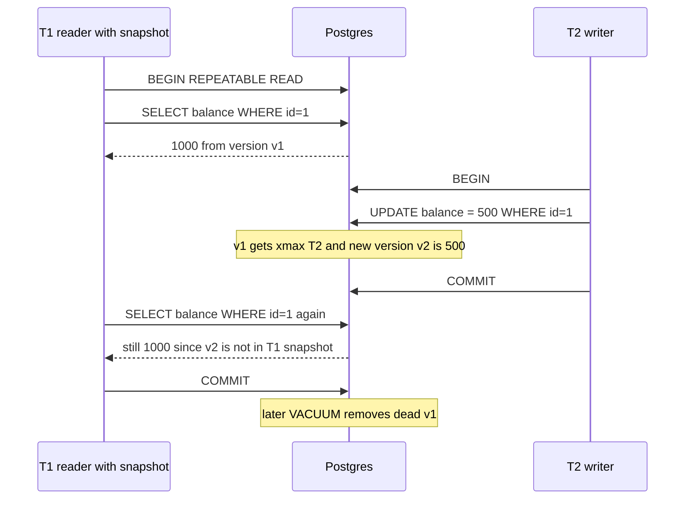
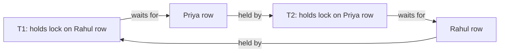

# Transactions & ACID

A transaction = a group of operations that happens **entirely** or **not at all**. Payments, seat booking, inventory, wallets: everywhere the interviewer asks "what if two people do this at the same time?". This page covers ACID, isolation levels, MVCC, locking and deadlocks, all of which come up in SDE-1/SDE-2 interviews.

## ⭐ What a transaction is

**In one line:** one logical unit of work (like "Rahul sent Priya ₹500") made of multiple SQL statements, where the DB guarantees nobody sees the half-done state and a crash cannot leave it behind.

> **Example:** a Paytm wallet transfer. ₹500 minus from Rahul's wallet, ₹500 plus to Priya's wallet, and a ledger entry. If the first step runs and the server crashes, ₹500 vanishes. A transaction prevents that.

```sql
BEGIN;
UPDATE wallets SET balance = balance - 500 WHERE user_id = 1;   -- Rahul
UPDATE wallets SET balance = balance + 500 WHERE user_id = 2;   -- Priya
INSERT INTO ledger (from_user, to_user, amount) VALUES (1, 2, 500);
COMMIT;
```

**Interview tip:** for every write flow, say where the transaction boundary is: "These three statements are in one transaction."

**Common mistake:** doing multi-step work in autocommit mode. Every statement becomes its own transaction.

## ⭐ ACID, each letter with an example

**In one line:** ACID = Atomicity, Consistency, Isolation, Durability; together these four guarantees make a transaction trustworthy.

| Letter | Meaning | In a bank transfer | How the DB does it |
|---|---|---|---|
| **A**tomicity | all or nothing | debit done and credit fails → the debit is rolled back too | undo log / rollback; in Postgres the aborted tuple is invisible |
| **C**onsistency | after the transaction the DB is in a valid state; all constraints hold | if `CHECK (balance >= 0)` breaks the transaction fails; total money stays the same | constraints, FKs, triggers + the app's invariants |
| **I**solation | concurrent transactions do not see each other's partial state | two transfers hit Rahul's wallet at once, the balance stays correct | locks + MVCC, depends on the isolation level |
| **D**urability | after commit the data survives a crash | power cut right after "Transfer successful", the money is still transferred | WAL / redo log fsync before the commit ack |

```sql
-- Consistency: the DB itself blocks an invalid state
ALTER TABLE wallets ADD CONSTRAINT balance_non_negative CHECK (balance >= 0);

BEGIN;
UPDATE wallets SET balance = balance - 5000 WHERE user_id = 1;  -- balance was only 500
-- ERROR: violates check constraint "balance_non_negative"
ROLLBACK;  -- Atomicity: nothing was applied
```

Note: the **C** in ACID and the **C** in CAP are different. CAP's C = all replicas show the same latest value (linearizability). Details: [CAP & Consistency](../01-topics/06-cap-consistency.md).

**Interview tip:** "How is durability achieved?" → "The WAL record is fsynced to disk before the commit is acknowledged; on a crash the WAL is replayed." With replication: a synchronous replica keeps the data safe even if a node is lost.

**Common mistake:** treating Consistency as only the DB's job. An invariant like "total money stays the same" comes from app logic + transactions together.

## ⭐ Transaction commands

**In one line:** start with BEGIN, make it permanent with COMMIT, undo with ROLLBACK, partially undo with SAVEPOINT.

| Command | What it does | Example |
|---|---|---|
| `BEGIN` / `START TRANSACTION` | start a transaction | `BEGIN;` |
| `COMMIT` | make all changes permanent and visible to others | `COMMIT;` |
| `ROLLBACK` | undo all changes | `ROLLBACK;` |
| `SAVEPOINT name` | checkpoint in the middle | `SAVEPOINT before_coupon;` |
| `ROLLBACK TO SAVEPOINT name` | undo only what came after the checkpoint | `ROLLBACK TO SAVEPOINT before_coupon;` |
| `RELEASE SAVEPOINT name` | drop the savepoint | `RELEASE SAVEPOINT before_coupon;` |
| `SET TRANSACTION ISOLATION LEVEL ...` | level for this transaction | `SET TRANSACTION ISOLATION LEVEL SERIALIZABLE;` |
| `BEGIN ISOLATION LEVEL ...` (Postgres) | set the level at start | `BEGIN ISOLATION LEVEL REPEATABLE READ;` |
| `SET autocommit = 0` (MySQL) | turn autocommit off | session level |
| `SELECT ... FOR UPDATE` | write lock on rows | see the locking section below |
| `SET lock_timeout = '2s'` (Postgres) | max wait for a lock | avoid long waits |
| `innodb_lock_wait_timeout` (MySQL) | lock wait limit (default 50s) | `SET innodb_lock_wait_timeout = 5;` |

```sql
-- Swiggy checkout: the order must be created even if the coupon fails
BEGIN;
INSERT INTO orders (id, user_id, amount) VALUES (9001, 42, 499);

SAVEPOINT before_coupon;
UPDATE coupons SET used = used + 1
WHERE code = 'SWIGGY50' AND used < max_uses;
-- app saw 0 rows updated (coupon exhausted), so undo only the coupon part
ROLLBACK TO SAVEPOINT before_coupon;

INSERT INTO payments (order_id, amount, status) VALUES (9001, 499, 'PENDING');
COMMIT;   -- order + payment are permanent, the coupon change is not
```

**Interview tip:** in Postgres, if one statement inside a transaction errors, the whole transaction goes into the "aborted" state; further statements fail until you ROLLBACK. A SAVEPOINT lets you handle that error locally.

**Common mistake:** a network call (payment gateway, HTTP) inside a transaction. Locks are held for seconds. Make external calls outside the transaction.

## ⭐ Isolation levels and anomalies

**In one line:** the isolation level decides how much concurrent transactions see of each other's changes; the stronger the level, the fewer anomalies and the less concurrency.

### Anomalies (understand these first)

| Anomaly | What happens | Example |
|---|---|---|
| **Dirty read** | reading another transaction's **uncommitted** data | T1 sets balance to 0 (not committed), T2 reads 0, T1 rolls back. T2 saw data that never existed |
| **Non-repeatable read** | reading the same row twice, someone committed a change in between | T1 reads price 100, T2 commits 120, T1 reads again and gets 120 |
| **Phantom read** | the same **range query** twice, new rows appear | T1: `COUNT(*) WHERE show_id=5` = 10, T2 inserts a booking, T1 gets 11 |
| **Lost update** | two transactions read-modify-write, one overwrites the other | both read stock 10, both write 9; 2 sold, stock dropped by only 1 |
| **Write skew** | both update different rows, but a shared rule breaks | rule "at least 1 doctor on call". Both doctors see 2 on call, both go off → 0 |

### Levels

| Level | Dirty read | Non-repeatable | Phantom | Lost update | Write skew |
|---|---|---|---|---|---|
| **Read Uncommitted** | possible | possible | possible | possible | possible |
| **Read Committed** | prevented | possible | possible | possible | possible |
| **Repeatable Read** | prevented | prevented | possible per ANSI; prevented in Postgres, mostly prevented in MySQL | prevented in Postgres (serialization error), possible in MySQL | possible |
| **Serializable** | prevented | prevented | prevented | prevented | prevented |

### Postgres vs MySQL defaults

| | PostgreSQL | MySQL InnoDB |
|---|---|---|
| Default level | **Read Committed** | **Repeatable Read** |
| Read Uncommitted | behaves like Read Committed (never dirty reads) | real dirty reads |
| Repeatable Read | snapshot isolation: snapshot from transaction start; concurrent update gives a `could not serialize access` error | consistent snapshot for plain SELECT; locking reads + gap/next-key locks block phantoms |
| Serializable | **SSI** (Serializable Snapshot Isolation): optimistic, one transaction aborts on conflict and must retry | turns every plain SELECT into `FOR SHARE` (locking) |

```sql
-- Postgres: write skew is caught under Serializable
BEGIN ISOLATION LEVEL SERIALIZABLE;
SELECT COUNT(*) FROM doctors WHERE on_call = true;   -- 2
UPDATE doctors SET on_call = false WHERE id = 1;
COMMIT;
-- If another transaction does the same for id = 2, one of them gets:
-- ERROR: could not serialize access due to read/write dependencies among transactions
-- The app must retry the whole transaction
```

**Interview tip:** "Which isolation level would you use?" → "Default Read Committed, and on critical paths (stock, seat, balance) a `FOR UPDATE` row lock or an atomic UPDATE. For a very important invariant, Serializable + a retry loop."

**Common mistake:** thinking Repeatable Read prevents both lost updates and write skew. MySQL RR can lose updates, and write skew happens in both (only Serializable prevents it).

## ⭐ MVCC: readers don't block writers

**In one line:** with MVCC (Multi-Version Concurrency Control) each update creates a new version of the row; each transaction reads the right version for its snapshot, so reads need no locks.

**In Postgres:**
- Each row version (tuple) has `xmin` (the transaction that created it) and `xmax` (the transaction that deleted/updated it).
- At transaction start (RR) or each statement (RC) you get a **snapshot**: which transaction IDs were committed.
- A row version is visible if `xmin` is committed and in the snapshot, and `xmax` is empty or not committed in the snapshot.
- UPDATE = set `xmax` on the old tuple + insert a new tuple. `VACUUM` cleans up old **dead tuples**.

**In MySQL InnoDB:** the row holds the latest version, older versions live in the **undo log** (roll pointer chain). The purge thread cleans old undo records.



**Benefits:** reads never block writes and writes never block reads. Long reports can run on production.
**Cost:** storage for dead versions (bloat), vacuum work, and very long transactions stop vacuum from cleaning.

MVCC does not solve **write-write conflicts**: if two transactions update the same row, the second waits on the row lock.

**Interview tip:** "Why is a long-running transaction bad in Postgres?" Its snapshot keeps old versions alive, vacuum cannot remove them, the table bloats, and there is a transaction ID wraparound risk.

**Common mistake:** thinking MVCC means no locks at all. Writes still take row-level locks.

## ⭐ Locking: row locks and SELECT ... FOR UPDATE

**In one line:** when you read data and then write based on it (check-then-act), take a row lock so nobody changes it in between.

| Lock / clause | What it does | When to use |
|---|---|---|
| Implicit row lock | `UPDATE`/`DELETE` takes an exclusive lock on the row until commit | always happens |
| `SELECT ... FOR UPDATE` | exclusive lock on the rows read; other `FOR UPDATE`/UPDATE wait | read → decide → update (stock, seat, balance) |
| `SELECT ... FOR SHARE` | shared lock; others can read, not change | keep a parent row alive while inserting a child |
| `FOR UPDATE NOWAIT` | error immediately if the lock isn't available | show the user "try again" quickly |
| `FOR UPDATE SKIP LOCKED` | skip locked rows, return the rest | job queue, multiple workers |
| Table lock `LOCK TABLE` | whole table | migrations; avoid in the app |
| Advisory lock (Postgres) | app-defined lock by number | `pg_advisory_xact_lock(42)` so a cron runs only once |
| Gap / next-key lock (MySQL) | lock on an index range, blocks phantom inserts | automatic under RR |

```sql
-- BookMyShow: book 2 seats, no double booking
BEGIN;
SELECT id, status FROM seats
WHERE show_id = 77 AND seat_no IN ('A1', 'A2')
FOR UPDATE;                         -- both rows locked, the other user waits here
-- app check: are both AVAILABLE?
UPDATE seats SET status = 'BOOKED', booked_by = 42
WHERE show_id = 77 AND seat_no IN ('A1', 'A2');
COMMIT;

-- Better when possible: an atomic conditional UPDATE, no separate SELECT needed
UPDATE inventory SET stock = stock - 1
WHERE sku = 'IPHONE16' AND stock > 0;      -- 0 rows updated = out of stock

-- Job queue: each worker picks different jobs, nobody waits
BEGIN;
SELECT id, payload FROM jobs
WHERE status = 'PENDING'
ORDER BY created_at
LIMIT 10
FOR UPDATE SKIP LOCKED;
-- process ...
UPDATE jobs SET status = 'DONE' WHERE id = ANY(ARRAY[101, 102]);  -- the ones picked
COMMIT;
```

### Optimistic locking (version column)

**In one line:** don't lock; at update time check that nobody changed the row since you read it.

```sql
-- Read
SELECT id, stock, version FROM products WHERE id = 5;    -- stock 10, version 7

-- Write only if version is still 7
UPDATE products
SET stock = 9, version = version + 1
WHERE id = 5 AND version = 7;
-- 1 row updated → success
-- 0 rows updated → someone changed it first, re-read and retry
```

| | Pessimistic (`FOR UPDATE`) | Optimistic (version) |
|---|---|---|
| How | lock first, then work | work, then check at commit |
| Low contention | lock overhead wasted | best |
| High contention (flash sale) | requests queue up but all correct | many retries, wasted work |
| User think time (form edit) | lock held for minutes, bad | best (wiki, profile edit) |
| Deadlock risk | yes | no |

Used in: [BookMyShow](../02-questions/t1-05-bookmyshow.md), [Flash Sale](../02-questions/t2-15-flash-sale.md), [E-commerce Inventory](../02-questions/t2-24-ecommerce-inventory.md), [Job Scheduler](../02-questions/t2-18-job-scheduler.md). Details: [Locks & contention](../01-topics/09-locks-and-contention.md).

**Interview tip:** "1 million people for 1000 iPhones in a flash sale?" A DB row lock per request = a hot row. Gate first with Redis `DECR`, then do an atomic `UPDATE ... WHERE stock > 0` in the DB.

**Common mistake:** `SELECT stock` (no lock) → check in app → `UPDATE stock = 9`. That is the classic lost update.

## ⭐ Deadlocks

**In one line:** when two transactions wait for locks the other holds, both are stuck forever; the DB kills one to break the deadlock.

> **Example:** T1 transfers Rahul → Priya: locks Rahul's row first, then Priya's. T2 transfers Priya → Rahul: Priya first, then Rahul. Each got its first lock and waits for the second. A cycle.



**How DBs detect them:**
- **Wait-for graph**: transactions are nodes, "A waits for B" is an edge. A cycle = deadlock.
- Postgres: if a lock wait exceeds `deadlock_timeout` (default 1s) it checks the graph and aborts one transaction with `ERROR: deadlock detected`.
- MySQL InnoDB: immediate detection (`innodb_deadlock_detect`), rolls back the smaller transaction (fewer rows modified). `SHOW ENGINE INNODB STATUS` shows the latest deadlock.
- Distributed systems often rely on timeouts.

**How to avoid them:**
1. **Consistent lock order**: always lock the smaller `user_id` first. In a transfer use `ORDER BY id ... FOR UPDATE`.
2. Keep transactions short, no user input / network calls inside.
3. Lock all rows in one statement: `WHERE id IN (1, 2) ORDER BY id FOR UPDATE`.
4. Right indexes: an UPDATE without an index locks more rows (and gaps in MySQL).
5. **Retry** with backoff on a deadlock error in the app (this is normal, not a bug).

```sql
-- Fixed transfer: always lock in ascending id order
BEGIN;
SELECT id, balance FROM wallets
WHERE user_id IN (1, 2)
ORDER BY user_id
FOR UPDATE;
UPDATE wallets SET balance = balance - 500 WHERE user_id = 1;
UPDATE wallets SET balance = balance + 500 WHERE user_id = 2;
COMMIT;
```

**Interview tip:** "Deadlock vs lock wait timeout?" A deadlock = a cycle, the DB detects it and aborts one immediately. A lock timeout = just waited too long, no cycle required.

**Common mistake:** turning a deadlock error into a 500 for the user. Retry the whole transaction.

## ⭐ Transactions across services

**In one line:** a DB transaction only works within one DB; when the Order service and Payment service have separate DBs you need a pattern like saga or outbox.

- **2PC (Two-Phase Commit)**: the coordinator first asks everyone to "prepare", then "commit". Strong, but blocking and slow; if the coordinator is down, participants are stuck.
- **Saga**: each service runs a local transaction, and on failure runs a **compensating action** (refund, release seat). Eventually consistent.
- **Outbox pattern**: business row + event in one local transaction; a relay sends the event to Kafka. Removes the dual-write problem.
- **Idempotency keys**: no double charge on retries. Details: [Idempotency & retries](../01-topics/10-idempotency-retries.md).

Full details: [Distributed transactions](../01-topics/16-distributed-transactions.md). Payments design: [Payment System](../02-questions/t1-11-payment-system.md).

**Interview tip:** "How do you get ACID across microservices?" → "Local ACID inside each service, saga + outbox + idempotency between services. 2PC only when all participants are in one trusted setup."

**Common mistake:** writing directly into the payment DB from the order service "so it's one transaction". That breaks the service boundary.

## ⭐ BASE vs ACID

**In one line:** ACID = correctness first; BASE = availability and scale first, consistency a little later.

**BASE** = **B**asically **A**vailable, **S**oft state, **E**ventually consistent.

| Point | ACID | BASE |
|---|---|---|
| Focus | correctness, every read is latest | availability, keep running during partitions |
| Consistency | strong, immediate | eventual (ms to seconds) |
| Typical DB | Postgres, MySQL, Spanner | Cassandra, DynamoDB (default), Riak |
| Scale | vertical + careful sharding | horizontal, easy |
| Use case | payments, inventory, booking | like counts, feed, chat history, analytics |
| Conflicts | prevented up front with locks | last-write-wins, vector clocks, CRDTs |

It is not black and white:
- DynamoDB has `TransactWriteItems` (ACID, limited items) and strongly consistent reads.
- Cassandra has lightweight transactions (`IF NOT EXISTS`, Paxos), but they are slow.
- MongoDB 4.0+ has multi-document transactions.
- NewSQL (Spanner, CockroachDB) is distributed and ACID. Details: [NewSQL](13-newsql.md).

**Interview tip:** use both in one system: "The payment ledger is ACID in Postgres, and like counts go to a BASE store, because a like count 1–2 sec stale is fine."

**Common mistake:** saying "NoSQL has no transactions" as an absolute. They have limited transactions; only the cost and scope differ.

## Say this in the interview

- "For counters like stock I'll do an atomic `UPDATE ... WHERE stock > 0`; for read-then-write, `FOR UPDATE`; and for low-contention edits, optimistic locking with a version column."
- "Postgres defaults to Read Committed; for a write-skew-style invariant I use Serializable + retry, and a consistent lock order to avoid deadlocks."

## Checklist

- [ ] I can explain all four letters of ACID with the bank transfer example
- [ ] I can show BEGIN, COMMIT, ROLLBACK and SAVEPOINT usage in SQL
- [ ] I can explain dirty read, non-repeatable read, phantom, lost update and write skew with examples
- [ ] I can say which anomaly each isolation level prevents and the Postgres vs MySQL defaults
- [ ] I can explain MVCC (xmin/xmax, snapshot, vacuum, undo log)
- [ ] I can say when to use FOR UPDATE, FOR SHARE, SKIP LOCKED and version-column optimistic locking
- [ ] I can explain how a deadlock forms, how the DB detects it and how lock ordering avoids it
- [ ] I can explain saga/outbox across services and BASE vs ACID
